# 使用排气声音记录计算发动机转速

> 原文：<https://medium.com/analytics-vidhya/using-exhaust-sound-recordings-to-calculate-engine-rpm-93d54d8a1010?source=collection_archive---------7----------------------->

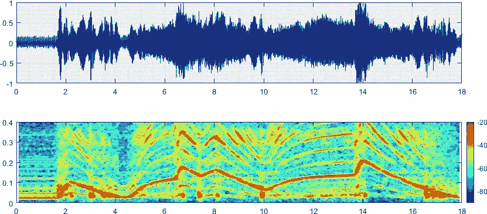

前一段时间，我写了一个 MATLAB 脚本，处理车辆的排气声音记录，分析其频谱，并计算每分钟的发动机转速。今天，我将使用 3 个示例录音向您展示这是如何做到的。

# 数据收集

这 3 个声音文件首先是我自己汽车尾气的自制录音，还有 2 个我从 YouTube 车载视频下载的录音:

*   **马自达 MX-5 (NC) 2.0i 158 bhp:** 我的车。
*   **2011 年，Fernando Alonso 驾驶法拉利 150 Italia(f1):**在铃鹿赛道上跑了一圈。
*   **保时捷 911 GT3 991.2:**0-300 公里/小时的加速。

# 光谱分析

将在 MATLAB 中计算每个信号的频域，并使用其频谱图进行研究。频谱图是一种数据处理技术，利用它可以绘制信号频域的幅度分布与时间的关系。通过将最初较长的信号离散成较短长度的块(窗口)并单独计算每个块的快速傅立叶变换(FFT ),创建数字频谱图。需要预先调整这些离散化数据块的窗口和重叠。

## 马自达 MX-5 (NC) 2.0i 158 bhp

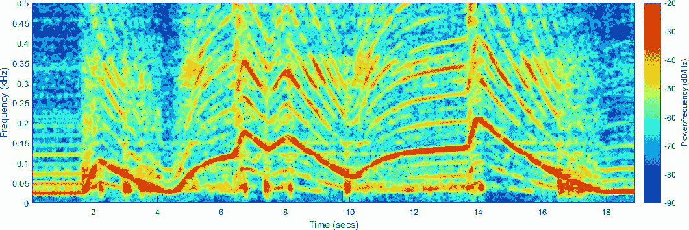

## 法拉利 150 Italia(f1)

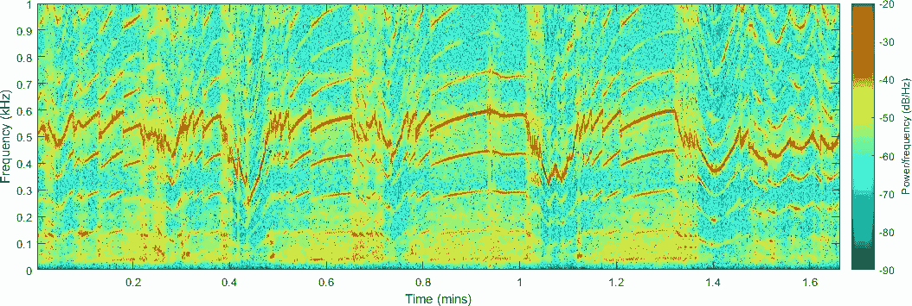

## 保时捷 911 GT3 991.2

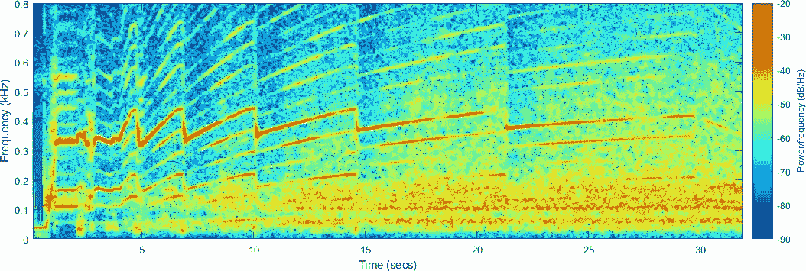

上面的三个光谱图告诉我们很多关于每种情况下发生的事情。除了第一个信号，我在静止状态下加速我的汽车，你已经可以瞥见一个典型的引擎速度图的形状，因为司机通过不同的齿轮，加速和刹车。下一个挑战将是找到基频并将其从其余不相关的频率内容中分离出来。

# 寻找基频

除了人工生成的正弦波，自然界中所有的声音都是复杂的音调——也就是说，它们由多个正弦波组合而成。基频或一次谐波是被认为是最响亮的频率波。其余的将是基波的谐波和分音。此外，在本例中，部分频谱内容将来自其他来源(风、振动、电噪声等)产生的噪声。有不同的算法使我们能够从频谱中找到基频，并将其作为基于时域的信号，我将使用 Welch 的功率谱密度估计。

以马自达 MX-5 信号为例，下图显示了以下 4 个步骤:

*   **录音:**录音的原始数据。
*   **声谱图:**录音的频谱。
*   **声谱图&基频:**应用韦尔奇法求出基频的声谱图。
*   **基频:**孤立基频。

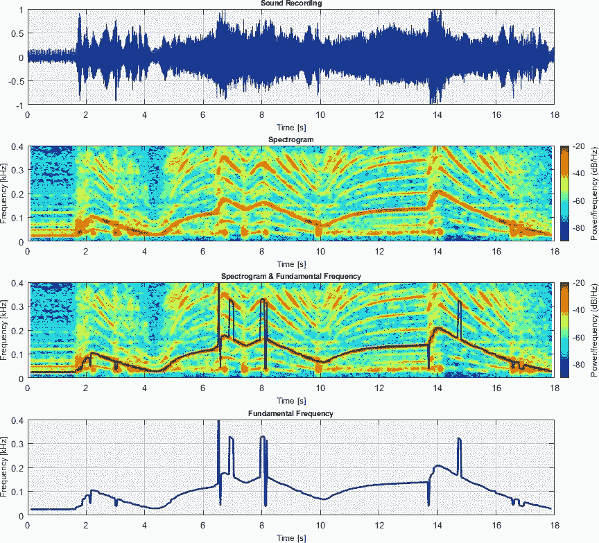

看上面的图，我们可以看到韦尔奇的方法如何找到基频一般是准确的，但也有一些例外，例如 7 秒。，8 秒。或 14.75 秒。时间点。二次谐波的强度超过基波，干扰预测并误导结果。这可以通过微调窗口和重叠参数来改善，但这将以牺牲数据分辨率为代价。因此，人们可以决定提出一种算法来限制韦尔奇方法应用的频率范围。不过，目前我只是将错误的数据点替换为“ *NaN* ”。下图显示了 3 种声音信号各自的基频。

## 马自达 MX-5 (NC) 2.0i 158 bhp

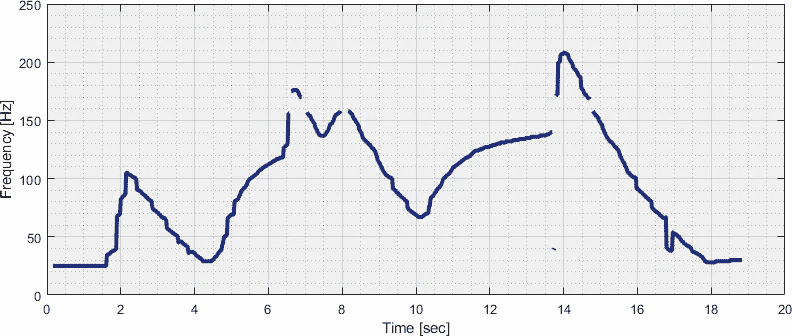

## 法拉利 150 Italia(f1)

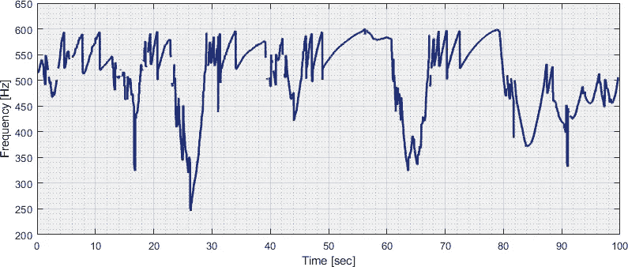

## 保时捷 911 GT3 991.2

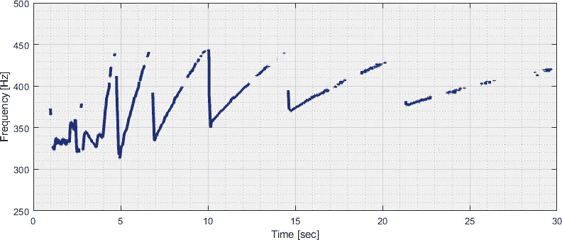

# 内燃机

让我们通过了解每台发动机的一些基本信息，将基频信号转换为发动机转速信号。我们将使用气缸数和冲程数(4 冲程或 2 冲程)。考虑到这一点，我们可以计算每秒发生的发动机爆炸次数，如下所示:

乘数参数 *k* 默认为 1，但由于各种异常原因，在某些情况下可能会有所不同:

*   大爆炸点火顺序(多个气缸同时引爆)。
*   低转速时缺爆的二冲程发动机。
*   消除基频的歧管或消声器设计。

## 马自达 MX-5 (NC) 2.0i 158 bhp

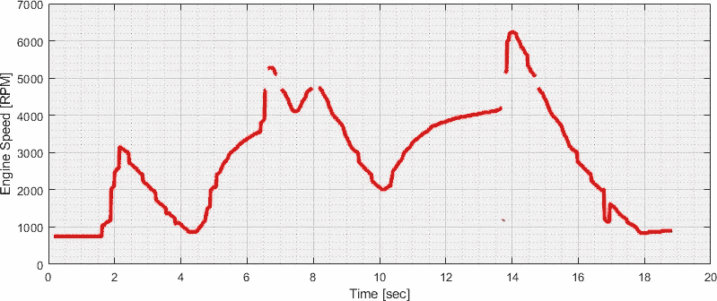

## 法拉利 150 Italia(f1)

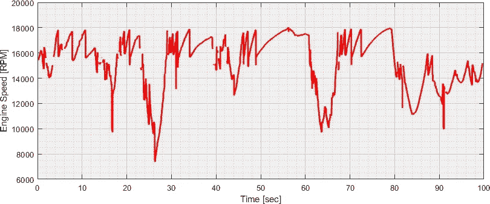

## 保时捷 911 GT3 991.2

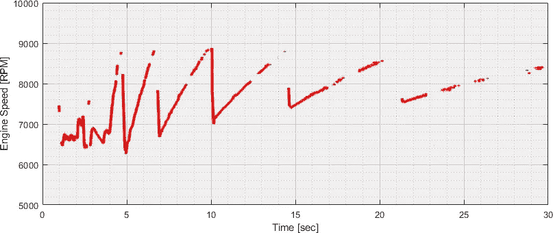

# 结论

频谱分析技术是非常强大的工具，可用于从排气声音的简单音频记录中计算内燃机速度以及其他车辆指标。主要挑战在于，基频并不总是直接与谐波和其他噪声源隔离。虽然这可以通过多种方式解决，但在各种车辆和发动机类型下实现自动化并使其坚固耐用可能仍然是困难的。然而，在计算出发动机速度信号的情况下，这可以用于逆向工程其他车辆参数，例如车辆速度或发动机扭矩和功率曲线。