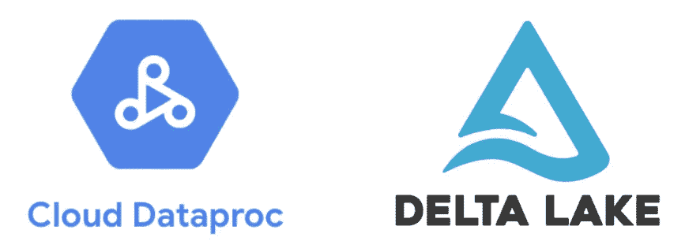
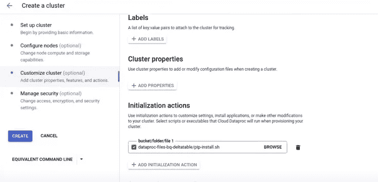
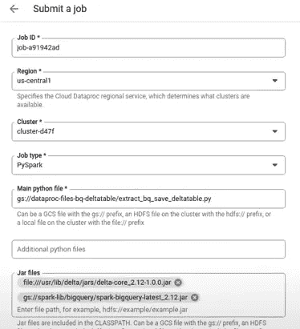
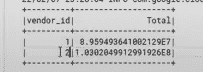
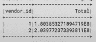

# 使用 Google Dataproc 创建增量表

> 原文：<https://medium.com/analytics-vidhya/using-google-dataproc-to-create-delta-tables-c6dffa263fee?source=collection_archive---------1----------------------->

数据湖架构是当今许多数据工程领域的目标，因为你可以依靠低成本的文件存储，如谷歌云存储和亚马逊 S3，并保证你的报告的一致性。在这篇文章中，我们将看到如何使用 Google Dataproc 构建增量表，从任何来源读取数据并将其转换为报告。

如果你愿意，你可以观看我描述和展示这一过程的视频:

你也可以在我的 Github 上找到这个解决方案的完整代码。

我们可以使用 Google Dataproc 来创建运行 Apache Spark 的机器集群。所以我们可以在 Pyspark 或 Scala 中提交作业。首先，我们创建一个代码，从著名的公共 NYC taxi 数据集读取 2015 年 1 月的数据，创建一个按 vendor_id 分组并计算其总和的报告，然后将其保存为 Google 云存储上的 Delta 表。纽约市的出租车数据集是由 Google 在 Bigquery 上免费提供的，但是你可以在自己的项目中更改数据源。

我们还需要创建一个文件，其中包含在创建 dataproc 集群时要执行的初始化指令。它将安装 python 依赖项来处理增量表，还将下载增量表 jar，以便 Spark 可以处理增量表。

将这两个文件上传到谷歌云存储的一个文件夹中。

现在，我们可以在 Google Dataproc 上创建一个集群。对于这个演示，我们可以依赖最基本的默认配置。但是，在“Customize Cluster”选项卡的“Initialization actions”中，我们必须选择之前创建的初始化文件。

现在，我们可以在这个已创建的集群上创建一个作业。我们必须选择 Pyspark 作为作业类型，并选择我们之前创建的主文件。非常重要的是，我们必须通知必要的 jar 来执行作业。我们必须提供公共大查询连接器的路径和在初始化操作中下载的 Delta Core jar 的路径:

工作完成后，我们可以看到我们的报告的格式，也可以看到它保存在 Google 云存储上。Delta 表以 parquet 格式存储其文件，并在一个名为“delta”的文件夹中跟踪其变化。

那么现在，如果您每天或每月都收到新数据，并且需要更新您的报告，该怎么办呢？这就是增量表允许您做的事情。在第二段代码中，我们将接收 1 月和 2 月的数据，计算报告，并执行合并操作，而不仅仅是覆盖报告。这就像是 SQL 上很好的 UPSERT。它将按 vendor_id 比较行，当它们匹配时，更新所有其他列，当它在旧版本中不存在时，插入新数据。

您可以看到，这些值已经用两个月以来的新数据更新了。

此外，您可以使用 SQL 引擎查询 Delta 表，如 Presto 或 Athena，并使用该框架构建所有的 Lakehouse 架构。