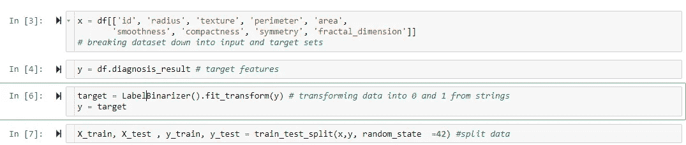

# 利用 KNN 进行癌症预测

> 原文：<https://medium.com/analytics-vidhya/using-knn-for-cancer-predictions-cfd74b60f4f1?source=collection_archive---------17----------------------->

作者 Zachary Galante——Bryant 大学数据科学专业的大四学生

赫克托·j·里瓦斯在 [Unsplash](https://unsplash.com?utm_source=medium&utm_medium=referral) 上拍摄的照片

**什么是 KNN？**

KNN 是一种非常基本的机器学习算法，它使用周围的数据来预测新数据。如下图中问号所示，它代表算法要分类的新数据(或测试用例)。然后，它考虑到类和它的邻居的距离，为测试数据作出预测。

**计算距离**

对于 KNN，距离测量极其重要，因为它们可以准确确定某些相邻要素之间的距离，这也会对分类产生影响。在这个例子中，将使用欧几里德距离，因为它也是机器学习中最流行的距离度量之一。欧几里德距离的公式如下所示，它取两个 x 和 y 点之间的差，然后对它们求平方以消除负值。这是一个基本而可靠的距离测量。也有更多的距离测量，如曼哈顿，和 Jaccard 距离。Jaccard 距离是深度学习社区中非常流行的距离度量，特别是用于图像识别的卷积神经网络。

**数据准备**

现在我们已经了解了 KNN 是如何工作的，我们现在能够用 Python 实现一个模型了。下面是正在加载的数据集和显示的特征。注意，目标变量是“诊断结果”字段。

下图更深入地研究了目标变量，显示了恶性和良性记录的数量。

在将数据传递给模型之前，还需要做一些预处理，以便模型能够正确运行。使用 KNN，所有特征都必须是数字，因为它不能计算字符串之间的距离。在下面的屏幕截图中，它显示了数据集的所有数据类型，请注意唯一不是数字的特性是我们的目标变量“diagnosis_result”

为了改变这一点，目标变量将通过标签编码器函数变为二进制。这将取值“M”和“B ”,并自动将它们赋给 0 和 1。

在下图中，数据被分为“x”和“y”数据集。在第一个单元格中，除了目标变量之外的所有内容都被选为输入数据，这将是“x”数据集。接下来，选择“y”数据集作为诊断结果特征。接下来，如前所述，目标变量的数据被转换为二进制，然后被重新赋值为“y”。最后，数据被分成测试集和训练集。由于没有明确说明，数据被分成 75%的训练和 25%的测试。

**运行模型**

既然数据的格式正确，并且被分解为训练集和测试集，现在就可以对模型进行训练和测试了。使用循环来测试哪个数量的邻域适合用于实现模型的最佳得分。

**评估模型性能**

在所示的图表中，它说明了模型的最佳邻居数量是 2，因为它导致测试集和训练集都具有最高的准确性分数。当使用 3 个邻居时，模型获得相同的测试分数，但是训练分数较低，这意味着 2 个邻居是模型的最佳拟合。

**最优模式**

既然已经使用不同的参数对模型进行了评估，那么可以使用之前确定为 2 的最佳邻域数来运行该模型。如结果所示，该模型最终运行得相当好，因为它得到了 84%的测试分数:

**结论**

正如在整篇文章中所看到的，拥有更多的邻居并不总是对模型有利，因为它会导致精度提高到某一点，但随后会下降。找到最佳级别对于实现模型的最佳结果极其重要。

**参考文献**

 [## sk learn . model _ selection . train _ test _ split-sci kit-learn 0 . 24 . 1 文档

### 如果是 float，应介于 0.0 和 1.0 之间，并表示要包含在训练分割中的数据集的比例。如果…

scikit-learn.org](https://scikit-learn.org/stable/modules/generated/sklearn.model_selection.train_test_split.html) 

[https://www . data camp . com/community/tutorials/k-nearest-neighbor-class ification-sci kit-learn](https://www.datacamp.com/community/tutorials/k-nearest-neighbor-classification-scikit-learn)

[https://mccormickml.com/2013/08/15/the-gaussian-kernel/](https://mccormickml.com/2013/08/15/the-gaussian-kernel/)