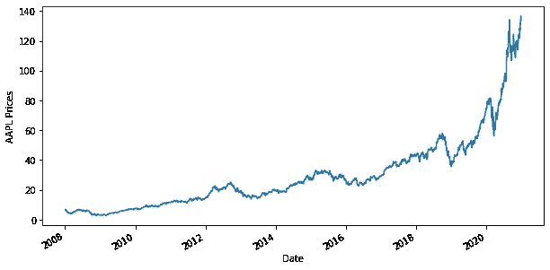
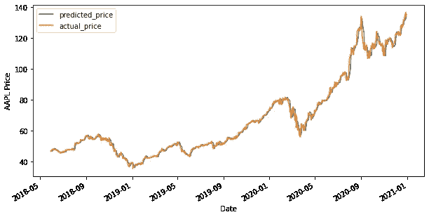

# 在 Python 中使用线性回归预测 AAPL(苹果股票)价格

> 原文：<https://medium.com/analytics-vidhya/using-linear-regression-to-predict-aapl-apple-stock-prices-in-python-1a629fbea15b?source=collection_archive---------3----------------------->

有可能预测 AAPL 价格的走向吗？

是的，让我们使用[机器学习回归技术](https://www.quantinsti.com/blog/machine-learning-trading-predict-stock-prices-regression/)来预测世界上最受关注的公司之一苹果公司的价格。

我们将创建一个[机器学习](https://quantra.quantinsti.com/course/introduction-to-machine-learning-for-trading)线性回归模型，从过去的 AAPL 价格中获取信息，并返回第二天 AAPL 价格的预测。

# 导入库并读取数据

首先:导入实现这个策略所需的所有必要的库。

然后，我们读取过去 13 年的每日 AAPL 价格数据，并将其存储在 Dataframe 中。我们删除不相关的列，并使用 dropna()函数删除 NaN 值。然后，我们绘制 AAPL 收盘价。

输出:



# 定义解释变量

解释变量是被操纵来决定第二天 AAPL 价格的变量。简单地说，它们是我们想要用来预测 AAPL 价格的特征。该策略中的解释变量是过去 3 天和 9 天的移动平均值。我们使用 dropna()函数删除 NaN 值，并将特征变量存储在 x 中。

但是，您可以向 X 添加更多您认为对预测 AAPL 价格有用的变量。这些变量可以是技术指标

# 定义因变量

同样，因变量取决于解释变量的值。简单地说，这就是我们试图预测的 AAPL 价格。我们将 AAPL 的价格存储在 y 中。

```
y = Df['Close']y.head()
```

# 将数据分成训练和测试数据集

在这一步中，我们将预测器和输出数据分为训练和测试数据。通过将输入与预期输出配对，训练数据用于创建线性回归模型。测试数据用于评估模型的训练情况。

1.  前 80%的数据用于训练，其余数据用于测试
2.  X_train 和 y_train 是训练数据集
3.  X_test 和 y_test 是测试数据集

# 创建线性回归模型

我们现在将创建一个线性回归模型。但是，什么是线性回归呢？

如果我们试图捕捉“x”和“y”变量之间的数学关系，即通过散点图拟合一条线，根据“x”的观察值“最好地”解释“y”的观察值，那么 x 和 y 之间的这种方程称为线性回归分析。

```
***Y = m1 * X1 + m2 * X2 + C AAPL price = m1 * 3 days moving average + m2 * 15 days moving average + c***
```

然后，我们使用拟合方法来拟合自变量和因变量(x 和 y ),以生成回归系数和常数。

```
linear = LinearRegression().fit(X_train,y_train)
```

# 预测 AAPL 价格

现在，是时候检查模型是否在测试数据集中工作了。我们使用使用训练数据集创建的线性模型来预测 AAPL 价格。预测方法找到给定解释变量 x 的 AAPL 价格(y)

输出



该图显示了 AAPL 的预测价格和实际价格。

# 让我们检查一下我们的准确性

现在，让我们使用 score()函数来计算拟合度。

```
r2_score = linear.score(X[t:],y[t:])*100  float("{0:.2f}".format(r2_score))
```

# **输出— 99.42**

可以看出，模型的 R 平方为 99.42%。r 平方始终介于 0 和 100%之间。接近 100%的分数表明该模型很好地解释了 AAPL 价格。

恭喜你。你刚刚学会了一个基本而强大的[机器学习](https://www.quantinsti.com/blog/overview-machine-learning-trading/)技术。感谢阅读！

再见！