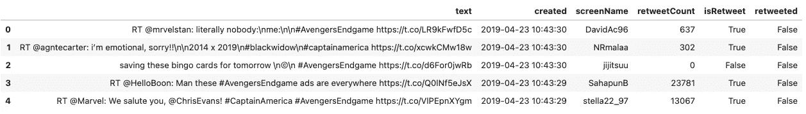
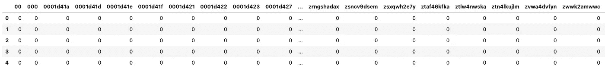
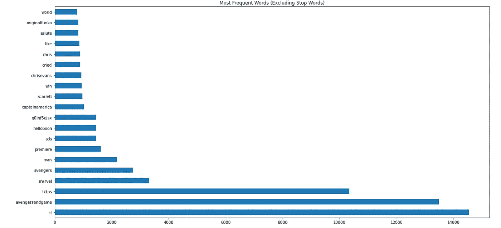
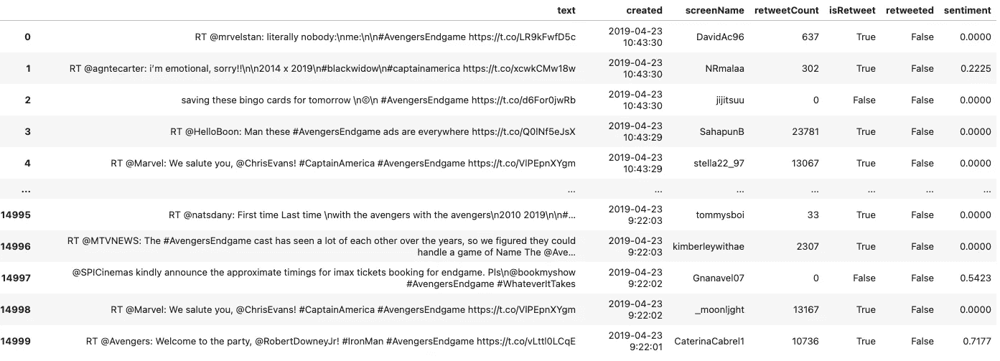
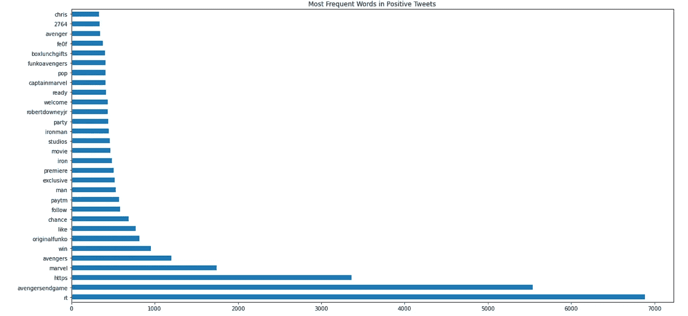
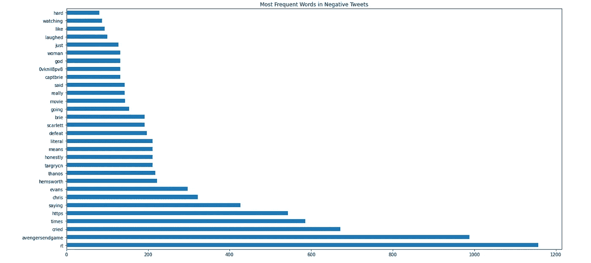

# 使用 Python 中的自然语言处理来进行你自己的社交倾听

> 原文：<https://medium.com/analytics-vidhya/using-natural-language-processing-in-python-to-conduct-your-own-social-listening-f0e6bda47aee?source=collection_archive---------6----------------------->


资料来源:KM&A

近年来，我们已经看到越来越多的企业不仅使用社交媒体与消费者互动，还利用这些数据更好地为他们的商业决策提供信息。具体到营销，社交倾听已经成为广告商的解决方案。

什么是社交倾听？根据提供社交倾听服务的营销公司 Hootsuite 的说法，品牌的社交倾听是“跟踪、分析和回应社交媒体上关于他们的对话的机会。”然而[的另一个社交倾听工具](https://sproutsocial.com/social-listening/)将它定义为“分析不仅仅围绕你的品牌，而是围绕你的整个行业的对话和趋势。”为了我们的例子，我们将使用前一个定义，并采取更微观的方法来进行社交倾听。

我们将使用来自 Kaggle 的这个[#复仇者联盟](https://www.kaggle.com/kavita5/twitter-dataset-avengersendgame) Twitter 数据集。

**第一步:导入**

```
#imports
import pandas as pd
import numpy as np
import matplotlib.pyplot as plt
import seaborn as sns
from sklearn.feature_extraction.text import CountVectorizer, TfidfVectorizer
from nltk.sentiment.vader import SentimentIntensityAnalyzer
```

我们将使用的两个主要 NLP 工具是 Sklearn 的 CountVectorizer(或 TfidfVectorizer)和 NLTK 的 SentimentIntensityAnalyzer。

**第二步:设置数据**

```
# read into data
tweets = pd.read_csv('tweets.csv')# drop columns as needed
tweets = tweets.drop(columns=['Unnamed: 0', 'favorited', 'favoriteCount', 'replyToSN','replyToSID', 'statusSource','truncated', 'id', 'replyToUID', 'longitude', 'latitude'])# check data
tweets
```

输出应该如下所示:



**第三步:计数矢量器**

CountVectorizer 将文本转换为向量，并计算每行文本中某个单词出现的次数。TfidfVectorizer 也将文本转换为向量，但它不是使用由整数表示的词频，而是通过每个词在数据中出现的频率来计算它们的权重，这由浮点数表示。

```
# instantiate CountVectorizer with stop_words parameter
cvec = CountVectorizer(stop_words='english')# fit cvec to text column
cvec.fit(tweets['text'])# transform text column
text_cvec = cvec.transform(tweets['text'])# create dataframe with the transformed vectors
df = pd.DataFrame(text_cvec.todense(),
                 columns = cvec.get_feature_names())# view results
df
```

以 CountVectorizer 为例，输出应该如下所示:



由于我们没有专注于清洁，我们看到了许多奇怪的矢量创建。如果我们建立一个模型，这些可以用超参数剔除。

**第三步:可视化最常用的单词**

```
# set image size
plt.figure(figsize=(15,7))# plot top 30 most frequent words
df.sum().sort_values(ascending=False).head(30).plot(kind='barh')
plt.title("Most Frequent Words (Excluding Stop Words)")
```

输出:



毫不奇怪，核心标签之外最常见的词是:漫威，复仇者联盟。美国队长/克里斯·埃文斯和斯嘉丽·约翰逊都是热门话题。

**第四步:情感分析**

我们正在利用 NLTK 包中的 SentimentIntensityAnalyzer。这将输出一个正数、中性、负数和复合分数。正面情绪由正整数表示，负面情绪由负整数表示，而中性情绪得分为 0。我们将只查看每条推文的复合(整体)得分。

```
# instantiate sentiment analysis
sentiment = SentimentIntensityAnalyzer()# create an empty list for sentiment scores
sentiment_list = []# loop through each tweet and calculate overall sentiment score, then append to the list above
for i in tweets['text']:
    score = sentiment.polarity_scores(i)['compound']
    sentiment_list.append(score)# create a new column in tweets dataframe that has the sentiment scores
tweets['sentiment'] = sentiment_list# view results
tweets.head()
```

输出应该是这样的(最右边的新情绪栏):



**步骤 5:将计数矢量器与情感分析相结合**

让我们来看看推文中情绪得分为*正值*的热门词汇。

```
# create new dataframe with positive sentiment tweets
positives = tweets[tweets['sentiment'] > 0]# instantiate CountVectorizer with stop_words parameter
cvec_pos = CountVectorizer(stop_words='english')# fit cvec to text column
cvec_pos.fit(positives['text'])# transform text column
text_cvec_pos = cvec_pos.transform(positives['text'])# create dataframe with the transformed vectors
df_pos = pd.DataFrame(text_cvec_pos.todense(),
                 columns = cvec_pos.get_feature_names())# set image size
plt.figure(figsize=(15,7))# plot top 30 most frequent words
df_pos.sum().sort_values(ascending=False).head(30).plot(kind='barh')
plt.title("Most Frequent Words in Positive Tweets")
```



除了核心术语之外，正面推文中最常见的一些词是:originalfunko、ironman、robertdowneyjr、captainmarvel。

现在让我们来看看情绪得分为*负*的推文中的热门词汇。

```
# create new dataframe with negative sentiment tweets
negatives = tweets[tweets['sentiment'] < 0]# instantiate CountVectorizer with stop_words parameter
cvec_neg = CountVectorizer(stop_words='english')# fit cvec to text column
cvec_neg.fit(negatives['text'])# transform text column
text_cvec_neg = cvec_neg.transform(negatives['text'])# create dataframe with the transformed vectors
df_neg = pd.DataFrame(text_cvec_neg.todense(),
                 columns = cvec_neg.get_feature_names())# set image size
plt.figure(figsize=(15,7))# plot top 30 most frequent words
df_neg.sum().sort_values(ascending=False).head(30).plot(kind='barh')
plt.title("Most Frequent Words in Negative Tweets")
```



除了核心术语之外，负面推特中最常见的一些词是:哭了，克里斯·埃文斯，海姆斯沃斯，塔诺斯，失败。

**结论**

梳理所有的推文，我们发现克里斯·埃文斯/美国队长是电影中最受欢迎的话题之一。当专门查看积极情绪的推文时，小罗伯特·唐尼/铁人是最受欢迎的话题之一。对于负面情绪的推文，“哭了”是最常见的关键词，其次是“克里斯·埃文斯”(没有剧透)、“thanos”和“失败”。从这个分析中，我们可以为观众推断出电影中最激动人心的时刻，既有快乐的也有悲伤的。