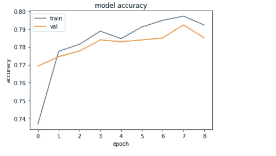

# 利用神经网络解决客户流失问题。

> 原文：<https://medium.com/analytics-vidhya/using-neural-networks-to-solve-customer-churn-problem-3527f1a5a38?source=collection_archive---------12----------------------->


艾莉娜·格鲁布尼亚克在 [Unsplash](https://unsplash.com?utm_source=medium&utm_medium=referral) 上的照片

数据集:【https://www.kaggle.com/radmirzosimov/telecom-users-dataset 

笔记本:[https://www . ka ggle . com/tanishsawant 2002/customer-churn-keras-and-sk learn](https://www.kaggle.com/tanishsawant2002/customer-churn-keras-and-sklearn)

关于数据集和任务:

任何企业都希望最大限度地增加客户数量。要实现这一目标，不仅要努力吸引新客户，还要留住现有客户。留住一个客户比吸引一个新客户花费更少。此外，新客户可能对业务服务不太感兴趣，很难与他合作，而老客户已经有了与服务交互的必要数据。

相应地，预测客户流失，我们可以及时做出反应，努力留住想要离开的客户。根据客户使用的服务数据，我们可以为他提供特殊优惠，试图改变他离开运营商的决定。这将使留住用户的任务比吸引新用户的任务更容易实现，因为我们对此还一无所知。

一家电信公司为您提供了一个数据集。该数据包含大约 6000 名用户的信息、他们的人口统计特征、他们使用的服务、使用运营商服务的持续时间、支付方式和支付金额。

任务是分析数据，预测用户流失(识别愿意和不愿意续约的人)。

这是一个非常普通的分类问题，通常通过使用像 K 最近邻或 RandomForestClassifier 或支持向量机这样的算法来解决。

这次，我们将使用神经网络来预测客户的行为

导入数据:

```
df = pd.read_csv("../input/telecom-users-dataset/telecom_users.csv")
df.head()
```


输出的一部分

让我们检查列的数据类型

```
df.info()
```


输出

描述数据框架

```
df.describe().T
```


最好总是存储列的列表:

```
cols = df.columns
cols = list(cols)
```

数据预处理:

从前面的输出可以看出，有许多“Object”类型的列，它们需要被更改为 numeric。

这个过程被称为热编码。

```
*#object type columns*
obj_cols = [column for column **in** cols if df[column].dtypes=='object']
```

以下是所有对象类型列

在进行热编码之前，建议检查对象类型列的唯一值的计数。

如果任何一列包含许多不同的值，那么对该列进行一次热编码可能会导致太多的列特性。

这可能会导致过度拟合，并大大降低模型的效率。

```
*#Unique values in object columns*
for col **in** obj_cols:
    print("---------------------------")
    print(col)
    print(df[f"**{**col**}**"].value_counts())
```

输出:

```
---------------------------
customerID
1705-GUHPV    1
5215-LNLDJ    1
4529-CKBCL    1
7133-VBDCG    1
2332-EFBJY    1
             ..
7801-CEDNV    1
4565-EVZMJ    1
8690-ZVLCL    1
8100-HZZLJ    1
5474-LAMUQ    1
Name: customerID, Length: 5986, dtype: int64
---------------------------
gender
Male      3050
Female    2936
Name: gender, dtype: int64
---------------------------
Partner
No     3082
Yes    2904
Name: Partner, dtype: int64
---------------------------
Dependents
No     4195
Yes    1791
Name: Dependents, dtype: int64
---------------------------
PhoneService
Yes    5396
No      590
Name: PhoneService, dtype: int64
---------------------------
MultipleLines
No                  2848
Yes                 2548
No phone service     590
Name: MultipleLines, dtype: int64
---------------------------
InternetService
Fiber optic    2627
DSL            2068
No             1291
Name: InternetService, dtype: int64
---------------------------
OnlineSecurity
No                     2982
Yes                    1713
No internet service    1291
Name: OnlineSecurity, dtype: int64
---------------------------
OnlineBackup
No                     2605
Yes                    2090
No internet service    1291
Name: OnlineBackup, dtype: int64
---------------------------
DeviceProtection
No                     2640
Yes                    2055
No internet service    1291
Name: DeviceProtection, dtype: int64
---------------------------
TechSupport
No                     2960
Yes                    1735
No internet service    1291
Name: TechSupport, dtype: int64
---------------------------
StreamingTV
No                     2389
Yes                    2306
No internet service    1291
Name: StreamingTV, dtype: int64
---------------------------
StreamingMovies
No                     2356
Yes                    2339
No internet service    1291
Name: StreamingMovies, dtype: int64
---------------------------
Contract
Month-to-month    3269
Two year          1441
One year          1276
Name: Contract, dtype: int64
---------------------------
PaperlessBilling
Yes    3528
No     2458
Name: PaperlessBilling, dtype: int64
---------------------------
PaymentMethod
Electronic check             2006
Mailed check                 1369
Bank transfer (automatic)    1308
Credit card (automatic)      1303
Name: PaymentMethod, dtype: int64
---------------------------
TotalCharges
20.2       10
           10
19.75       8
19.55       7
19.9        6
           ..
4414.3      1
1261.35     1
6885.75     1
716.4       1
2998        1
Name: TotalCharges, Length: 5611, dtype: int64
---------------------------
Churn
No     4399
Yes    1587
Name: Churn, dtype: int64
```

客户 ID 肯定应该被删除，否则模型会把它弄得一团糟。

```
*#Customer ID must be dropped, else the data is fine to be one hot encoded.*
df = df.drop('customerID', axis=1)
obj_cols.remove('customerID')
```

开始了…..

在这一点上，我们可以热编码出特性。

为此，可以使用名为 pd.get_dummies()的方法。

这是一个非常强大的方法！只需两行代码，就可以对整个表进行热编码。！

```
*#One hot encoding*
for col **in** obj_cols:
    df[col] = pd.get_dummies(df[col])df.head()
```


如你所见，这些列是分开的。

```
cols = list(df.columns) 
```

将数据分为训练和测试:

```
*#Split data*
X = df[set(cols)-set(["Churn"])]
y = df["Churn"]from sklearn.pipeline import make_pipeline
from sklearn.preprocessing import StandardScaler
from sklearn.ensemble import RandomForestClassifier

X_train, X_test, y_train, y_test = train_test_split(X, y, test_size=0.2)
```

此时，我们可以将数据标准化。

通过归一化，数据被调整，使得数据的平均值为 0，标准偏差和方差被设置为 1。

对于规范化，StandardScaler()是 sklearn.preprocessing 提供的方法。

```
sc = StandardScaler()
sc.fit(X_train)
X_train = sc.transform(X_train)
X_test = sc.transform(X_test)
X_train = pd.DataFrame(X_train)
X_test = pd.DataFrame(X_test)X_train.head()
```


如你所见，数据肯定和以前一样。

定义模型:

导入必要的库:

```
from tensorflow import keras
from keras.models import Sequential
from keras.layers import Dense, Dropout
```

定义模型

```
model = Sequential([
    Dense(32, activation='relu', input_dim=20),
    Dropout(0.5),
    Dense(16, activation='relu'),
    Dense(1, activation='sigmoid')
])
```

需要注意的非常重要的一点是，input_dim 设置为 20。

为什么是 20？

因为……数据集中有 20 个特征。如果这个值与特征的数量不一致，那么它会引起一些问题。

```
X_train.shape
```


`Also note the size of the output`

编译模型，看一下总结。

```
model.compile(optimizer='adam', loss='mean_squared_error', metrics=['accuracy'])
model.summary()
```


将数据放入模型:

```
history = model.fit(X_train, y_train, batch_size=10, validation_split=0.2 ,epochs=100 ,callbacks=[keras.callbacks.EarlyStopping(monitor='val_loss',patience=3, restore_best_weights=True)])
```

历史对象具有属性“History ”,它是包含训练步骤日志的 python 字典。

```
history.history
```


为了检查我们的模型的准确性，可以使用 history.history 的准确性键。

```
plt.plot(history.history['accuracy'])
plt.plot(history.history['val_accuracy'])
plt.title('model accuracy')
plt.ylabel('accuracy')
plt.xlabel('epoch')
plt.legend(['train', 'val'], loc='upper left')
plt.show()
```



```
plt.plot(history.history['loss'])
plt.plot(history.history['val_loss'])
plt.title('Loss')
plt.ylabel('loss')
plt.xlabel('epoch')
plt.legend(['train', 'val'], loc='upper left')
plt.show()
```


就是这样！！

我们已经成功地实现了预测客户流失的神经网络。

你也可以尝试改变神经网络的领域。你可以调整网络，通过添加或删除一些层，改变激活…..等等。

PS:一定要看看我的笔记本，在那里我用不同的算法解决了同一个问题。