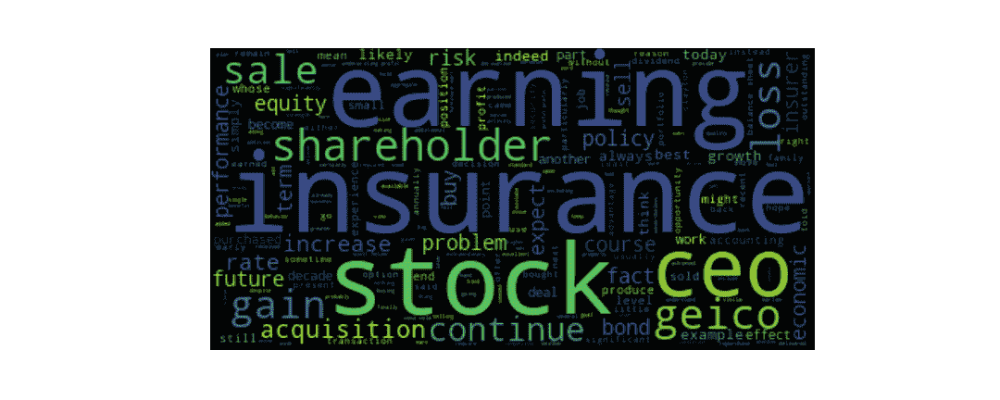
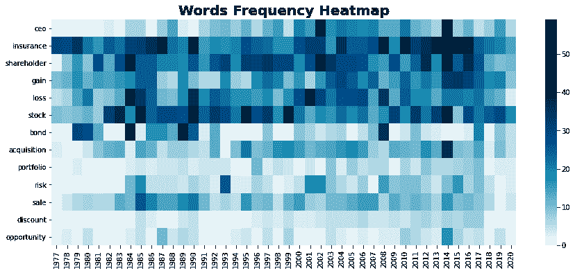
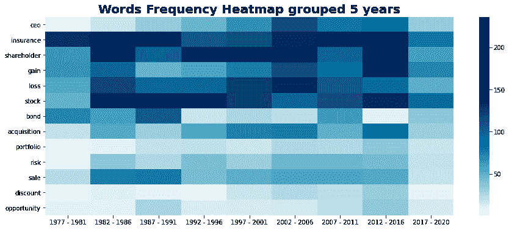
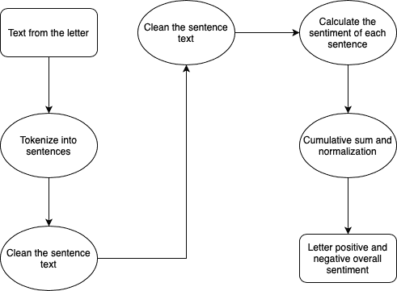
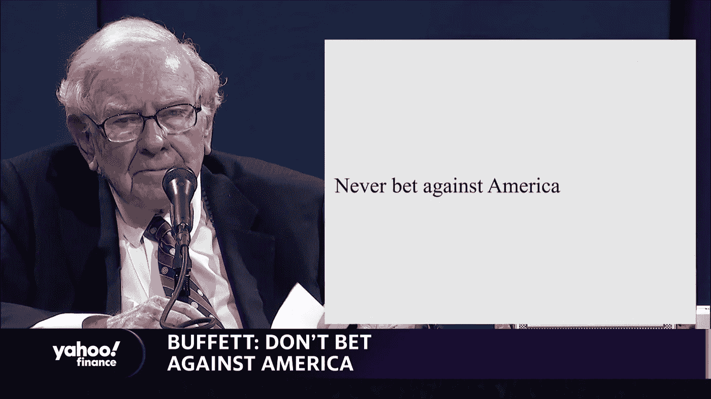
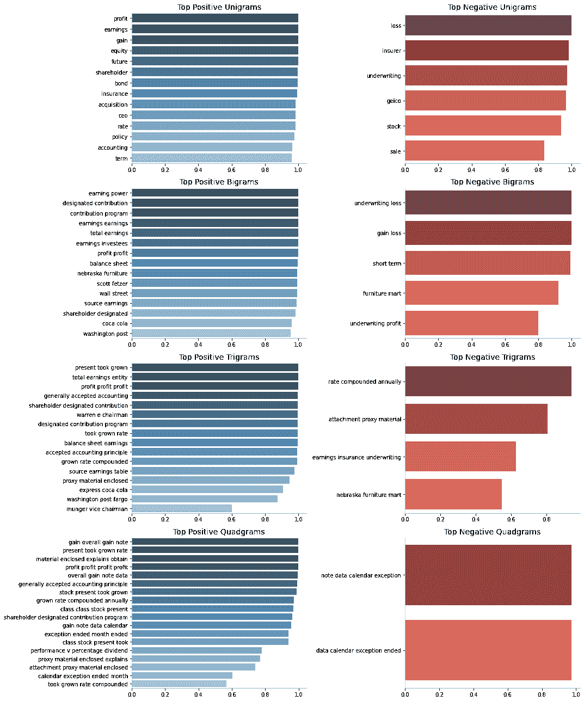

# 使用自然语言处理进入沃伦巴菲特的思想第 2 部分

> 原文：<https://medium.com/analytics-vidhya/using-nlp-to-get-inside-warren-buffet-mind-part-2-8e3557810a39?source=collection_archive---------6----------------------->


频率和情感分析。

在第 1 部分中，我使用了在问答任务中训练的变形金刚来回答这个问题:“机器学习模型可以回答关于金融和经济的问题吗？”。如果你还没有阅读这篇文章，不要再浪费时间，点击这里阅读。

在本文中，我将使用 NLP 技术来回答这些问题:

**1。自助餐最常用的术语是什么？这些术语是否会随着时间的推移而改变？**

**2。这些年来，他对经济和股市的感觉如何？**

# 自助餐最常用的术语是什么？这些术语是否会随着时间的推移而改变？

我的一个好奇心是，巴菲特的演讲是随着时间的推移而改变，还是一直保持不变。所以我分析了他在股东信中写的话是如何随着时间而变化的。

首先，我综合了从 1977 年到 2020 年的所有信件，绘制了一个单词云。单词云是一种视觉表示，其中单词的大小表示它们在文本中的频率。

## 词云



自助餐字母词云

赚和**股票**这两个词在字母中有一个亮点，正如预期的那样，因为他们的核心业务是从股票中赚钱，但其他有趣的词也有一个很大的亮点是**保险**和 **Geico** 。展示了巴菲特是多么喜欢保险行业，并证实了《福布斯》的采访，当时他说 Geico 是他人生中的第一投资。

其他引起我注意的词还有首席执行官，表明沃伦不仅投资伟大的公司，也投资伟大的人，还有股东，表明巴菲特总是关心股东的幸福。

## 频率热图

根据信中最常用的词，我绘制了一张热图，看看这些年来沃伦的演讲是有变化还是保持不变。



单词频率热图，x 轴是字母 years，y 轴是单词，越接近白色的单元格表示频率低，越接近绿色的单元格表示频率高。

我们可以注意到，**保险**、**股东**、**收益**、**损失**和**股票**这些词在这些被分析的年份的信件中频繁出现。从 90 年代中期开始， **CEO** 这个词开始更多地出现在字母中。

如果我们看单词**损失**的行，我们看到在 **2001** 中这个单词被大量使用。大概是因为世贸中心遇袭导致保险业遭受了有史以来最惨重的损失。

另一个突出的问题是股票行的 1995 年，在这一年讨论了伯克希尔 B 类股票的创建。由于这是公司的一项重要决策，将会影响到所有伯克希尔的投资者，他必须解释这项创新是如何运作的。这就是为什么那一年更多地使用股票这个术语。

在**债券**行中，我们看到了 1984 年**和 2008 年**的亮点。1984 年，他写下了他购买债券的投资理念。2008 年，他写了一篇关于免税债券保险市场的文章。****

但是，由于我们没有在这张热图的字母中看到任何强有力的模式，我将数据分组为 5 年期，以分析是否有任何模式出现。



按 5 年期分组的词频热图

即使绘制分组热图，我们也只能在**首席执行官**行**行**处看到一种趋势，这种趋势的频率逐年增加。

## 但是为什么沃伦·巴菲特开始在信中更频繁地使用 CEO 这个词呢？

深入研究巴菲特的生活，我发现他的投资策略是从购买**雪茄蒂**公司开始的。

> “如果你以足够低的价格买入一只股票，通常公司的运气会出现一些小问题，让你有机会脱手，获得可观的利润，尽管公司的长期表现可能很糟糕。我称之为“ ***雪茄屁股*** *”的投资方法。在街上发现的只剩下一口的雪茄烟蒂可能不会提供太多的烟，但是“廉价购买”将使这一口烟全部获利。*

雪茄烟头公司的首席执行官们在投资中没有发挥重要作用，因为巴菲特对这类公司的意图只是在短期内获利。但是，他的合伙人查理·芒格(Charlie Munger)说服巴菲特改变他的投资策略，专注于价值投资(这种策略包括挑选看起来交易价格低于其 T4 内在价值(T5)或账面价值的 T2 股票)。对于注重长期业绩的价值投资者来说，谁是公司的首席执行官对是否投资该公司起着很大的作用。

沃伦投资理念的这种变化发生在 80 年代末，他在 1989 年的信中写道:

> “但现在，当我们购买公司或普通股时，我们会寻找拥有一流管理层的一流企业。”

因此，巴菲特越来越多地使用 CEO 这个词的可能原因是他的投资策略从购买雪茄蒂公司转向购买股票。

在那之后，我试图获得巴菲特对一些时下热门话题的想法，如比特币、区块链、加密、外汇、期权、AI、ESG、Tesla 和 FAANG。但这些术语从未出现在他的信中。证实了他的“能力圈”概念。能力圈是指投资者在决定投资哪些公司时，坚持自己了解的领域。

正如我们所看到的，巴菲特的演讲似乎并没有随着时间的推移而发生太大的变化，在一些一次性的事件中，他专注于一些特定的领域或对他的股东来说重要的事件。当他改变策略，从购买雪茄蒂转向购买价值公司时，他只是更多地谈论首席执行官。

# 这些年来，他对经济和股市的感觉如何？

我的最后一个好奇心是，他是否会在信中表露自己的情绪，或者他是否总是把自己的情绪放在一边，用一种更中性的语气。

为了进行这种分析，我再次利用了**变形金刚**的强大功能，这次使用了预先训练好的“情感分析”管道，还使用了[情感强度分析器](https://towardsdatascience.com/sentimental-analysis-using-vader-a3415fef7664)，该分析器使用 VADER(用于情感推理的化合价感知词典)技术来查看这两种技术之间是否有任何差异。

## **什么是情感分析？**

情感分析或意见挖掘是 NLP 的子集，它试图提取文本是正面、负面还是中性的(一些情感分析只将文本分类为正面或负面)。

## 使用变压器的情感分析

在 Python 的情感分析任务中使用预先训练好的转换器很容易。有了 3 行代码，你就可以开始对你的句子进行否定和肯定的分类了。

```
**>>> from** **transformers** **import** pipeline
**>>>** classifier = pipeline('sentiment-analysis')
**>>>** classifier('We are very happy to show you the 🤗 Transformers library.')
[{'label': 'POSITIVE', 'score': 0.9997795224189758}]
```

情感分析管道的输出是一个字典，它有一个正的或负的分数，加起来等于 1。

在我使用情感分析管道之前，我在文本中做了一些预处理，以获得更好的结果。下图总结了这一过程。



我使用了一个句子标记化来将信件的文本分割成句子，然后我对每个句子的情感分析进行了累积求和，之后，我对结果进行了归一化

最后，我将结果绘制在热图中。


使用预先训练的变压器进行情感分析得到的热图

这张热图让我大吃一惊，因为该模型将大部分年份评为负值。2001 年和 2008 年**有一种更消极的感觉，可能是由于 2001 年的 911 和 2008 年的金融危机。**

另一个有趣的事实是，尽管获得了疫情奖，但对 2020 年的信的评价更积极而不是消极。毕竟，正如我们今天所看到的，巴菲特的感觉是正确的，因为从 2020 年 3 月 20 日股票价格的底部到现在，标准普尔 500 已经上涨了 70%以上，所以“**永远不要赌美国**”。



沃伦·巴菲特在他的 2020 年会上

# Ngrams 情感分析

为了实现 n gram 情感分析，我使用了 [nltk](https://www.nltk.org/) 包从所有信件的文本中获取 20 个最常见的一元词、二元词、三元词和四元词，并使用 transformer 将 n gram 分为正面和负面。

你可以在下面的图表中看到结果。正片在左边是蓝色，负片在右边是红色。有趣的是，除了包含单词 loss 的 ngrams，所有其他负 ngrams 似乎都不是负的，比如 unigrams **geico** 和 **stock** 。



Ngrams 情绪分析条形图，左边是正的 ngrams，右边是负的 ngrams。为了绘制这些条形图，我使用了在这个 [kaggle](https://www.kaggle.com/jairneto/e-commerce-sentiment-analysis-eda-viz-nlp/edit) 中实现的函数。

## 使用情感强度分析器 VADER 进行情感分析

> *VADER (Valence Aware 词典和情感推理机)是一款基于词典和规则的情感分析工具，专门针对社交媒体中表达的情感。*

使用情感强度分析器(SIA) **VADER** 技术的模型将文本分为 3 类，负面、正面和中性。分析信件的过程遵循与 transformer 相同的步骤，只是改变了用于计算情绪的技术，结果在下面的热图中。


使用 SIA 的情感分析热图

使用 SIA，我们有不同于变形金刚分析的中性的所有年份的文本。可能是因为用于训练模型的数据来自社交媒体。将社交媒体文本与巴菲特信件中的信息语气相比较，SIA 使用 VADER 将所有信件文本归类为中性并不令人惊讶。

这些相互矛盾的结果对我下一次使用预先训练好的模型进行情感分析很有帮助。因为表明用于训练模型的数据对其性能有重要作用。

# 结论

1.  在这篇文章中，我们没有发现多年来巴菲特写信时使用的词汇有任何明显的变化。
2.  这些字母具有负面或中性的情绪，并且使用的两个预训练模型具有冲突的结果，这表明我们需要找到一个预训练模型，其用于训练的数据与您想要分类的数据相似。

你可以在我的 [Github 库](https://github.com/jairNeto/warren_buffet_letters)查看写这篇文章的代码。如果你对我的 [Linkedin](https://www.linkedin.com/in/jair-guedes-ferreira-neto/) 账户有任何意见，请随时联系我，非常感谢你阅读这篇文章。

如果你喜欢你所读的，一定要👏下面，分享给你的朋友，关注我，不要错过这一系列的帖子。

# 参考

 [## 股东信函

### 对于股东和其他感兴趣的人来说，这本书汇编了沃伦…

www.berkshirehathaway.com](https://www.berkshirehathaway.com/letters/letters.html) [](https://realpython.com/python-nltk-sentiment-analysis/#customizing-nltks-sentiment-analysis) [## 情感分析:使用 Python 的 NLTK 库的第一步——真正的 Python

### NLTK 库包含各种实用程序，允许您有效地操作和分析语言数据。在…之中

realpython.com](https://realpython.com/python-nltk-sentiment-analysis/#customizing-nltks-sentiment-analysis) [](https://towardsdatascience.com/a-beginners-guide-to-sentiment-analysis-in-python-95e354ea84f6) [## Python 情感分析初学者指南

### 关于使用文本数据构建单词云、漂亮的可视化和机器学习模型的端到端指南。

towardsdatascience.com](https://towardsdatascience.com/a-beginners-guide-to-sentiment-analysis-in-python-95e354ea84f6) [](https://towardsdatascience.com/sentiment-analysis-in-10-minutes-with-bert-and-hugging-face-294e8a04b671) [## 伯特和拥抱脸 10 分钟情感分析

### 学习预训练的自然语言处理模型的基础，伯特，并建立一个使用 IMDB 电影评论的情感分类器…

towardsdatascience.com](https://towardsdatascience.com/sentiment-analysis-in-10-minutes-with-bert-and-hugging-face-294e8a04b671) [](/@b.terryjack/nlp-pre-trained-sentiment-analysis-1eb52a9d742c) [## NLP:预先训练的情感分析

### 让我们评估一下各种 Pythonic NLP 库中提供的一些预训练的情感分析工具。

medium.com](/@b.terryjack/nlp-pre-trained-sentiment-analysis-1eb52a9d742c)  [## 电子商务情感分析:EDA + Viz + NLP ✍

### 使用 Kaggle 笔记本探索和运行机器学习代码|使用来自多个数据源的数据

www.kaggle.com](https://www.kaggle.com/thiagopanini/e-commerce-sentiment-analysis-eda-viz-nlp?select=viz_utils.py)