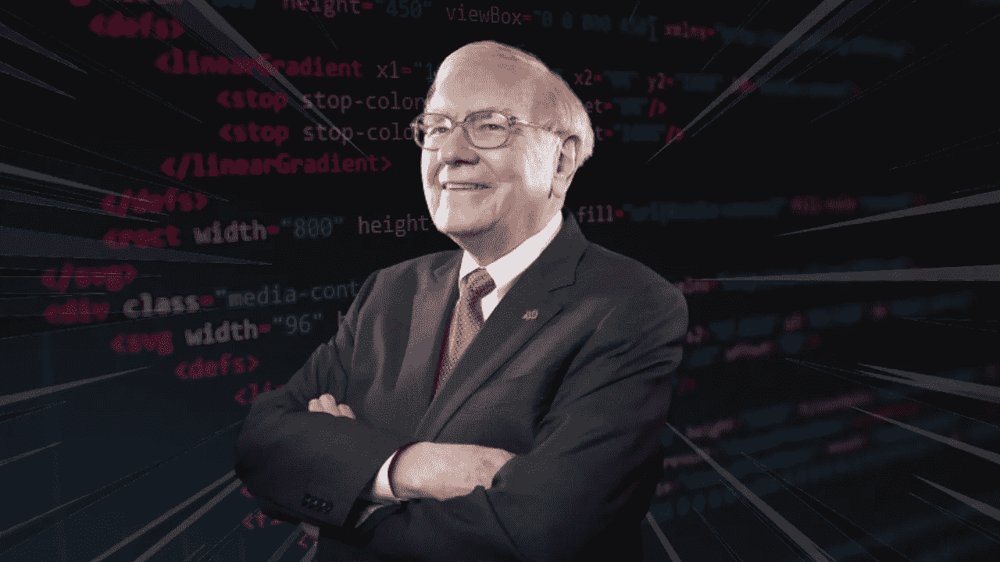
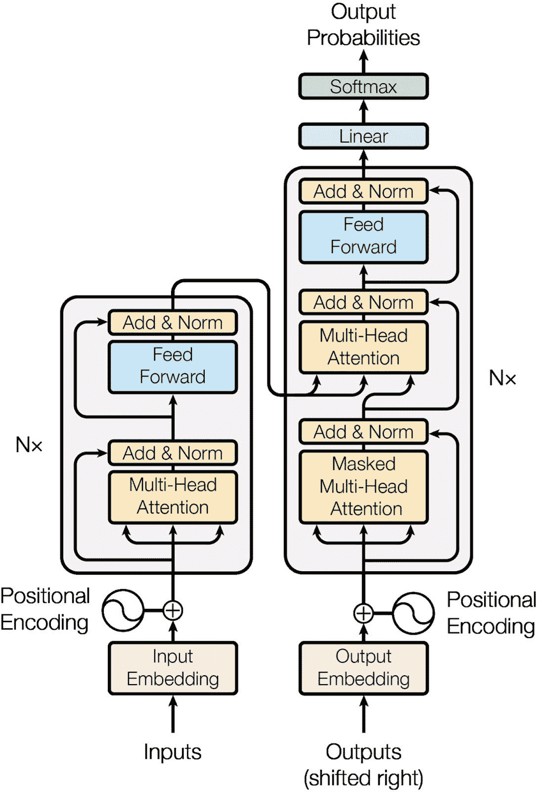
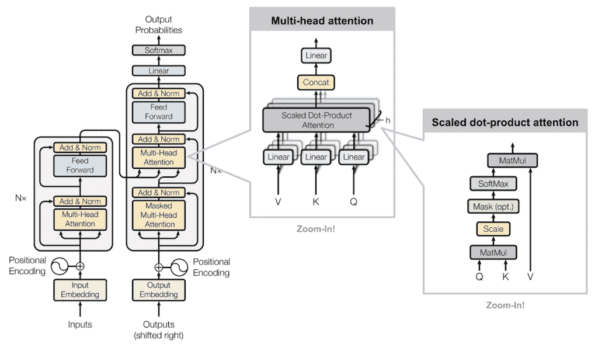
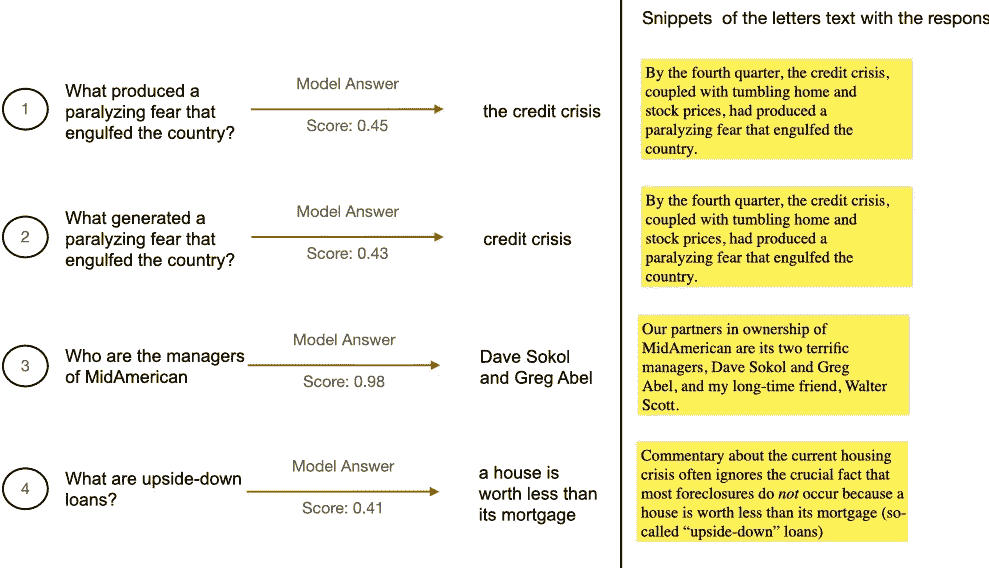
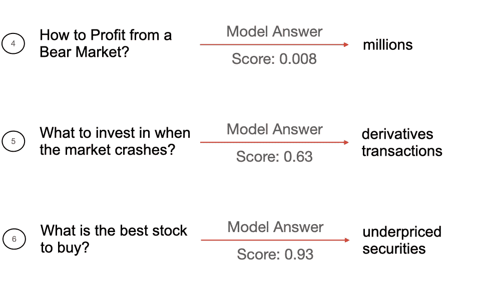

# 使用自然语言处理进入沃伦巴菲特的思想第一部分

> 原文：<https://medium.com/analytics-vidhya/using-nlp-to-get-inside-warren-buffet-mind-part-i-666d717d0c2e?source=collection_archive---------10----------------------->

沃伦·巴菲特是一位美国投资者、慈善家，在《T2》福布斯富豪榜上排名第六。从 1965 年到 2020 年，他的总收益为**2810526%**，而 [S & P500](https://www.investopedia.com/terms/s/sp500.asp) (美国 500 大上市公司指数)上涨了 23454%。他被认为是有史以来最好的投资者，是包括我在内的许多人的灵感来源。

# 介绍

为了结合我对**技术**和**金融市场**的热情，我将写一系列帖子，通过回答以下 3 个问题，看看人工智能(AI)的使用是否能帮助我理解巴菲特的想法。

1.  机器学习模型可以回答关于金融和经济的问题吗？

2.自助餐最常用的术语是什么？这些术语是否会随着时间的推移而改变？

3.这些年来，他对经济和股市的感觉如何？

为了回答这些问题，我将使用自然语言处理( [NLP](https://machinelearningmastery.com/natural-language-processing/) )技术和他每年写给伯克希尔·哈撒韦股东的[信件](https://www.berkshirehathaway.com/letters/letters.html)中的文字，他是这家公司的首席执行官。在这篇文章中，我将回答第一个问题。

# 机器学习模型可以回答关于金融和经济的问题吗？

为了回答这个问题，我将使用变革人工智能领域的 transformer 架构。

论文“ [**关注你所需要的一切**](https://arxiv.org/pdf/1706.03762v5.pdf) ”从 Google 引入了变压器技术。考虑到单词在句子中的重要性，他们使用了一个**编码器**来为每个单词创建嵌入，并使用了一个**解码器**来将嵌入转换回文本。

## 变压器架构

编码器和解码器架构由具有多头注意力和前馈层的堆叠模块组成。

变压器-模型架构。

与其他 NLP 方法不同，transformer 不使用循环，而是使用堆叠的注意层。在每个注意力层中，模型都在观察句子的不同部分，并试图了解更多关于单词的信息。

多头注意力由几个并行运行的注意力层组成。

仔细观察注意机制，您会发现它由两部分组成，一部分是使用 softmax 学习权重的点积注意，另一部分是并行调用点积操作数次的多头注意。

最后有一个前馈层，实现了给定句子中每个元素的线性变换。这些注意力层试图观察句子的不同部分，以发现单词的语义或句法信息。

如果你想了解更多关于变形金刚的信息，你可以查看 Cathal Horan 的这个[***帖子。***](https://neptune.ai/blog/bert-and-the-transformer-architecture-reshaping-the-ai-landscape)

## 问题回答

QA(问答)是当模型只接收一个上下文和一个问题时，它输出一个答案(其中答案在上下文中)和一个置信度得分。QA 是一项使用 transformers 架构的任务。

使用预先训练好的变换来完成 QA 任务很容易，就像我们在下面的例子中从 [huggingface](https://huggingface.co/transformers/task_summary.html#question-answering) 看到的那样:

因此，我使用这个经过训练的模型和 2008 年的 Buffet 信件，只是删除了特殊字符，作为上下文来查看该模型是否可以做出正确的预测。

问题、答案和显示正确答案的片段

如您所见，该模型能够正确理解所有问题，并对所有场景给出了满意的答案。对于第一个问题，答案应该是这样的:“信贷危机，伴随着房价和股价的暴跌”，但这个模型回答了“信贷危机”，部分是正确的。

我提出的第二个问题是检查模型是否会给出正确的答案，即使我将该单词改为同义词，因此我将单词**产生的**改为单词**产生的**，答案是相同的。

然后在第三个问题中，我用“Who”而不是“What”来查看具有不同问题代词 the 的模型行为，模型给出了置信度为 0.98 的正确答案。最后一题，除了信心分低，回答也是对的。
然后我去问那些回答不在正文里的问题，看看模型表现如何。

模型给出的问题和答案

该模型对问题 4 给出了一个毫无意义的答案，但这是意料之中的，因为信中没有提到任何熊市。但是这个模型对问题 5 和 6 给出了有趣的答案。

该模型认为，当市场崩溃时，你应该投资于衍生品交易，当市场崩溃时，这确实是一个很好的投资，正如你在 2020 年市场崩溃时看到的那样，当 Universa Tail 基金在其投资组合中有衍生品时， [**在 2020 年 3 月**](https://www.bloomberg.com/news/articles/2020-04-08/taleb-advised-universa-tail-risk-fund-returned-3-600-in-march) 回报了 3，600%。

对于问题 6，虽然模型没有回答具体的股票购买，但输出是“定价过低的证券”,这是一个很好的回答，因为巴菲特以购买定价过低的证券而闻名，而定价过低的证券几乎总是一个好的投资。

# 结论

我们可以看到，预训练的 transformer 模型能够在新的上下文中获得正确的答案，甚至能够根据其答案不在该上下文中的问题给出有意义的答案。当然，这个模型还不是一个预言，但是我很期待看到 NLP 的发展，以及它将引领我们走向未来。

你可以在我的 [Github 库](https://github.com/jairNeto/warren_buffet_letters)查看写这篇文章的代码。如果你对我的 Linkedin 账户有任何意见，请随时联系我，非常感谢你阅读这篇文章。

如果你喜欢你所读的，一定要👏下面，分享给你的朋友，关注我，不要错过这一系列的帖子。在下一篇文章中，我将尝试回答这些问题:

*   自助餐最常用的术语是什么？这些术语是否会随着时间的推移而改变？
*   这些年来，他对经济和股市的感觉如何？

**敬请期待！**

# 参考

*   [**https://www.berkshirehathaway.com/letters/letters.html**](https://www.berkshirehathaway.com/letters/letters.html)
*   [https://towards data science . com/10 分钟内情绪分析-与伯特拥抱脸 294e8a04b671](https://towardsdatascience.com/sentiment-analysis-in-10-minutes-with-bert-and-hugging-face-294e8a04b671)
*   [https://www . tensor flow . org/tutorials/text/classify _ text _ with _ Bert](https://www.tensorflow.org/tutorials/text/classify_text_with_bert)
*   [https://huggingface.co/transformers/model_doc/bert.html](https://huggingface.co/transformers/model_doc/bert.html)
*   [https://Neptune . ai/blog/Bert-and-the-transformer-architecture-shaping-the-ai-landscape](https://neptune.ai/blog/bert-and-the-transformer-architecture-reshaping-the-ai-landscape)