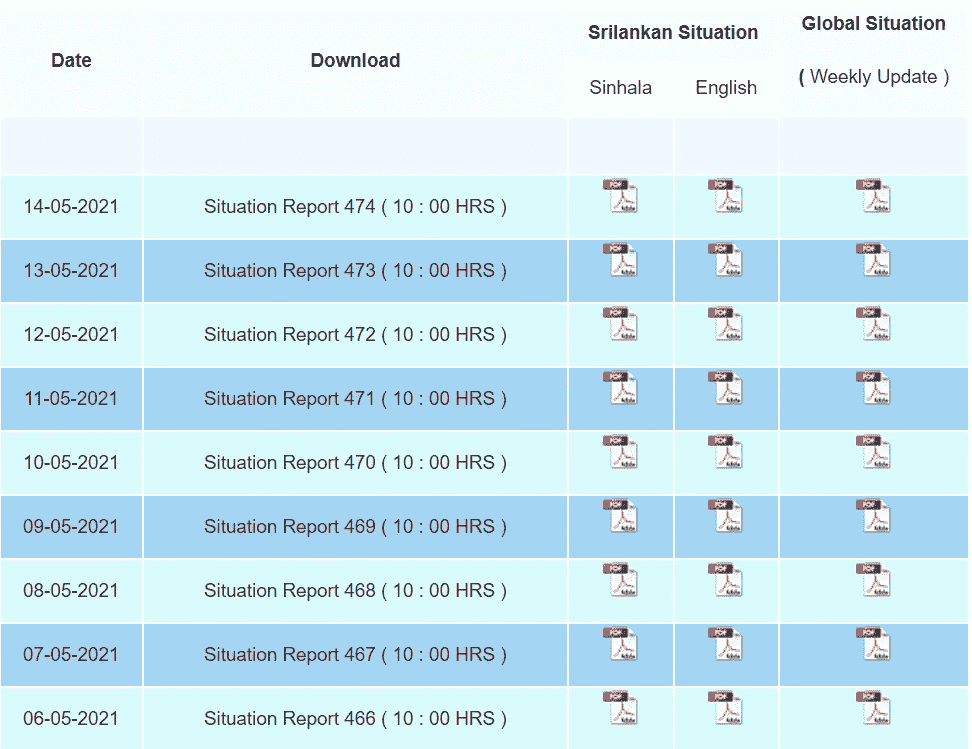
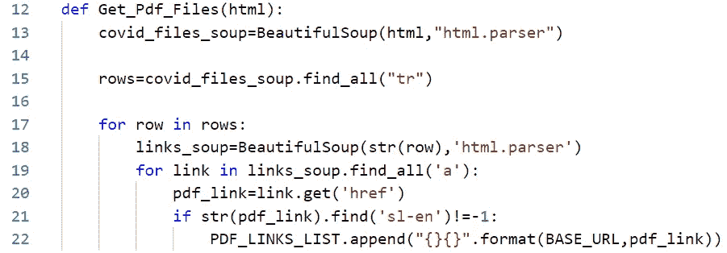
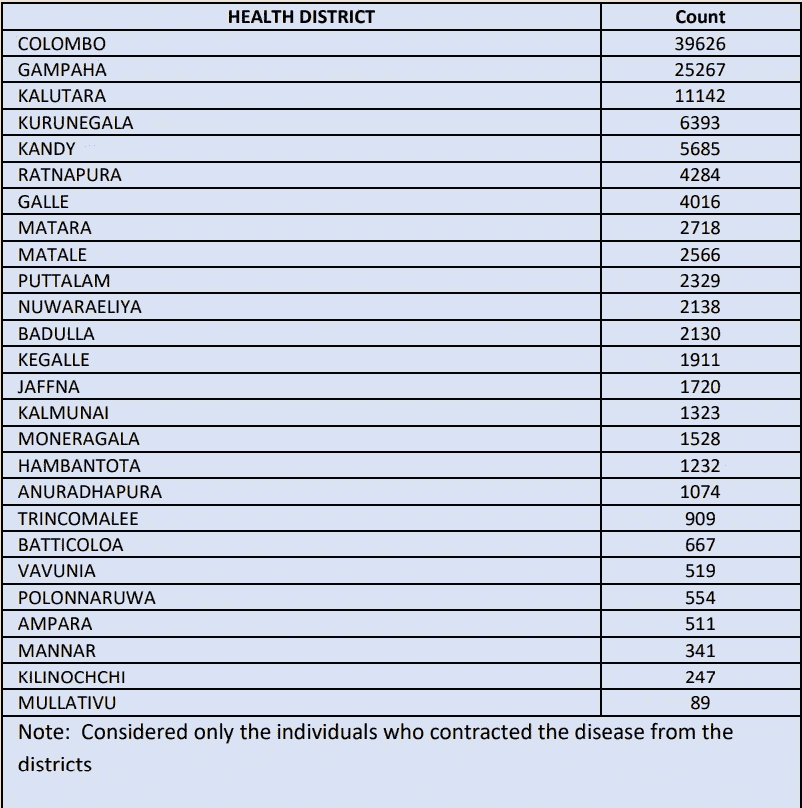
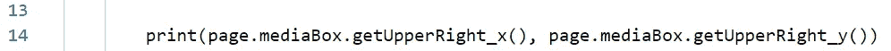
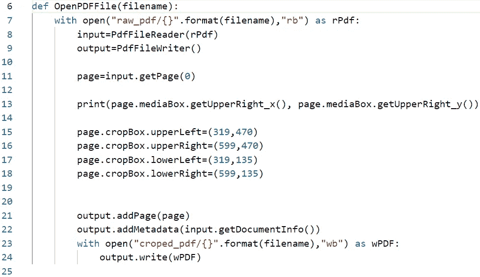
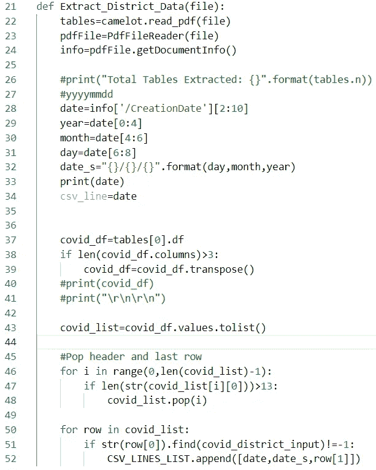
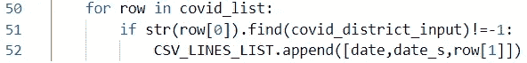
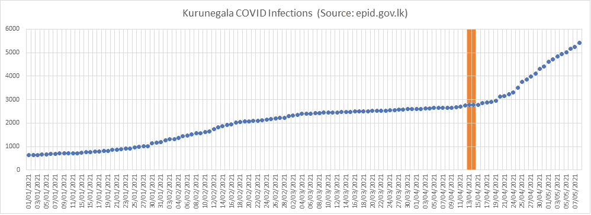
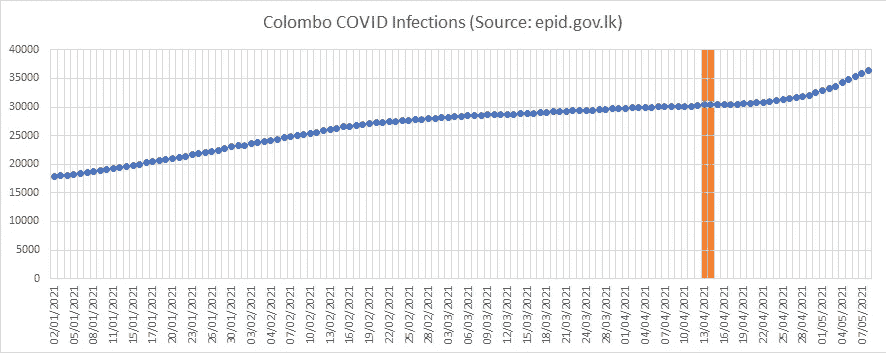
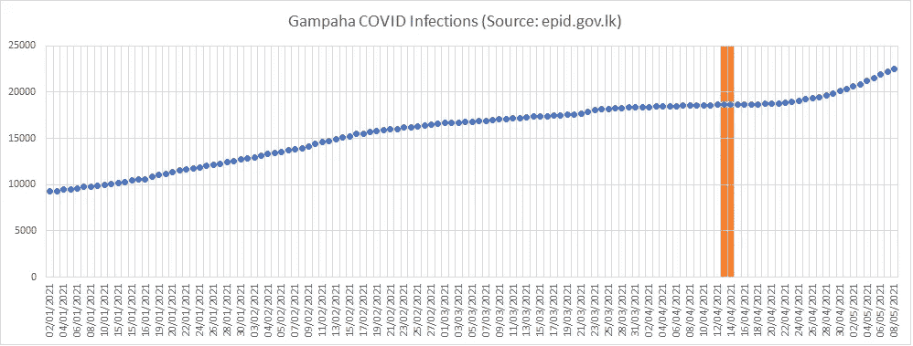

# 使用 Python 从 epid.gov.lk 提取分区 COVID 数据(从多个 PDF 文件中)

> 原文：<https://medium.com/analytics-vidhya/using-python-to-extract-district-wise-covid-data-from-epid-gov-lk-from-pdf-files-2c611a1a32fa?source=collection_archive---------19----------------------->

我获取斯里兰卡新冠肺炎病例的地区级新冠肺炎数据的主要动机，是为了了解新冠肺炎教在这些地区内是如何演变的，并找出数据中的模式，如地区间的流动、国家/宗教节日、政治集会等。但是由于政府在一个单独的 PDF 文件中发布每天的 COVID 数据(所有地区),这是 python 程序聚合这些数据的工作。

**从单个 PDF 文件中聚合 COVID 数据的过程可以分为 4 个独立的任务:在主网站上搜索 PDF COVID 报告的链接，裁剪出相应的感兴趣的表格，读取感兴趣的表格并聚合数据。**

# 在 epid.gov.lk 中搜索各个 PDF 文件的下载链接。

这是最简单的过程之一，感谢像 BeautifulSoup 这样的 python libraires，它允许用户创建简单的 html 元素查询，列出所有相同类型的元素，并将它们存储在一个列表中。

这是我们将要下载 PDF 文件的网站的样子:

资料来源:epid.gov.lk

从上图中可以看出，PDF 文件的链接以表格的形式呈现，有英文和僧伽罗文两种版本。

拥有两种不同语言的 PDF 文件增加了查找的复杂性，**只有**，英语**版本的文件。然而，幸运的是，有一个简单的区分方法。以下面的两个链接为例:**

web/images/pdf/corona _ virus _ report/sitrep-***sl-sin***-14–05 _ 10 _ 21 . pdf(僧伽罗文版)

web/images/pdf/corona _ virus _ report/sitrep-***sl-en***-14–05 _ 10 _ 21 . pdf(英文版)

在上面的例子中，你可以看到使用关键字 **sl-en** 意味着你可以过滤英文版的 PDF 文件。

下面是提取 PDF 文件链接的代码片段。下面的代码将在图像后解释。

Python 代码片段 1

代码的第一步是遍历表中的每一行。第二步是提取表格中的所有超链接，其中包含一个 PDF 文件。最后一步是提取 PDF 文件的所有英文版本。

# 裁剪出相应的表格。

用于 Python 的 Camelot 库是一个很好的工具，可以将 PDF 文件中的表格提取到一个 **Pandas Dataframe 对象中，**这使得表格操作更加容易。为了使这个过程更容易，更不容易出错，我们的 python 程序从各个表中读取日期，更容易将表裁剪到一个单独的 PDF 文件中，只包含单个表。

下面是我们希望提取的表格:

表 1 资料来源:epid.gov.lk

如果我们知道表格边界的像素值，那么就很容易提取这个表格。但是，由于表格在每个 PDF 文件中的位置可能略有不同，因此通过增加裁剪区域来考虑这些变化也很重要。

## 获取要裁剪的像素坐标

可悲的现实是，没有轻松的方法来获得 PDF 文件的裁剪像素坐标。然而，经过大量研究后，我发现将 PDF 文件转换成 JPEG 格式，然后使用光标获取作物坐标更容易。

以获得准确的作物坐标；由于像素值可以是相对的，所以我使用 PyPDF2 的 mediabox 函数来获取 PDF 文件的原始宽度和高度。下图显示了如何做到这一点:

Python 代码片段 2

一旦获得这些坐标。然后，PDF 文件被转换为 JPEG 图像，并在 Ms Paint 中打开。然后图像被**调整**到 PDF 文件的原始**宽度和高度**。然后使用光标获取我想要提取的表格的像素坐标。

## 将元数据传输到新的 PDF 文件中。

由于表中没有提供与表相关的日期，因此无法按日期追踪表。然而，幸运的是，PDF 文件的创建日期与该表的相关日期一致。但是，当创建 PDF 文件的新裁剪版本时，元数据不会自动复制。然而，这个过程非常简单，只需要几行代码。

Python 代码片段 3

以下函数显示了如何在 python 代码中完成裁剪:

Python 代码片段 4

# 从表中读取和操作数据

一旦裁剪出感兴趣的表并移植了元数据，从表中读取数据的过程就变得轻而易举了。Camelot 库能够将表数据转换为 Pandas Dataframe 对象，我随后将该对象转换为 Python list 对象，然后我可以删除与我试图收集的数据不相关的行。从**表 1** 可以看到，第一行和最后一行都可以删除。

Python 代码片段 5

# 汇总特定用户选择的地区的数据。

为用户选择的特定地区聚集数据:接受用户输入，并完成区分大小写的字符串查找；根据地区汇总数据。

Python 代码片段 6

Python 代码片段 7

# 结果

下表显示了斯里兰卡三个地区的 COVID 感染率。

图表 1

图表 2

图表 3

# 结论

作为一名对数据科学感兴趣的机器人工程师，但我还没有接受过该领域的正式培训，我对这第一步感到非常自豪，因为所涉及的工作非常复杂。我使用三个独立的 Python 脚本成功完成了这项任务。我下一步的努力是利用获得的数据进行一些实际的数据分析，并发现一些有趣的相关性。