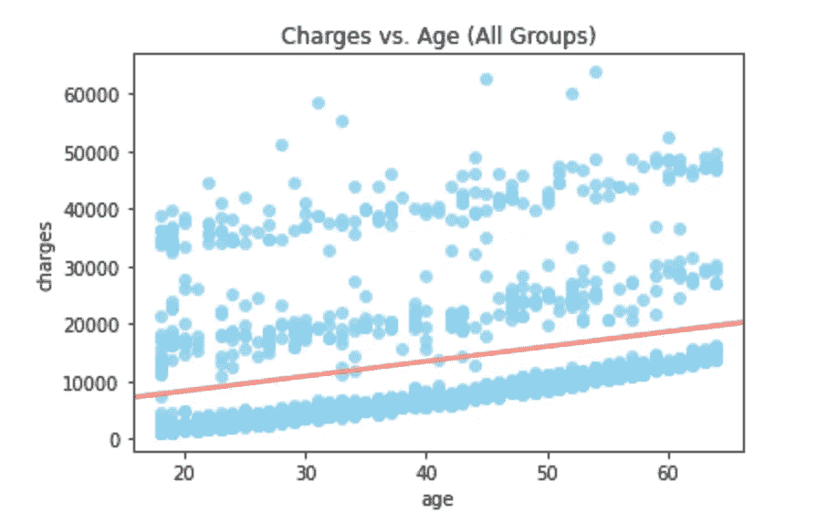

# 使用 Python 对公共卫生计划进行优先级排序

> 原文：<https://medium.com/analytics-vidhya/using-python-to-prioritize-public-health-initiatives-b6e5571f3af2?source=collection_archive---------24----------------------->

图片来源:联合医疗|凯尔西-塞博尔德诊所

任何社会面临的一个更大的问题是医疗保健。虽然质疑哪种医疗体系是最好的往往是一场有争议的辩论，但更直接的起点是检查哪些健康指标是最重要的优先事项。

在本文中，我将展示我使用 Python 分析健康数据的发现。我将使用个人医疗保健成本作为整体健康的代理，然后检查一些因素，以得出一些结论，哪些是最具决定性的。

我将从检查整个群体的趋势开始，然后我将按成本四分位数、性别和吸烟状况深入研究趋势，最后以关键要点结束。

原始数据可以在这里找到[，用于分析数据的代码可以在 Github](https://gist.github.com/meperezcuello/82a9f1c1c473d6585e750ad2e3c05a41#file-medical_cost-csv) [这里](https://github.com/johnpauv/Health-Exploritory-Data-Analysis)找到。

# **整体趋势**

当观察整个群体时，有几个趋势不一定令人惊讶，但仍然值得注意。

首先，一个人接受的医疗费用和他们的年龄成正相关(见图 1)。相关性很小，表明年龄不是医疗费用的最决定性因素。该图还显示，有相当数量的人低于平均值，即使他们的年龄在上升。这个群体可能拥有良好的基因，健康的生活方式，或者两者兼而有之。

图 1

对于整个群体来说，身体质量指数(身体质量指数)似乎是医疗费用方面的一个决定性因素(见图 2)。这里要注意的最重要的一点是，当一个人的身体质量指数达到 30 岁时，医疗保健成本就会飙升。虽然数据没有揭示为什么会出现这种情况，但这仍然是一个需要认识的有用数字。

公共卫生官员可以利用这一信息，优先考虑将 BMI 保持在 30 以下的举措，以改善健康状况并降低成本。

图 2

检查的最后两个数据点是孩子的数量和每个人居住的地区(见图 3 和图 4)。如下图所示，这两个因素都没有对整个群体的医疗成本产生显著影响。

图 3

图 4

最后，注意数据集的局限性很重要。如下图所示，费用分布中较便宜的人占了很大一部分(见图 5)。这可能导致来自健康个体的数据掩盖了导致最高医疗费用的趋势。为了解决这个问题，让我们来看看医疗费用处于上四分之一的人。

图 5

# **医疗费用的上四分之一趋势**

由于数据不具有高斯分布，电荷的上四分位数和整个组的特征之间存在很大的差异。例如，上四分位数组的平均值比整个组的平均值高 234%。值得研究一下这背后的关键驱动因素。

造成这种差异的最重要因素之一是身体质量指数。从下图可以明显看出，身体质量指数和医疗费用之间的相关性在最高四分位数的人群中变得更强(见图 2 和图 6)。

这再次表明，公共卫生官员在向支付最高医疗费用的群体推广计划时，可以将身体质量指数作为一个关键指标。

图 6

# **按性别分列的医疗费用趋势**

从性别趋势来看，下图显示男性的医疗费用略高于女性(见图 7 和图 8)。图 7 显示，这种现象主要是由男性在分布的右尾要求更多的房地产所驱动的，而不一定是健康男性的短缺。同时，图 8 显示这一趋势随着年龄的增长而保持不变。

图 7

图 8

图 9 显示，男性和女性医疗费用之间的趋势差距随着儿童的增多而扩大。一对夫妇每多生一个孩子，男性的医疗费用就比女性增长得更快。

公共卫生官员可以利用这一信息，更密切地监测男性的关键健康指标，特别是当他们成为父亲时。

图 9

# **吸烟者与非吸烟者的医疗费用趋势**

最后，医疗费用中最能说明问题的因素之一是个人是否吸烟。

首先，吸烟者的平均医疗费用是不吸烟者的近 4 倍。下面的图 10 说明了这一点，表明大量吸烟者的医疗费用很高，而绝大多数非吸烟者的医疗费用低于平均水平。

图 10

图 11 展示了同样的概念，显示了吸烟者的充电下限与非吸烟者的充电上限大致一致。

图 11

最后，身体质量指数似乎对吸烟者的医疗费用有巨大的影响(见图 12)。当看右边的不吸烟者时，医疗费用和身体质量指数之间的关系很弱。然而，吸烟者体验到医疗费用和身体质量指数之间强烈的正相关。

为了让他的信息发挥作用，公共卫生官员可以推动强有力的反吸烟倡议。对于那些吸烟的人来说，需要特别注意保持他们的身体质量指数低。

图 12

# **关键要点:**

通过研究这些数据，公共卫生官员获得了以下关键信息:

1.  对于整个人口来说，将身体质量指数水平保持在 30 以下是保持低医疗费用的有效方法。
2.  男性的医疗费用略高于女性——这一现象随着男性有了孩子而加剧。
3.  吸烟者的医疗费用明显高于不吸烟者，尤其是随着身体质量指数水平的上升。

虽然这些要点不会解决任何健康危机，但它们确实展示了数据的力量，为促进健康倡议提供了一个有意义的起点。