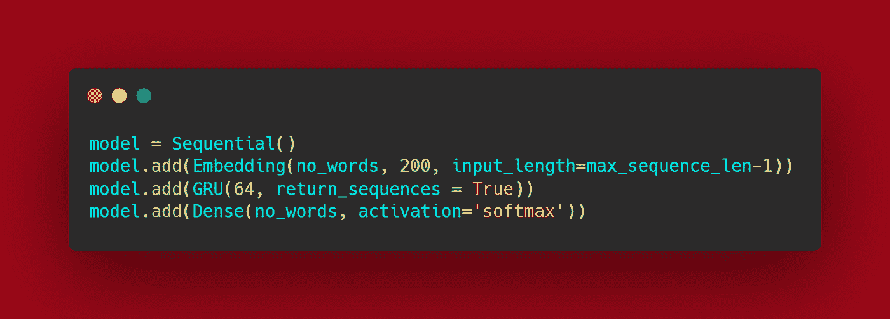
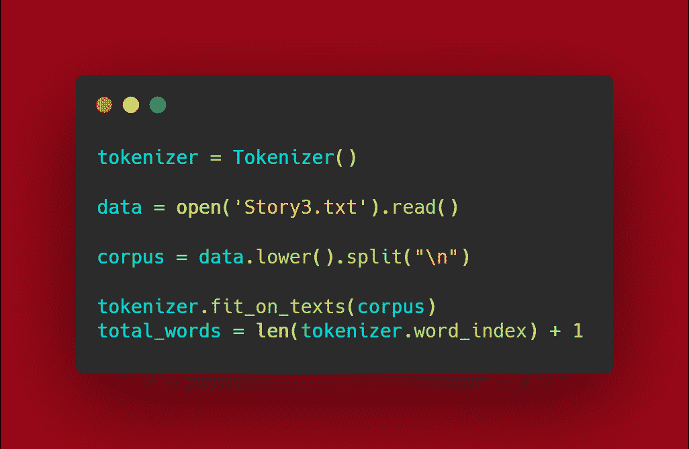
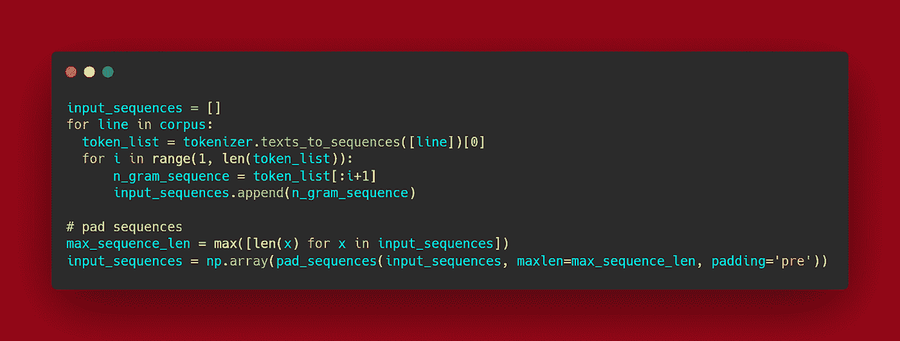
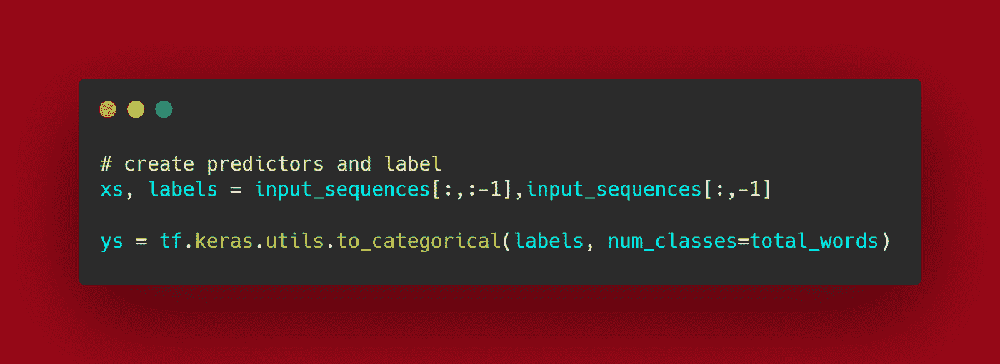
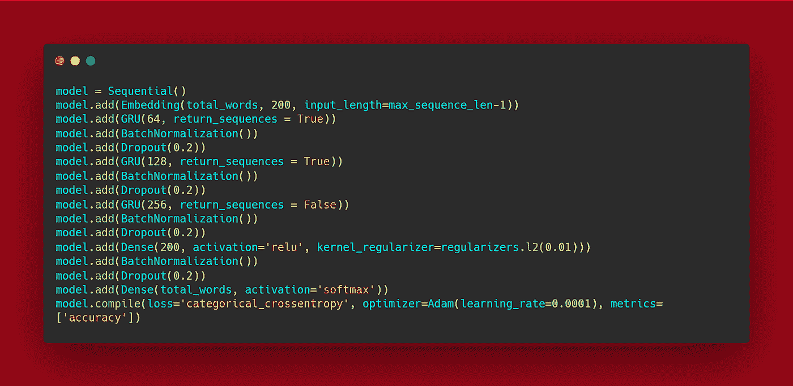
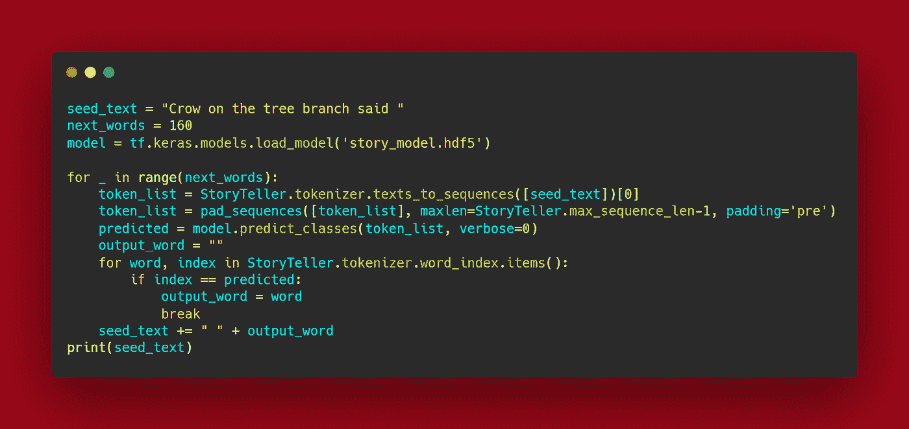

# 使用 RNN 模型生成文本

> 原文：<https://medium.com/analytics-vidhya/using-rnn-model-for-text-generation-c5a37017d142?source=collection_archive---------2----------------------->

# 什么是 RNN 模式？

RNN 的“递归神经网络”是人工智能中的一种神经网络。该网络有两个主要实现:

**时间序列预测-**

用于预测天气预报、股市预测等。

**自然语言处理-**

[RNN](https://pianalytix.com/recurrent-neural-network-rnn/) 在自然语言处理中广泛使用，作为 RNN 模型的构建层，帮助实现各种自然语言处理应用。尽管其中之一是文本生成。然而，它处理的是创建一个基于以前使用的单词及其语法预测下一个单词的模型。

# 如何建立一个 RNN 模型？

RNN 模型类似于 CNN 模型，只需改变几层就可以在文本语料库(词汇/单词集/句子)上工作。RNN 模型由以下几层组成。

正如所看到的，只有 2 个新的层是嵌入和 GRU，还有一个层在使用中互换，即 LSTM 层。

# RNN 的层

RNN 模型中的每一层都有不同的用途，但是一层的输出是另一层的输入。

## 首先是嵌入层-

嵌入层可以看作一个查找表，它将每个单词创建为一个整数，将其映射到一个嵌入。嵌入的大小是一个超参数，你可以通过实验来改变它，看看什么对你的问题有效。

**第二 GRU 或 LSTM(结合双向层)【可选】**

## LSTM:“长短期记忆”

LSTM 循环单元试图“记住”网络已经经历过的所有过去的知识，并且还丢弃“忘记”不需要进一步处理的无关数据。这是通过服务于不同目的的不同激活功能“门”来完成的。

每个 LSTM 循环单元保持一个矢量呼叫作为“内部单元状态”，它描述了由前一个 LSTM 循环单元传递的要保留的信息。

使用的门如下:

*   忘记大门——忘记什么
*   输入门-添加什么
*   输出门-下一个隐藏状态是什么

**注:**内部单元状态被认为是输入门的一个子部分，但在许多 LSTM 文献中它并不被认为是门。

## GRU:“门控循环单元”

与 LSTM 不同，GRUs 由两个门组成，不保持“内部细胞状态”。存储在 LSTM 循环单元的内部单元状态中的信息被合并到 GRU 的隐藏状态中。该集合信息传递到下一个门控循环单元。

使用的门如下:

*   更新门-向前传递多少数据
*   重置门-要忘记多少数据

**注意:**当前存储器门被认为是复位门的子部分，因为该门的唯一目的是减少过去信息对当前信息的影响。

来到双向，这是一个可选的前缀层使用了 LSTM 或 GRU 的组合

**举例:**

***Tf。双向(Tf。***

这一层用于维护两个方向的数据流，即前向和后向，在正常的 LSTM 中，数据只在前向传播。

# RNN 的实施

与 CNN 模型类似，RNN 模型也需要一些数据预处理。

在这里，数据是以文本和音频的形式出现的，使用 RNN 来生成文本。文本生成的预处理非常简单，我们需要将句子分解成单个单词，并创建一个存储所有这些单词的向量。使用函数调用作为记号赋予器就可以了，记号化是将句子分解成记号(单词、字符或子单词)的过程。

这里的数据保存了故事中的句子 3。Txt 文件。这些句子然后被转换成小写，然后使用代码中显示的函数进行标记化。Total_words 包含训练样本的数量，也称为“M”。

下一步是通过适当地填充它们以匹配 Max_length 来创建 Input_sequence。

## 例子

如果 Max_length=32 并且第一行的长度为 25，那么将填充 7 个空格以保持整批完整。

然后是标签创建和设置 X 和 Y 值，这里切片用于获得 X 的标签和可训练值，而对于 Y 值，只有标签与 Total_words 映射。

## 最后训练 RNN 模型

注意:这个代码只是为故事 3 创建。Txt 文件。

您需要了解用于文本生成的每个文件的字数，这将有助于根据需要修改模型。

**注意:**对模型进行 100-200 个时期的训练可能不会产生好的结果，并且由于模型使用了更多的节点和神经元，因此非常繁重。因此，它影响模型的训练时间。

## 测试模型

实现后，只需测试模型，您可以使用以下代码块来完成:

这里使用一个句子来测试模型，这个句子需要为模型提供生成文本的基础。

# 结论:

使用 RNN 文本生成使我们对超参数和其他值进行实验，包括字数和层数，以获得更好的结果。

**参考:**

[https://www.tensorflow.org/](https://www.tensorflow.org/)