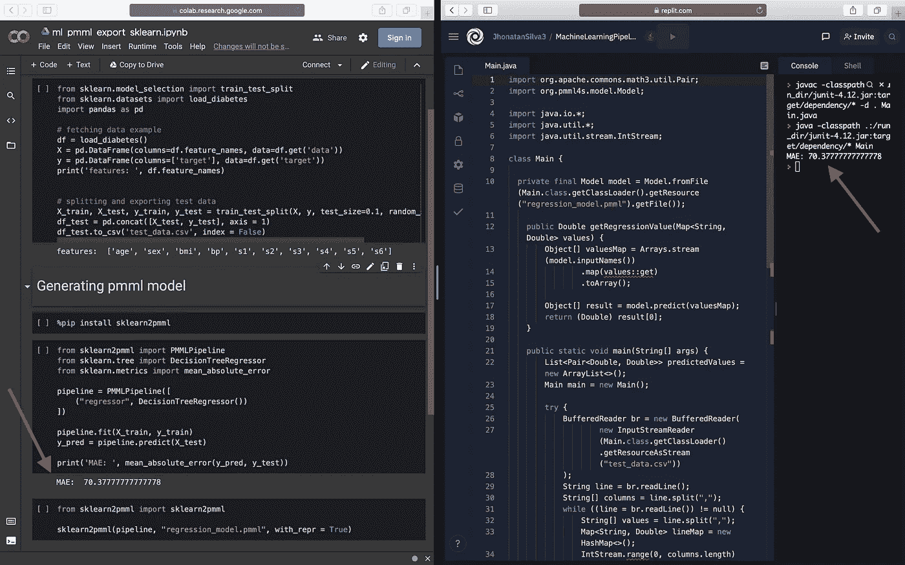

# 在 Java 应用程序中使用 scikit-learn 模型

> 原文：<https://medium.com/analytics-vidhya/using-scikit-learn-model-into-java-app-96d776b84c44?source=collection_archive---------5----------------------->

将长代码库从一种编程语言迁移到另一种编程语言通常是一个挑战，有时甚至没有意义。如果您正在使用 Java，并且需要应用 scikit-learn 的机器学习模型，本教程可能会对您有所帮助。

为此，我们将使用 3 个库:scikit-learn、sklearn2pmml 和 pllm4s。为了帮助管理数据，我们还使用了其他库，但如果需要，您可以替换它们。

# 代码看起来像什么

为了导出模型，我们有简单的步骤，如下所述。在这个例子中，我们在 *PMMLPipeline* 类中使用回归器，但是如果你想的话，你也可以使用分类器。不要忘记将 *scikit-learn* 和 *sklearn2pmml* 添加到您的 python 项目依赖项中。

```
from sklearn.datasets import load_diabetes
from sklearn.tree import DecisionTreeRegressor
from sklearn2pmml import PMMLPipeline, sklearn2pmml
import pandas as pd# fetching data example
df = load_diabetes()
X = pd.DataFrame(columns = df.feature_names, data = df.get('data'))
y = pd.DataFrame(columns = ['target'], data = df.get('target'))# here you can use the key classifier, if suitable
pipeline = PMMLPipeline([ ('regressor', DecisionTreeRegressor()) ])#training the model
pipeline.fit(X, y)# exporting the model
sklearn2pmml(pipeline, 'model.pmml', with_repr = True)
```

确保将列名添加到数据集中，否则您将无法识别 Java 代码中的特性。此外，这个例子非常简单，但是如果您有一个复杂的问题，您可以通过查看 [SkLearn2PMML 文档](https://github.com/jpmml/sklearn2pmml)来使用更多的库功能。

在 Java 代码中，做出预测也非常简单。我们在下面展示一个例子。在这个例子中，我们使用的是 [pmml4s 库](https://github.com/autodeployai/pmml4s)，所以不要忘记添加依赖项。

```
import org.pmml4s.model.Model;

import java.util.*;

public class Main {

    private final Model model = Model.fromFile(Main.class.getClassLoader().getResource("model.pmml").getFile());

    public Double getRegressionValue(Map<String, Double> values) {
        Object[] valuesMap = Arrays.stream(model.inputNames())
                .map(values::get)
                .toArray();

        Object[] result = model.predict(valuesMap);
        return (Double) result[0];
    }

    public static void main(String[] args) {
        Main main = new Main();
        Map<String, Double> values = Map.of(
                "age", 20d,
                "sex", 1d,
                "bmi", -100d,
                "bp", -200d,
                "s1", 1d,
                "s2", 2d,
                "s3", 3d,
                "s4", 4d,
                "s5", 5d,
                "s6", 6d
        );

        double predicted = main.getRegressionValue(values);
        System.out.println(predicted);
    }
}
```

对于这个 java 代码，我们需要的主要方法是 *predict* ，您可以简单地向它传递一个数组。尽可能地简化代码，但是要注意将这些特性添加到这个数组的顺序，这就是我们使用 Map 的原因。 *inputNames* 方法向您展示了您需要遵循的特性输入顺序。

# 测试它的工作情况

出于测试目的，我导出了在 Python 代码中使用的相同测试数据，并在 Java 代码中导入。有各种各样的指标可以用来衡量我们的机器学习模型，在这里，使用 MAE ( *表示绝对误差*)是因为它非常简单和直观。



比较 Python 和 Java 中模型的 MAE

查看上图，我们可以看到两种代码中的 MAE 是相同的。这意味着我们预测的是相同的值，这只是检查您是否正确导出了模型的一个想法。您还可以使用任何其他指标来确保这一点。

本测试中使用的代码可从以下网址获得:

*   python:[https://colab . research . Google . com/drive/1 ofdbfkqrprb 0 jwztq 7 kgv 7 m3 jrfs-o？USP = sharing # scroll to = duj q1np-ln1q](https://colab.research.google.com/drive/1OFdBfKQrqRpRb0jWZtq7kgv7M3JRfs-o?usp=sharing#scrollTo=DuJq1np-ln1q)
*   Java:[https://replit . com/@ jhonatansilva 3/machinelingpipeline # main . Java](https://replit.com/@JhonatanSilva3/MachineLearningPipeline#Main.java)

希望这对你有所帮助(: