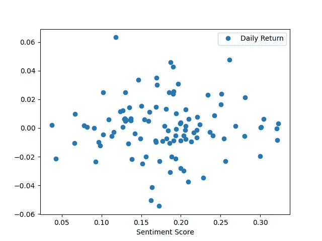
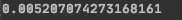

# 利用情绪分析预测股票市场

> 原文：<https://medium.com/analytics-vidhya/using-sentiment-analysis-to-predict-the-stock-market-77100295d753?source=collection_archive---------5----------------------->

## 财经新闻标题的情绪分析(使用 Python)对股市走势有预测力吗？

在我之前的[文章](https://python.plainenglish.io/access-historical-financial-news-headlines-with-python-be1b8faaea9f)中，我解释了如何**用 Python 免费获取历史财经新闻头条**。现在我们有了这些数据，我们可以验证新闻标题是否可以预测股市运动。

这篇文章和其他许多相同主题的文章的不同之处在于，由于我们获取数据的方式不同，我们可以进行长达 1 年的测试。正如我在之前的[文章](https://python.plainenglish.io/access-historical-financial-news-headlines-with-python-be1b8faaea9f)中所讨论的，许多来源或 API 很少或根本没有历史新闻标题。此外，一般来说，我们每天有超过 30 个标题，这是许多来源或 API 所不允许的。


由 [Pixabay](https://pixabay.com/) 上的[像素](https://pixabay.com/users/pexels-2286921/)拍摄

# 1-获取历史每日收盘股票价格

第一步是获得历史每日收盘数据，以计算我们要进行测试的股票的每日回报率。

正如那句话所说:

> 垃圾进，垃圾出


[亨利&公司](https://unsplash.com/@hngstrm)在 [Unsplash](https://unsplash.com/photos/cZpvuwwQQg0) 上拍摄的照片

出于这个原因，拥有一个好的数据集是数据分析的一个基本部分，如果不是最关键的部分的话。

这就是为什么从 Alpha Vantage API 中提取每日历史股票价格的原因。Finnhub API 中没有指定每日收盘是否根据股票分割和股息进行调整。

要调用 Alpha Vantage 的 API，您需要您的唯一密钥，您可以在这里获得。

使用 API 键的一个好的实践是**将它存储为一个环境变量**(关于如何做的好文章[在这里](https://able.bio/rhett/how-to-set-and-get-environment-variables-in-python--274rgt5))。代码中的关键变量名作为环境变量存储在`.env`文件中，如下所示:

我们可以导入所需的模块，从 Alpha Vantage API 中获取每日历史股票价格。

然后我们可以构建一个类来初始化 Alpha Vantage API 所需的属性。

然后我们可以创建一个从 Alpha Vantage API 获取数据并计算每日回报的类(接下来两个要点)

# 2-运行情感分析并计算分数

我们用 VADER 情绪分析器(nltk . perspective . Vader)对财经新闻标题进行情绪分析。

对于每个标题，复合得分返回一个介于-1(最极端的负面标题)和 1(最极端的正面标题)之间的标准化值。然后，我们通过对当天获得的单个标题的所有得分进行平均来创建每日得分。

为了尽可能准确，脚本分析了从 9:30(美国东部时间)到 9:29(美国东部时间)的新闻标题，正好在常规交易开始之前(北美市场)。

首先，我们导入所需的模块:

然后，我们为 VADER 情感分析器创建一个类。我们要做的第一件事是初始化属性和参数。

我们现在可以使用 VADER 对新闻标题进行情感分析。

注意，在这个方法中，我们有两个装饰器`@init_sql`，用于打开、保存和关闭数据库，还有`@iterate_day`，用于对期望时间段内的新闻标题进行情感分析。

方法`check_size()`确保我们有足够的标题来运行情感分析，使其具有统计学意义(默认的最小大小是 30)

# 3-将滞后指数与每日收盘回报相关联

这是最后一步。注意，如前所述，这篇文章是在这篇[文章](https://python.plainenglish.io/access-historical-financial-news-headlines-with-python-be1b8faaea9f)之后，在这篇文章中我们获得了历史金融新闻标题。当前代码是使用上一篇文章中的目录和数据库(SQL)编写的。如果你决定使用不同的来源来获取财经新闻标题，一定要注意这一点。

首先，我们需要导入所需的模块。

我们创建一个类来初始化项目所需的“全局”值。

最后，我们对照前一天亚马逊上的金融新闻标题的情绪分析，绘制股票的每日回报(在这种情况下是亚马逊):

```
init_.pd_data.plot(x =init_.sentiment_name,y=init_.daily_return,style = "o")
```

我们还计算这两者之间的相关性:

```
print(init_.pd_data[init_.daily_return].corr(init_.pd_data[init_.sentiment_name]))
```

这是我们得到的图表，显示每日回报率和新闻标题的情绪得分之间的相关性很小甚至没有。



如下所示的相关性接近于 0，表明几乎没有相关性。



我希望这对你有所帮助。如果您有任何意见、反馈和想法，请留下。我会很感激的。

项目回购的链接是[这里是](https://github.com/philippe-ostiguy/sentiment_analysis)。

在 [LinkedIn](https://www.linkedin.com/in/philippe-ostiguy/) 上或通过 ostiguyphilippe@gmail.com[与我进一步讨论](mailto:ostiguyphilippe@gmail.com)！