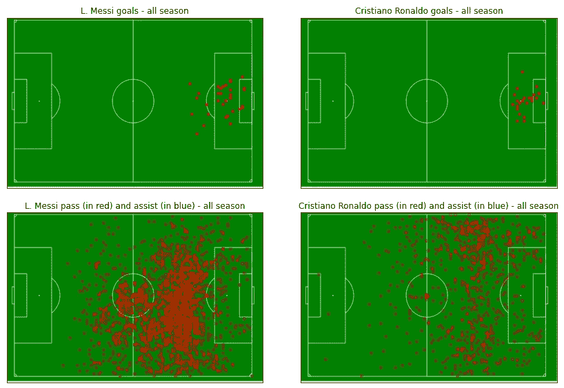
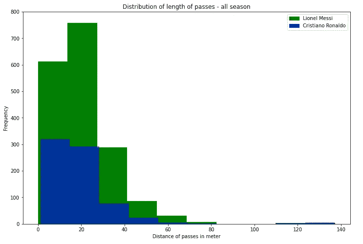
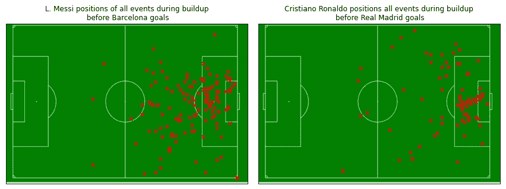
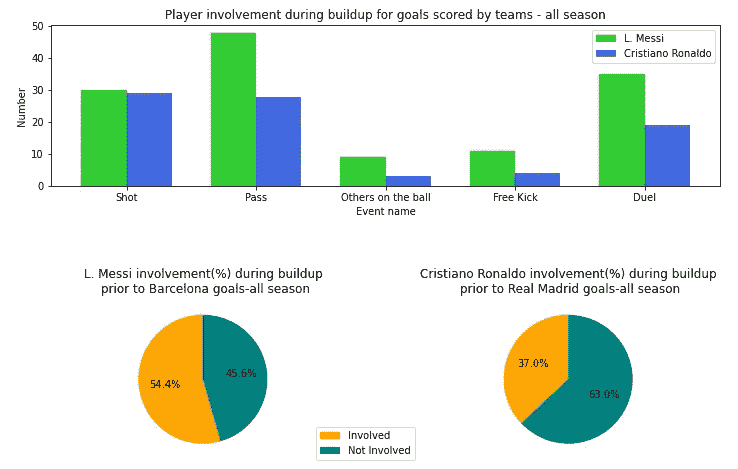

# 使用空间和活动数据(使用 python)了解梅西和罗纳尔多的比赛风格。

> 原文：<https://medium.com/analytics-vidhya/using-spatial-and-activities-data-with-python-to-understand-how-messi-and-ronaldo-do-their-magic-eae008531509?source=collection_archive---------14----------------------->

Izuddin Helmi Adnan 在 [Unsplash](https://unsplash.com/s/photos/soccer?utm_source=unsplash&utm_medium=referral&utm_content=creditCopyText) 上拍摄的照片

由于大量数据的可用性，体育分析近年来快速增长。像 Moneyball 这样的书籍和电影美化了数据驱动的决策在不同运动中的影响。足球也不例外。团队和分析师现在可以应用数据分析技术来改善结果，了解对手的战术，并判断球员的表现。谈到足球运动员，有两个名字在过去十年中脱颖而出:莱昂内尔·梅西和克里斯蒂亚诺·罗纳尔多。

两人都被认为是有史以来最伟大的，如果不是最伟大的。这些年来，关于谁是更好的球员有无数的争论。尽管专家和粉丝们做出了各种判断，这场争论还远未结束。人们谈论他们的进球能力以及他们赢得的奖杯数量。然而，我们并不总是看到基于其他数据的这些讨论。这是可以理解的，因为对于普通球迷来说，除了进球数量或助攻数量之外，并不总是能够获得高质量的数据。然而，我最近发现了一个有趣的足球数据集，它捕捉了与比赛事件以及这些事件在各种比赛中的位置相关的信息。所以，我决定深入研究这个问题，对这个数据集进行一点数据分析和可视化，特别关注这两个球员。

好吧，这篇文章其实不是关于谁更好的辩论，而是关于借助丰富的数据来理解他们独特的风格和对各自团队的贡献，这些数据是我们今天在 Python 的帮助下获得的。这些代码可以在下面的 GitHub 链接中找到:[https://GitHub . com/muhammadmarfsazed/Data _ wrangling _ analysis _ soccer _ Data/blob/master/Messi _ Ronaldo _ comparison _ visualization . ipynb](https://github.com/MuhammadMarufSazed/Data_wrangling_analysis_soccer_data/blob/master/Messi_Ronaldo_comparison_visualization.ipynb)

我已经在之前的一篇文章中介绍了数据集，并给出了数据预处理阶段的演练，可以在下面的链接中找到。

 [## 使用 Python 的数据争论项目

### 数据集:时空 _ 比赛 _ 事件 _ 足球 _ 比赛

marufsazed.medium.com](https://marufsazed.medium.com/data-wrangling-project-with-python-eee40b460fed) 

与这篇文章相关的所有分析和可视化都是基于西班牙联赛 2017-18 赛季(是的，现在在 2021 年做这个分析有点晚，但从数据科学、python 和足球迷的角度来看，这仍然值得努力😃)

我们知道梅西和 c 罗都是优秀的进球者。在这场特殊的比赛中，正如我们从下面的图片中看到的，两人都进了几个球。不过从剧情上可以看出，梅西在禁区外的进球相当多。而罗纳尔多的进球来自禁区内。如果我们从他们传球和助攻的位置来看，我们会发现在比赛风格和位置上有很大的不同。与罗纳尔多相比，梅西传球次数更多，助攻次数也更多。而且在定位上，梅西倾向于在靠近对方禁区的同时多打很多传球。而罗纳尔多则倾向于在球场左侧留下更多红点。

上面两个图显示了梅西和罗纳尔多进球的位置。底部的两个图显示了传球和助攻的位置。底部图中的红点表示传球，蓝点表示助攻。

很多人都知道，巴塞罗那更喜欢控球型足球。他们喜欢用小传球把球控制在自己手中。这可能是梅西打出如此多传球的原因之一。另一方面，皇马更愿意采取反击的打法，这使得罗纳尔多这样的前锋更难像梅西那样多次传球。如果我们看看这两名球员的传球距离，我们可以看到他们都发出了很多小传球。根据下面的图表，真的不可能判断这些传球是否对他们的球队有意义，或者这些只是为了保持控球而简单的小而无害的传球。换句话说，我们无法判断这些传球对他们的球队是否真的有用。

传球距离的分布

为了了解他们的有效性，我认为了解他们在团队进攻建设期间的活动是一个好主意。为了做到这一点，我绘制了这两个球员在为他们的球队进球的进攻过程中的位置。这些进球可能是他们或者他们队里的其他人打进的。我只想知道在他们队进球之前他们的活动是什么。所以，我决定为这两个球员策划发生在他们的球队进球前 10 秒的事件。我的假设是，事件越接近目标时间，该事件成为构建的一部分的机会就越大。正如我们所看到的，随着越来越接近巴塞罗那进球事件，梅西有向中路靠近的趋势。他越来越多地参与到中路以及禁区内的活动中。另一方面，罗纳尔多更多地出现在禁区的左边以及禁区内。就他们在建造期间的活动定位而言，存在完全不同的情况。

定位在本队进球前 10 秒发生的球员活动。

下面的条形图显示了这两个球员在积累阶段的事件分类。两者的拍摄次数相似；然而，梅西在传球和决斗的数量上遥遥领先。在下面的饼状图中，我们可以看到梅西参与了 54.4%的巴塞罗那进球，而罗纳尔多则参与了 37%。

条形图显示了球员在他们的球队进球后 10 秒内发生的事件(活动)明细。饼图显示了他们的球队在 10 秒内进球的百分比。

正如我在帖子开头提到的，这篇帖子的目的不是从谁更胜一筹的角度来评判和比较这些球员，而是了解和欣赏他们不同的风格以及对各自球队的影响。梅西通过成为球队建设的一部分而变得更加投入。罗纳尔多很少参与这个过程。然而，鉴于我所看到的和我所拥有的一点足球知识，我会假设罗纳尔多在准备阶段试图进入禁区。这听起来可能很自私，但他的无球跑动对皇家马德里来说可能与梅西对巴塞罗那的传球和助攻一样有价值。不幸的是，我处理的数据没有关于球员无球跑动的信息。它仅捕获与足球比赛中的事件相关的数据。所以，在我们匆忙下结论之前，一定要小心谨慎。