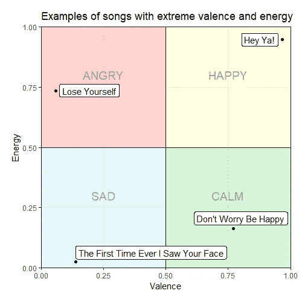

# 使用 Spotify 数据寻找最快乐的 emo 歌曲

> 原文：<https://medium.com/analytics-vidhya/using-spotify-data-to-find-the-happiest-emo-song-20e37fdf9eb?source=collection_archive---------18----------------------->

乌列尔·索伯兰斯在 [Unsplash](https://unsplash.com?utm_source=medium&utm_medium=referral) 上拍摄的照片

我最近发现了查理·汤普森的 [**spotifyr**](https://www.rdocumentation.org/packages/spotifyr/versions/1.0.0) 包，它提供了一种使用统计编程语言 r 分析 Spotify 数据的简单方法。许多人用这个包做了一些有趣的事情，例如[凯特琳·胡顿搜索最令人沮丧的圣诞歌曲](https://caitlinhudon.com/2017/12/22/blue-christmas/)和[查理·汤普森自己搜索最令人沮丧的电台司令歌曲](https://www.rcharlie.com/blog/fitter-happier/)。受到这些分析的启发，作为一个自称上辈子是 emo 小子的人，我决定用它来尝试和寻找最快乐的 emo 歌曲。

如果你想自己尝试使用 spotifyr，你可以按照 Charlie Thompson 网站上的说明进行安装。(在撰写本文时，spotifyr 并没有托管在 CRAN 上，所以我从 Github 安装了它。)

我这个项目的所有代码都可以在这里找到。

*请注意，一些歌曲标题包含潜在的冒犯性语言！*

# 哪些歌？

这个项目的第一个挑战是找出应该考虑哪些歌曲。为了避免任何关于什么应该或不应该被贴上 emo 标签的争论，我让 Spotify 决定，只收录了他们 80 首歌曲的“ [Emo Forever](https://open.spotify.com/playlist/37i9dQZF1DX9wa6XirBPv8?si=sY6rNtoBTom8TbdxERo__Q) ”播放列表中的歌曲。虽然这不是一个全面的列表，但它给了我一个相当有代表性的样本，这些样本是 2000 年代和 2010 年代初这一流派全盛时期相对知名的 emo 流行歌曲。

通过复制播放列表的 Spotify URI(位于 Spotify 应用程序的“共享”菜单中)并使用 get_playlist_tracks 功能，可以使用 Spotify yr 获取播放列表中的歌曲。

# 音乐极性

在后台，Spotify 上的每首歌曲都有各种相关属性。除了熟悉的音乐特征，如调和速度，这些还包括对音轨情绪的更多主观测量。这些算法生成的指标纯粹基于音轨的音频特征，而不是歌词(尽管 Spotify 对音轨的具体属性保密)。

这种分析的两个最相关的属性是**化合价**和**能量**。根据[的官方文件](https://developer.spotify.com/documentation/web-api/reference/tracks/get-audio-features/)，价测量*“一首曲目所传达的音乐积极性”*，而能量*“代表强度和活动的感性测量”*。两者都在 0 到 1 的范围内测量。

这个图说明了不同价和能量值的歌曲的整体情绪，以及一些众所周知的例子。

(这篇文章中的这些例子和对四个象限的描述归功于 Miriam Quick。)

最快乐的歌曲位于该网格的右上象限，因此为了量化播放列表中每个曲目的“音乐极性”，我计算了其(*价，能量*)坐标与(0，0)的距离:

然后我就按照这个尺度安排了播放列表。这是排名前五的歌曲:

底部 5:

*中间的*是我所知道的最快乐的歌曲，仍然被普遍认为是“emo ”,在开始这个项目之前，我预测它会得分很高，所以我很高兴看到它在这里占据首位。与此同时,*取消铃声,*的极性得分比播放列表中的其他歌曲低得多。如果我们也考虑歌词呢？

# 抒情的极性

spotifyr 与 [genius](https://cran.r-project.org/web/packages/genius/index.html) 软件包配合良好，该软件包通过 R. genius 的 genius_lyrics 函数获取艺术家和曲目标题并返回其歌词。

我首先清理数据，删除一些曲目名称中的标点符号，并编辑一些非唯一的艺术家姓名(如 Aiden，他碰巧与一名意大利说唱歌手同名)。该函数有时会随机返回 NA 值，所以我编写了一个快速包装器函数，让它尝试多次，如果仍然失败，就发出警告放弃。

一旦我导入了播放列表中歌曲的歌词，我就使用 [qdap](https://cran.r-project.org/web/packages/qdap/index.html) 包中的[极性](https://www.rdocumentation.org/packages/qdap/versions/2.4.3/topics/polarity)函数来执行近似情感分析。该功能识别一段文本中的正面或负面单词，然后查看每个单词周围的单词簇，以识别它是被否定(例如“不好”)还是被放大(例如“非常好”)。大致来说，正簇的密度越高，文本的整体极性得分就越高(可以是正的，也可以是负的)。

这是 5 首歌词最积极向上的歌曲:

最消极的 5 个:

这是我个人最喜欢的歌曲之一*的强劲表现，充满爱的光辉*，这首歌讲述了一对夫妇在大屠杀期间的决心，尽管它的主题黑暗，但却令人振奋。我对水下的*车*不太熟悉，但鉴于合唱的歌词是

> 我在水下的汽车里消磨时间，回想我忘了告诉你这个
> 我不在乎你离开和抛弃我，更痛苦的是我仍然会为你而死

…那么这似乎相当准确。

# 结合一切

在计算了音乐和歌词的积极度之后，是时候尝试将它们合并成一个积极度的通用衡量标准了。这在本质上是困难的——这两种积极性的衡量标准相当随意，衡量尺度也不同，不同的人受音乐和歌词的影响程度也不同，所以这是一个主观决定。因此，我尝试了几种不同的方法来组合它们，旨在选择一种相对简单的方法，最符合我自己对歌曲积极性的看法。

我决定的措施如下。首先，我将音乐极性除以√2(音乐极性的最大可能值),并采用抒情极性的标准逻辑函数,从而将两个测量值映射到 0 和 1 之间。然后我从(0，0)找到了变换后的*(音乐极性，抒情极性*)坐标的距离。

这是前五名:

底部 5:

尽管前五名中的其他作品具有更高的音乐极性得分，但凭借其高音乐和抒情极性的结合，*因爱情的荣耀而活着*获得了整体最高分。同时*取消钟声*以最低的整体极性得分结束，因为它的音乐极性极低，尽管有适度高的抒情极性。

# 扩充字典

qdap 的极性得分取决于所使用的积极和消极词汇的“字典”。默认字典是一组相当通用的单词，它不一定适合所有的上下文。例如，如果你想分析 tweets 中的文本，你会想扩充默认字典，使其包含网络俚语。有没有歌词中经常出现的词没有收录在 qdap 的默认词典中？

为了回答这个问题，我计算了每个词在歌曲歌词中总共出现的次数，然后使用 dplyr 的 anti_join 函数来识别 qdap 的默认词典中缺少哪些词，并按频率对结果进行排序。有一些有趣的遗漏:

*   “down”这个词一共出现了 167 次，出现在各种否定短语中，比如“看不起”、“脸朝下趴在地板上”和“让你失望”
*   “好吧”这个词出现了 59 次——鉴于这种类型，感觉好吧是相当积极的，在这种情况下，这可以被认为是一个积极的词

在扩充字典使得“down”被认为是一个否定词而“alright”被认为是一个肯定性词之后，按总体极性排列的前 5 首歌曲如下:

*一切正常*拔得头筹，这并不十分令人惊讶！这表明了极性计算的局限性——这首歌是关于与焦虑和强迫症斗争的，尽管你告诉人们一切都不太好，显示了 qdap 无法察觉讽刺。(这也让我觉得《动感城市》的原声音乐和《T2:我的化学罗曼史》在谈论他们的问题时有着非常不同的方式。)

与此同时，排名后 5 位的人基本保持不变:

总的来说，我认为基于默认字典的计算更准确地反映了歌曲的实际积极性。也许需要调整一些参数，这样这些词就不会有太大的影响。

# 未来的想法

这是我目前的分析范围，但我希望在未来探索一些途径:

*   **更多歌曲**——我在这里只考虑了一小部分相当主流的 emo 流行歌曲，但 emo 及其相关子类别仍在蓬勃发展(我个人是 Pinegrove、Hotelier 和 Foxing 等的忠实粉丝)。在这个项目的未来迭代中，考虑更广泛的 emo 定义和不太知名的歌曲会很有趣。
*   一个更准确的积极性指标——如上所述，我最终使用的音乐和歌词相结合的积极性指标相当随意。如果能进一步了解人们如何受到音乐和抒情因素的影响，从而得出一个更可靠的衡量标准，那就太好了。

*你觉得最幸福的 emo 歌曲是哪一首？请在回复中告诉我。我也很乐意听到你对这篇文章的想法和反馈，如果你喜欢，请分享！*