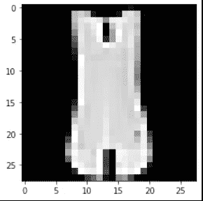
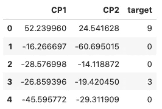
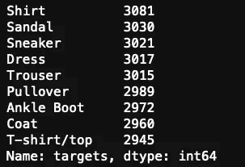
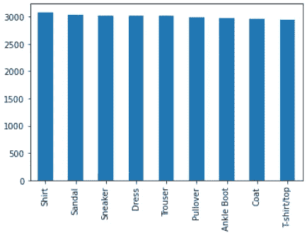
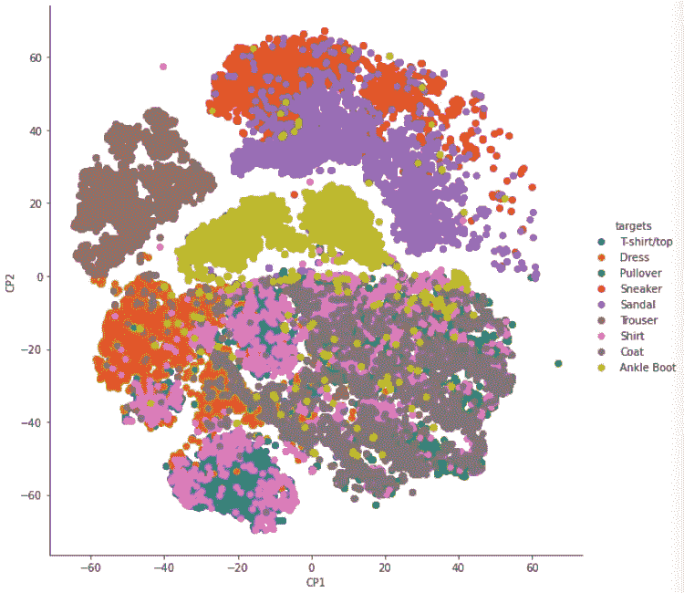

# 使用 t-SNE 进行数据可视化

> 原文：<https://medium.com/analytics-vidhya/using-t-sne-for-data-visualisation-8a83f46fbad3?source=collection_archive---------1----------------------->

一个简单的例子，说明如何使用 t-SNE 来可视化数据。


照片由[戴安娜 H](https://unsplash.com/@diana_h?utm_source=medium&utm_medium=referral) 在 [Unsplash](https://unsplash.com?utm_source=medium&utm_medium=referral) 拍摄

T 这篇文章的目的不是教你如何**[**T-SNE(T-分布式随机邻居嵌入)**](https://en.wikipedia.org/wiki/T-distributed_stochastic_neighbor_embedding) 工作，而是教你如何使用它来帮助你可视化数据。t-SNE 背后的主要思想是，在降低维数的过程中，它试图保持相似的观察值接近，而不相似的观察值分开。让我们看看这种降维技术如何帮助我们看到实例的集群。**

## ****所需库****

```
import matplotlib.pyplot as plt
import numpy as np
import pandas as pd
import seaborn as snsfrom sklearn import datasets
from sklearn import manifold
```

# **资料组**

**对于这个例子，我们将使用时尚 MNIST 数据集。该数据集由 70，000 幅(28x28)灰度图像组成，与来自 10 个不同类别的标签相关联。**

```
# load dataset
data = datasets.fetch_openml(
    'Fashion-MNIST',
    version=1,
    return_X_y=True
)# data returns a tuple (features, target)
features, target = data
target = target.astype(int)
```

## *****绘制样本图像*****

```
# reshape the features for plotting image
image = features.iloc[0].values.reshape(28, 28)
plt.imshow(image, cmap='gray')
```

****

# **应用 t-SNE**

**我们将减少特征的维度，并在最终的绘图上使用目标进行以后的识别。有 784 个特征代表(28 x 28)图像上的每个像素。在这种情况下，降维就派上了用场。基本上，我们将使用的功能作为一个无人监管的数据集。**

**我们可以使用 t-SNE 将特征简化为两个部分。注意，在这个例子中只选择了 30，000 行。**

```
# dimensionality reduction using t-SNE
tsne = manifold.TSNE(n_components=2, random_state=42)# fit and transform
mnist_tr = tsne.fit_transform(features[:30000])# transformed_data is a 2D numpy array of shape (30000, 2)
```

**为了更好地操作数据并使用 Seaborn 绘制数据，让我们使用 transformed_data 和目标创建一个数据框架:**

```
# create dataframe
cps_df = pd.DataFrame(columns=['CP1', 'CP2', 'target'],
                       data=np.column_stack((mnist_tr, 
                                            target.iloc[:30000])))# cast targets column to int
cps_df.loc[:, 'target'] = cps_df.target.astype(int)cps_df.head()
```

****

**t-SNE 组件**

**现在，我们可以将目标标签映射到它们所代表的实际服装上，以便进行绘制**

```
clothes_map = {0:'T-shirt/top',
               1: 'Trouser',
               2: 'Pullover',
               3: 'Dress',
               4: 'Coat',
               5: 'Sandal',
               6: 'Shirt',
               7: 'Sneaker',
               8: 'Bag',
               9: 'Ankle Boot'}# map targets to actual clothes for plotting
cps_df.loc[:, 'target'] = cps_df.target.map(clothes_map)
```

**让我们检查一下目标的分布:**

```
cps_df.target.value_counts().plot(kind='bar')
```

********

**条形图时尚-MNIST 目标类**

# **最终情节**

**最后，让我们画出组件并对目标进行颜色编码:**

```
grid = sns.FacetGrid(cps_df, hue="target", size=8)grid.map(plt.scatter, 'CP1', 'CP2').add_legend()
```

****

**当它们更相似时(t 恤和衬衫和外套和套头衫)，我们可以看到形成的主要簇和一些类相互重叠。此外，可以观察到大多数裤子类有更明显的区别。请注意鞋子如何更紧密地组合在一起，例如运动鞋和凉鞋。**

**抓住机会，进一步探索这个伟大的学习数据集！尝试一些分类算法，并检查哪一个给你最好的准确性。**

**感谢阅读！**