# 在采用英伟达 RTX 3000 系列 GPU 的 Windows 10 上使用 TensorFlow

> 原文：<https://medium.com/analytics-vidhya/using-tensorflow-on-windows-10-with-nvidia-rtx-3000-series-gpus-637ab2a4b163?source=collection_archive---------1----------------------->

## 从源代码构建 CUDA/cuDNN 以用于 GPU 加速深度学习的分步指南


克里斯蒂安·威迪格在 [Unsplash](https://unsplash.com?utm_source=medium&utm_medium=referral) 上拍摄的照片

# 概观

安装 TensorFlow/CUDA/cuDNN 用于加速硬件(如 GPU)并非易事，尤其是对于 windows 机器上的新手用户。下面描述了如何从源代码构建 CUDA/cuDNN 包，以便使用英伟达 RTX 30XX GPU 加速 TensorFlow 任务。

本文假设

*   您正在使用 IntelliJ、PyCharm 或 Spyder/Anaconda 之类的 IDE
*   您已经使用 pip/conda 安装软件包
*   您已经实际安装了您的 GPU

我们会掩护

*   简而言之，检查系统/硬件要求
*   使用 pip 安装 TensorFlow
*   在深度上，从源代码构建 CUDA/cuDNN，以便 TensorFlow 可以在 GPU 支持下使用

在开始之前，值得注意的是 TensorFlow 和相关的依赖关系**需要非常具体的驱动程序/包版本**，因此建议使用本文中指定的确切版本。

# 系统和硬件要求

开始之前，请确保正确下载并安装了 **python 版本> 3.8** 。通过在命令行中键入以下内容来检查 python 版本(通过在 windows 搜索栏中键入“cmd ”+ enter 来打开终端)。

```
C:\Users\...> python --version 
Python 3.8.x
```

还请确保正确安装了 GPU，并且更新了 Nvidia 驱动程序。您可以通过打开 Nvidia 控制面板(从桌面或程序列表)并查看 GPU 名称上方的版本号来查看驱动程序版本。**驱动版本必须是> 455** 。

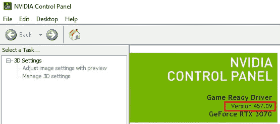

如果使用 pycharm 或 spyder 之类的 IDE，创建一个使用 TensorFlow 的虚拟环境会很有用(但不是必需的)。在 IntelliJ 中设置虚拟环境的一些资源可以在[这里](https://www.jetbrains.com/help/idea/creating-virtual-environment.html)找到，在 Spyder/Anaconda 中[这里](https://docs.conda.io/projects/conda/en/latest/user-guide/tasks/manage-environments.html)找到

# 安装 TensorFlow

随着最近的 **TensorFlow v. 2.4.0** 发布，IDE 终端中的简单 pip 安装(或 conda 安装)命令**(与 cmd 行相反，在这种情况下，您需要使用“pip3”而不是 pip 进行系统范围的安装)将安装具有 GPU 支持能力的 TensorFlow 的开箱即用版本；然而，要利用 GPU 启用的 TensorFlow 的全部功能，您必须安装依赖项。您必须指定`tensorflow==2.4.0`；TensorFlow 的早期版本不支持 3000 系列 GPU 中的**安培**架构。TensorFlow v < 2.4.0 是为 2000 系列和更低 GPU 上的**图灵**架构构建的。**

```
C:\...\generic_project_folder>pip install tensorflow==2.4.0
```

# 安装依赖项

安装 TensorFlow 之前需要以下依赖项。安装过程将在后续章节中介绍。

*   [微软 Visual Studio C++编译器](https://visualstudio.microsoft.com/vs/community/)
*   [CUDA 工具包 11.0](https://developer.nvidia.com/cuda-11.0-download-archive)
*   [cuDNN v8.0.4(适用于 CUDA 11.0](https://developer.nvidia.com/rdp/cudnn-archive)

## Microsoft Visual Studio C++编译器

CUDA 工具包需要 MS Visual Studio C++编译器。最简单的安装方法是安装微软 Visual Studio 代码(一个完整的 IDE ),可以从这里下载。按照屏幕提示进行操作。

## CUDA 工具包 11.0

跟随[链接](https://developer.nvidia.com/cuda-11.0-download-archive)。选择 Windows > x86_64 架构>版本 10 > exe【网络】。使用本地安装程序类型将所有组件嵌入其中，如果您需要进行多次安装，这是非常有用的，但是这可能是一个漫长的过程，具体取决于连接/硬件，因此建议通过网络可执行文件进行安装。

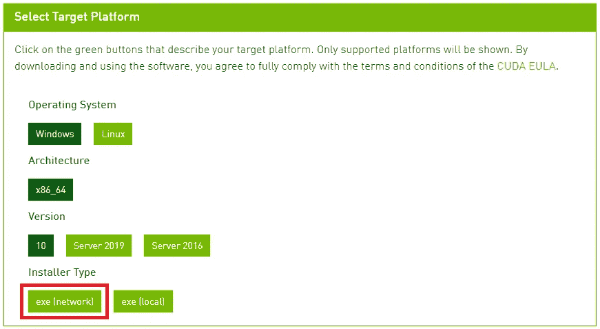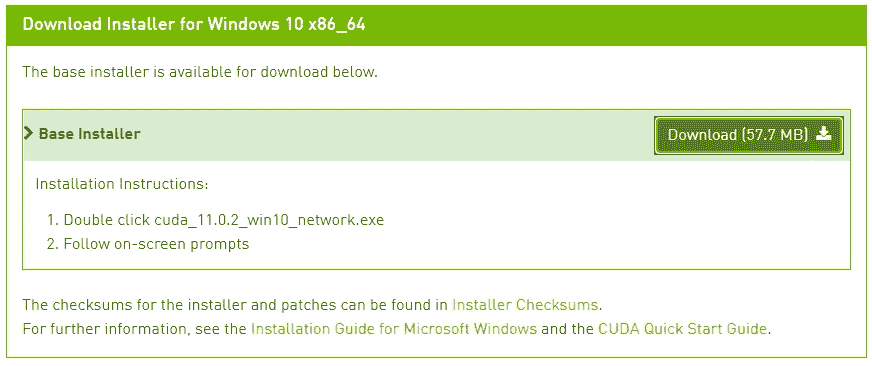

右键单击“下载”并选择“在新标签中打开链接”或双击开始下载。

下载完成后，将文件夹解压到一个临时位置。

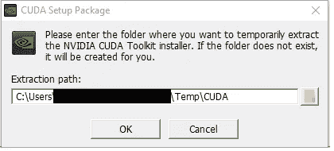

按照屏幕上的提示，接受所有协议，安装并完成。

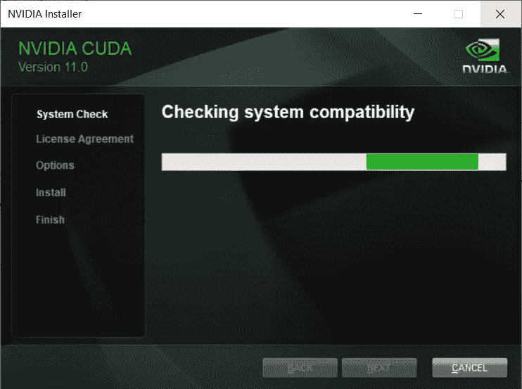

安装完成后，您可以退出窗口。

## cuDNN 8.0.4

跟随[链接](https://developer.nvidia.com/rdp/cudnn-archive)并选择合适的下载库(如下所示)。这将把你带到 Nvidia 开发者页面。如果您还不是 Nvidia 开发者计划的成员，您需要加入并接受条款，之后您可以下载文件。请务必为 **CUDA 11.0** 下载 **cuDNN v8.0.4** 。

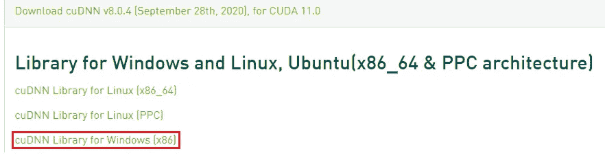

下载完成后，将文件夹的内容解压缩到一个文件存储位置，就像您的桌面或下载文件夹一样容易访问。

现在，您已经拥有了从源代码构建 CUDA/cuDNN 包的所有组件，因此 TensorFlow 可以与 GPU 加速一起使用。

# 构建 CUDA/cuDNN

下一个任务需要使用两个主要目录，您将从下载的 cuDNN 库中传输 3 组文件到 NVIDIA GPU 计算工具包程序文件。这些目录的根目录可以在下面找到，需要注意的是 cuDNN 根目录是你在最后一步解压的地方。

```
# cuDNN root
C:\Users\...\Downloads\cudnn-11.0-windows-x64-v8.0.4.30.zip# NVIDIA GPU Computing Toolkit root
C:\Program Files\NVIDIA GPU Computing Toolkit\CUDA\v11.0
```

## 集合 1

导航到下面的目录，将“cudnn.lib”从 1 复制到 2。

```
# 1\. cuDNN
\...\cudnn-11.0-windows-x64-v8.0.4.30.zip\cuda\lib\x64# 2\. NVIDIA GPU Computing Toolkit
\...\NVIDIA GPU Computing Toolkit\CUDA\v11.0\lib\x64
```

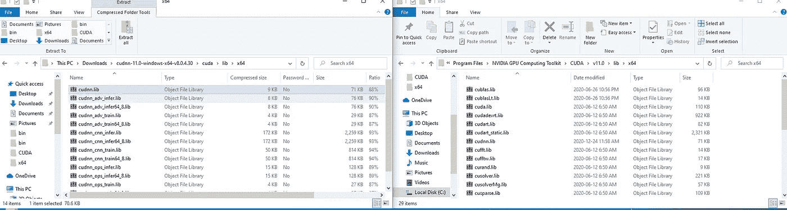

## 集合 2

导航到下面的目录，将“cudnn.h”从 1 复制到 2。

```
# 1\. cuDNN
\...\cudnn-11.0-windows-x64-v8.0.4.30.zip\cuda\include# 2\. NVIDIA GPU Computing Toolkit
\...\NVIDIA GPU Computing Toolkit\CUDA\v11.0\include
```

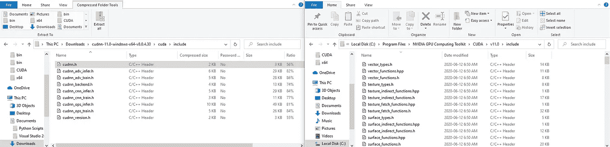

## 第三组

导航到下面的目录，并将所有文件从 1 复制到 2。

```
# 1\. cuDNN
\...\cudnn-11.0-windows-x64-v8.0.4.30.zip\cuda\bin# 2\. NVIDIA GPU Computing Toolkit
\...\NVIDIA GPU Computing Toolkit\CUDA\v11.0\include
```

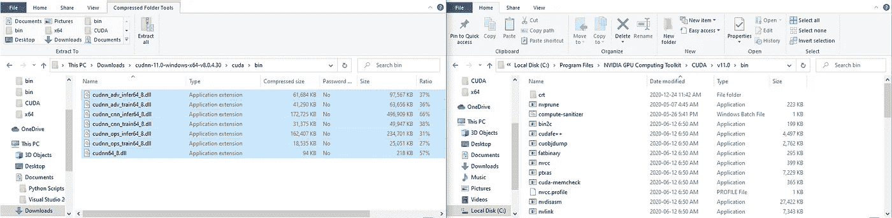

> 注意:如果您只是将 cudnn64_8.dll 文件从 1 复制到 2，您将能够编译您的模型，但是它们会在训练时崩溃。

为了确保所有的软件包都正确构建，首先重启你的计算机。

重新启动后，在窗口栏中搜索“编辑系统和环境变量”，然后单击 enter。单击“环境变量…”

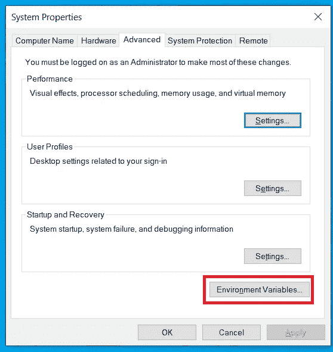

双击“Path”系统变量。确保显示以下内容。单击确定退出所有窗口。

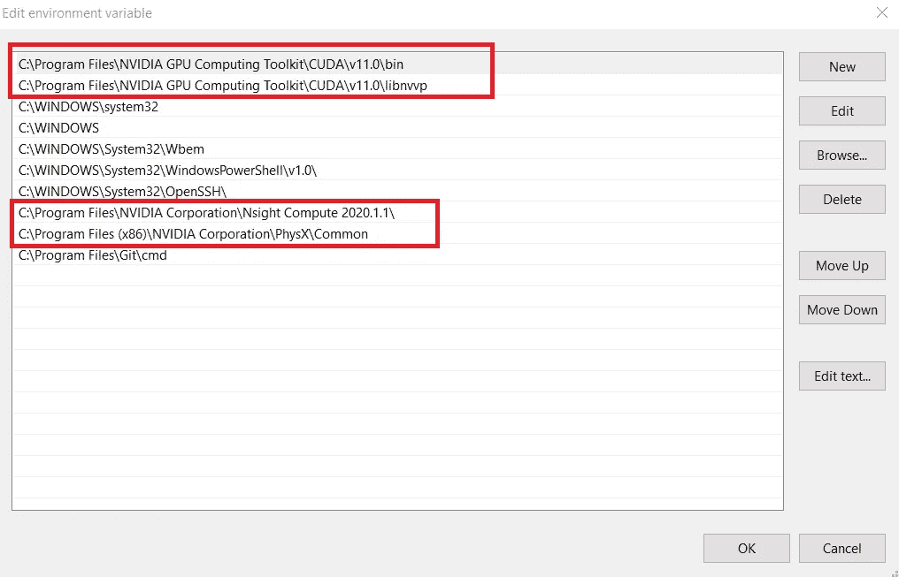

# 检查配置

既然 TensorFlow 及其所有依赖项已经安装并构建完毕，您需要检查 TensorFlow 和 python 是否能够“看到”GPU。

1.  在之前安装 TensorFlow 的任何项目中打开 IDE
2.  要检查 GPU 是否可用，请在 IDE 终端或脚本中键入以下内容并运行；您的输出应该如下所示

```
>>>import tensorflow as tf
>>>tf.config.list_physical_devices("GPU")
[PhysicalDevice(name='/physical_device:GPU:0', device_type='GPU')]
```

4.用卷积神经网络测试你的 GPU！使用以下脚本确保 TensorFlow 用于培训。下面这个模型的性能不会很好，只是为了保证 TensorFlow 模型可以编译和训练。

```
from tensorflow.keras import datasets, layers, models
import matplotlib.pyplot as plt

(train_images, train_labels), (test_images, test_labels) = datasets.cifar10.load_data()

train_images, test_images = train_images / 255.0, test_images / 255.0

model = models.Sequential()
model.add(layers.Conv2D(32, (3, 3), activation='relu', input_shape=(32, 32, 3)))
model.add(layers.MaxPooling2D((2, 2)))
model.add(layers.Flatten())
model.add(layers.Dense(64, activation='relu'))
model.add(layers.Dense(10))

model.compile(optimizer='Adam', loss=tf.keras.losses.SparseCategoricalCrossentropy(from_logits=True))

history = model.fit(train_images, train_labels, batch_size=10, epochs=100)
```

如果一切正常，您的 IDE 应该会输出如下所示的内容。

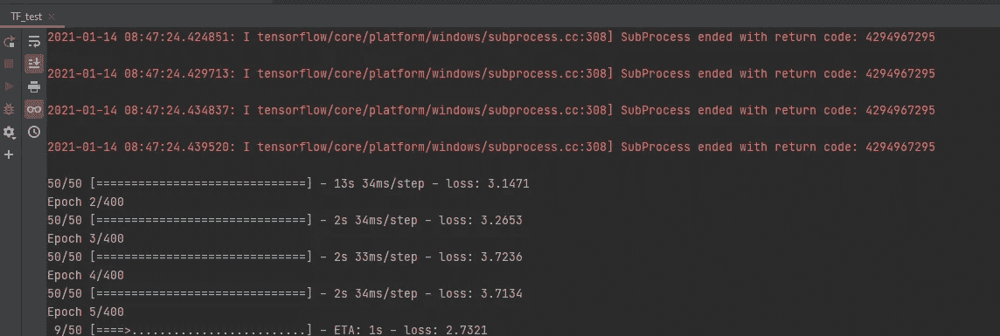

祝贺您安装 TensorFlow，构建 CUDA/cuDNN，并利用您的 GPU 硬件加速深度学习性能！

此外，我写这篇文章是因为我自己很难搞清楚，而且没有太多的资源用于新的 Nvidia 30XX GPUs。请找到我张贴的 TensorFlow github [问题](https://github.com/tensorflow/tensorflow/issues/45611)和 SO [问题](https://stackoverflow.com/questions/65225612/why-does-adding-convolution-pool-layer-crash-keras-tensorflow-model-while-runnin)试图找出我的挣扎！