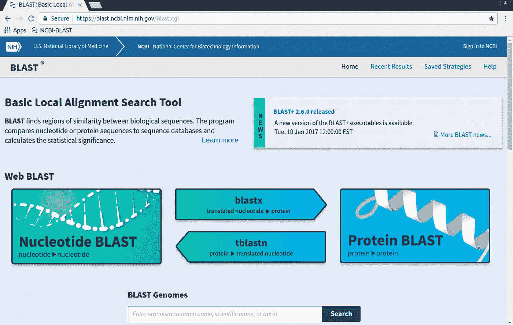
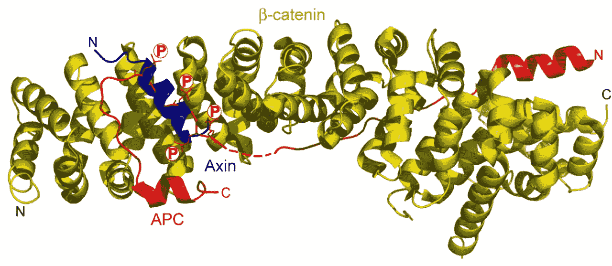
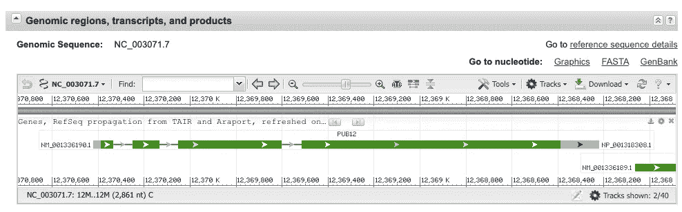
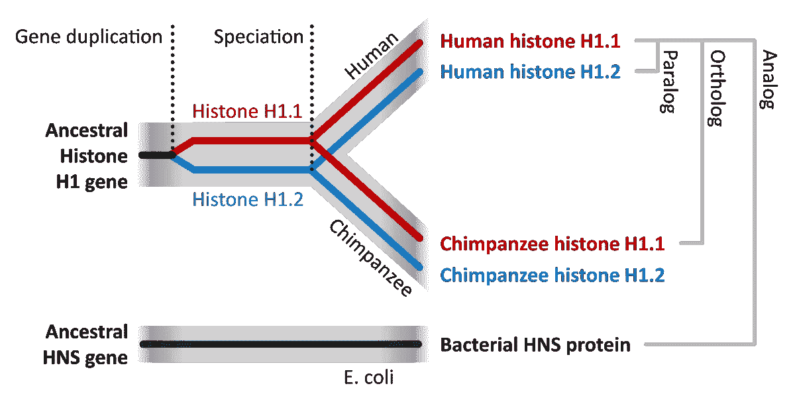
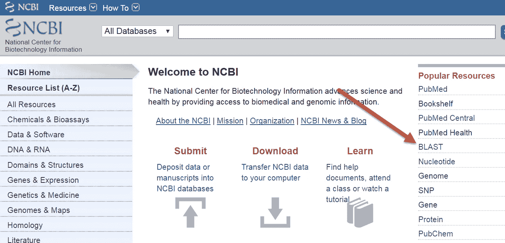
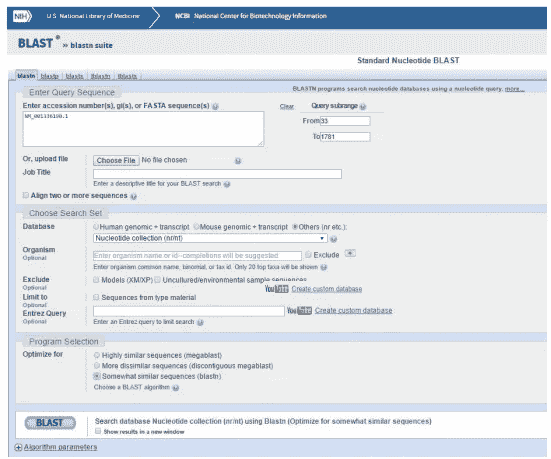
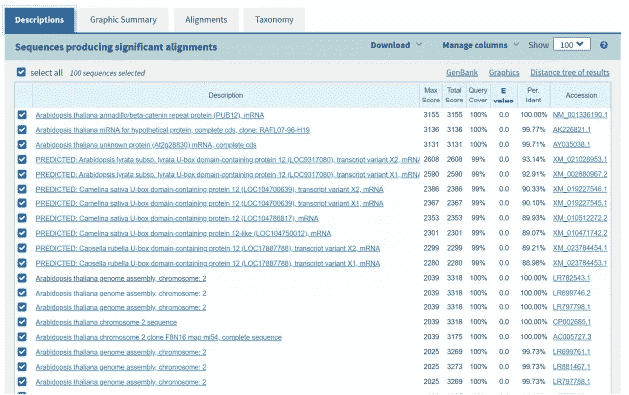
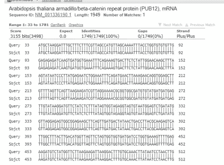

# 利用 NCBI BLAST 界面鉴定拟南芥中差异蛋白的同源序列

> 原文：<https://medium.com/analytics-vidhya/using-the-ncbi-blast-interface-for-identifying-homologous-sequences-in-differentiating-proteins-bc5cd38c480e?source=collection_archive---------22----------------------->

大约有 500 万到 1 亿种物种生活在地球上！来源:[发现](https://www.google.com/url?sa=i&url=https%3A%2F%2Fwww.discovery.com%2Fscience%2FEarth-Perfect-Place-for-Life&psig=AOvVaw2u8suEP_lMUEenVs1addM_&ust=1618276140449000&source=images&cd=vfe&ved=0CA0QjhxqFwoTCICYsN_C9-8CFQAAAAAdAAAAABAE)

目前生活在地球上的生物种类之多令人惊讶。据估计，它有超过 1000 万个物种，平均分布在世界不同的生物群落中。生物多样性的数量是惊人的，但这给组织和分类带来了困难。

寻找各种生物之间的遗传相似性可能极其困难，因为研究人员必须解析每个个体物种的数万亿个细胞。如果你把生活在地球上的大量物种和古老搜索算法相对较慢的计算时间考虑在内，在许多情况下，不可能找到类似的序列。

在 NCBI 爆炸算法搜索页面。信用: [widdowquin.github.io](https://www.google.com/url?sa=i&url=https%3A%2F%2Fwiddowquinn.github.io%2F2018-03-06-ibioic%2F02-sequence_databases%2F01-blast_at_NCBI_website.html&psig=AOvVaw2qDeekVVwUFscVBdmjvYyK&ust=1618276287446000&source=images&cd=vfe&ved=0CA0QjhxqFwoTCJCm5YzD9-8CFQAAAAAdAAAAABAO)

幸运的是，通过使用 BLAST 算法，NCBI 已经形成了一种发现物种变体之间局部相似性的方法，这种方法计算成本低，速度快。这种 NCBI 功能对于那些想要搜索大量基因序列但没有计算能力的研究人员来说非常有用。

在这篇文章中，我将谈论通过 NCBI 平台导航的基础知识，以及我如何使用 NCBI BLAST 功能对拟南芥物种，特别是其β-连环蛋白重复蛋白进行有趣的推断。

# 为什么是拟南芥？

信用:[语言学家](https://www.google.com/url?sa=i&url=https%3A%2F%2Fwww.inaturalist.org%2Fguide_taxa%2F495156&psig=AOvVaw2nJxmFLlLn3ewHcRw3m3j3&ust=1618276391931000&source=images&cd=vfe&ved=0CA0QjhxqFwoTCLDN7cDD9-8CFQAAAAAdAAAAABAD)

拟南芥物种，更通常被称为 thale cress，由于其基因组的可及性和简单性，经常是入门科学研究的一个点。它生长速度极快，包含一个小基因组(~114.5 Mb)，并对其进行了大量的科学研究。

我之所以重点研究β-连环蛋白重复蛋白，是因为它对体内细胞的增殖和分化具有活力。这些在拟南芥的干细胞更新中起着重要的作用。

由于对干细胞领域感兴趣，我想更进一步，找到与β-连环蛋白重复蛋白相似的同源序列，看看在其他不同的动物中是否有类似的特征。

β-连环蛋白重复蛋白的可视化表示。鸣谢:[细胞科学杂志](https://www.google.com/url?sa=i&url=https%3A%2F%2Fjcs.biologists.org%2Fcontent%2F120%2F19%2F3337&psig=AOvVaw2uB8tsx6IaQLw5RrUEHmau&ust=1618276502472000&source=images&cd=vfe&ved=0CAMQjB1qFwoTCLCr9_jD9-8CFQAAAAAdAAAAABAa)

这种鉴定可以通过拟南芥物种不熟悉的其他类似蛋白质来引导增加或减少该植物中的细胞增殖。从这项研究进一步扩展，thale cress 不知道的类似蛋白质可以用来指出它的功能主要依赖于外部蛋白质。

这种外来蛋白质的使用对这一领域的基因研究有着巨大的影响；因此，看到 NCBI BLAST 平台是多么容易接近，我决定进行实验并确定类似的蛋白质。

# NCBI 概况

[加州大学伯克利分校图书馆更新](https://www.google.com/url?sa=i&url=https%3A%2F%2Fupdate.lib.berkeley.edu%2F2016%2F01%2F22%2Fncbi-bioinformatics-tools-an-introduction-4%2F&psig=AOvVaw2hGDammPKo4rXCNgLS6yx9&ust=1618276564320000&source=images&cd=vfe&ved=0CAMQjB1qFwoTCMDHh5XE9-8CFQAAAAAdAAAAABAD)

NCBI[拥有最大的生物数据仓库之一，包含地球上所有生命形式的遗传信息。完整的基因组被组织起来并相互参照，以便于科学家查阅。](http://www.ncbi.nlm.nih.gov/)

如果你知道你在寻找什么，并且知道你想从 NCBI 提供的结果中得到什么，那么这个工具对有兴趣在这个领域形成新想法的计算生物学家来说是非常有用的。

通常，NCBI 使用登记号或特定序列的唯一标识符来识别其遗传平台中的各种基因组。即使在作者的要求下发生了变异，这些数字也不会改变。随后的**版本号**(每次递增 1)被放置在该登录号上，以显示该基因组在 NCBI 的历史。GA1020304.2 的登录号示例，其中登录号附加了“. 2”(第二版)。

你要找的东西可以通过这个登录号或基因关键词(如泛素蛋白连接酶)在 NCBI 的数据库中进行搜索。

在这篇文章中，我们将重点关注β-连环蛋白重复蛋白(拟南芥或水芹植物物种的一部分)。请注意，这种特定的蛋白质和物种可以与 NCBI 数据库中的任何特定蛋白质互换。该蛋白的登录号为 NP_001318308。

β-连环蛋白重复蛋白基因组区域的快照。[来源](https://www.ncbi.nlm.nih.gov/gene?Db=gene&Cmd=DetailsSearch&Term=817432)

我发现 NCBI 的迷人之处在于，它们显示了特定蛋白质的特定基因组序列，显示了**信息，如外显子、保守域，甚至基因在基因组中的位置。**

这些核苷酸序列最常用的格式是 GenBank 平面文件格式，它包含来自 NCBI 数据库的分类信息和序列本身。

# 实现 BLAST 算法

*注意:如果你还不熟悉 BLAST 算法的内部工作原理，那么我强烈建议你看看我以前的文章***，解释 BLAST 算法及其在字符串匹配中的作用。**

## *术语*

*在讨论 BLAST 算法的实现之前，重要的是要注意序列如何被认为是“相似的”，这意味着它们彼此共享大量的核苷酸。*

**

*不同序列类型的简单直观表示。信用:[维基百科](https://www.google.com/url?sa=i&url=https%3A%2F%2Fen.wikipedia.org%2Fwiki%2FSequence_homology&psig=AOvVaw3ots5igFERcA39f9MNgdXl&ust=1618276785754000&source=images&cd=vfe&ved=0CAMQjB1qFwoTCOCTuP3E9-8CFQAAAAAdAAAAABAD)*

***同源序列**是通过共同祖先相关的序列，**直向同源序列**是通过过去的物种形成事件(当进化谱系分裂时)相关的序列，**旁系同源序列**是通过过去的复制事件相关的序列。*

*通过用户输入的**查询序列**，找到 HSPs 或**高分片段对**(你的查询序列与 BLAST 返回的数据库序列之间的子序列匹配)。*

*通常，BLAST 算法只检查**局部比对**(通过序列的一部分，而不是全部)，而不是全局比对，并且将其注意力更多地集中在同源序列上，而不是直向同源和旁系同源，因为这是科学家最感兴趣的。*

## *爆炸步骤*

**

*使用 BLAST 的另一个简单方法。功劳:[导游在一旁](https://www.google.com/url?sa=i&url=https%3A%2F%2Fguides.nnlm.gov%2Ftutorial%2Fncbi-blast-finding-and-comparing-sequences&psig=AOvVaw2hGDammPKo4rXCNgLS6yx9&ust=1618276564320000&source=images&cd=vfe&ved=0CAMQjB1qFwoTCMDHh5XE9-8CFQAAAAAdAAAAABAJ)*

*在*搜索 NCBI* 页面，在所有数据库中搜索您的登录号(在我们的例子中是 NP_001318308)。然后单击基因链接，以可视化特定蛋白质内部的 mRNA 和蛋白质轨迹。*

*使用“运行 BLAST”链接来分析网页的这个序列部分。根据您希望从搜索中获得的内容填写必要的信息，然后单击 BLAST 命令进行测试！*

**

*BLAST 查询页面的外观。*

*对于我的特定项目，我做了一些明显的改变:*

*   *我将默认的**数据库**改为**其他(nr/nt)** ，因为我们的序列是非人类的(水芹是一种小型开花植物)。*
*   *我将**程序选择/优化**改为**有点类似的序列**(专门使用 BLASTN 算法)*
*   *我在顶部输入了一个 **FASTA 序列**而不是普通的登录号。这只是登录号的核苷酸表示，通常用于蛋白质本身的特定部分。*

*BLAST HSPs 以三种不同的方式量化，但我主要关注 E 值或**期望值**，这是一个基于不同比对数量的值，其分数至少与观察到的分数相同(高于那些只是偶然发生的分数)。这意味着分数与 E 值呈负相关。E = mn2^-S，m 是查询序列的长度，n 是数据库本身的大小。欲了解更多信息，请查看此[链接](http://www.metagenomics.wiki/tools/blast/evalue)。*

## *项目结果*

**

*拟南芥β-连环蛋白重复蛋白的 BLASTN 输出描述。*

*如上图所示，有多个遗传序列的 E 值为 0.0。由于低 E 值对应于较高的分数，这些遗传序列可以被视为与用户输入的查询序列在遗传上几乎相同。*

*上面发现的许多序列已经与拟南芥物种密切相关；然而，即使它们的 E 值为零，它们作为进化伙伴也有明显的不同。*

*这些特定的同源序列是目前我正在探索的一个研究点，因为我努力深入下去，并发现 BLAST 算法发现的序列是否有任何影响。*

**

*β-连环蛋白重复蛋白的序列间输出比对。*

# *TL；速度三角形定位法(dead reckoning)*

*   *NCBI 拥有各种各样的遗传信息，研究人员可以通过登录号获取特定的蛋白质。*
*   *我的项目主要关注拟南芥物种，特别是β-连环蛋白重复蛋白，以及 BLAST 算法如何用于寻找相似的同源序列。*
*   *使用 BLAST NCBI 功能，发现了同源序列。令人惊讶的是，E 值为零(几乎完美比对)的序列不是拟南芥物种的一部分。*
*   *正在对这些序列进行进一步的研究，以了解它们是否可以作为β-连环蛋白重复蛋白的替代品。*

# *额外资源*

*   *研究论文: [NCBI 爆炸:一个更好的网络界面](https://academic.oup.com/nar/article/36/suppl_2/W5/2505810?login=true)(关于 NCBI 爆炸工具本身的更多信息)*
*   *研究:[BLAST 序列分析工具](https://www.ncbi.nlm.nih.gov/sites/books/NBK153387/)(关于 BLAST 算法本身的更多信息！)*

**嗨！我今年 16 岁，目前对机器学习和生物技术领域感兴趣。如果你有兴趣看到更多我的内容和我发布的内容，可以考虑订阅我的* [*简讯*](https://forms.gle/gdCammxd628UTQ9j9) *！查看我的三月简讯* [*这里*](https://preview.mailerlite.com/n3t1o8) *！还有，看看我的*[*LinkedIn*](https://www.linkedin.com/in/karthikmittal/)*和*[*Github*](https://github.com/karthikm15)*页面。如果你对个人心态感兴趣，或者只是一般的东西，使用我的* [*日历*](https://calendly.com/karthikmittal306) *注册聊天。**