# 利用推特数据探索新冠肺炎在非洲的影响

> 原文：<https://medium.com/analytics-vidhya/using-twitter-data-to-explore-the-impact-of-covid-19-in-africa-bdb8d3adf346?source=collection_archive---------17----------------------->


在 [Unsplash](https://unsplash.com/?utm_source=unsplash&utm_medium=referral&utm_content=creditCopyText) 上由 [muthengi mbuvi](https://unsplash.com/@muthengimbuvi?utm_source=unsplash&utm_medium=referral&utm_content=creditCopyText) 拍摄的照片

从 2019 年 12 月开始，全世界都在对抗一种叫做冠状病毒的传染病。随着行动限制和居家命令的实施，Twitter 等社交媒体平台已成为用户相互保持联系的唯一手段和表达他们对疫情的担忧、意见和感受的渠道。在这些充满挑战的时期，人们使用 Twitter 来感谢一线卫生工作者，并在困难时期相互扶持。另一方面，Twitter 也是大量错误信息和负面推文的地方，对这种疾病产生了不必要的焦虑。

在这篇文章中，我选择通过使用 Twitter 数据的仪表板来探索 COVID19 对人们生计的影响。我们构建的系统将让我们深入了解 COVID19 对人们生活的影响。该系统将有助于了解人们对 COVID 19 的知识、态度和看法。它将揭示人们对 covid19 的一些常见误解，从而有助于抗击该疾病的努力，如疫苗的有效分发。

在本文的最后，我们将建立一个使用 Twitter 数据的系统。这些数据是使用关键词“covide19”和“非洲”收集的。将会有一个全自动的 MLOps 管道，使用推文的情绪和推文中讨论的主题来分析 Twitter 应用程序数据。最后，我们将部署一个控制面板，让我们能够使用 Streamlit 来研究调查结果。

# GitHub 链接

[](https://github.com/eandualem/Twitter-Data-Analysis) [## ean dualem/Twitter-数据分析

### 从 2019 年 12 月开始，全世界都在对抗一种叫做冠状病毒的传染病。与……

github.com](https://github.com/eandualem/Twitter-Data-Analysis) 

# 数据析取

如前所述，我们将使用从 Twitter 收集的数据，使用关键字“covide19”和“Africa”。数据采用 JSON 格式，包含 6532 行。我们首先从 JSON 文件中提取 pandas 数据帧。一个**数据帧**是一个二维大小可变的、潜在异构的表格数据结构，带有标记轴(行和列)。

函数 read_json 读取 json 文件，并返回包含单个 tweets 的 JSON 列表。TweetDfExtractor 类将 tweets JSON 解析成 pandas 数据帧。在这里，我从高音数据中提取了 15 列。提取列后，我们创建一个包含 15 列的 zip 文件。然后，我们使用 pandas 生成一个数据帧，并将其保存到名为“processed_tweet_data.csv”的文件中。

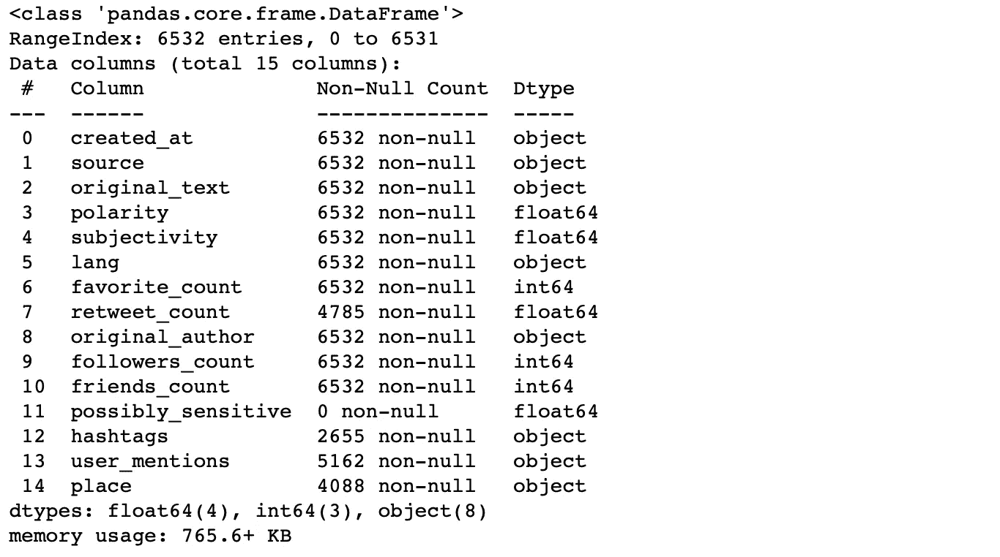

从 json 提取的数据

# 方法

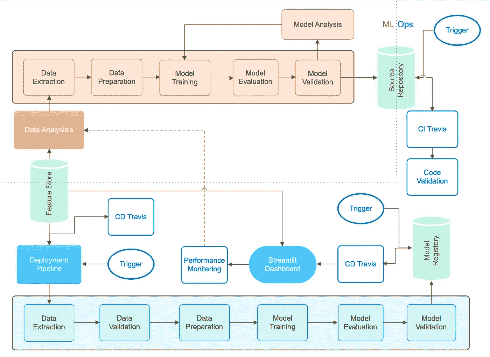

系统设计

现在我们有了熊猫数据框中的数据。我们可以谈谈整个系统。对于这个项目，我们将遵循 MLOps 级别 1，即 ML 管道自动化。MLOps 是一个工程学科，旨在统一 ML 系统开发(dev)和 ML 系统部署(Ops ),以标准化和简化生产中高性能模型的持续交付。

该架构将允许快速实验，并且使用基于使用 Travis 的实时管道触发器的新数据，在生产中自动训练该模型。

# 数据预处理

在探索或创建模型之前，我们需要对数据进行预处理。删除不需要的列或从一些列中提取特定数据，清理包含实际 tweet 文本的 original_text 列，最后将所有列转换为正确的数据类型。

下面是使用 Clean_Tweets 类进行预处理要做的事情列表。

*   使用熊猫读取 processed_tweet_data.csv 文件。

```
tweets = pd.read_csv("../processed_tweet_data.csv")
```

*   如果数据框中有任何重复，我们将删除它们。

```
ct = Clean_Tweets()
tweets = ct.drop_duplicate(tweets)
```

*   删除非英语推文和 lang 专栏。在放弃非英语推文后，我们不再需要阿郎专栏。

```
tweets = ct.remove_non_english_tweets(tweets)
tweets.drop(['lang'], axis=1, inplace=True)
```

*   从 original_text 列中删除链接、标点符号、数字和特殊字符。

```
tweets = ct.remove_links(tweets)
tweets = ct.remove_special_characters(tweets)
```

*   数据集中有两种类型的 hashtags。那些在 hashtag 列中的和那些在 original_text 中提到的。我们将清理两者，并在单独的列中输出主题。

*   我们从 user_mantiodsns 列中提取屏幕名称，从 source 列中提取设备。

*   将包含文本的所有列转换为小写。

```
tweets = ct.to_lower(tweets)
```

*   将所有列转换为正确的数据类型

```
tweets = ct.convert_to_string(tweets)
tweets = ct.convert_to_numbers(tweets)
tweets = ct.convert_to_boolean(tweets)
tweets = ct.convert_to_numbers(tweets)
```

*   填写缺失的值

```
tweets["possibly_sensitive"].fillna(False, inplace=True) tweets["place"].fillna(" ", inplace=True)
```

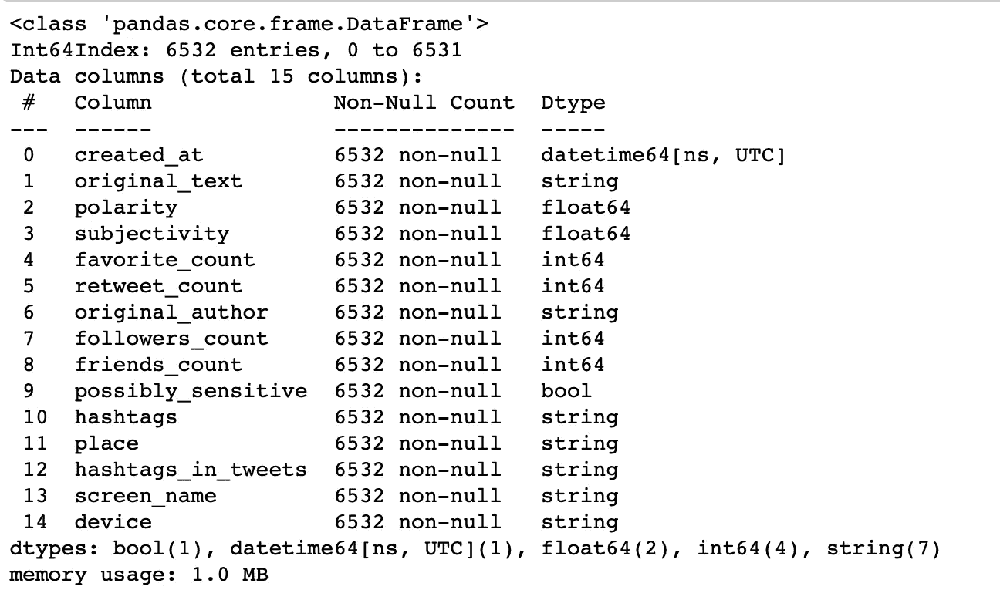

清洗后的数据帧

以上所有步骤都在[预处理. ipynb](https://github.com/eandualem/Twitter-Data-Analysis/blob/main/notebooks/preprocessing.ipynb) 笔记本中用数据探索和可视化进行了详细解释。我们通过将最终数据框保存到 clean_tweets.csv 来结束本节。

# 数据探索和可视化

现在让我们试着深入了解一下这些数据。例如，谁是最热门的推文作者，一个人平均发了多少条推文，推文中最常提到的词，使用的热门推文标签，极性(“积极”、“消极”、“中立”)比率。

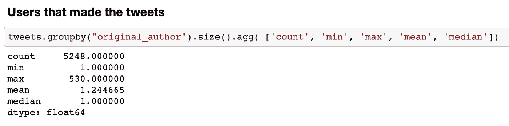

正如我们所见，原作者的平均值是 1.24，这意味着大多数推文来自独特的个人，除了一个离群者，他在总共 5248 条推文中发了 530 条。这是有问题的，因为我们不希望一个人的观点影响我们的模型。

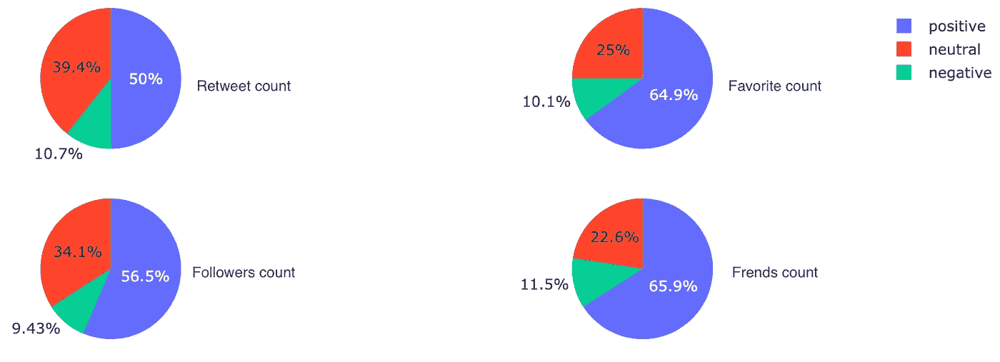

Tweets 极性反对他们的受欢迎程度。

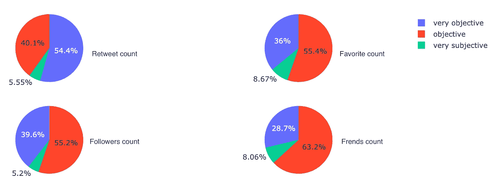

推特的主观性与受欢迎程度相反。

我们可以看到积极的推文有最多的转发、收藏、关注者和朋友。客观的推文拥有最多的收藏夹、关注者和朋友。客观的推文转发次数最多。我们的数据集中没有非常主观的推文，这将是我们的问题之一。

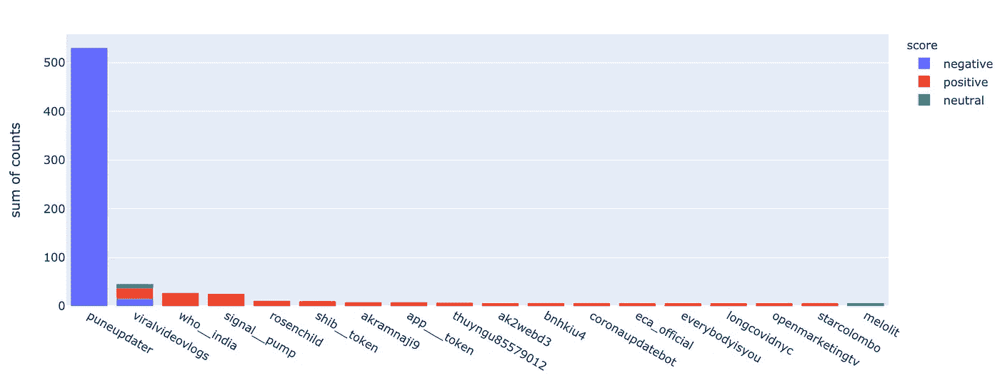

反对原作者的推文极性。

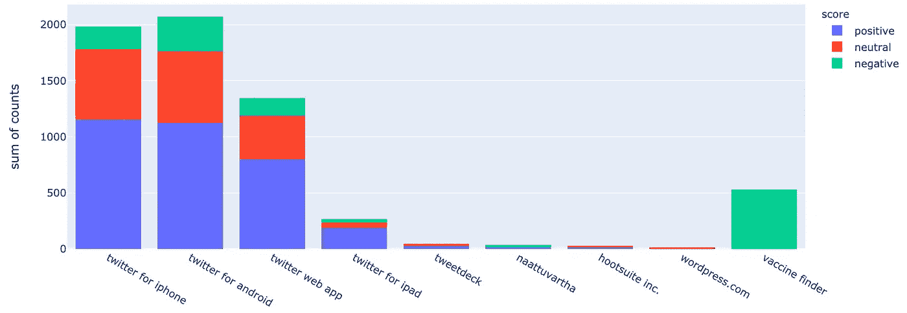

推文的极性与制造它们的设备相反。

上面两个图显示了原创作者的数量和产生推文的设备的数量。我们可以从设备名称疫苗查找器中看到，我们收到了 500 多条推文，都是负面的。这意味着一半的负面推文来自这个设备。如果你还记得的话，我们已经在一些推文中发现了一个异常值。名为“puneupdater”的用户正在使用该设备。这意味着一个人发了几乎一半的负面推文，1277 条中的 530 条。

这是一个很大的数据流。好消息是，当数据发生变化时，我们的系统会自动重新训练。该系统将能够重新培训和服务于新的模式。我在[预处理. ipynb](https://github.com/eandualem/Twitter-Data-Analysis/blob/main/notebooks/preprocessing.ipynb) 笔记本里做了更多的探索和可视化。

# 主题建模

主题建模是一种无监督的机器学习技术，能够扫描一组文档，检测其中的单词和短语模式，并自动聚类单词组和最能表征一组文档的类似表达。

我们从主题建模开始，因为它不需要预先定义的标签列表。这意味着我们不是在训练以前被人类分类的数据。

```
df = pd.DataFrame(columns=['clean_text'])
df['clean_text'] = tweets['original_text']
```

我们已经完成了大部分预处理步骤。在这里，我们将继续删除停用词。

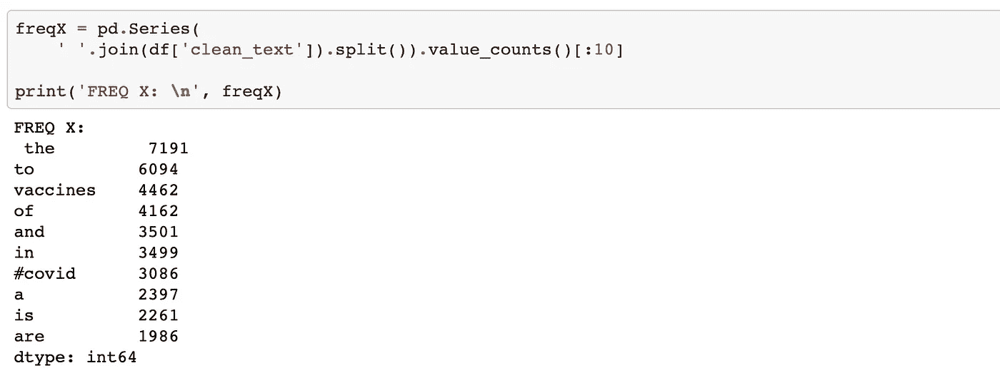

文档中的前 10 个单词

此图像显示了文档中的前 10 个单词。正如我们所看到的，大多数都是停用词。我们删除它们是因为它们不影响文本的语义，并且经常(但不总是)这样做可以提高模型的性能。

```
sentence_list = [sent for sent in df['clean_text']] 
word_list = [sent for sent in sentence_list]
```

现在下一步是标记化。**记号化**是一种将一段文本分割成称为记号的更小单元的方法。这里，标记可以是单词、字符或子单词。在这里，我们将推文标记成单词。

```
lemmatizer = WordNetLemmatizer()
word_list_lematized = []
for w in word_list:
  word_list_lematized.append([lemmatizer.lemmatize(x) for x in w])
```

然后我们做词条释义，这是一个将单词的屈折形式组合在一起的过程。词元化允许我们将这些词作为一个单独的项目来分析，通过词的词元来识别。

有两种主要的主题建模方法。*潜在语义分析(LSA)和潜在狄利克雷分配(LDA)。两者都基于*相同的潜在假设:分布假设(即相似的主题使用相似的词)和统计混合假设(即文档谈论几个主题)，可以确定统计分布。如果你想深入了解这个主题，有一个关于 Federico Pascual 的[主题建模](https://monkeylearn.com/blog/introduction-to-topic-modeling/)的博客。

这里，我们将使用 LDA 将我们语料库中的每条 tweet 映射到一组主题，这些主题涵盖了 tweet 中的大量单词。

**结果:**

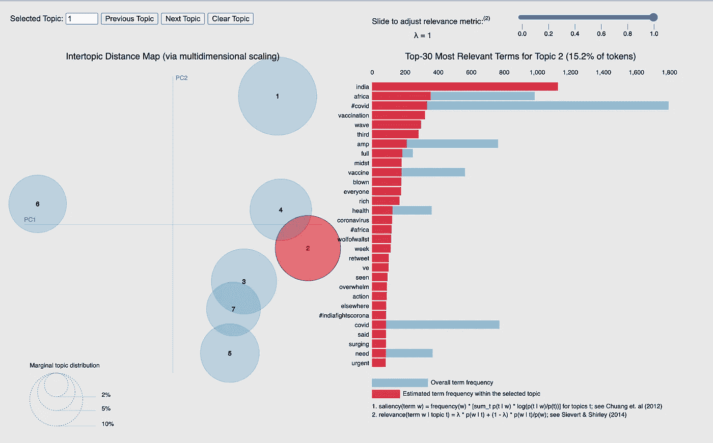

通过 LDA 执行的主题建模的可视化

# 情感分析

```
**# Import the libraries**
import tweepy
from textblob import TextBlob
from wordcloud import WordCloud
import pandas as pd
import numpy as np
import re
import matplotlib.pyplot as plt
plt.style.use('fivethirtyeight')
```

***“情感分析*** *:对一段文字中所表达的观点进行计算识别和分类的过程，尤其是为了确定作者对某一特定话题、产品等的态度。是积极的，消极的，还是中性的。”—牛津英语词典*

我们将建立一个模型，可以分析我们预处理的推文，并能够判断推文背后的情绪。

```
df = pd.DataFrame(columns=['clean_text', 'polarity'])
df['clean_text'] = tweets['original_text']
df['polarity'] = tweets['polarity']
```

我们首先创建一个包含纯文本和极性列的新数据框。

```
def text_category(p):
  if p > 0:
    return "positive"
  elif p < 0:
    return "negative"
  else:
    return "neutral"df["polarity"] = df["polarity"].apply(text_category)
df = df[df['polarity'] != 'neutral']
```

这里，我们使用 text_category 函数将极性从 float 转换为 category 数据。然后，我们删除了中性极性的推文。这将允许我们创建一个模型，将推文分类为正面或负面。

这里，我们首先构建一个名为 scoremap 的列。它将正极性映射为 1，负极性映射为 0。然后我们将输入数据(cleaned_text)和输出数据(score_map)分离为(X，y)。最后，在将数据分成训练数据和验证数据之后，我们使用函数 train_and_showscore 来训练模型。

**结果:**训练准确率为 1.0，验证准确率为 0.96。这表明模型过度拟合。考虑到我们在数据探索部分的数据中发现的流程，这是意料之中的。

# 细流

[Streamlit](https://streamlit.io/) 是一个开源的 Python 库，可以轻松创建和共享漂亮的定制 web 应用程序，用于机器学习和数据科学。在这里，我们通过使用 Streamlit 构建一个 web 应用程序来完成我们的工作。

下面是创建存储 Pandas 数据框的表的模式。有用于在 MySQL 数据库中存储 clean_data.csv 和在文件夹 [mysql_and_streamit](https://github.com/eandualem/Twitter-Data-Analysis/tree/main/mysql%20and%20streamit) 中创建 Streamlight web app 的类。这是来自网络应用的一些页面。

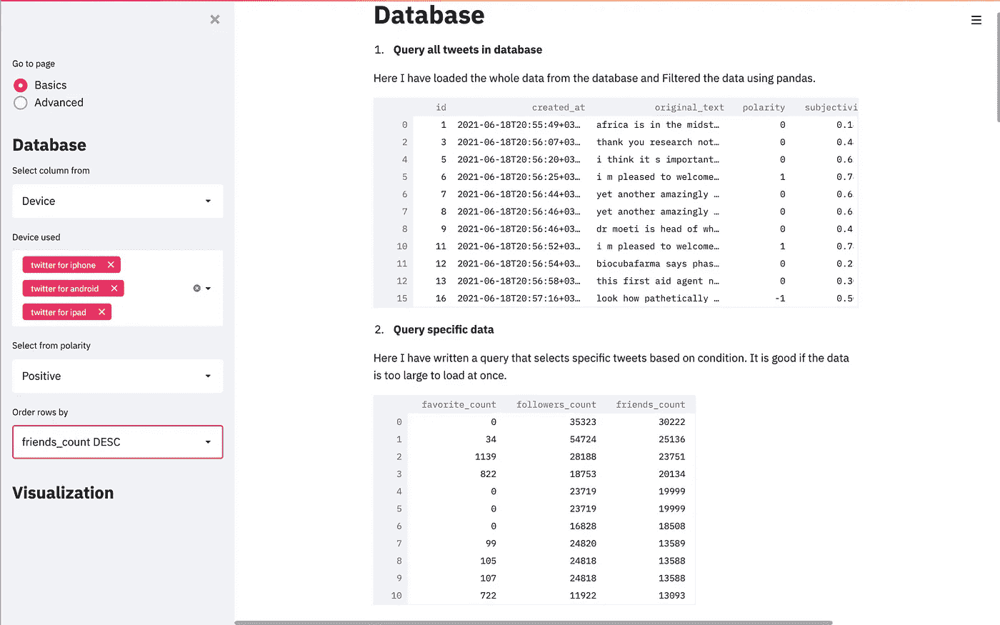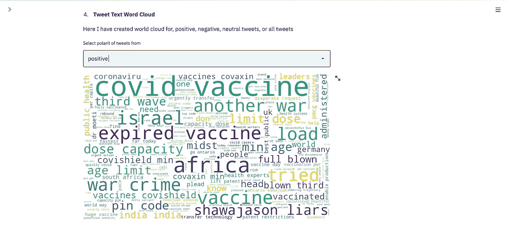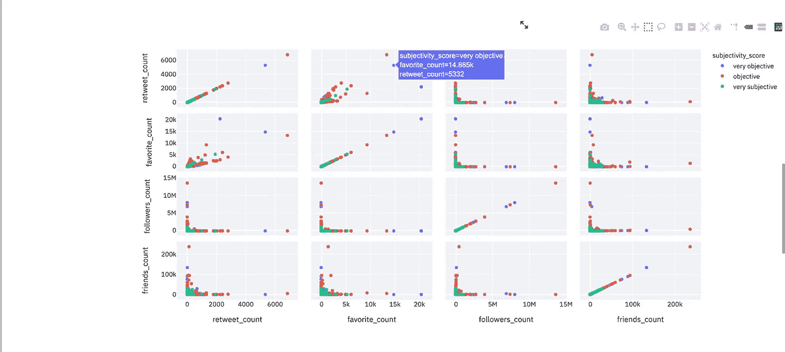

[1]:谷歌。机器学习中的连续交付和自动化管道。[https://cloud . Google . com/architecture/mlops-continuous-delivery-and-automation-pipelines-in-machine-learning](https://cloud.google.com/architecture/mlops-continuous-delivery-and-automation-pipelines-in-machine-learning)

[2]:费德里科·帕斯夸尔(2019 年 9 月 26 日)。主题建模:导论。[https://monkey learn . com/blog/introduction-to-topic-modeling/](https://monkeylearn.com/blog/introduction-to-topic-modeling/)。

[3]:哈什特·泰亚吉。什么是 m lops——入门必备知识。[https://towards data science . com/what-is-mlops-everything-you-must-know-to-get-started-523 f 2d 0 b 8 BD 8](https://towardsdatascience.com/what-is-mlops-everything-you-must-know-to-get-started-523f2d0b8bd8)。