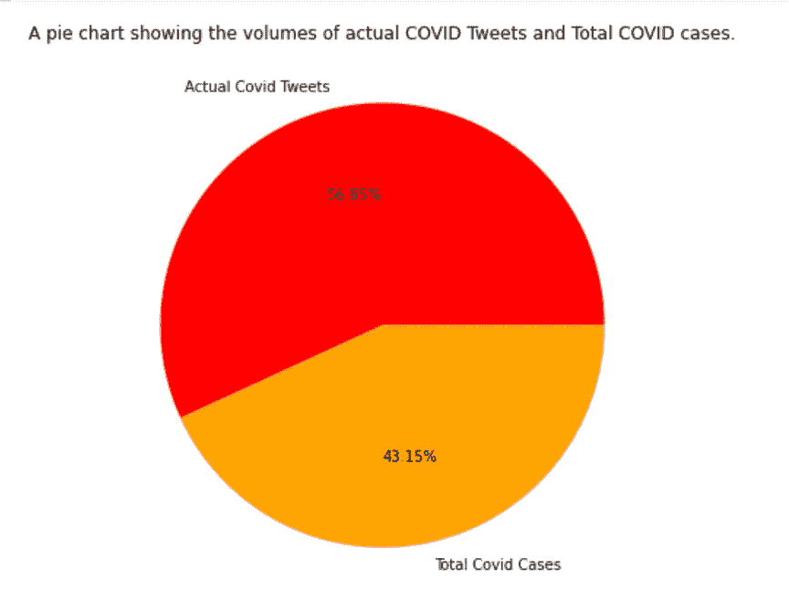

# 我们可以用推特来追踪美国由 COVID 引起的失业吗？

> 原文：<https://medium.com/analytics-vidhya/using-twitter-to-track-covid-caused-unemployment-in-the-usa-9f32d14d2c40?source=collection_archive---------6----------------------->

## 数据科学报告

## 3 个独立数据集的比较分析

作者:道格·里齐奥、特里沙拉·苏亚万什、穆罕默德·叶海亚和瓦伦·加尔格

新冠肺炎，新型冠状病毒。2019 年 12 月底首次在中国武汉发现病毒爆发，这种具有肺炎样症状的神秘新疾病迅速蔓延到 Mainland China 其他地区，[最终感染了世界各地的每个主要人口中心](https://www.ajmc.com/view/a-timeline-of-covid19-developments-in-2020)。截至 2021 年 5 月 12 日，世卫组织已报告全球新冠肺炎[确诊病例 159319384 例，其中死亡 3311780 例。在美国，COVID 病例总数最多的国家为 32，424，637 例，估计迄今已有 576，814 人死亡。](https://covid19.who.int/)

在全球范围内，冠状病毒疫情留下了国际航空旅行限制、国家封锁、企业关闭和数百万人死亡的遗产。在个人层面上，它拆散了朋友和家庭成员，结束了我们所爱的人的生命，并影响了生活本身的许多方面——改变了从我们如何在家里度过时间到我们如何在日常工作中工作的一切。

事实上，对许多人来说，在新冠肺炎事件之后，家庭生活和工作生活这两个以前分开的方面现在已经完全融合在一起了。随着几乎所有可以想象到的行业的人都被推到社交距离、个人隔离和在家工作的做法中，工作本身的性质已经被冠状病毒完全改变了——甚至可能是永久性的。然而，那些能够保住自己工作的人，即使是在这种孤立无援的状态下，也是幸运的。在疫情的早期，只有最重要的工人被允许继续工作，大量从事非重要或面向社会的职业的工人立即发现自己失业或就业不足，因为政府强制封锁和对感染的恐惧大大降低了对他们服务的需求。

COVID 对美国失业率的打击尤为严重。联邦政府缺乏有效的财政救济，这确保了只要冠状病毒继续存在，遭受冠状病毒影响的无数企业和独立承包商将继续挣扎。前所未有数量的美国公司缩减业务或完全关闭，2020 年大约有 500 家美国公司申请破产。这些关闭导致美国失业率飙升，[失业率一度高达 16%，相当于美国有 2050 万人失业。](https://www.pewresearch.org/fact-tank/2020/06/11/unemployment-rose-higher-in-three-months-of-covid-19-than-it-did-in-two-years-of-the-great-recession/)

现在，随着大量的人失业，被困在家里，对世界的现状感到沮丧，互联网的活动出现了巨大的增长。[冠状病毒后，社交媒体的使用尤其显著增加，据估计，仅在 2020 年 3 月，美国的社交媒体使用就增加了 32%。](https://www.statista.com/statistics/1106498/home-media-consumption-coronavirus-worldwide-by-country/)许多人涌向 YouTube、Instagram、脸书和 Twitter 等网站，相互交谈，而不是面对面的接触，这些社交媒体平台成为表达我们这个乱世所有问题的重要工具——在疫情期间，它们成为关于政治辩论、个人 COVID 更新和对工作(或缺乏工作)的抱怨等主题的公共对话的重要门户。

甚至在冠状病毒之前，社交媒体平台就已经开始成为对全球流行的时事和热门讨论进行数据分析的宝贵资源。在后 COVID 时代，在这些系统中流通的公开可用数据甚至更加巨大。现在，考虑到我们越来越多的知识唾手可得，一个有趣的问题出现了— **我们究竟如何实现这项新技术产生的信息？**

# 关键想法

**本项目的关键理念或主要目标是比较来自美国特定地区的 COVID 案例、失业率和两个主题的 Twitter 提及率的多种数据来源，以回答以下三个问题:**

1.  我们可以使用社交媒体数据来跟踪新冠肺炎和失业率吗？
2.  如果关于这些问题的推文实际上与现实世界中的比率相对应，我们可以使用这些数据来预测未来的失业率或 COVID 病例和死亡率吗？
3.  最重要的是，我们能利用这些数据来帮助 COVID 导致的失业受害者吗？如果美国政府为因疫情而失业的人提供援助的资金有限，我们能否分析冠状病毒病例、失业率和社交媒体提及这两个主题的交集，以评估该国哪些地区受到的影响最大？我们能否告知政府，他们稀缺的资源将被最佳分配到哪里，并抵消新冠肺炎对那些受影响最大的人失业的影响？

# **导入库**

由于我们的大部分项目是在名为 Jupyter Notebooks 的开发环境中完成的，我们使用的主要编程语言是 Python，我们必须在下载任何数据之前将大量 Python 库导入到笔记本中。下面是我们使用的库的列表，以及它们的功能:

*   **熊猫**:用于将原始数据转换成可操作的数据帧
*   **JSON** :用于处理 JavaScript 对象符号文件(用于 Twitter 数据)
*   **PyDrive** 和 **Google** :用于使用 Google 工具
*   **NLTK** :自然语言工具包，用于文本处理
*   **Numpy** :用于处理数组和形成计算
*   **Plotly** 、 **Matplotlib** 和 **Seaborn** :用于可视化数据

因为我们的项目还包含一些不同的主题(新冠肺炎案例、失业率以及关于这两者的社交媒体讨论)，我们必须从几个不同的来源获得数据。

# **疾控中心数据**

过去一年有关新冠肺炎病例的数据来自美国国家公共卫生机构疾病控制和预防中心的网站。CDC 网站上有一个新冠肺炎病例和死亡的大型数据集，可以通过 JSON API 访问。该数据集报告了自 1 月 22 日以来 2020 年每一天美国所有 50 个州和 10 个不同的美国城市或地区(如纽约市、华盛顿 DC、波多黎各和美属维尔京群岛)的情况。

来自 CDC 的数据集包含大约 24，000 行 COVID 统计数据，其中 15 列按日期、州名、一段时间内的总病例数、一段时间内的总死亡数、每天的新病例数和每天的新死亡数等项目进行标记。其中一些栏目还包含无关或不完整的信息，如第二个日期和“可能”与“确诊”病例和死亡。因为这些列中的许多字段都有空值，所以它们对分析没有用，需要删除才能正确绘制数据。一旦数据集通过 API 从 CDC 中提取出来，它就被转换成 Pandas 数据帧，进行清理和组织，然后转换成. CSV 文件以便长期存储。

疾病控制中心关于 COVID 比率的数据

# **BLS 数据**

[我们的第二个数据来源是美国劳工统计局或 BLS 的失业统计数据。](https://www.bls.gov/charts/state-employment-and-unemployment/state-unemployment-rates-animated.htm)尽管由于 COVID 在 2020 年的传播，我们只能收集该年的数据，但我们决定收集 2018 年至 2021 年前几个月的美国失业统计数据，以从更广泛的角度了解该国的就业情况如何随着时间的推移而变化。如果 2018 年和 2019 年是相对“正常”的失业年，我们可以通过查看这三年之间的差异，更好地衡量 COVID 对 2020 年失业率的影响。

然而，并非 BLS 网站上的所有数据集都可以通过 API 获得，所以我们必须通过 Python 函数直接从 HTML 页面下载这些信息。该数据集最初还包含 10 年的季节性调整州失业率，而不是我们需要的 3 年(零 1 个月)，因此我们必须再次将数据转换为 Pandas 数据框架，这一次删除了 7 年的不必要数据，对其进行清理和组织，并将其转换为. CSV。该数据集的数据清理还包括使用 melt 函数将数据框架从宽格式转换为长格式，以便于可视化。

BLS 失业率数据

# **推特数据**

最难收集的数据是来自 Twitter 的数据。我们最初的目标是使用 Python 库 Tweepy 搜索 Twitter 的全部推文档案，过滤掉过去三年的所有推文，提到与失业和疾病相关的关键词，如 COVID，标记特定的地点，以及美国用户的推文。为了访问这个庞大的社交媒体帖子档案，我们所有的小组成员都需要注册 Twitter 开发者账户，并首先获得公司的批准。然而，我们很快意识到[Twitter API 对用户在特定时间窗口内可以请求的 tweets 数量施加了严格的速率限制](https://developer.twitter.com/en/products/twitter-api/premium-apis)，我们无法按预期执行搜索。

幸运的是，有其他方法可以获得大量的推文，尤其是当它涉及新冠肺炎的时候。 [CrisisNLP 是一个致力于冠状病毒](https://crisisnlp.qcri.org/covid19)等危机信息主题研究的网站，它在 Twitter 上提供了大量关于该疾病的数据——其 GeoCoV19 数据集包含数亿条与 COVID 相关的推文，基于大约 800 个与新冠肺炎相关的不同标签。然而，这个网站上的数据有其自身的局限性，因为推文的范围仅从 2020 年 2 月 1 日到 5 月 1 日。此外，由于 Twitter 的服务条款不允许将完整的推文数据集分发给第三方，如 CrisisNLP，网站上的所有推文都是“脱水的”，这意味着它们以唯一推文 ID 的形式包含在纯文本文件中，作为 Twitter 存档中推文的引用，而不是推文本身。[一个叫做“hydrator”的桌面应用程序](https://github.com/DocNow/hydrator)需要将这些来自 Twitter 的推文“再水合”成完整的 JSON 数据。通过 hydrator，这些 tweet IDs 允许我们检索所有 tweet 元数据，包括 tweet 的文本。

水合器程序

尽管数据集只有 3 个月的推文，但收集所有的推文非常耗时。首先，脱水的推文都被分成。TSV 文件，代表一个月中某一天所有与 COVID 相关的推文，每个文件包含几十万到几百万个推文 ID，具体日期视情况而定。在单独下载完所有这些文件后，需要进行一点额外的处理，删除不必要的标题和列，并将文件转换为。水合器可读的 CSV 文件。虽然 hydrator 是它自己的实体，但它仍然需要通过用户的开发者帐户访问 Twitter API，还必须处理 API 速率限制，迫使它每 15 分钟暂停一次。我们输入到程序中的每个连续文件的水合时间也显著增加——2 月 1 日的文件只有大约 65 万条推文，水合需要大约 2 个小时，而 3 月和 4 月的所有文件都有 100 万到 600 万条推文，需要一整天才能完成处理。

此外，hydrator 试图提取的许多推文在被 CrisisNLP 存档后被用户删除，而 2 月 1 日的数据集有 650，000 个推文 ID，但只检索到 400，000 个。除了处理 Twitter 数据的无尽挑战，通过水合作用创建的 JSON 文件是巨大的，从 10-30 或更多 GB 的 RAM 不等，并经常导致我们的计算机空间不足。这些推文的大量相关数据是数据集只提供脱水推文 ID 而不是真实信息的另一个原因——包含一系列数字(ID)的纯文本文件比包含数百万推文及其所有元数据的 JSON 文件更易于上传到网站或从网站下载。同样，我们处理巨大的 JSON 文件的唯一方法是将每个 JSON 文件转换成更小的文件。CSV，然后在第二天的推文补水之前删除它。

crisis NLP“geo cov 19”推文

在 Google Drive 中发布文件

最终，由于时间和空间的限制，我们只能每隔一天发一次推文。由于数据的巨大规模，我们需要使用 Google colab 来使我们所有的队友都能够访问它。下面显示的图像序列详细描述了二月份的文件夹，以及用于遍历这些文件的几行代码。

导入库

访问谷歌文件

遍历整个文件夹

# **数据清理和组织**

一旦我们下载了各种数据集并将其转换成数据帧，我们就必须清理和组织它们。这是一种被称为**维度缩减**的数据科学技术，可以通过简化数据集并将其信息限制为与我们的使用最相关的东西来定义。在这种情况下，我们执行的维度缩减涉及将数据限制在特定的时间范围内，并且只隔离感兴趣的位置，例如美国各州。

减少来自疾病预防控制中心的 COVID 数据和来自 BLS 的失业统计数据的维度是简单的任务，因为这两种资源都侧重于主要政府机构收集的有组织的数字信息。这些数据集中唯一需要移除的要素是不符合美国各州条件的位置(如波多黎各)以及包含空值或不必要信息的额外列。

因为这两个数据集中的数据是由记录它们的州来定义的，所以我们也需要根据州来减少 CrisisNLP 中的 Twitter 数据。然而，事实证明使用 tweets 更具挑战性。我们遇到的一个复杂问题是，twitter 有几个位置参数可用于每条推文。第一个是“坐标”参数，包含发布推文的人的精确 GPS 坐标，例如 40.741895，-73.989308。第二个是“place”参数，它包含用户在提交时登记的特定地点的名称，比如纽约州纽约市。第三个参数与特定的 tweet 无关，而是一个“用户位置”,每个 Twitter 用户都可以选择在他们的个人资料中显示。在 2020 年 2 月 1 日提取的 412，239 条与 COVID 相关的推文中，只有 117 行数据包含坐标信息，2991 行包含位置数据，而 281，412 行包含某种用户位置。所有 117 条有坐标数据的推文也显示了地点参数的信息，大多数有地点参数的推文也显示了用户位置。因此，我们认为坐标和位置参数对于分析都是不必要的，我们选择只使用用户位置来识别来自特定区域的用户。

尽管个人资料中列出的一些用户位置是 Twitter 自己提供的官方位置，但许多实际上是由用户直接填写的。由于用户可以在自己的个人位置书写，其中许多不仅包含美国特定州的标题或缩写，还包含额外的数据，如表情符号、停用词或其他国家的名称，我们必须从数据集中删除这些数据。

定义美国各州的名称

虽然这很容易，但我们接下来要做的是将用户位置限制在美国各州。我们的第一个想法是简单地搜索所有用户位置包含字符串“USA”的推文，以隔离来自美国的推文，但许多位置只显示城市和州名，而没有国家代码，如“阿拉巴马州蒙哥马利”大量用户也没有在他们的个人资料中使用官方的 Twitter 位置，而是选择像“阿拉巴马”这样的单数州名一些用户使用诸如“Montgomery，AL”之类的带有首字母缩写的名称，而不是完整的州名，其中许多名称既有大写形式也有小写形式。因此，我们需要通过全名和缩写来搜索每个州，以最大化我们的位置结果。

组合美国各州的名称

然而，这也不像听起来那么简单，因为许多州的缩写存在于其他地区的名称中。虽然列出所有外国国家的列表并将其从美国州数据库中删除对某些地区有效，但某些国家的名称存在于某些州的名称中，如印度、墨西哥和格鲁吉亚。这些不能轻易过滤掉。此外，一定数量的用户将多个地方的名称作为他们的用户位置，这表明他们住在两个地方。类似地，还有其他用户包括具有旅行表情符号的用户位置，该旅行表情符号暗示从一个到下一个的永久重新定位。出于类似的目的，一些用户还会使用国旗或地球表情符号。在这些实际位置指示器的顶部，一些用户写下带有停用词或一般术语的短语。搜索最常见的停用词并将其从数据库中删除可能是解决这一问题的一种方法，但许多短停用词也存在于真实地名中。搜索某些州首字母缩略词，如 LA、or 和 AR，也会导致需要过滤掉的模糊位置。然而，最终，无论我们如何努力地过滤掉额外的数据，我们的搜索最终撒下了比我们预期更大的网，而且我们做的一些额外的清理工作涉及到人工识别不正确的位置。

为每个文件夹中的每个文件在 Tweet 用户位置中搜索美国各州

在按位置对推文进行分类后，我们还想进一步细分推文，首先是推文的完整列表，其次是只包含失业相关术语的推文列表，如“失业”、“工作”、“工作”等。应该重申的是，整个 Twitter 数据集包含提到新冠肺炎的推文，因此主数据集的任何子集也将与 COVID 相关。然而，通过这一小节，我们仍然可以试图理解关于冠状病毒的公共话语中有多少是关于失业的对话。一旦实现了这个目标，我们就可以开始计算 COVID 推文的总数与仅与就业相关的推文的数量，以供将来分析。

打印每天每个州的每条推文的数量

# **可视化和比较数据**

在我们清理和组织了数据之后，我们可以开始可视化和比较这些集合。

美国每月失业率(2018–2021 年)

我们绘制的第一个图表是我们最简单的数据集，来自 BLS 的失业数据。通过下面的可视化，我们可以看到整个美国从 2018 年到 2020 年所有三年的总失业率，包括 2021 年的第一个月。虽然 2018 年 1 月至 2020 年 2 月的失业率略有下降，但与去年相比，2020 年 3 月的失业率略有上升，2020 年 4 月冠状病毒在美国造成影响时，失业率飙升。幸运的是，自那以后失业率一直在下降，到 2021 年 1 月，失业率已经非常接近原始水平。

各州平均失业率(2018-2020 年)

下一张图显示了 2018 年、2019 年和 2020 年三年间所有州的人均失业率。我们决定在这个图表中包括美国列出的每个地点，作为一个更有趣的比较基础-虽然内华达州和阿拉斯加州是邻近各州中失业率最高的，但在过去几年中，与美国相关的平均失业率最高的地区是波多黎各。2017 年 9 月，飓风玛丽亚造成了严重破坏。然而，有趣的是，波多黎各过去 3 年 10%的平均失业率在随后的 2020 年图表中被其他州的失业率超过。

各州平均失业率(2020 年)

内华达州再次以超过 13%的失业率高居榜首，而夏威夷以 12%的失业率几乎同样糟糕，加利福尼亚州的失业率刚刚超过 10%。仅根据这些数据很难得出一系列可靠的结论，但我们可以做出的一个可能的假设是，那些经济体系主要基于旅游业或娱乐业的州将受到封锁的最大影响，导致许多企业损失利润，许多人最终失业。

设置地块

接下来，上面显示了我们如何导入 Python 库 matplotlib 和 seaborn，然后创建一个图来可视化从 2 月到 5 月初与 COVID 相关的 tweets 子集的常规 COVID 相关 tweets 的总数。随着时间的推移，推文的数量会增加，虽然我们 5 月的数据集不完整，但我们可以看到，整个月的推文数量可能会继续增加。佐治亚州的大量推文也可能是一个错误，因为另一个国家有相同的名称，伊利诺伊州的数字也可能是如此，这可能是因为其州首字母缩写“in”在其他用户位置被用作频繁的术语。不足为奇的是，纽约、加利福尼亚和得克萨斯，美国人口最多的几个州，也包含最多的推文。

每个州的 COVID 推文总数(2 月至 5 月)

各州与失业相关的 COVID 推文数量(2 月至 5 月)

这两个条形图显示了我们的 tweet 总数之间的差异的另一个细分。虽然所有 COVID 推文的数量都在数百万条以下，但 COVID 推文中提到失业相关术语的子集约为 4 万条。随着时间的推移，我们也更清楚地了解到所有与 COVID 相关的推文的增长情况，随着新冠肺炎病毒的继续传播，每个月都在稳步增长。尽管考虑到所有 COVD 相关推文的发布率，3 月份与失业相关的推文数量也远高于预期，但根据 BLS 的数据，失业率最高的月份是 4 月。会不会是在实际失业率开始上升之前，就在冠状病毒开始传播的时候，人们对失业的担忧在社交媒体上浮出水面？

COVID 推文总数(左)，与失业相关的 COVID 推文(右)

下面的饼状图是推文的另一个细分，显示在美国所有与 COVID 相关的推文中，提及失业的推文数量占 4.4%。这意味着，在美国，每 23 条与 COVID 相关的推文中，就有近 1 条提到了就业。虽然数量不多，但意义重大，它显示了疫情对就业的切实影响，以及网上关于失业的讨论。

与失业相关的总 COVID Tweets 与 COVID Tweets

进一步比较这些数据集，我们测量了美国所有与 COVID 相关的推文与前 5 个州的 COVID 案例总数，推文数量最高或案例数量取决于月份。尽管相对缺乏 COVID 病例，但加州在 2 月份有最多的 COVID 推文。然而，到了 3 月份，加州的社交媒体提及率处于较低水平。与此同时，纽约的病例总数远远超过了社交媒体对该疾病的提及。到 4 月份，COVID 推文开始随着 COVID 病例总数的增加而增加——如果我们可以访问当月的所有推文，这一趋势可能会在 5 月份继续。

每个州的 COVID 病例和死亡总数与 COVID 推文总数之比

COVID 案例总数与 COVID 推文总数

这是一个饼图，显示了所有 COVID 推文的数量与所有 COVID 案例的数量。令人惊讶的是，这两个数字大致相等——这意味着美国每一个患有 COVID 的人，至少也有一条关于 COVID 的推特。然而，值得注意的是，Twitter 上关于冠状病毒的对话发生在该病毒实际开始感染美国人之前。如果我们能够获得更多月份的 COVID 病例数据，这些数字很可能会更加偏向病例数。

虽然我们不确定它对从我们的数据中提取更多见解有多大帮助，但我们也想尝试实现 K-Means 聚类，作为探索新获得的数据科学技术的一种方式。在这种情况下，聚类是在总 COVID 案例、总 tweets 和失业 tweets 的组合上完成的。每个州被聚类成一个由相似数量的案例和推文定义的组，我们使用的算法依赖于欧几里德距离作为相似性度量。这是对该数据集的描述，下面我们使用了 Elbow 方法来帮助找到要应用的最佳聚类数。根据在 4 处弯曲的左图，数据将在四个集群之间最佳分布。右边的图表显示了四个集群及其各自的案例和 tweet 计数。

肘方法(左)，群集质心(右)

针对所有 COVID 案例和所有 COVID 推文的聚类分析

这里的图显示了集群的实际分布。虽然纽约是最小的集群，但与其他州相比，它实际上是推特和案例数量最多的州，这也是它脱颖而出的原因。与此同时，最大的聚类显示了许多其他州，相比之下，这些州的 COVID 病例和推文要少得多。然而，应该提到的是，K-Means 聚类质心在很大程度上受离群点支配，并且如果算法不能检测数据中的异常，则状态可能因此被放入错误的聚类中。K-Means 聚类对这个项目有多大用处值得怀疑，但是值得一试。

聚类饼图(左)，聚类状态(右)

这个项目的最后一个实验是看看我们是否可以使用机器学习过程来预测未来的就业率。我们使用的训练函数是 TRAINLM，这是一个根据 Levenberg-Marquardt 优化更新权重和偏差值的网络训练函数。

基于神经网络预测的结果，我们看到几乎 35 个状态落在±10%的范围内，这几乎是 70%准确的。预测是基于我们的神经网络的 3 层。与中期报告(具有 2 层)相比，这是我们的机器学习模型中的可比较的改进，其中有 38 个状态落在+-15%的范围内。

作为验证我们发现的一个例子，我们选择了加利福尼亚，就实际病例数和失业率而言，它是 COVID 打击最严重的州之一。与“失业”相关的推文数量从 2020 年 2 月的 1020 条，到 2020 年 3 月的 3741 条和 4 月的 4049 条不等。BLS 报告的失业率分别为 4.3%、4.5%和 16%。我们计算出，2020 年 5 月，大约有 3897 条来自“CA”的失业推文。因此，我们预计 BLS 的实际失业率应该会下降。通过我们的机器学习模型，我们可以看到预测率也下降到 15.4%，这证明了我们的模型的准确性。

也就是说，我们的数据只覆盖了几个月的范围，这可能不足以产生对全州失业率等统计数据的长期预测，而且我们只能预测一个月的数据未来，而这已经是一整年前的事情了。换句话说，我们无法对任何事情做出新的预测。

机器学习过程

# 限制

不幸的是，这个项目经历了许多限制——部分是由于某些数据集的不可预见的性质，也由于项目目标的巨大野心！

首先，我们的初衷是将 CrisisNLP 的 GeoCoV19 推文中提到冠状病毒的数据集与我们自己从 Twitter 存档中收集的提到失业的推文进行比较。然而，由于 Twitter 的 API 对收集旧推文的严格限制，我们被迫放弃这一想法，转而从 COVID 推文中提取失业推文的子集。这意味着我们无法真正衡量关于失业的推文是如何随着时间的推移而上升的——只能衡量失业话题是否在关于新冠肺炎的推文中上升。

Twitter 数据带来的另一个限制是，精确定位大量特定用户位置面临许多障碍，特别是如果这些地方是美国的州。虽然我们可以选择只收集以州的全名为特征的推文，而不是在我们的搜索中包括它们的缩写，但这将大大减少我们数据集中推文的总数，产生不准确的结果。另一方面，包含这些首字母缩写也意味着我们无意中收集了用户位置与州无关的推文。

处理来自 Twitter 等社交媒体平台的数据也非常耗时，因为数据集非常大。实时提取一天的推文可能需要一天的时间，而从一天到另一天将数百万条推文投影到一个图表上对我们的计算机来说太多了。这是我们选择按月而不是按天来衡量结果的一个原因，尽管我们可以访问 COVID 案例和推文的每日数据。因为组合两个或更多不使用相同参数的数据集会导致可用数据的更大减少，所以我们可以设计的可视化数量受到了限制。

最重要的是，衡量每个州的推文总数或 COVID 案例数，而不与人均数据进行比较，这不是很有见地。该项目将大大受益于第四个数据集，该数据集反映了一段时间以来每个州的人口情况。然而，虽然我们确实试图在项目结束时获得这些信息，但当时项目的规模远远超出了我们的预期，并且在数百甚至数千人死于 COVID 的情况下跟踪每个州的每日人口计数也不是一件容易的事情。

# 结论

由于这些限制，很难准确地衡量我们对项目的预期。将多个数据集相互比较并没有产生我们期望获得的洞察力。然而，尽管我们遇到了挫折，我们还是从这个项目中学到了一些东西。

我们验证的一个假设是，在 Twitter 上关于新冠肺炎的提及率随着新冠肺炎在美国的实际比率而上升——尽管在第一个月之后，COVID 病例总数超过了社交媒体上关于他们的谈话。我们预计它们会以类似的速度增长，但事实并非如此，这显示了有多少人感染了这种疾病。

含有失业相关词汇的推文包括了相当数量的提到新冠肺炎的推文，接近 5%。因此，虽然失业可能不是人们在考虑冠状病毒时的主要话题，但它意义重大。众所周知，疫情对就业产生了巨大的影响，其中一些影响也反映在社交媒体上。

最大和人口最多的州，如纽约和加利福尼亚州，COVID 病例数量最多，总推文数量最多，与失业相关的推文数量最多。这并不奇怪，因为他们人口众多，但是，正如我们之前所说，如果没有精确的人均数据，这些值就失去了一点意义。

虽然夏威夷和内华达等州在 2020 年全年显示出极高的失业率，但这并不意味着疾病对它们的打击更大，至少不是直接的。如果没有更多的研究，我们最初的“旅游和娱乐”假设无法得到验证。这可能是因为这些经济体中有太多的人口是流动的，疫情导致许多人离开到其他国家，导致人们留下来传播疾病的机会更低。另一方面，正如我们在前几年的图表中看到的，内华达州的失业率已经是全国最高的之一，所以也许 COVID 没有像我们想象的那样提高失业率。此外，根据对更多外部来源的进一步研究，结果表明[夏威夷的人均 COVID 病例总数是美国所有州中最低的](https://www.beckershospitalreview.com/public-health/states-ranked-by-confirmed-covid-19-cases-july-1.html#:~:text=North%20Dakota%20has%20the%20most,by%20U.S.%20states%20and%20counties.)，与其高失业率相比，这一统计数据听起来自相矛盾。北达科他州也是 COVID 打击最严重的州，至少就总病例数而言，这是一个事实，如果不计算其实际人口，我们就无法观察到这一点。

这恰恰说明了衡量几个因素对整个国家的健康和繁荣的影响有多难。事实证明，仅仅比较图表上的一系列数字是不够的，尤其是如果它们来自不同的数据来源，代表完全不同的事物。即使两个数据集以某种方式相互关联，也需要大量的操作才能使它们在一起有意义。

所以，为了回答我们在文章前面提出的问题:

1.  *我们能使用社交媒体数据来追踪新冠肺炎和失业率吗？* **是的，虽然社交媒体并不是对现实的完全反映，但互联网用户也不是完全可靠的信息来源，消除噪音、只隔离相关的区域数据需要大量的提炼。**
2.  *如果关于这些问题的推文实际上与现实世界中的比率相对应，我们可以使用这些数据来预测未来的失业率或 COVID 病例和死亡率吗？*
    **是的，但是预测遥远的未来需要更多的数据。**
3.  我们能利用这些数据来帮助 COVID 导致的失业的最大受害者吗？
    **也许吧。这个项目肯定是有潜力的，但是截至目前，结果多少还没有定论。同样，需要更多数据！**

# 参考

 [## 2020 年新冠肺炎发展时间表

### 感恩节后几周，美国部分地区的病例又开始激增；在…中也可以看到同样的效果

www.ajmc.com](https://www.ajmc.com/view/a-timeline-of-covid19-developments-in-2020)  [## 世卫组织冠状病毒(新冠肺炎)仪表板

### 世界卫生组织冠状病毒疾病形势报告显示官方每日新冠肺炎病例和…

covid19.who.int](https://covid19.who.int/)  [## 新冠肺炎三个月的失业率比大萧条的两年都要高

### 新冠肺炎病毒的爆发及其引发的经济衰退使美国失业人数增加了 14%以上

www.pewresearch.org](https://www.pewresearch.org/fact-tank/2020/06/11/unemployment-rose-higher-in-three-months-of-covid-19-than-it-did-in-two-years-of-the-great-recession/)  [## 随着申请数量继续攀升，2020 年美国企业破产数量接近 500 家

### 冠状病毒危机期间，美国的企业破产持续增长，24 家公司加入了 2020 年的名单…

www.spglobal.com](https://www.spglobal.com/marketintelligence/en/news-insights/latest-news-headlines/us-corporate-bankruptcy-count-in-2020-nears-500-as-filings-continue-to-climb-60249430)  [## 按国家/地区统计的新冠肺炎期间媒体使用情况

### 2020 年 3 月进行的一项全球调查显示，冠状病毒对家庭媒体产生了直接影响…

www.statista.com](https://www.statista.com/statistics/1106498/home-media-consumption-coronavirus-worldwide-by-country/)  [## 一段时间内美国各州新冠肺炎病例和死亡数|数据|疾病控制和预防中心…

### 编辑描述

data.cdc.gov](https://data.cdc.gov/Case-Surveillance/United-States-COVID-19-Cases-and-Deaths-by-State-o/9mfq-cb36)  [## 经季节性调整后，过去 10 年的州失业率

### 将鼠标悬停在某个状态上以查看数据。将鼠标悬停在图例项上以查看类别中的状态。资料来源:美国劳动局…

www.bls.gov](https://www.bls.gov/charts/state-employment-and-unemployment/state-unemployment-rates-animated.htm)  [## 十二岁。API - Twitter API v1.1 参考- tweepy 4.0.0-alpha 文档

### 这个类为 Twitter 提供的 API 提供了一个包装器。该类中提供的函数如下…

docs.tweepy.org](https://docs.tweepy.org/en/latest/api.html?#API.search)  [## Twitter 高级 API-Twitter 开发者

### Twitter premium APIs 将我们企业 API 的可靠性、稳定性和可访问性带给了我们更广泛的开发者…

developer.twitter.com](https://developer.twitter.com/en/products/twitter-api/premium-apis)  [## 危机

### GeoCoV19 是一个大规模的 Twitter 数据集，包含超过 5.24 亿条多语言推文(截至 5 月 1 日)。的…

crisisnlp.qcri.org](https://crisisnlp.qcri.org/covid19)  [## DocNow/水合器

### Hydrator 是一个基于电子的桌面应用程序，用于水合 Twitter ID 数据集。Twitter 的服务条款不…

github.com](https://github.com/DocNow/hydrator)  [## 按新冠肺炎病例排名的州:5 月 5 日

### 在美国各州中，北达科他州每 10 万人中确诊的新冠肺炎病例最多，而夏威夷州每 10 万人中确诊的病例最多

www.beckershospitalreview.com](https://www.beckershospitalreview.com/public-health/states-ranked-by-confirmed-covid-19-cases-july-1.html#:~:text=North%20Dakota%20has%20the%20most,by%20U.S.%20states%20and%20counties)