# 使用可视化算法(VAT 和 iVAT)评估聚类趋势

> 原文：<https://medium.com/analytics-vidhya/using-visualization-algorithms-vat-ivat-to-assess-cluster-tendency-a89251a2400e?source=collection_archive---------0----------------------->

在描绘主题之前，要“明显地”确定数据集中有聚类。

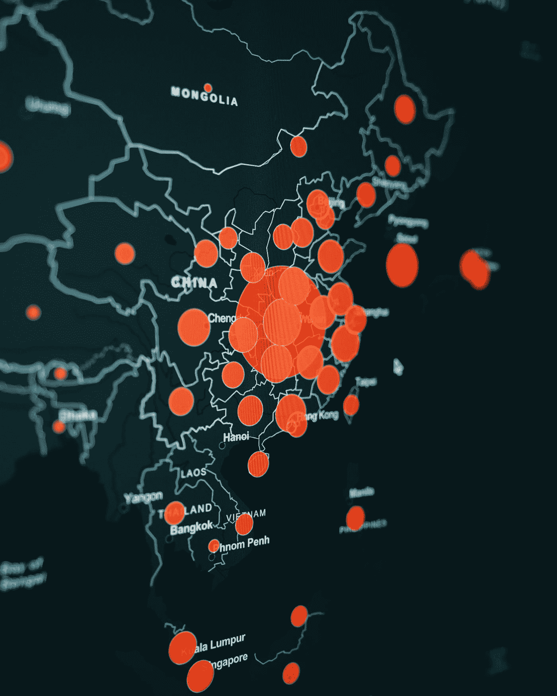

[粘土银行](https://unsplash.com/@claybanks?utm_source=medium&utm_medium=referral)在 [Unsplash](https://unsplash.com?utm_source=medium&utm_medium=referral) 拍摄的照片

通过从无监督的数据中发现主题，进行客户和受众细分等是做出基于证据的决策的经济有效的方式。但是，在数据集上进行聚类分析并做出决策时，首先不验证聚类是否确实存在；可能更具破坏性、更昂贵、代价更高。

在本文中，我们将解释如何使用两种可视化算法(VAT 和 iVAT ),在开始任何相关的聚类分析之前，评估 python 中无监督数据集的聚类趋势。

为了了解 VAT 和 iVAT 的不同领域，我们将介绍以下部分:

> ***1。集群趋势*的概念**
> 
> ***2。聚类趋势算法***
> 
> ***3。VAT 和 iVAT 算法*和**
> 
> ***4。如何使用 VAT 评估数据集的聚类趋势，以及 Python 中的 iVAT 测试***
> 
> ***5。结论***
> 
> ***6。*概要**

# 1.集群趋势的概念

聚类趋势是评估数据集是否可能存在聚类的过程。它旨在帮助我们回答这个关键问题——“这个数据集中有基于我们的研究问题的聚类吗？”

回答这个问题至关重要；因为它将决定是否有必要对数据集进行聚类分析(K-means、层次分析等)。

那么，我们该如何回答这个问题，或者说我们该怎么回答呢？

*简单的回答—我们部署“聚类趋势评估算法”*

# 2.聚类趋势评估算法

聚类趋势评估算法是机器学习方法，用于评估数据集是否可能存在聚类模式。进行这些评估有两种主要方法:也就是统计和视觉方法。统计方法的一个例子是霍普金斯测试，而视觉方法的例子是趋势的视觉评估(VAT)和改进的趋势视觉评估(iVAT)测试。

# 3.VAT 和 iVAT 算法

## 3.1.增值税(趋势的视觉评估)

VAT 是一种评估数据集聚类趋势的可视化方法。该算法指定可以在数据集中找到的聚类数，并通过沿正方形大小的地图的左对角线创建密集的黑色正方形来显示聚类(聚类层次结构)中是否存在现有的聚类。该算法通过创建观测值的最小生成树来工作，这些观测值之间的成对距离显示为地图上的黑色方块。

请注意-在极少数情况下，密集的黑色方块不会位于对角线上，特别是当地图不是正方形时(因为它使用矩阵，并且不是所有矩阵都是正方形矩阵)，黑色形状也不会是正方形(可以是矩形)。

此外，VAT 和 iVAT 的使用不应被视为专门用于确定数据集中可发现的聚类数量的指标(如肘形法和剪影法)的替代品。主要地，VAT 和 iVAT 算法的唯一功能是直观地提示数据集中是否存在聚类，以避免在没有聚类的数据集上进行聚类分析的昂贵成本。也就是说，VAT 和 iVAT 图可用于验证和加强估计聚类数的主要算法，它们不应用作替代品。

一般来说，对于给定的 VAT/iVAT 算法，计算聚类数的方法是计算打印地图内密集黑色方块的数量。

**VAT 贴图**示例:下图显示了 4 个主贴图(3a-3d ),不同数量的黑色方块代表聚类。如图所示，带有 3a 标签的第一个地图有三个明显的黑色方块，因此它有三个集群。此外，最后一个带有 3d 标签的图形有两个黑色方块，因此它有两个集群。

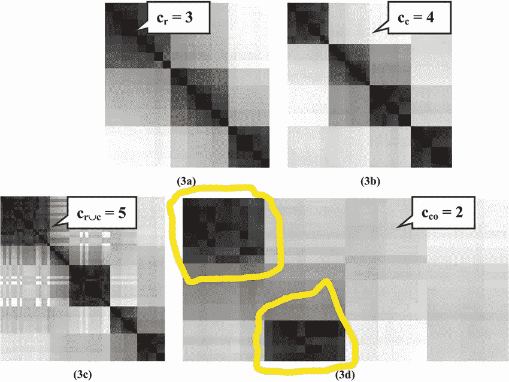

图 3.1:增值税地图集。图片来自 Bezdek 等人(2007)在[研究之门](https://www.researchgate.net/publication/3336491_Visual_Assessment_of_Clustering_Tendency_for_Rectangular_Dissimilarity_Matrices)发表的文章

## **3.2。iVAT(趋势的改进视觉评估)**

iVAT 是一种评估数据集聚类趋势的可视化方法。它是增值税的改进版本。与 VAT 不同的是，它在打印的地图中提供了更精确、更清晰的密集黑色方块/矩形。然而，它有更多的计算时间成本。

正如 VAT 算法一样，代表聚类数的黑色正方形图像在极少数情况下不会位于左对角线上，也可能不是正方形。

**iVAT 映射图**示例:下图显示了 3 个映射图(从左侧引用),具有不同数量的黑色方块，代表聚类。举例来说，第一个方块(左起)有三个簇(尽管簇内也有簇)，第二个方块有三个黑色方块，因此它有三个簇。

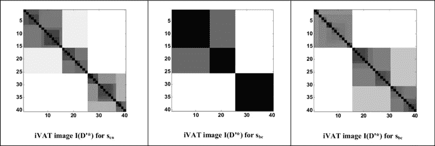

图 3.2:一组 iVAT 地图。图片来自 Bezdek 等人(2010)在[研究之门](https://www.researchgate.net/publication/224177086_Clustering_elliptical_anomalies_in_sensor_networks)发表的文章

# 4.如何在 Python 中使用 VAT 和 iVAT 测试评估数据集的聚类趋势

在 Python 中，VAT 和 iVAT 使用相异矩阵直观地评估数据集的聚类趋势。矩阵适用于数字和分类数据类型，因为它对所有类型都有特定的函数。

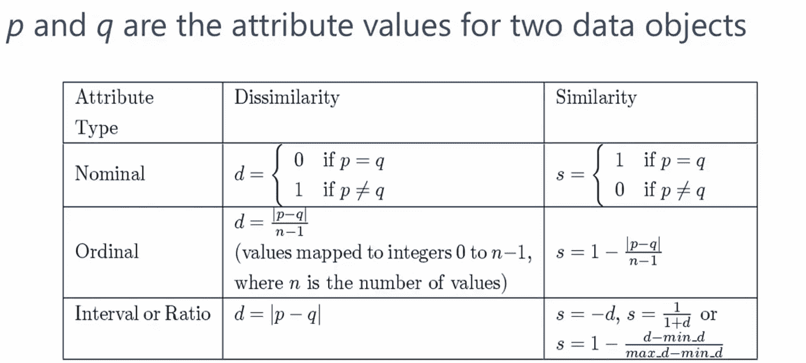

图 4.1:分类特征的相异和相似函数。图片来自[数据科学道场](https://www.youtube.com/channel/UCzL_0nIe8B4-7ShhVPfJkgw)

现在，让我们简单地谈论一下相异(和相似)之处，以便那些对知道它是什么非常感兴趣的人。

## 4.1.相异和相似的基本概念

**相异度**是两个数据对象/数据点差异程度的数值度量。两个数据点距离越远，其相异度越高，反之亦然。值得一提的是**‘相似性’**，这是两个数据对象/点有多相似的数值度量，是相异的直接对立面。两个数据对象越接近，它们的相似度越高，反之亦然。

因此，如果两个数据点具有高相似度值，则它们将具有低相异度值；如果它们具有高的相异值，它们将具有低的相似值。这仅仅意味着相异和相似具有相反的关系。

## 4.2.相异和聚类

在 python 中的 VAT 和 iVAT 算法的上下文中，两个数据点之间非常低的不相似性表示高度密集的黑色正方形/矩形，这表示聚类的存在。而非常高的不相似性仅仅意味着它们相距很远而不能被聚类或在一个聚类中。

## **4.3。Python 中的 VAT 和 iVAT 算法(VAT)**

为了在 python 中实现 VAT (& iVAT)算法，我们将在 anaconda 环境中依次执行以下操作:

1.  通过 Pandas 将数据集作为 dataframe 导入到 anaconda 工作环境中；
2.  从 **pyclustertend** 模块将 VAT 和 iVAT 算法导入到我们的工作环境中；
3.  使用 OneHot 编码(虚拟编码，如果要素是标称的)或 label en 编码(如果要素是序数的)，将数据集中的任何分类要素转换为数字要素；
4.  将数据帧转换成 NumPy 数组；
5.  向算法提供 Numpy 数组数据集；和
6.  将算法的结果作为地图获取。

在我们的数据集上运行算法的输出将产生包含黑色正方形(或矩形)的有序相异正方形图。

## **4.4。实践环节:实现算法**

4.4a. **导入包**

```
#import the packages
import pandas as pd # working with data
import numpy as np # working with arrays
from pyclustertend import vat
from pyclustertend import ivat
```

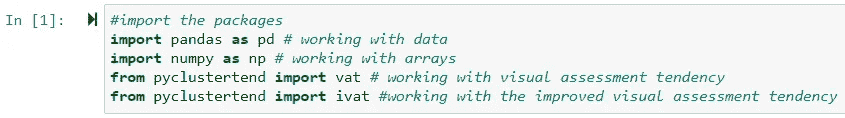

4.4b. **导入数据集**

```
#import dataset into anaconda through pandas
# Specify the path directory to the stata dataset on your computer so as to import it into pandas
path=r"B:\Current_Contraceptive_Users_Modified_NDHS2018_15_19.dta"# Read the stata dataset into pandas (as its dataframe) and name the dataframe as DHS 
Young_Contraceptive_Users=pd.read_stata(path)
```

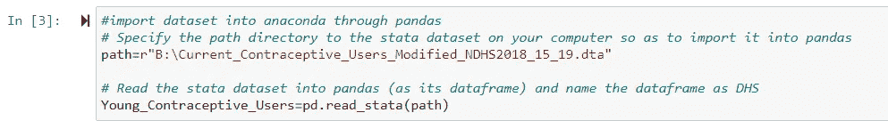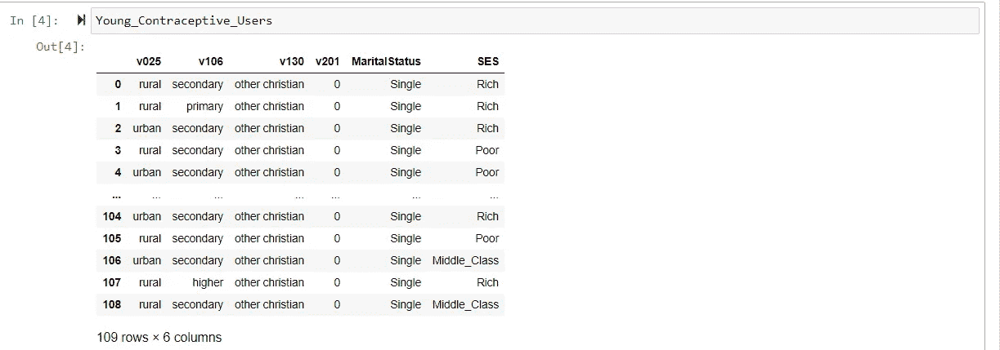

有 109 个观察值和 6 个特征

4.4c. **将分类特征转换为数字特征**

在我们的数据集中有 5 个标称(非序数)特征，我们将使用一个热编码(虚拟编码)将它们转换成数字特征

```
# convert the categorical features in the dataset to numerical 
Young_Contraceptive_Users=pd.get_dummies(Young_Contraceptive_Users, columns = ['v025','v106','v130','MaritalStatus','SES'])
```

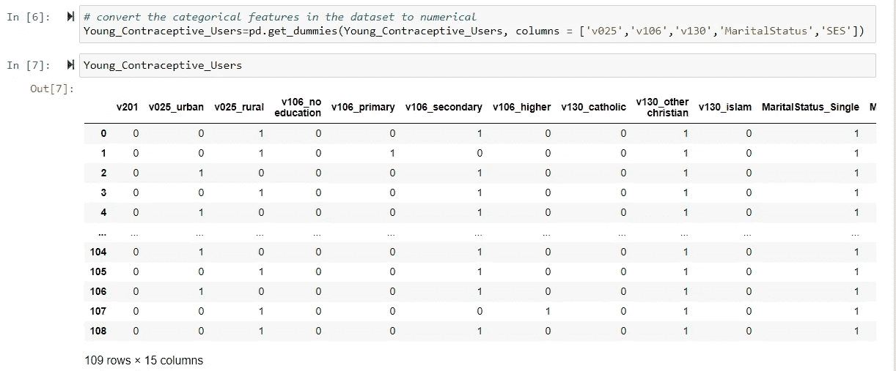

在一次热编码(OHE)之后，有 109 个观察值和 15 个特征

4.4d. **将熊猫数据帧转换为 Numpy 数组**

```
# convert the categorical features in the dataset to numerical 
Young_Contraceptive_Users=pd.get_dummies(Young_Contraceptive_Users, columns = ['v025','v106','v130','MaritalStatus','SES'])
```

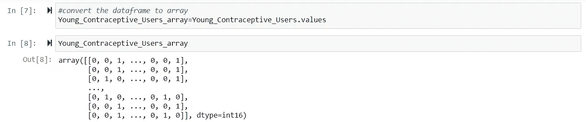

4.4e. **将数组数据馈入 VAT 算法**

```
#feed the array data to the VAT (Visual Assessment Tendency) algorithm 
vat(Young_Contraceptive_Users_array)
```

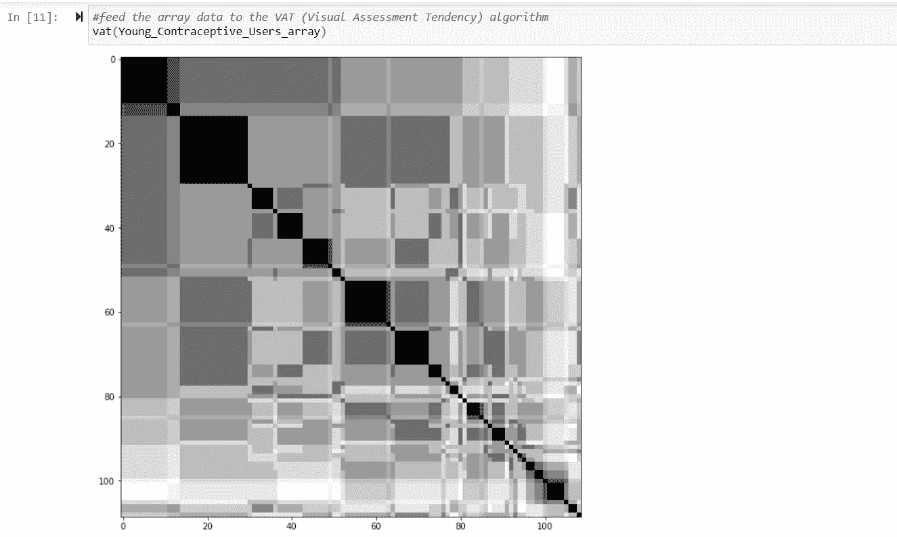

4.4f. **将数组数据送入 iVAT 算法**

```
#feed the array data to the improved VAT (Visual Assessment Tendency) algorithm 
ivat(Never_Use_Contraceptive_array)
```

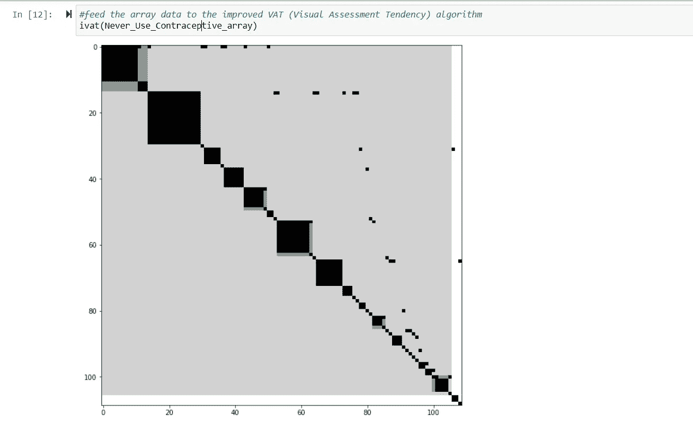

# 5.结论

从实施算法(VAT 和 iVAT)的结果来看，从生成的地图中可以观察到，年轻避孕药具使用者的数据集具有聚类，因此应该使用聚类分析来探索和描绘。对数据集进行 K-Prototype 聚类分析是很方便的，因为它同时具有数值和分类特征(混合数据类型)。此外，iVAT 图比预期的 VAT 图更清晰、更精确。如地图所示，数据集中至少有七个聚类。

请记住，有特定的算法，旨在帮助您识别具有统计意义的聚类数。VAT 和 iVAT 算法只是为了帮助我们决定是否应该继续进行聚类分析。虽然 VAT 和 iVAT 图可用于验证和加强估计聚类数的主要算法，但它们不应用作替代品。

# **6。总结**

1.可视化评估趋势(VAT)及其 iVAT 变体的使用是为了直观地建议是否需要对数据集进行聚类分析。

2.视觉评估趋势(VAT)及其变体的使用不应用于确定数据集中可以找到的聚类数。虽然它们可以用于验证和加强估计聚类数的主要算法，但它们不应该被用作替代品。有一些具体的度量方法——肘法和剪影法，可以帮助你做到这一点。

3.改进的视觉评估趋势(iVAT)是 VAT 的改进版本，因为它具有更精确和更清晰的图像。然而，它有更多的计算时间成本。也就是说，它比大桶需要更多的时间收敛。

**现在就这样**。希望你觉得这有用？请放下你的评论，在 LinkedIn 上关注我，地址是 [Ayobami Akiode LinkedIn](https://www.linkedin.com/in/ayobami-akiode-38528839/)

用于此分析的 Jupyter 笔记本可从[**此处**](https://github.com/ayobamiakiode/My-projects/blob/master/Using%20Visualization%20Algorithms%20(VAT%20and%20iVAT)%20To%20Assess%20Cluster%20Tendency-%20Copy.ipynb) 获得

## 数据源:

本文中使用的数据是 2018 年收集的尼日利亚人口与健康调查(DHS)的免费二手数据，名为 NDHS 2018。DHS 是在发展中国家进行的一项具有全国代表性的调查。在尼日利亚，这项调查通常每 5 年进行一次；覆盖尼日利亚所有州，包括首都。

如需从 DHS 计划获取任何国家级免费数据，请访问 [**DHS 计划**](https://dhsprogram.com/data/dataset_admin/login_main.cfm?CFID=6656492&CFTOKEN=ce6ca5b288d60002-2AFF6515-C723-702A-D46EDCBB32A8BDBD) ，注册并申请。