# 为您的 Docker 项目使用漏洞检测软件

> 原文：<https://medium.com/analytics-vidhya/using-vulnerability-detection-software-for-your-docker-projects-dd7222b18d4a?source=collection_archive---------2----------------------->


*照片由*[](https://unsplash.com/@sigmund?utm_source=unsplash&utm_medium=referral&utm_content=creditCopyText)**上* [*下*](https://unsplash.com/s/photos/code?utm_source=unsplash&utm_medium=referral&utm_content=creditCopyText)*

# *内容*

*   *Docker 是什么？*
*   *使用 Docker 运行 Python Flask 应用程序*
*   *什么是开源安全漏洞？*

# *Docker 是什么？*

*Docker 让开发者使用 Docker 容器[创建、部署和运行应用程序变得非常容易。Docker 允许开发人员将应用程序打包成一个包，其中包含运行应用程序所需的所有内容。](https://www.docker.com/resources/what-container)*

*您可以将 Docker 容器视为一个可以运行您的应用程序的完整环境。可以使用 CLI(例如, [CircleCI](https://circleci.com) 或 Docker API)或云(例如 Azure 或 On-Premises)来管理容器。Docker 容器可以在 Windows 和 Linux 操作系统上运行。*

*容器化的应用程序比虚拟机使用更少的资源，因为它们启动和停止更快，这使得 Docker 成为一个高效的选择。*

# *使用 Docker 运行 Python Flask 应用程序*

*在接下来的一系列步骤中，您将使用 Python 创建 flask 应用程序，并编写 requirements.txt 和 DockerFile。如果您想直接跳到与 Docker 一起运行部分，在克隆后直接跳到步骤 4。*

*从 GitHub 克隆存储库:*

```
*git clone [https://github.com/Soumi7/renovate-docker.git](https://github.com/Soumi7/renovate-docker.git)cd renovate-docker*
```

> *让我们创建一个简单的 flask API，并用 Docker 运行它*

1.  *在根文件夹中创建一个 **app.py** 文件夹:*

```
*from flask import Flask, request, jsonify, render_template, url_forapp = Flask(__name__)@app.route(‘/’)def home(): return ‘Hello World’@app.route(‘/predict_api’, methods=[“GET”,”POST”])def list_post(): json_body = request.get_json() predictions = 2 * json_body[0] predictions = list(predictions) return jsonify(results = predictions)if __name__ == ‘__main__’: app.run(host=’0.0.0.0',port=5000)*
```

*2.在根文件夹中创建一个 **Dockerfile** :*

```
*FROM python:3.6-slimCOPY ./app.py /deploy/COPY ./requirements.txt /deploy/WORKDIR /deploy/RUN pip3 install — no-cache-dir -r requirements.txtEXPOSE 80ENTRYPOINT [“python”, “app.py”]*
```

*3.创建一个包含依赖关系的 **requirements.txt** 文件，在我们简单的应用程序中，它只是一个 flask:*

```
*Flask==1.1.1*
```

*4.安装 Docker:*

*删除现有的 docker 版本:*

```
*sudo apt-get remove docker docker-engine docker.io containerd runc*
```

*安装 Docker:*

```
*sudo apt-get updatesudo apt-get install docker-ce docker-ce-cli containerd.io*
```

*您可以通过运行 hello-world 映像来验证安装是否成功:*

```
*sudo docker run hello-world*
```

*要获取 docker 图像:*

```
*sudo docker build -t app-test .*
```

*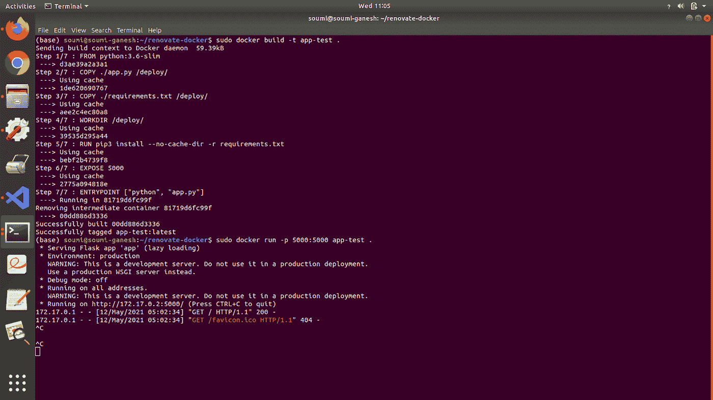*

*映像已经构建完毕，可以运行了。我们可以使用以下命令来实现这一点:*

```
*sudo docker run -p 5000:5000 app-test .*
```

**

> *在浏览器中打开链接。应用程序运行完美！将所有这些代码推送到 GitHub 上的一个存储库中。*

*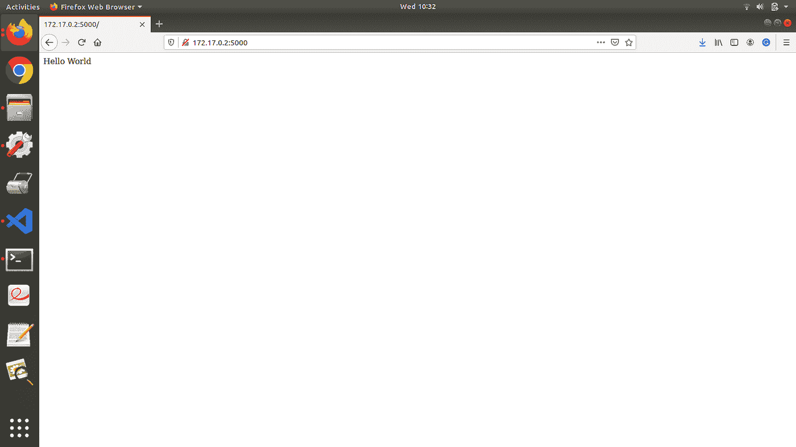*

# *什么是开源安全漏洞？*

*既然您的应用程序已经用 Docker 构建和容器化了，您就可以托管它了。但是，你忘了一件事！应用程序中的依赖项！随着新版本开源库的发布，旧版本被弃用。这些版本容易受到 DDoS 攻击等安全问题的攻击。作为维护者，您必须不断地维护、检查和更新这些依赖关系。那很费时间，对吗？*

*有几种开发人员工具可以解决开源漏洞。这样可以节省时间，降低风险。其中包括识别 node.js 应用程序中的威胁的节点安全项目(NSP)、涵盖 NET/C#、Java 和 JavaScript 的 OSSIndex、python、Java、Go 的 Gemnasium 等等。*

*对于本文，我将使用 renew，它可以识别应用程序中的潜在安全漏洞。它实时运行以识别最新的可用版本。它对 NPM 来说是免费的，作为一个 Github 应用程序对公共和私人的仓库都是可用的。*

# *版本精度的保持*

*默认情况下,“修复”会保留 Docker 图像中布局的精度级别。如果现有映像被固定在 img:1.1，renew 不会建议升级到 img:1.2.0 或 img:1.3.0。renew 只会提出升级到 img:1.2 和 img:1.3。*

> *现在，让我们继续使用 Docker 进行自我主机更新:*

*创建一个`config.js`文件:*

```
*module.exports = {endpoint: ‘https://api.github.com/',token: GITHUB_ACCESS_TOKEN,platform: ‘github’,logLevel: ‘debug’,onboardingConfig: {extends: [‘config:base’],},repositories: [‘Soumi7/renovate-docker’],renovateFork: true,gitAuthor: “Soumi Bardhan <soumibardhan10@gmail.com>”,username: “Soumi7”,onboarding: false,printConfig: true,requireConfig: false,};*
```

*现在，在添加访问令牌之前，您需要生成一个:*

*在您的 **GitHub** 个人资料中进入**设置**:*

*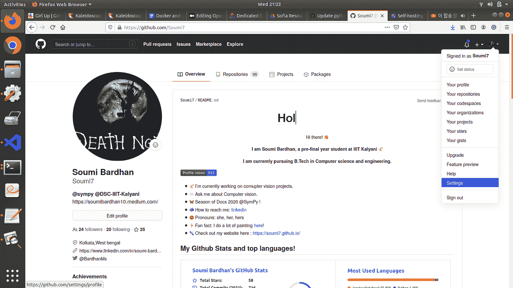*

*从**设置**，进入**开发者**工具:*

*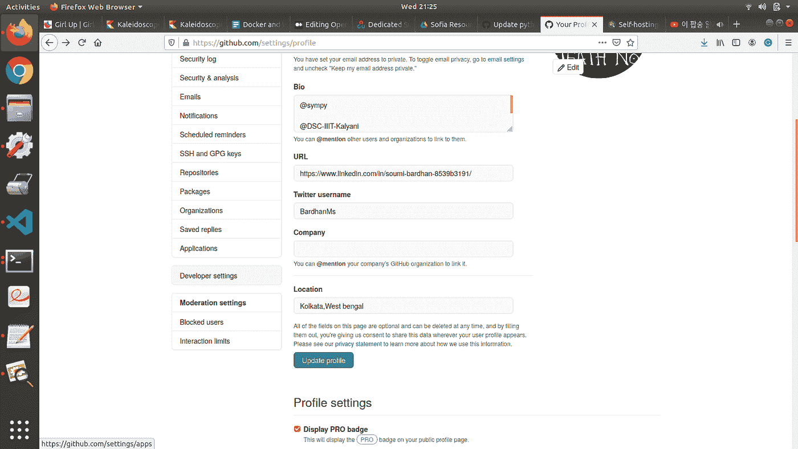*

*转到**个人访问令牌**:*

*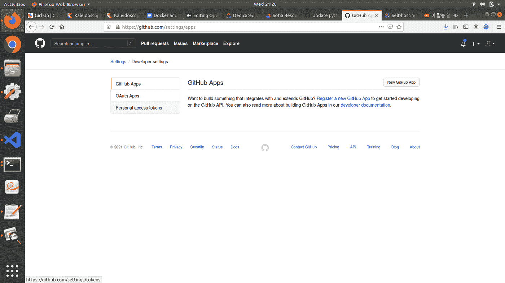*

*点击**生成新令牌**:*

*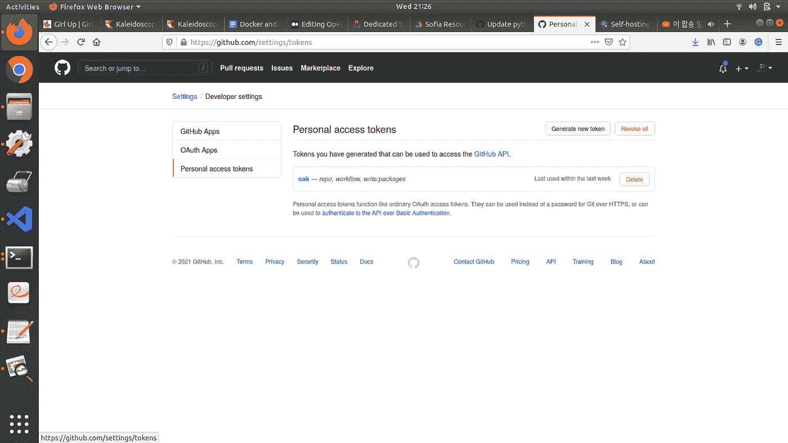*

*复制并保存到某个地方，以便以后使用。*

*在`config.js`文件中适当添加您的详细信息:*

```
*module.exports = {endpoint: ‘https://api.github.com/',token: GITHUB_ACCESS_TOKEN,platform: ‘github’,logLevel: ‘debug’,onboardingConfig: {extends: [‘config:base’],},repositories: [‘YOUR_USERNAME/YOUR_REPO_NAME],renovateFork: true,gitAuthor: “YOUR_NAME <YOUR_EMAIL_ID>”,username: “YOUR_GITHUB_USERNAME”,onboarding: false,printConfig: true,requireConfig: false,};*
```

> *现在你已经准备好了！您首先需要迁移您的 config.js。在您的终端中键入以下内容:*

```
*docker run — rm -v “/home/USER_NAME/REPO_NAME/.github/config.js:/usr/src/app/config.js” renovate/renovate*
```

*这也将**拉**最新版本的**翻新**。*

> *当我用我的存储库进行试验时，我是这样做的。如果您正在使用我的存储库，您可以使用此命令。只需更改本地系统的配置路径！*

```
*docker run — rm -v “/home/soumi/renovate-docker/.github/config.js:/usr/src/app/config.js” renovate/renovate:25.18.4*
```

*如果您错误地将配置推送到 GitHub，GitHub 将自动撤销该令牌，您必须生成另一个令牌。*

*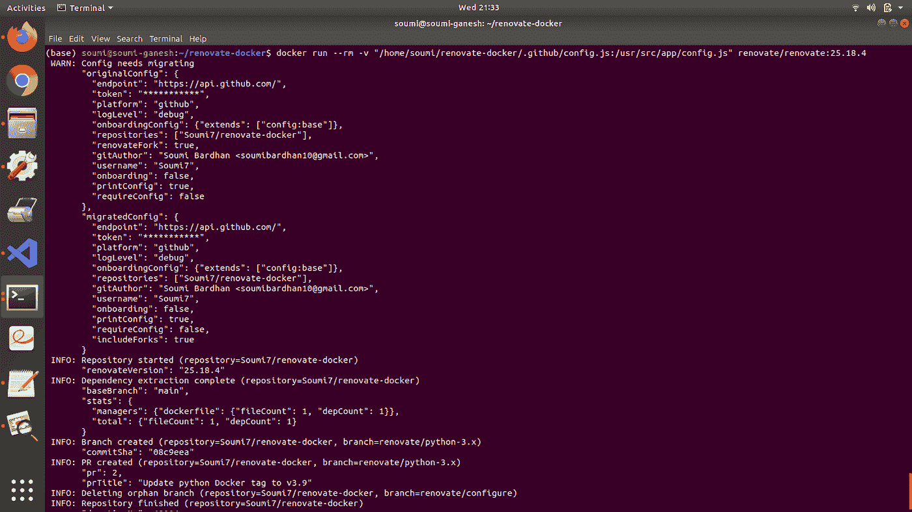*

*瞧啊。成功了！如果您的任何依赖项没有更新，将会在您的 GitHub 存储库中创建一个 PR！在这里，因为 Renovate 将 docker 文件标识为依赖项管理器，所以它可以识别 docker 文件中的开源漏洞。*

*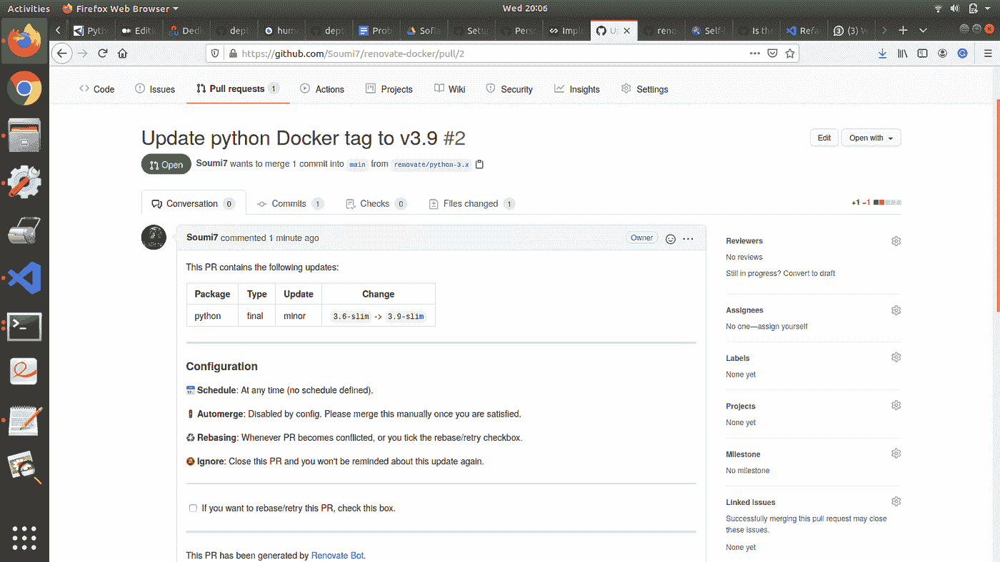*

*就是这样！用 Docker 进行自我改造是多么容易，这让我非常兴奋！*

*现在我们将删除 Dockerfile 文件。我们现在只有一个管理依赖关系的 requirements.txt 文件。别忘了把这个变化推送给 GitHub 否则，以下步骤中的更改将不可见。*

*requirements.txt 中的 flask 版本是 1.1.1。*

```
*docker run — rm -v “/home/soumi/renovate-docker/.github/config.js:/usr/src/app/config.js” renovate/renovate:25.18.4*
```

*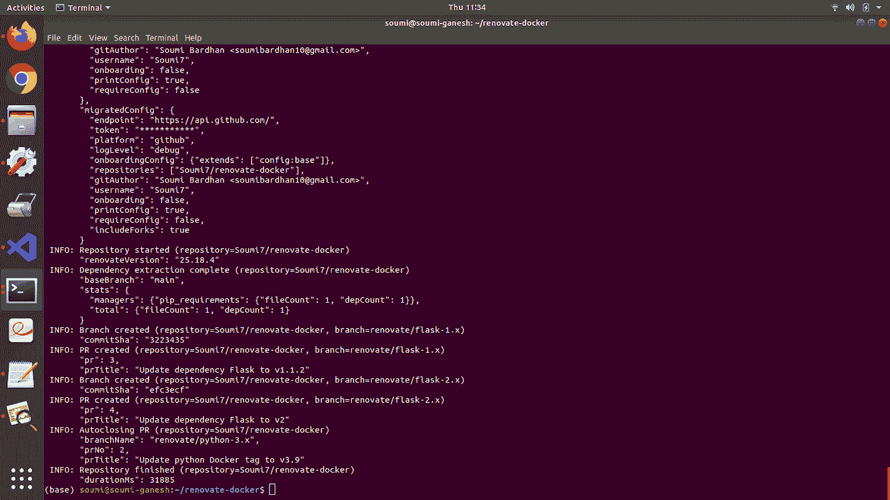*

*注意需求文件现在是如何被识别为依赖管理器的。PRs 现在将被制作到 requirements.txt。现在您将看到这个 PR 被创建到您在 **GitHub** 上的存储库中:*

*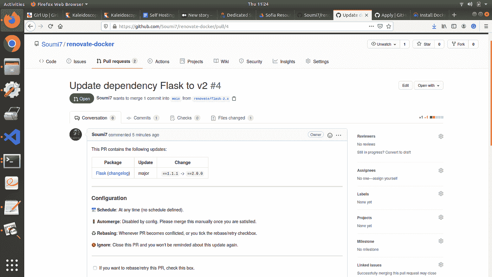**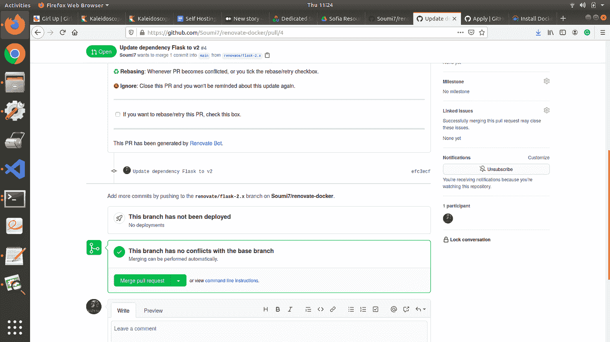*

*这次 PR 是把 flask 版本从 1.1.1 更新到 2.0.0。*

*如果你觉得有帮助，请在我的 GitHub 上留下一颗星。谢谢！*

*[](https://github.com/Soumi7) [## Soumi7 -概述

### @ sympy @ DSC-IIIT-卡利亚尼 https://soumi7.github.io/你好！👋我是 Soumi Bardhan，最后一个…

github.com](https://github.com/Soumi7)*