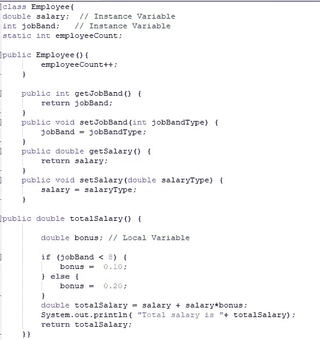
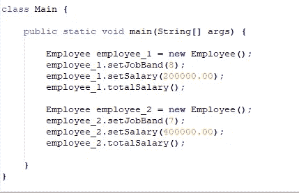
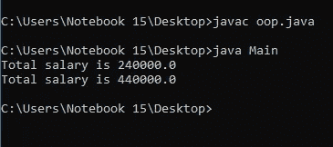
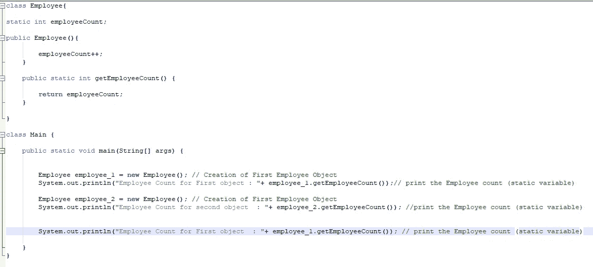
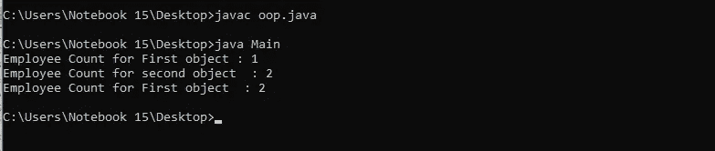
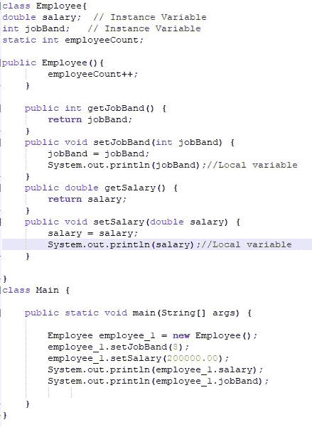
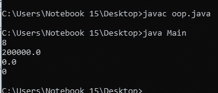
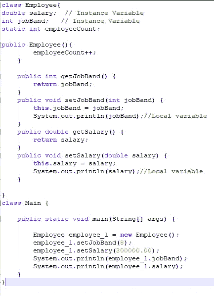
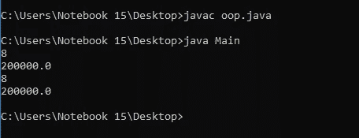

# Java 中变量和“this”关键字的使用

> 原文：<https://medium.com/analytics-vidhya/utilization-of-variables-and-this-keyword-in-java-d102de7f7cd1?source=collection_archive---------21----------------------->

Java 是 IT 行业中众所周知的面向对象编程语言。

Java 语言(一种计算机语言，尤用于创建网站)

我们在[上一篇文章](/analytics-vidhya/basic-concepts-of-object-oriented-programming-java-db67a4ead3a4)中讨论了面向对象编程的基本概念。现在，我们将学习在 java 编程中起重要作用的变量的三个最大类别和“ **this** ”关键字。

在我们继续讨论变量和“ **this** ”之前，首先我们将讨论 java 中不同的数据类型。数据类型被用作解释 java 中的位的上下文。主要有两类数据类型。例如基本类型和引用类型。原始类型简单且固定。由 int、boolean、char、short、byte、float、long、double 等八种基本数据类型组成。

引用类型是基元类型和引用类型的复杂集合。变量是具有类型、名称和值的内存位置。局部变量、静态变量和实例变量是引用变量的三大类。

***局部变量***

方法中定义的变量。它只能在方法中访问。这些变量没有默认值，因此在使用之前应该赋值。否则，它将返回一个编译时错误。

***实例变量(非静态字段)***

在类内和方法外定义的变量称为实例变量。它永远不会有静态访问修饰符。这些被认为是对象(实例)的一部分。

实例变量和局部变量都可以用下面的例子来阐述。

员工类别

员工对象的创建

逻辑输出

***【静态变量(静态字段)***

使用静态访问修饰符的变量。由类的所有对象使用的变量的一个副本。它属于类而不是对象。每次值改变时，类的所有对象都可以看到变量值。可以用下面给出的例子来说明。

静态变量示例

***此“此”关键字的用法***

“this”关键字用于引用当前对象的属性。如果实例变量名和方法参数名(预先初始化的局部变量)相同，那么必须使用“this”关键字引用当前对象的变量，并通过 getter、setter 方法为这些变量赋值。如果没有使用“this ”,那么 value 将不会赋给实例变量，而只会赋给局部变量，如下所示。

不使用“this”关键字的代码段

程序的输出

在上面的示例中，对象 employee_1 的属性 salary 和 job band 不是由 settter 方法设置的。这是因为薪水/工作范围提到两个变量都是局部变量。

现在，我们将使用 this 关键字，并为当前对象的实例变量赋值。

使用“this”关键字的代码段

程序的输出

在上面的示例中，对象 employee_1 的属性 salary 和 job band 由 settter 方法设置。这是因为“**this . salary”**引用的实例变量 **salary** 被设置为本地变量 **salary 的值。**

总之，对象的状态可以被它的字段(静态字段或非静态字段)引用，另一方面，方法的状态可以被局部变量引用。在本文中，我们将探讨不同类型的变量以及 Java 中“this”关键字的用法。

直到那时！！！编码快乐！！！