# 利用多种类型的特征进行蛋白质分类！

> 原文：<https://medium.com/analytics-vidhya/utilizing-multiple-types-of-features-for-protein-classification-a82028e9c75c?source=collection_archive---------28----------------------->

用于蛋白质分类的大多数当前和标准方法依赖于用于蛋白质序列的递归神经网络；这些网络然后预测蛋白质分类。然而，这个特殊的项目是为了尝试看看我们是否可以使用其他容易实现的功能来帮助预测。结果表明还有很大的改进空间。

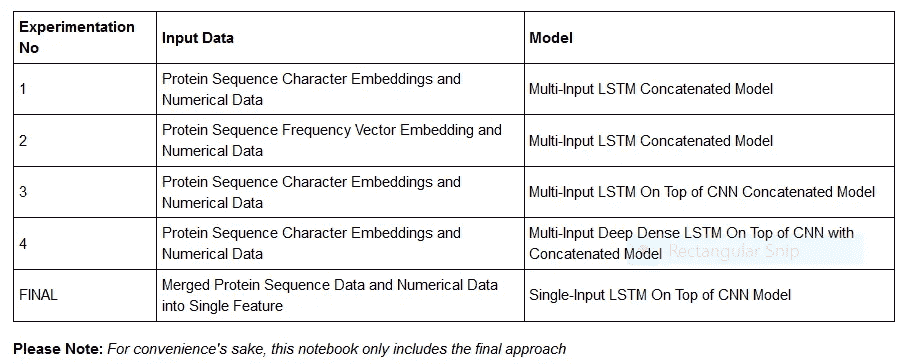

所用数据:[https://www.kaggle.com/shahir/protein-data-set](https://www.kaggle.com/shahir/protein-data-set)

现在，我们直接跳进去怎么样？

我们先稍微摆弄一下数据。为了做到这一点，我们首先需要获得数据。Kaggle 在这一点上做得很好，因为我们不需要为了使用数据集而将它们下载到我们的本地机器上。相反，由于它既是一个在线笔记本编辑器，也是一个分享任何有关数据科学(包括数据集)的社区，我们可以访问上面的链接，只需这样做:

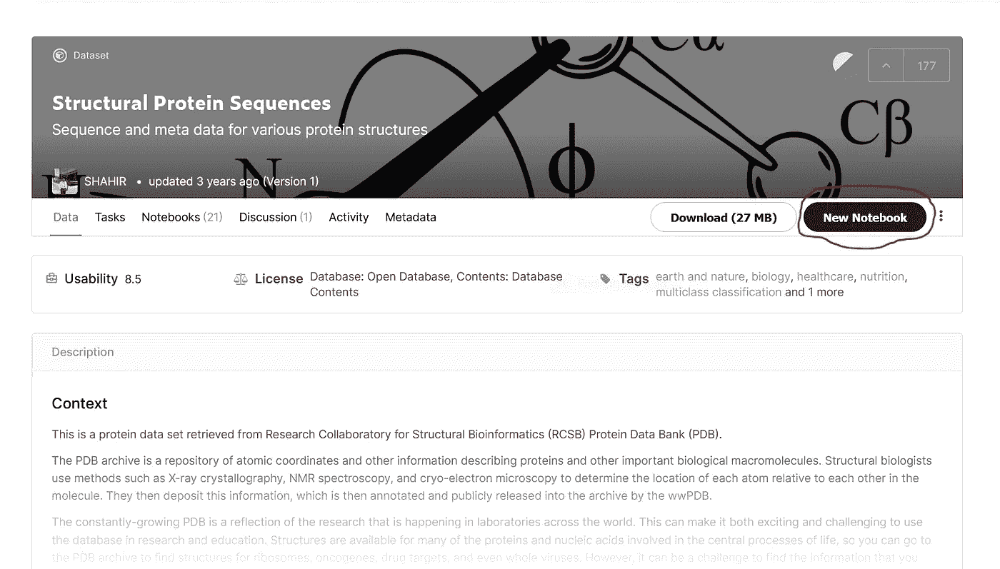

单击“新建笔记本”按钮，用已安装的数据创建一个笔记本！

准备工作结束后，我们终于可以开始编码了！

初始数据清理过程的大部分代码直接取自本文参考资料一节中链接的笔记本。

我们应该做的第一件事是把数据读入熊猫的数据框。你会注意到数据分为两部分。csv 文件。

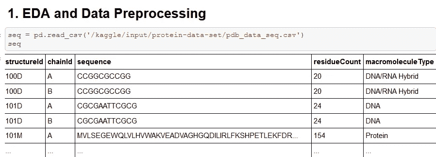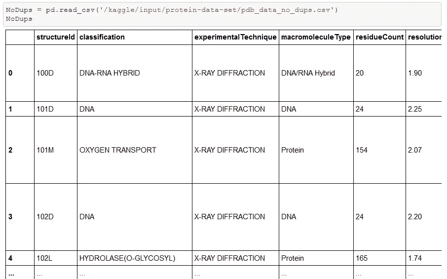

现在让我们把这两个数据帧合并成一个！

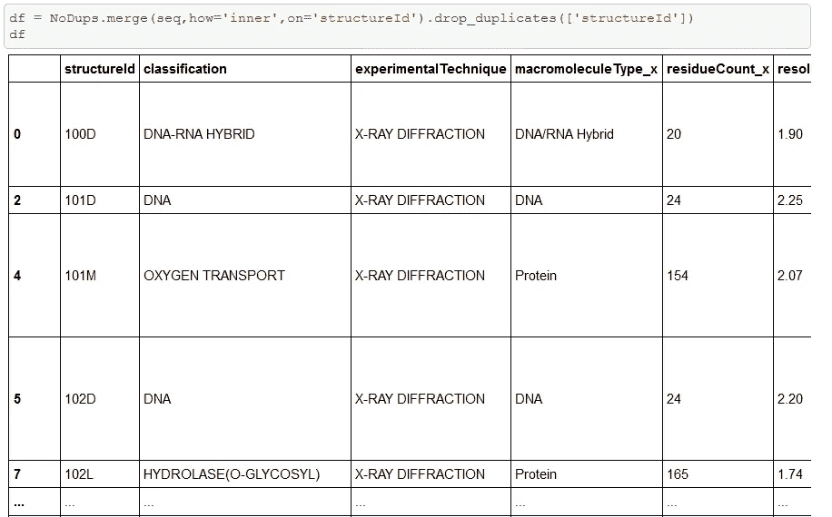

在这之后，我们只是做一些基本的数据探索和清理之类的事情。我们将在本文中快速浏览这个过程，但是如果您想查看细节，请确保查看完整的笔记本。你可以在我的 GitHub 上找到，下面有链接！

首先，我们删除所有空值。然后，我们确保删除所有涉及非蛋白质大分子的行。

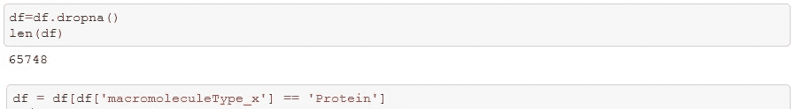

以下是一些有趣的发现:

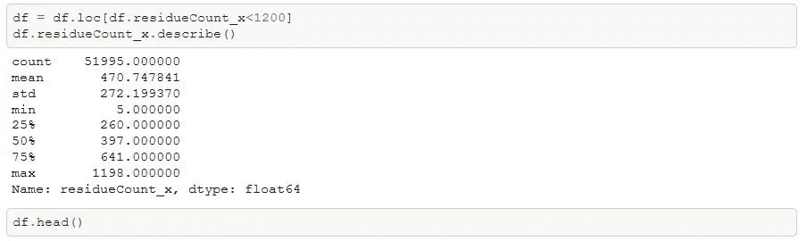

接下来，让我们将所有的数据合并成一个单一的特征！

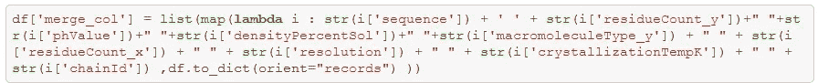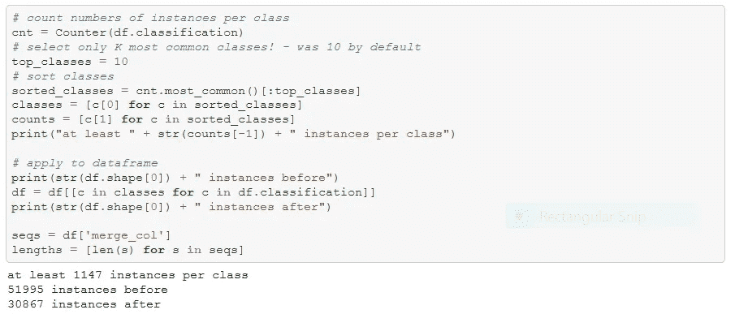

接下来，是时候为我们的最终模型准备数据了！

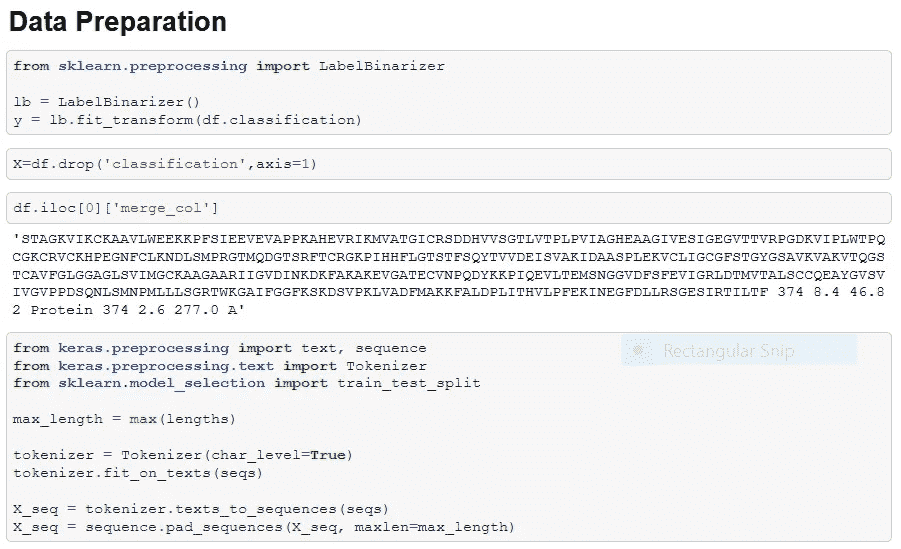

记得进口我们需要的工具。

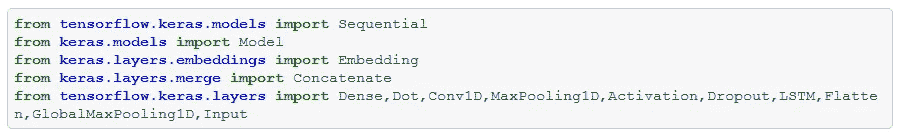

现在，是你们期待已久的时候了…实际模型！

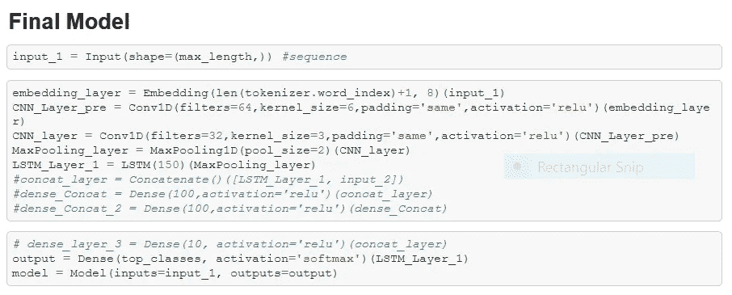

是时候训练它了！

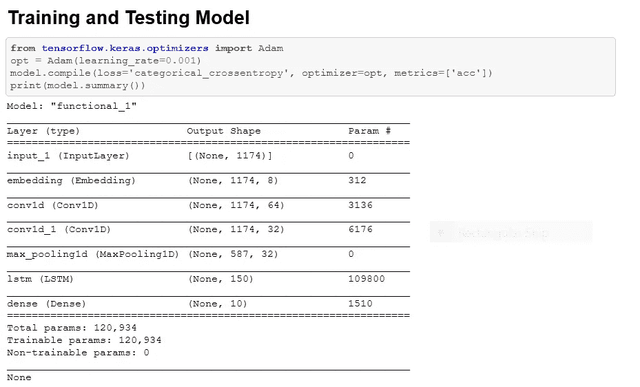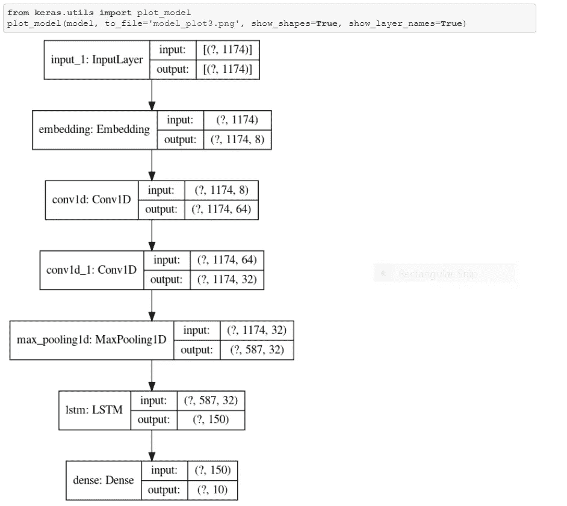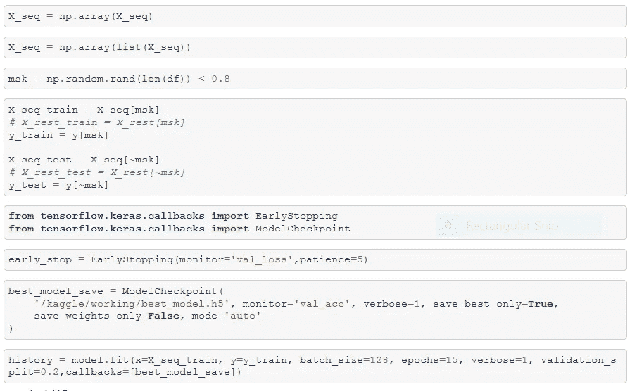

好了，现在我们需要弄清楚我们的模型表现如何。

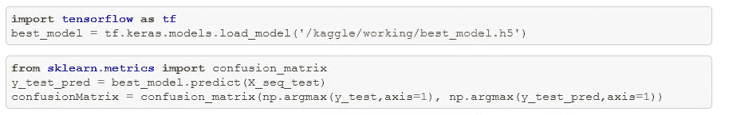

压轴戏！我们的困惑矩阵…

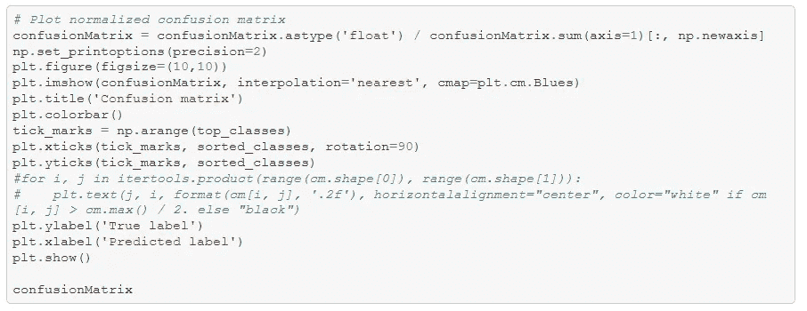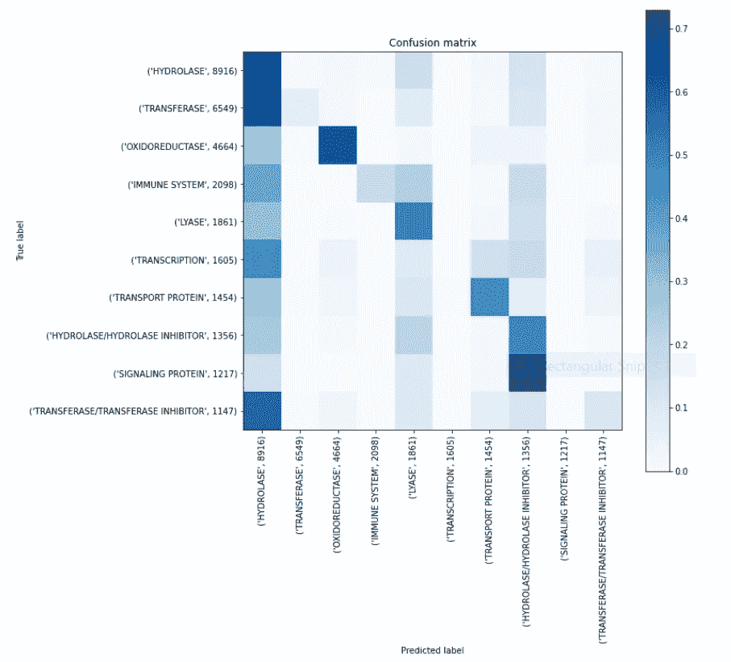

Welp。如你所见，我们的模型挣扎了很久。尽管如此，我还是希望你们能从中学到一些东西！

完整的笔记本可以在我的 GitHub 上找到:【https://github.com/AAbhi256 

# 参考

 [## CNN keras 和 innvestigate

### 使用 Kaggle 笔记本探索和运行机器学习代码|使用来自结构蛋白质序列的数据

www.kaggle.com](https://www.kaggle.com/helmehelmuto/cnn-keras-and-innvestigate) 

[https://towards data science . com/a-comprehensive-guide-to-correlation-neural-network-with-keras-3f 7886028 e4a](https://towardsdatascience.com/a-comprehensive-guide-to-correlational-neural-network-with-keras-3f7886028e4a)

[https://snap . Stanford . edu/snappy/doc/reference/multimodal . html](https://snap.stanford.edu/snappy/doc/reference/multimodal.html)

【https://open access . the CVF . com/content _ cvpr _ 2017/papers/Chen _ AMC _ Attention _ guided _ 2017 _ paper . pdf