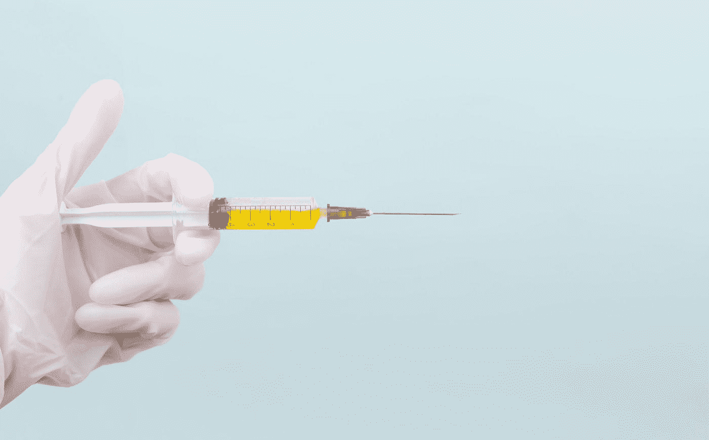
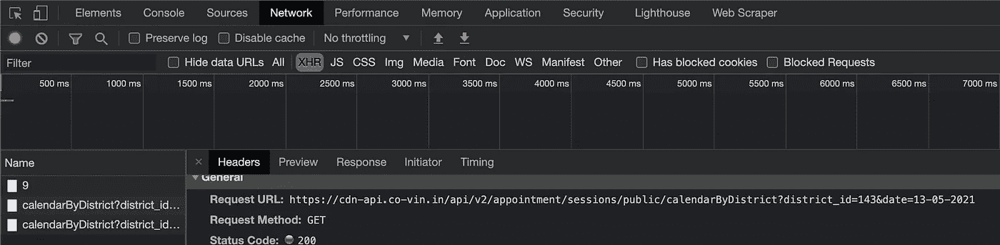
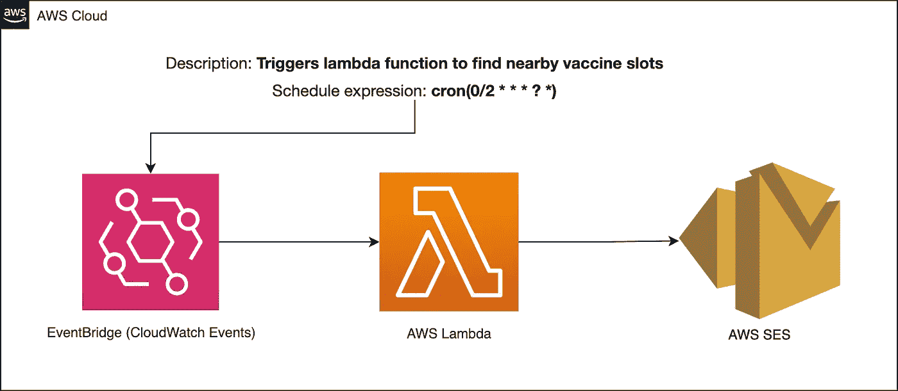
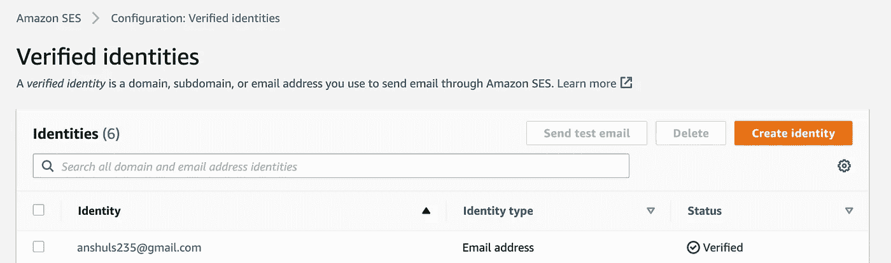
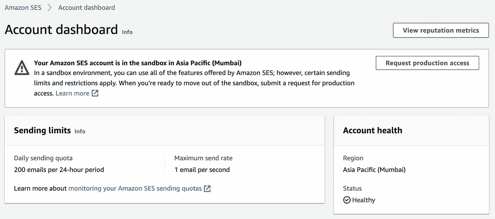
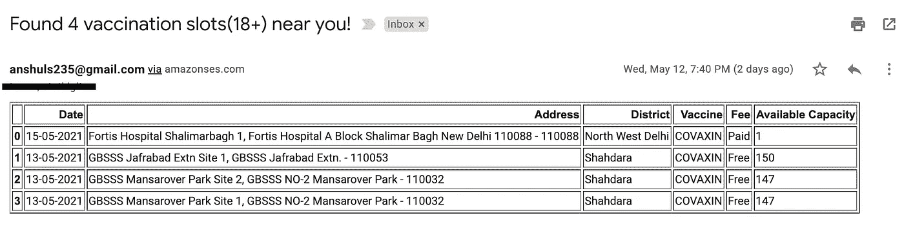

# 使用 AWS 和 Python 的疫苗槽通知程序

> 原文：<https://medium.com/analytics-vidhya/vaccine-slot-notifier-using-aws-python-bbfe7dd60e84?source=collection_archive---------20----------------------->

了解如何使用几个简单的步骤构建自己的通知系统！

戴安娜·波莱希娜在 [Unsplash](https://unsplash.com?utm_source=medium&utm_medium=referral) 上拍摄的照片

印度宣布，从 2021 年 5 月 1 日起，将开始为 18-44 岁年龄组的人群接种疫苗。此前，它只针对所有 45 岁以上的人。此外，在前来接种疫苗之前，必须在 [COWIN 门户网站](https://www.cowin.gov.in/home)上进行登记和预约。印度 18-44 岁年龄组的人口为 5.946 亿，只有一个单一的疫苗接种注册门户。因此，毫无疑问，这需要技术人员运用他们的技能，建立通知系统，将所有人从麻烦中解救出来。下面的推文很好地总结了这一点😜

有太多的通知系统，它们也非常有用。我想创造我自己的版本，只是想把它记录下来，因为同样的过程可以在许多其他事情上复制，不仅仅是 COVID 疫苗接种。

开门见山，以下是我用来想出自己的通知系统的步骤。稍后将详细说明每一步。

1.  找到数据的来源。
2.  获取和操作数据。
3.  创建一个无限期实现步骤 2 并发送通知的管道。

# **第一步:找到数据源-**

*   最好的事情是**公共 API**已经可用，所以你可以直接检查[这个链接](https://apisetu.gov.in/public/marketplace/api/cowin)并根据你的需要获取数据。
*   更通用的方法是使用**开发者工具**并通过**网络**选项卡找到 API。如果有很多请求，最好按 XHR 请求过滤。

# 步骤 2:获取和操作数据-

既然您已经弄清楚了数据源，那么您只需要创建一个脚本，该脚本将从数据源获取数据并将其处理成您喜欢的格式。出于编写脚本的目的，我使用了 Python，出于可读性考虑，我的首选格式是表格。

关于守则的几点

*   因为我使用的是 **AWS lambda** ，所以代码是针对 lambda 函数的。只是它被封装在函数 **lambda_handler** 内部。
*   为了将**熊猫**和**请求**导入我的 lambda 函数，我使用了 lambda 图层。[跟随本文](/analytics-vidhya/aws-adding-python-libraries-to-lambda-layers-8c4eaf8fed80)向 lambda 添加非标准 python 库。
*   Lambda 按照 UTC 时区运行代码。我忘了导入 pytz，它也不是一个标准库。所以，这就是为什么手动改变第 13 行的时区。
*   我已经对第 14 行的地区进行了硬编码，因为我和我的朋友只想要德里 NCR 的更新。因此，逻辑可以根据您的需要来实现。
*   当我为我的朋友和我自己构建服务时，我将接收者添加为一个**环境变量**。你可以根据自己的需要从你的数据库或 S3 中读取它们。
*   **send_email** 函数在 utils.py 中，我把[这篇惊艳的文章](https://kuharan.medium.com/sending-emails-with-aws-lambda-aws-simple-email-service-ses-513839bc53ab)作为参考创建了这个函数。

# 步骤 3:创建一个无限期实现步骤 2 并发送通知的管道-

以上是用于疫苗通知程序的简单 AWS 架构。调度表达式使 **EventBridge** 在每 **2 分钟**后触发步骤 2 中的 **lambda** 功能。频率完全取决于你的需要。

AWS 提供 2 种通知服务: **SNS** & **SES** 。SNS 使你能够以简单的文本格式发送信息或电子邮件。SES 使你能够使用 HTML 发送格式化的电子邮件或文本信息。你甚至可以发送带有附件的电子邮件。由于 **Pandas** 提供了一个函数 **df.to_html()** 将dataframe 转换成 html，这激励我使用 SES。

*   SES 是一个非常容易使用的服务。您只需在 AWS 控制台中转至 SES，并在那里添加电子邮件/身份。创建身份后，会向其发送一封验证邮件，在验证时，会添加一个带有绿色勾号的“已验证”作为身份状态。

> **请注意** : SES 邮件只能发送给沙箱中经过验证的邮件。此外，无论访问(沙盒/生产)如何，都需要验证发送者。

*   因为我是个人使用，所以我手动添加了电子邮件。要使整个过程自动化，你可以简单地使用 [boto3](https://boto3.amazonaws.com/v1/documentation/api/latest/reference/services/ses.html#SES.Client.verify_email_address) 。
*   AWS 最初向 SES 提供**沙盒访问**，并且对您可以发送的电子邮件数量有上限(200 封/天)。但是，你可以用一个有效的理由请求**生产访问权**，AWS 将很乐意批准。此外，一旦您拥有生产访问权限，您也可以对验证邮件模板进行更改。

我的帐户仪表板的屏幕截图。我的帐户在沙盒里。

示例邮件

遵循所有的步骤将会给你你的疫苗槽通知程序，就像上面使用 Python & AWS 一样。正如我之前所说，同样的过程也可以用于许多其他目的。

我希望这篇文章对你有用。如有任何疑问，请随时联系我:)

# [LinkedIn](https://www.linkedin.com/in/anshuls235/)
[Gmail](http://anshuls235@gmail.com/)