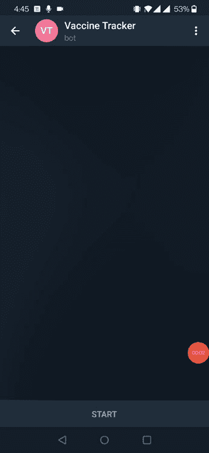
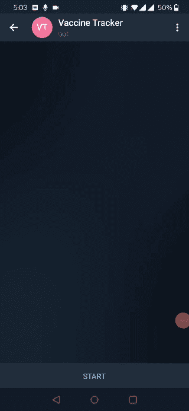
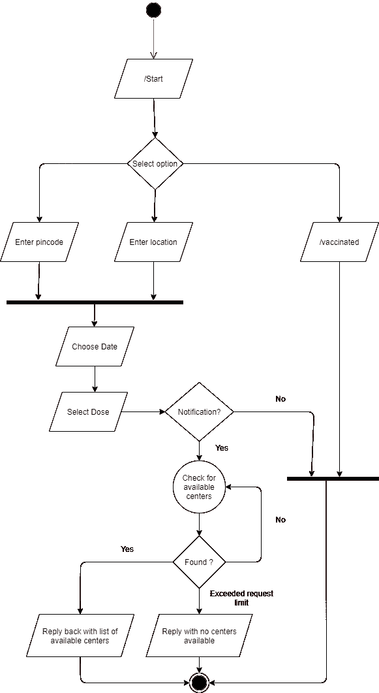
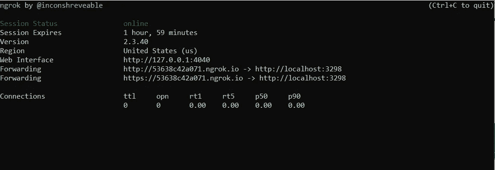

# 疫苗追踪器:一个电报聊天机器人

> 原文：<https://medium.com/analytics-vidhya/vaccine-tracker-a-telegram-chat-bot-6bbf5ec66b18?source=collection_archive---------12----------------------->

# 介绍

已经一年多了，因为世界正在新冠肺炎与一场不可预见的疫情战斗，尽早接种疫苗似乎是赢得这场战斗的最有效方式。为了缓解预订可用疫苗接种位置的困难，我决定开发一个交互式聊天机器人，用于根据密码、位置和剂量标准跟踪疫苗接种中心。

**疫苗追踪器**是一个电报机器人，使用以下方法检查可用的疫苗接种中心
:

1.  pin 码

2.位置

# 创建一个电报机器人

Telegram 提供了一个自己的机器人，名为“ [**机器人之父**](https://core.telegram.org/bots#6-botfather) ”，可用于创建和管理定制机器人。要创建一个新的机器人，键入命令 **/newbot** ，并为新机器人提供一个公共名称和一个唯一的标识用户名。从 [**机器人父亲**](https://core.telegram.org/bots#6-botfather) 收到的令牌需要保持安全，因为我们将在聊天机器人应用程序中使用它。

机器人父亲

# **构建疫苗追踪机器人**

为了开发**疫苗跟踪器** bot，我使用了 [python-telegram-bot](https://github.com/python-telegram-bot/python-telegram-bot) 库来与 Telegram Bot API 交互。这个库包含了许多用于管理对话的有用的包装器，它有很好的文档记录，并且有一个活跃的开发社区。为了帮助更好地理解机器人，下面是对话流程:

# 深潜

该机器人旨在使用从[合作伙伴](https://apisetu.gov.in/public/api/cowin)公开的公共 API 检索可用的中心，并向用户提供对话体验。以下是可用于检索发送给 bot 的消息的两种方法:

1.  投票
2.  Webhook

基于轮询的方法很简单，不需要任何额外的设置，因此应该仅用于测试目的。关于这一点，已经有很多可用的资源。然而，基于 webhook 的方法更具可伸缩性和成本效益，因为当没有任何数据可供处理时，不会浪费资源。疫苗追踪机器人使用基于 webhook 的方法来处理来自电报的输入事件。

**对话处理程序**

设计对话机器人的核心方面是管理对话的不同层次和方面。为此，python-telegram-bot 库公开了一个可用于管理对话的对话处理程序。每个会话在多个状态之间转换，这些状态需要在会话处理程序中指定，以及它们对应的处理程序实现。每个状态需要提供下一个适用的执行状态，如下所述:

对话处理程序

对话处理器可配置为使用以下方式管理电报消息、回叫和命令:

**回调查询处理程序**

回叫查询处理器被配置用于处理从电报接收的回叫事件。在大多数情况下，当自定义按钮可供用户选择时，会生成回调事件。例如，在这个机器人中，按下按钮产生的所有事件都需要一个回调处理程序来管理它们。

**消息处理程序**

消息处理器被配置用于处理从电报接收的消息事件。消息事件是用户键入或作为附件发送的任何内容。在这个 bot 中，从用户接收的 pin 码或位置数据需要一个消息处理程序来管理它们。

**命令处理程序**

命令处理程序设计用于处理用户输入的命令。例如，如果用户键入 **/start** 或**/vaccined**，，那么它将被视为有效命令，并配置了相应的处理程序。

处理程序实现

## 启用 Webhooks

为了理解 webhook 配置，理解什么是 webhook 是很重要的。webhook 本质上是一个提供给 telegram API 的 URL，只要收到用户的响应，就会被调用。

因为我们的应用程序被期望通过 webhook 监听来自 telegram API 的事件，所以它需要在 web 服务器内部运行。为此，python-telegram-bot 库提供了一个简单的解决方案，并使用以下代码启动一个 HTTP 服务器来监听 webhook 事件:

Webhook 配置

上面需要指出的重要一点是，webhook URL 必须是唯一的 **https** URL。这是 telegram API 所要求的，因为它们将共享敏感数据，即来自用户的消息，因此，SSL/TLS 加密在这里是必不可少的。对于使用 https 协议访问的任何 URL，它需要拥有由任何公共信任的[认证机构(CA)](https://www.ssl.com/faqs/what-is-a-certificate-authority/) 颁发的有效 SSL/TLS 证书。因为我们只计划测试我们的应用程序，所以一个更简单的方法是使用隧道通过公共 URL 访问我们的本地应用程序。 [Ngrok](https://ngrok.com/) 可以用来实现这一点，因为它在 **ngrok** 的子域上创建了一个公共 URL。将流量传输到我们的本地网络服务器。对于 Windows/Mac，从[这里](https://ngrok.com/download)下载 ngrok 并运行以下命令:

**ngrok http<port>**其中 port 是之前设置 webhook 时指定的端口。输出应该包含一个 https URL，它可以用作我们的 webhook URL，如下所示:

## 资源

1.  试用疫苗追踪机器人:[http://t.me/cowin_vaccine_tracking_bot](http://t.me/cowin_vaccine_tracking_bot)
2.  了解更多电报机器人:[https://core.telegram.org/bots](https://core.telegram.org/bots)
3.  了解更多 python 电报 bot 库:[https://github.com/python-telegram-bot/python-telegram-bot](https://github.com/python-telegram-bot/python-telegram-bot)

这个机器人的源代码可以在 GitHub 上找到。我希望这一信息将有助于开发和测试任何电报机器人。

在下一篇文章中，我将重点介绍如何使用 AWS 和 Heroku 将 telegram bot 作为独立应用程序部署在云上。