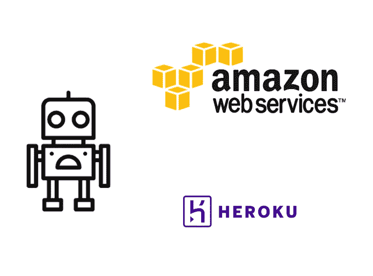
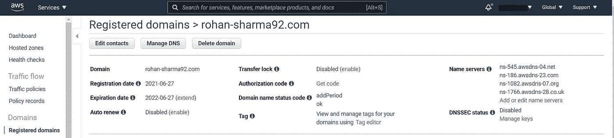
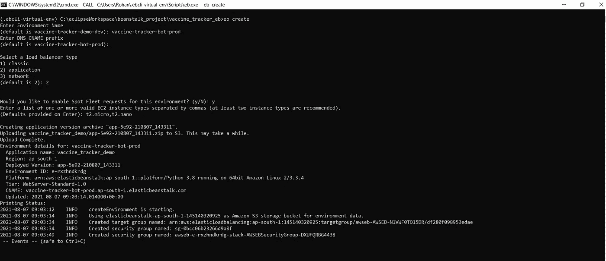
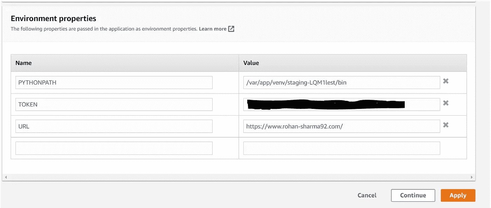
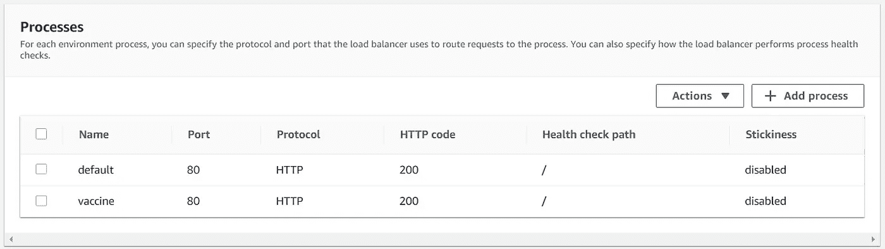
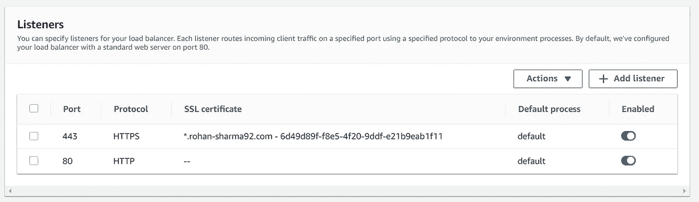
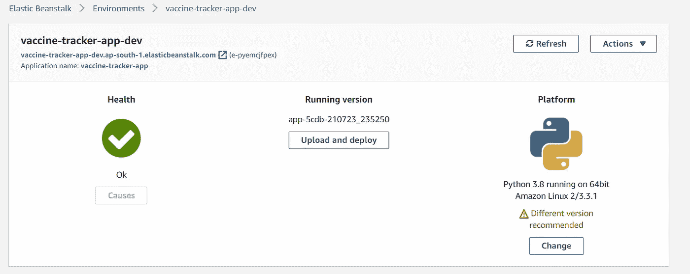
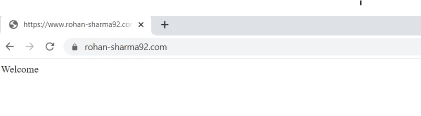
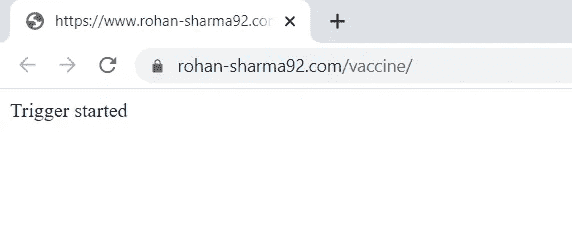

# 疫苗追踪器:电报聊天机器人(第二部分)

> 原文：<https://medium.com/analytics-vidhya/vaccine-tracker-a-telegram-chat-bot-part-2-3907c4243b74?source=collection_archive---------6----------------------->

# 介绍

在之前的[帖子](https://ronsharma1992.medium.com/vaccine-tracker-a-telegram-chat-bot-6bbf5ec66b18)中，我已经解释了疫苗追踪器的设计以及它如何部署在任何本地机器上。在这篇文章中，我将分享一个使用 Heroku 和 Amazon Web Services 的 telegram 聊天机器人的可扩展和无服务器部署。

# 与 Heroku 的经历

[Heroku](https://www.heroku.com/what) 是 Salesforce 推出的一款以应用为中心的云平台，可实现快速便捷的应用部署。所提供的免费服务对于部署个人项目或测试任何新应用程序来说都绰绰有余。然而，我们得到的最大优势是，使用 Heroku 部署的任何 web 应用程序都可以使用 HTTPS URL 自动访问，这是我们的聊天机器人的强制要求，如前所述。

然而，在我们的应用程序中使用 Heroku 有一些限制，其中之一是它只在欧洲和北美地区提供云资源。由于我们的应用程序正在请求来自 REST APIss 的数据，REST API 可从 [**Cowin**](https://apisetu.gov.in/public/marketplace/api/cowin#/) 获得，这些数据不能从印度以外的 IPs 访问，并返回一个 [**HTTP 403**](https://httpstatuses.com/403) 错误。

我发现[这篇](https://www.toptal.com/python/telegram-bot-tutorial-python)帖子对于使用 Heroku 部署一个电报聊天机器人很有用，如果上面的限制不存在，那就去看看吧。

# 出路:亚马逊网络服务

亚马逊在亚太(孟买)地区有一个可用区，因此为部署疫苗跟踪器 bot 提供了一个可行的选择。然而，选择 AWS 作为云提供商确实会给应用程序带来另一个问题。默认情况下，部署在 AWS 实例上的 web 应用程序可以使用公共 HTTP URL 在互联网上公开，但是我们的应用程序也需要支持 HTTPS。我们稍后会解决这个问题，但是首先我们需要在 AWS 上安装我们的聊天机器人。Amazon 通过 [AWS Elastic Beanstalk](https://aws.amazon.com/elasticbeanstalk/) 为 web 应用程序提供了一种非常有效的方法，我也将它用于部署。

## 弹性豆茎

[AWS Elastic Beanstalk](https://aws.amazon.com/elasticbeanstalk/) 是一种在 AWS 云上部署 web 应用程序的快速而简单的方法。使用这种方法最重要的好处是，它没有额外的成本，产生的成本仅来自部署中涉及的底层资源，如实例、负载平衡器、存储和监控。另一个优势是 [AWS Elastic Beanstalk](https://aws.amazon.com/elasticbeanstalk/) 自己管理应用平台的基础设施和扩展操作，因此减少了开发团队的工作量，并允许开发人员更多地关注应用逻辑。

## 配置 EB CLI

我假设你已经创建了一个 AWS 账户，但是如果你还没有，有足够的[资源](https://aws.amazon.com/premiumsupport/knowledge-center/create-and-activate-aws-account/)可以创建一个。

Elastic Beanstalk 提供了一个易于使用且功能强大的 CLI 来管理多种环境和应用程序，可以按照此处[的说明进行安装。此外，为访问键配置必要的权限也很重要，因为它将在部署应用程序的 Elastic Beanstalk 控制台中使用。](https://docs.aws.amazon.com/elasticbeanstalk/latest/dg/eb-cli3-install.html)

## 为 Webhooks 配置域名

如前所述，我们的 telegram bot 需要一个 HTTPS URL 来配置 telegram 事件的 webhooks，因此，我们需要一个 SSH/TLS 证书作为我们的 URL。AWS 通过 Amazon Certificate Manager 免费提供公共 SSL/TLS 证书，因此，这是推荐的方式。

在提供证书之前，我们需要提供一个注册的公共域名。有相当多的域名注册商，如 GoDaddy、Cloud Flare 等。但是由于我们将使用 AWS 资源进行部署，所以使用 Amazons 自己的 DNS 服务——route 53 要容易得多。Route 53 提供域名注册，这使得与其他 AWS 资源的设置变得容易。通过 Route53 获得域名很简单，详细说明可以在[这里](https://docs.aws.amazon.com/Route53/latest/DeveloperGuide/registrar.html?icmpid=docs_console_unmapped)找到。

53 号公路的域名注册

## 亚马逊证书管理器

该域名现在可用并注册到 DNS 注册中心。但是，要通过 HTTPS 提供内容，注册的域名需要注册证书颁发机构颁发的 SSL 证书。因为，我们已经广泛地将 AWS 用于其他资源，Amazon Certificate Manager 是一个可行的选择，因为它为 ACM 管理的资源(如弹性负载平衡器、API 网关等)颁发公共证书。免费的。

要创建证书请求，需要域名和验证选项。验证选项可以通过电子邮件或 DNS 进行。在我们的例子中，域是通过 Route53 注册的，因此通过 DNS 进行验证是首选。另一个技巧是在证书中指定域名时使用通配符，如*。rohan-sharma92.com。这将确保证书对任何子域有效，如果将来需要使用的话。

对于通过 DNS 进行的验证，在 AWS 中添加证书颁发请求后，可以下载 CSV 文件。CSV 文件是一个 DNS 配置，其中包含添加 CNAME 记录的信息。为了完成验证，需要使用 CSV 文件中提供的值在 Route53 中添加一个 CNAME 记录。AWS 提供了一组详细的指令来完成此操作[这里是](https://docs.aws.amazon.com/acm/latest/userguide/dns-validation.html)。

## 弹性豆茎:部署配置

对于通过 EB 部署应用程序， **EB Cli** 是一种便捷的方式。这可以通过在应用程序目录中运行以下步骤命令来完成:

1.创建应用程序

在 elastic beanstalk 中的应用程序可以看作是项目的同义词。因此，为了初始化应用程序， **eb init** 是首先需要运行的命令，指定应用程序名称和其他基本配置，如设置 SSH 密钥、代码提交等。这也将创建一个在 AWS EB web 控制台中可见的应用程序。

2.配置环境

在 elastic beanstalk 中，环境包含应用程序的平台配置。要设置环境，运行 **eb create** 命令，并在后续提示中指定配置设置，如实例详细信息、实例缩放范围等。因为这是一个相当轻量级的应用程序，所以 t2 micro 和 t2 nano 实例被配置为用于部署。

3.部署环境

一旦环境配置完成，应用程序准备好安装， **eb deploy** 是将环境部署到 AWS 上的命令。

EB CLI

一旦部署成功，就可以在 AWS 控制台中看到应用程序和环境以及部署状态。AWS 知识库有大量关于其他 **eb cli** 命令的信息以及示例，可以在[这里](https://docs.aws.amazon.com/elasticbeanstalk/latest/dg/eb3-cmd-commands.html)访问。

对于使用 flask 部署 python web 应用程序，Elastic Beanstalk 会自己处理大部分事情，只需要一个 requirements.txt 来指定外部[依赖关系](https://docs.aws.amazon.com/elasticbeanstalk/latest/dg/python-configuration-requirements.html)以及 python 应用程序的入口点。

## 配置环境属性

要使用 EB 完成 bot 的部署，需要配置以下环境属性:

1.  令牌:电报机器人令牌。
2.  Webhook URL:用于接收电报 API 事件的 https URL

## 配置负载平衡器

在配置负载平衡器之前，必须预先设想应用程序的架构，以确定路由流量的端点。疫苗跟踪器大量使用 python-telegram-bot 库提供的基础设施，处理通过 web 钩子接收的对话和更新。这个库提供了一个内置的 http 服务器，用于监听和向 telegram API 发送事件。服务器通过这里讨论的附加处理程序管理对话事件的不同阶段。

默认情况下，EB 为部署的应用程序创建一个应用程序负载平衡器。应用程序负载平衡器基于不同的参数(如/route、端口和协议)来路由流量。除此之外，应用程序负载平衡器应该能够访问预定义的路径来进行健康检查。对于健康检查，定期在指定的路由上发出 GET 请求，以检查资源的状态。如果在任何故障转移情况下需要，这是触发纵向扩展实例所必需的。

## API 端点

该 bot 公开了两个 API 端点:

1.  /:它是默认情况下用于运行状况检查的根端点。
2.  /vaccine:触发启动 bot。

为了将流量路由到这些端点，负载平衡器也需要配置这些 as 进程。任何进程也将定期进行健康检查，因此健康检查路径应该响应 Http GET 请求。

## 在负载平衡器上配置 SSH 请求

默认情况下，从 EB 部署的应用程序负载平衡器支持 Http 请求。为了支持 HTTPS 请求，需要在负载平衡器上配置一个 SSL/TLS 侦听器(端口 443)。之前创建的 SSL 证书也将用于配置该侦听器。这将确保负载平衡器能够将 Https 请求从电报服务器转发到我们的 bot 应用服务器。

## 反向代理

反向代理可以被视为实际 web 服务器前面的中间服务，负责将客户端请求转发到 web 服务器，就好像这些请求是由它自己发起的一样。对于通过 EB 部署的基本 flask 应用程序，标准的反向代理配置可能就足够了，因为它将请求转发到 Flask 对象创建时指定的端口。然而，在我们的 bot 中，内部 web 服务器运行在不同的端口上(默认情况下是 3298)，因此，需要反向代理配置来将请求转发到正确的端口。

Elastic Beanstalk 使用 Nginx 作为部署中的默认反向代理服务器。然而，在 EB 中配置 Nginx 并不简单，需要大量的工作，主要是因为互联网上的信息很分散。我将解释我对在 EB 中配置 Nginx 的理解，具体到我们的 bot 的需求。

## 设置反向代理

AWS Elastic Beanstalk 在实例上默认使用 Amazon Linux 2 平台。反向代理配置必须出现在**中。亚马逊 Linux 2 平台 EB 项目的平台**目录。反向代理配置的目标是将 http/https GET 请求路由到应用程序的“ **/** ”端口 5000，并将所有其他类型的请求转发到应用程序服务器的端口 3298(默认端口)。为此，需要修改以下配置文件:

1.  **nginx . conf**:nginx . conf**文件位于里面。平台目录，并保存所有端点的通用代理配置。这将覆盖默认的 nginx 配置文件。**

**nginx 配置**

**2. **00_application.conf** :该文件存在于**中。platform \ nginx \ conf . d \ elastic beanstalk**目录(如果不存在，需要手动创建一次)。这些文件的命名约定很重要，因为它决定了这些配置的执行顺序。标准命名惯例是确保在创建新文件时将序列号作为前缀。这些文件还提供了对端点代理配置的更细粒度的控制。**

**00 _ 应用程序. conf**

## **最后一击**

**正确配置后，部署应该会成功。**

****

**成功的应用程序部署**

**此外，该机器人可以通过互联网访问。**

****

**可通过互联网访问的机器人**

**要启动这个机器人，我们需要为它提供一个一次性触发器。触发器配置有端点**/疫苗**来启动 bot 的内部 web 服务器。内部 web 服务器通过[这个](https://www.rohan-sharma92.com/vaccine/) URL 手动启动。**

****

**启动机器人的触发器**

# **资源**

1.  **试用疫苗追踪机器人:[http://t.me/cowin_vaccine_tracking_bot](http://t.me/cowin_vaccine_tracking_bot)**
2.  **了解更多电报机器人:【https://core.telegram.org/bots **
3.  **弹性豆茎:[https://docs . AWS . Amazon . com/elastic Beanstalk/latest/DG/getting started . html](https://docs.aws.amazon.com/elasticbeanstalk/latest/dg/GettingStarted.html)**
4.  **疫苗追踪器:一个电报聊天机器人(第一部分):[https://medium . com/analytics-vid hya/vaccine-Tracker-A-telegram-chat-bot-6 bbf 5 EC 66 b 18](/analytics-vidhya/vaccine-tracker-a-telegram-chat-bot-6bbf5ec66b18)**