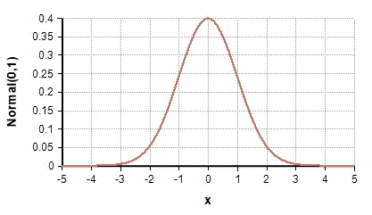

# 很快就到 VAE 了

> 原文：<https://medium.com/analytics-vidhya/vae-in-no-time-8084158ce66d?source=collection_archive---------7----------------------->

参观:[amitnikhade.com](https://amitnikhade.com/)


[演职员表](https://unsplash.com/photos/R9rFKy_AVbw?utm_source=unsplash&utm_medium=referral&utm_content=creditShareLink)

[*theamitnikhade*](https://medium.com/u/8cc2ede908a6?source=post_page-----8084158ce66d--------------------------------)

# 快速浏览变型自动编码器(VAE)

最近，[生成模型](https://developers.google.com/machine-learning/gan/generative#:~:text=A%20generative%20model%20includes%20the,to%20a%20sequence%20of%20words.)因其最先进的性能获得了巨大的关注，因此在市场上获得了巨大的重要性，并被广泛使用。变分自动编码器是用于学习潜在表示的深度学习技术，它们是无监督学习的最好方法之一。VAE 在生成各种数据方面取得了非凡的成果。

# 自动编码器(AE)一览

Autoencoder 包括编码器、解码器和瓶颈。编码器简单地将输入转换为瓶颈中最低维度的数字表示，以吸收其显著特征，解码器从几乎类似于输入的表示中重建回输出。

自动编码器旨在最小化重建损失。[重建损失](https://machinelearningmastery.com/loss-and-loss-functions-for-training-deep-learning-neural-networks/)是原始数据和重建数据之间的差异。

L [2 损失函数](https://afteracademy.com/blog/what-are-l1-and-l2-loss-functions)用于计算 AE 中的损失。即真实值和预测值之间所有平方差的总和。


l2 损失

自动编码器的应用包括[去噪](https://towardsdatascience.com/introduction-to-image-denoising-3e269f176483)、[降维](https://machinelearningmastery.com/dimensionality-reduction-for-machine-learning/#:~:text=Dimensionality%20reduction%20refers%20to%20techniques%20for%20reducing%20the,input%20variables%20in%20training%20data.&text=Fewer%20input%20dimensions%20often%20mean,to%20as%20degrees%20of%20freedom.)等。

# 变化的自动编码器一览

VAE 也是一种自动编码器，它不仅可以重构输出，还可以生成新的内容。明确地说，VAE 是一个生成模型，而自动编码器不是。自动编码器通过最小化从输入和重建图像计算的*重建损失*来学习将输入转换为某种向量表示，另一方面，VAE 通过最小化重建以及 [***KL 发散损失***](https://machinelearningmastery.com/divergence-between-probability-distributions/#:~:text=KL%20divergence%20can%20be%20calculated,x)%20%2F%20P(x))) 来生成输出，发散损失是实际和观察到的概率分布之间的差异，它是对称分数以及两个概率分布之间的距离度量，根据 VAE，它告诉学习的分布是否离正态分布不远[。](https://www.mathsisfun.com/data/standard-normal-distribution.html)


k-l 散度

以上就是 ***k-l*** 空间上分布 ***P*** 和 ***Q*** 之间的散度 *χ*

*变分自动编码器可以被定义为这样一种自动编码器，其训练被正则化以避免过拟合问题，并且它确保潜在空间吸收产生一些独特和独特结果的丰硕结果。*


图 1.1 VAE 建筑

变分自动编码器由编码器、解码器和损失函数组成。编码器和解码器是简单的神经网络。当输入数据 X 通过编码器时，编码器输出潜在状态分布( [*均值* **μ** *，方差* **σ**](https://byjus.com/jee/mean-and-variance/#:~:text=Mean%20and%20variance%20is%20a,observation%20are%20scattered%20and%20distributed.) *)，从中采样一个矢量* ***Z*** *)。我们总是假设潜在分布总是高斯分布。输入的* ***x*** *被编码器压缩成更小的尺寸。这通常被称为瓶颈或潜在空间。从中随机抽取一些数据，通过* [*反向传播*](https://brilliant.org/wiki/backpropagation/#:~:text=Backpropagation%2C%20short%20for%20%22backward%20propagation,to%20the%20neural%20network's%20weights.) *对样本进行解码，得到一个新的生成变量。*



高斯(正态)分布[【来源】](https://www.google.com/url?sa=i&url=https%3A%2F%2Fwiki.analytica.com%2Findex.php%3Ftitle%3DNormal_distribution&psig=AOvVaw0jUMrhalIkqubJpybG9tfQ&ust=1621535823275000&source=images&cd=vfe&ved=0CAIQjRxqFwoTCIi26uqx1vACFQAAAAAdAAAAABAD)

# 重新参数化技巧

在分布被抛出编码器之后，样本由随机节点选择，这使得反向传播不可能。我们需要反向传播编码器-解码器模型以使其学习。为了克服反向传播，我们使用带有均值和方差的ε(**ε**)来保持随机性。所以，我们也可以选择一个随机样本，学习潜在的分布状态。在迭代期间，ε保持随机样本，并且编码器输出的参数被更新。


图 1.2 [ [来源](https://www.google.com/url?sa=i&url=https%3A%2F%2Ftowardsdatascience.com%2Freparameterization-trick-126062cfd3c3&psig=AOvVaw303cuxrTo2DRaFVa7ag4ZA&ust=1621536311382000&source=images&cd=vfe&ved=0CAIQjRxqFwoTCNCd09Cz1vACFQAAAAAdAAAAABAD) ]

在分布被抛出编码器之后，样本由随机节点选择，这使得反向传播不可能。我们需要反向传播编码器-解码器模型以使其学习。为了克服反向传播，我们使用带有均值和方差的ε(**ε**)来保持随机性。所以，我们也可以选择一个随机样本，学习潜在的分布状态。在迭代期间，ε保持随机样本，并且编码器输出的参数被更新。

# 履行

让我们试着用 PyTorch 用 [MNIST 数据](http://yann.lecun.com/exdb/mnist/)在我们的代码中实现 VAE。


【[来源](https://www.google.com/url?sa=i&url=https%3A%2F%2Fwww.pinterest.com%2Fpin%2F567523990538356835%2F&psig=AOvVaw2Iu9WO9036SzZyOInsl6nM&ust=1621536019984000&source=images&cd=vfe&ved=0CAIQjRxqFwoTCIjkpeuy1vACFQAAAAAdAAAAABAD)

用 Torchvision 安装 PyTorch

```
#command line>> pip3 install pip install torch==1.7.1+cpu torchvision==0.8.2+cpu torchaudio===0.7.2 -f [https://download.pytorch.org/whl/torch_stable.html](https://download.pytorch.org/whl/torch_stable.html)>> pip3 install numpy
```

**导入库**

```
import torchvision.transforms as transformsimport torchvision

from torchvision.utils import save_imagefrom torch.utils.data import DataLoaderimport torchimport numpy as npimport torch.nn as nnimport torch.optim as optim
```

**准备数据**

我们使用的是 MNIST 数据集，因此我们将通过将其大小调整为 32x32 并转换为张量来对其进行转换。使用有史以来最好的 PyTorch 数据加载器(每批 64 个)准备好数据

```
transform = transforms.Compose([transforms.Resize((32,32)),transforms.ToTensor(),])trainset = torchvision.datasets.MNIST(root='./', train=True, download=True, transform=transform)trainloader = DataLoader(trainset, batch_size=64, shuffle=True)testset = torchvision.datasets.MNIST(root='./', train=False, download=True, transform=transform) 
```

MNIST 图像有一个 28x28 像素的单通道。

根据我们的要求定义要使用的设备

```
dev = torch.device("cuda:0" if torch.cuda.is_available() else "cpu")
```

**定义损失函数**

```
def final_loss(bce_loss, mu, logvar): BCE = bce_loss 
    KLD = -0.5 * torch.sum(1 + logvar - mu.pow(2) - logvar.exp())
    return BCE + KLD
```

损失是 [Kullback-Leibler 散度](https://en.wikipedia.org/wiki/Kullback%E2%80%93Leibler_divergence)和[二元交叉熵](https://towardsdatascience.com/understanding-binary-cross-entropy-log-loss-a-visual-explanation-a3ac6025181a)的总和

**定义参数**

```
z_dim =20lr = 0.001criterion = nn.BCELoss(reduction='sum')epochs = 1batch_size = 64
```

**创建可变自动编码器模型**

编码器由[卷积](https://en.wikipedia.org/wiki/Convolution#:~:text=In%20mathematics%20(in%20particular%2C%20functional,the%20process%20of%20computing%20it.)、[批量归一化](https://machinelearningmastery.com/batch-normalization-for-training-of-deep-neural-networks/)层和[泄漏 relu 组成。](https://machinelearningmastery.com/rectified-linear-activation-function-for-deep-learning-neural-networks/)编码器的输出是均值向量和标准差向量。

```
**class** VAE(nn.Module):
    **def** __init__(self):
        super(VAE, self).__init__() *#encoder* self.conv1 **=** nn.Conv2d(1 ,8 ,4 ,stride **=**2 ,padding **=**1 ) self.BN1 **=** nn.BatchNorm2d(8) self.af1 **=** nn.LeakyReLU() self.conv2 **=** nn.Conv2d(8 ,16 ,4 ,stride **=**2 ,padding **=** 1) self.BN2 **=** nn.BatchNorm2d(16) self.af2 **=** nn.LeakyReLU() self.conv3 **=** nn.Conv2d(16 ,32 ,4 ,stride **=**2 ,padding **=** 1) self.BN3 **=** nn.BatchNorm2d(32) self.af3 **=** nn.LeakyReLU() self.conv4 **=** nn.Conv2d(32 ,64 ,4 ,stride **=**2 ,padding **=** 0) self.BN4 **=** nn.BatchNorm2d(64)

        self.af4 **=** nn.LeakyReLU()
```

提供平均值和对数方差值的全连接层(**瓶颈部分**

```
 self.fc1 **=** nn.Linear(64,128) self.fc_mu **=** nn.Linear(128, z_dim) self.fca1 **=** nn.LeakyReLU() self.fcd1 **=** nn.Dropout(0.2) self.fc_log_var**=** nn.Linear(128, z_dim) self.fca2 **=** nn.LeakyReLU() self.fcd2 **=** nn.Dropout(0.2)
```

解码器只是重构采样的潜在向量表示，并产生原始表示的新变体。

```
​ self.fc2 **=** nn.Linear(z_dim, 64) self.da1 **=** nn.LeakyReLU() self.dd1 **=** nn.Dropout(0.2)​ self.deu1 **=** nn.UpsamplingNearest2d(scale_factor**=**2) self.dec1 **=** nn.ConvTranspose2d(64 ,64 ,4 ,stride **=**2 ,
                   padding **=** 0) self.deb1 **=** nn.BatchNorm2d(64) self.dea1 **=** nn.LeakyReLU() self.deu2 **=** nn.UpsamplingNearest2d(scale_factor**=**2) self.dec2 **=** nn.ConvTranspose2d(64 ,32 ,4 ,stride **=**2 ,
                   padding **=** 1) self.deb2 **=** nn.BatchNorm2d(32) self.dea2 **=** nn.LeakyReLU() self.deu3 **=** nn.UpsamplingNearest2d(scale_factor**=**2) self.dec3 **=** nn.ConvTranspose2d(32 ,16 ,4 ,stride **=**2 ,
                   padding **=** 1) self.deb3 **=** nn.BatchNorm2d(16) self.dea3 **=** nn.LeakyReLU() self.deu4 **=** nn.UpsamplingNearest2d(scale_factor**=**2) self.dec4 **=** nn.ConvTranspose2d(16 ,1 ,4 ,stride **=**2 ,
                   padding **=** 1) self.dea4 **=** nn.Sigmoid()​
```

随机向量是从平均向量和标准偏差中抽样出来的。通过应用[上采样和转换图层](https://machinelearningmastery.com/upsampling-and-transpose-convolution-layers-for-generative-adversarial-networks/)进一步重建，我使用了上采样和转换图层，得到了更好的结果。

```
**def** sampling(self, mu, log_var): std **=** torch.exp(log_var **/** 2) epsilon **=** torch.randn_like(std) **return** mu **+** epsilon ***** std​**def** forward(self, x): *#creating encoder* X **=** self.conv1(x) x **=** self.BN1(X) x **=** self.af1(x) x **=** self.conv2(x) x **=** self.BN2(x) x **=** self.af2(x) x **=** self.conv3(x) x **=** self.BN3(x) x **=** self.af3(x) x **=** self.conv4(x) x **=** self.BN4(x) x **=** self.af4(x) x **=** x.view(x.size()[0], **-**1) x **=** self.fc1(x) mu **=** self.fc_mu(x) mu **=** self.fca1(mu) mu **=** self.fcd1(mu) log_var **=** self.fc_log_var(x) log_var **=** self.fca2(log_var) log_var **=** self.fcd2(log_var) *#creating sampling* z **=** self.fc2(self.sampling(mu, log_var)) z **=** self.da1(z) z **=** self.dd1(z) z **=** z.view(**-**1,64,1,1) *#creating decoder* d **=** self.dec1(z) d **=** self.deb1(d) d **=** self.dea1(d) d **=** self.dec2(d) d **=** self.deb2(d) d **=** self.dea2(d) d **=** self.dec3(d) d **=** self.deb3(d) d **=** self.dea3(d) d **=** self.dec4(d) recontruction **=** self.dea4(d) **return** recontruction, mu, log_var 
```

**配置设备**

```
device = dev
model = VAE().to(device)
```

**定义优化器**

```
optimizer = optim.Adam(model.parameters(), lr=lr)
```

**开始训练**

```
grid_images = []
train_loss = []
valid_loss = []  def validate(model, dataloader, dataset, device, criterion):
    model.eval()
    running_loss = 0.0
    counter = 0
    with torch.no_grad():
        for i, data in tqdm(enumerate(dataloader),   total=int(len(dataset)/batch_size)):
            counter += 1
            data= data[0]
            data = data.to(device)
            reconstruction, mu, logvar = model(data)
            bce_loss = criterion(reconstruction, data)
            loss = final_loss(bce_loss, mu, logvar)
            running_loss += loss.item()

            # save the last batch input and output of every epoch
            if i == int(len(dataset)/batch_size) - 1:
                recon_images = reconstruction
    val_loss = running_loss / counter
    return val_loss, recon_imagesdef train(model, dataloader, dataset, device, optimizer, criterion):
    model.train()
    running_loss = 0.0
    counter = 0
    for i, data in tqdm(enumerate(dataloader), total=int(len(dataset)/batch_size)):
        counter += 1
        data = data[0]
        data = data.to(device)
        optimizer.zero_grad()
        reconstruction, mu, logvar = model(data)
        bce_loss = criterion(reconstruction, data)
        loss = final_loss(bce_loss, mu, logvar)
        loss.backward()
        running_loss += loss.item()
        optimizer.step()
    train_loss = running_loss / counter 
    return train_losscount = 0
for epoch in range(epochs):
    count = count+1
    if count == epochs:
    train_epoch_loss = train(
        model, trainloader, trainset, device, optimizer, criterion
    )
    valid_epoch_loss, recon_images = validate(
        model, testloader, testset, device, criterion
    )
    train_loss.append(train_epoch_loss)
    valid_loss.append(valid_epoch_loss)

    save_image(recon_images.cpu(), f"./output{epoch}.jpg") image_grid = make_grid(recon_images.detach().cpu())
    grid_images.append(image_grid) print(f"Train Loss: {train_epoch_loss:.4f}")
    print(f"Val Loss: {valid_epoch_loss:.4f}") 
```

在这里，我们的模型被训练，我们的重建图像被保存到定义的路径中。下图是我经过 5 个历元后得到的重建图像。

## 模型预测法


图 P1


图 P2

## 尝试的事情

尝试使用您自己定制的图像数据重建图像。希望你可以得到一些令人惊讶的结果，只是尝试超调模型与不同的组合。尝试增加纪元的数量。尝试玩 Z dim，学习率，卷积层，步幅，等等。

## 结论

> 如果使用大量数据和适当的计算能力，VAE 可以做得更多。

## 参考

 [## 自动编码变分贝叶斯

### 我们如何在有向概率模型中进行有效的推理和学习，在连续的…

arxiv.org](https://arxiv.org/abs/1312.6114)  [## 变分自动编码器简介

### 变分自动编码器提供了一个学习深层潜变量模型和相应的原理框架

arxiv.org](https://arxiv.org/abs/1906.02691) [](/vitrox-publication/generative-modeling-with-variational-auto-encoder-vae-fc449be9890e) [## 带有可变自动编码器的创成式建模(VAE)

### 理解变分自动编码器背后的直觉(VAE)

medium.com](/vitrox-publication/generative-modeling-with-variational-auto-encoder-vae-fc449be9890e) 

我的 GitHub:[https://github.com/AmitNikhade](https://github.com/AmitNikhade/VAE_RCimages/blob/master/src/Model/model.py)

链接到代码:[https://github.com/AmitNikhade/VAE_RCimages](https://github.com/AmitNikhade/VAE_RCimages/blob/master/src/Model/model.py)

在 LinkedIn 上关注我

如果你喜欢这个解释并认为它有用，请鼓掌。谢了。