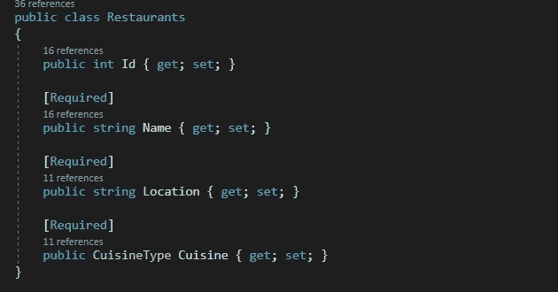
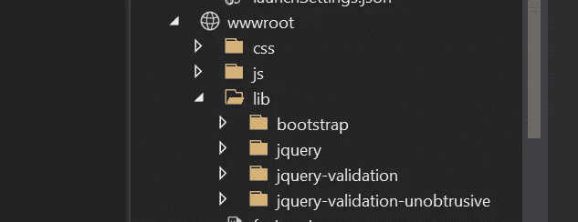
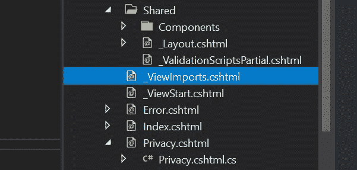
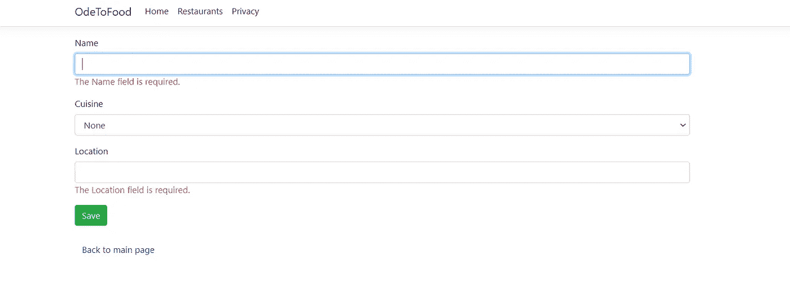
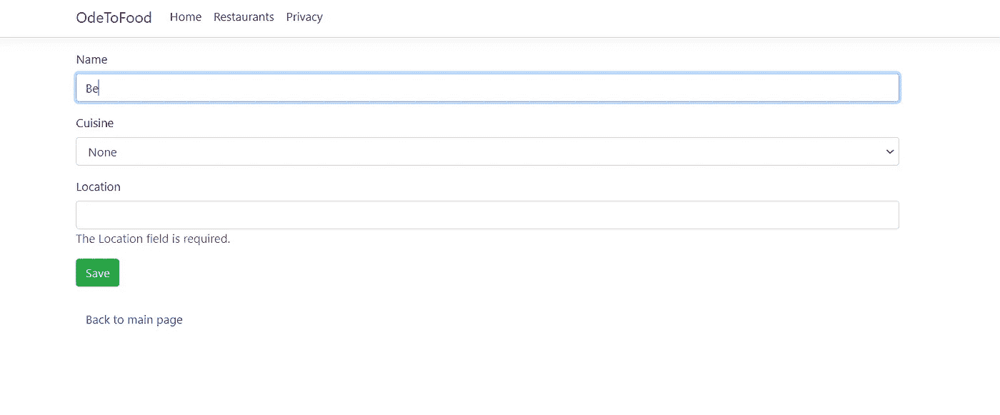

# ASP.NET 核心中的验证

> 原文：<https://medium.com/analytics-vidhya/validations-in-asp-net-core-11d40b267214?source=collection_archive---------0----------------------->

在您的 ASP.NET 核心应用程序中添加服务器端和客户端验证


照片由[福蒂斯·福托普洛斯](https://unsplash.com/@ffstop?utm_source=medium&utm_medium=referral)在 [Unsplash](https://unsplash.com?utm_source=medium&utm_medium=referral) 拍摄

ASP.NET 核心中的验证是**组件模型的一部分。DataAnnotations** 名称空间。它们可以被添加到我们的模型属性中，并进一步用于在 POST 操作期间向服务器提交数据时验证来自用户的输入。

默认情况下，有很多内置的验证，包括 EmailAddress、Phone、Range、RegularExpression、Required 等。我在我的餐馆类中为**【Required】**做了一些工作，确保属性有一些数据与之相关联。类似地，我们也可以添加其他内容，如[StringLength(100)]或[EmailAddress]

我们还可以使用 ErrorMessage 来设置验证触发时要显示的内容，例如:**[必填(ErrorMessage = "请输入名称")]**



在模型属性上添加验证

现在，我们可以在我们的属性上添加一个带有 **asp-validator-for** 的 span(它为我们设置了 **value** 和 **name** 属性)到我们的 razor 视图中，我们希望验证被触发，并在用户发布的数据无效时向最终用户显示一些消息。

作为一个例子，我已经共享了两个验证消息，它们用于我的餐馆类的名称和位置属性。

```
1\. <span asp-validation-for="Restaurant.Name" class="text-danger"></span>2\. <span asp-validation-for="Restaurant.Location" class="text-danger"></span>
```

我们可以添加下面的代码，在服务器端检查用户提交的数据是否有效(根据我们的验证)。这可以在下面代码的帮助下完成:

```
if(ModelState.IsValid) {//enter logic when data POSTed by user is valid
}return View();
```

`ModelState`是一个`Controller`实例的属性，可以从任何从 Microsoft . aspnetcore . MVC . controller 继承的类中访问。`ModelState`有两个用途:存储和提交提交的名称-值对，以及存储与每个值相关联的验证错误。

但是使用这种方法有一个问题。每次我们都要打电话给服务器，检查用户发布的数据是否有效。最好还设置一个客户端验证检查，这样可以最大限度地减少服务器端调用。

对于客户端验证，我们首先需要 **jquery-validation** 和**jquery-validation-obtructive**库，以及我们的通用 jquery 和引导库。英寸 NET Core，这些要加在 lib 文件夹的 **wwwroot** 里。



为客户端验证添加了 jquery-validation 和 jquery-validation-obtructive 库

然后，我们需要在 our _ViewImports.cshtml 中添加对 jquery.validate.min.js 和 jquery . validate . obtructive . min . js 的引用，以便它们可以在整个应用程序中使用。



显示 _ViewImports.cshtml 文件的屏幕截图

下面的代码显示了如何在共享文件夹的局部视图中引用它们:

```
<script src="~/lib/jquery-validation/dist/jquery.validate.min.js"></script><script src="~/lib/jquery-validation-unobtrusive/jquery.validate.unobtrusive.min.js"></script>
```

我将局部视图命名为 _ validationscriptspatial . cs html，只需使用下面的代码，就可以在应用程序的任何地方引用它:

```
@section Scripts{<partial name="_ValidationScriptsPartial"/>}
```

我在视图中引用了我需要通过填充和发布它的细节来创建一个新餐馆的地方。



客户端验证甚至在点击保存之前就被触发了

正如您在我的 web 应用程序的两个图像中看到的，甚至在我单击 Save 按钮并进行服务器调用之前，客户端验证就已经被触发了。

此外，在我开始在名称输入中输入一些内容之后，随着模型属性变得有效，验证消息逐渐消失。



在我开始在输入字段中输入内容之后，模型属性名称变得有效

如果你喜欢读这篇文章，**为它鼓掌**。如果你对**有任何问题或建议**，可以在评论区联系我。