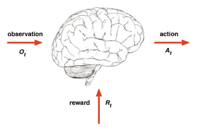
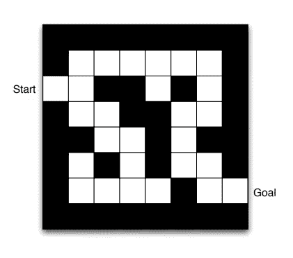
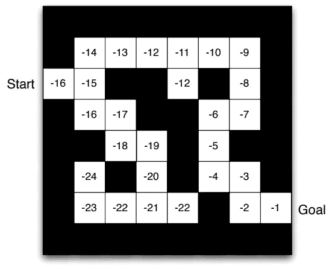
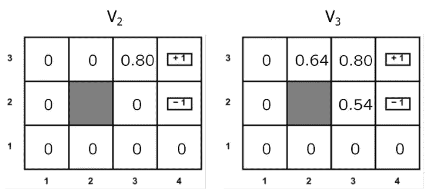
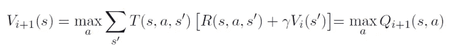

# 价值迭代和策略迭代

> 原文：<https://medium.com/analytics-vidhya/value-iteration-policy-iteration-1e133e3a1bfa?source=collection_archive---------9----------------------->

虽然 AI 不是一个新的话题，但新算法的实施，更快计算机的创造，以及在这一领域的投资，推动了人工智能相关工作在今天的普及。这种情况导致许多人对人工智能感兴趣，不管他们是否从事 IT 行业。因为有些人更可能倾向于做一些受欢迎的，看起来很花哨的事情。当然，这一点也不坏，但有时会引起误解。比如对某些人来说，人工智能只是机器学习。所以每当日常谈话的话题涉及到 ai 的时候，他们都会谈到回归、分类等等。由于机器学习相关的工作非常受欢迎，他们搜索了一下，找到了几乎每个初学者课程中教授的算法。

人工智能是比机器学习大得多的东西，不仅仅是回归模型，也不仅仅是谷歌的 PageRank 算法。另外，它不一定是面向数据的。有些技术并不把数据作为这个过程的第一个工具。对我来说，这是人工智能最好的一点。因为它不仅仅是统计学或者数学，它本身也有一些计算机科学的点。你可以从数据集中提取一些信息。但是您也可以从新的或现有的技术中提取其他信息。例如，你可以使用图形表示作为人工智能技术，并创建一个自治系统来计算文档中句子之间的相似性，并将它们分类为不同的主题类别。你不需要一个 CSV 文件，因为有些人习惯于看到，你不要在这个文件中寻找一个隐藏的模式，包括输入数据集。我想提到的是，当我们谈论人工智能时，我们需要从一个普遍的角度来看。

# **什么是代理？**

让我们假设你是负责决定一项任务的人，这项任务可能以成功或失败结束，你没有关于这项任务的任何信息(你以前没有做过任何类似的事情)。你做的第一件事就是采取一个行动，不管是大是小，如果你周围没有人问的话。然后你得到一个关于它的观察。比如在一个寒冷的房间里，你有取暖的任务，房间里有炉子。动作一是摸炉子暖手。但是你没有完成任务。因为那不是你想要的，现在你的手已经严重受伤了。所以行动 1 的结果对你非常不利。现在你至少在行动清单上有了行动。现在是行动 2 的时候了。你需要站在炉子旁边，等着暖和起来。行动 2 的结果是成功的。因为你现在很温暖，很幸福，你知道行动 2 比行动 1 好得多。因此，在这种情况下，当你必须在它们之间做出选择时，你会毫不犹豫地选择行动 2。

在这种情况下，您就是代理本身。因为你做了决定(行动)并观察了每个决定的结果(奖励，积极的或消极的)。在前两个行动之后，你的待办事项列表上有两个行动，你知道它们的回报(观察)。

图 1:行动、奖励和观察

你是代理人，你用来寻找最佳取暖方式的技术是强化学习。根据这种技术，代理被用来拥有关于它被创建的环境的经验。它会记住每一个地点、行动和奖励，并能够进行迭代以更新每一步的结果(在某些情况下，你可能会有所收获，但也会有所损失。因此，您当前的步骤可能会影响多个最终步骤。因为这意味着存在依赖性，所以您可能需要更新您的观察值)。

# 什么是策略？

现在假设你是一个迷宫赛跑者，你在一些你能向前、向后、向上或向下移动的积木之间跑。你现在在第一区，这是你的起点，你必须进入另一个区。因为你想逃离迷宫。所以你此时的行为就是你当前街区的政策。您的策略可能是↑、→、↓或↓之一。

图 2:迷宫的第一种状态

图 3:迷宫中每个街区对跑步者(或代理)的策略

# 什么是迭代？

你会看到迷宫中的一些箭头，如图 3 中的*所示。你可以问这些箭头是如何设置的，因为这个任务必须有一个自动代理，而自动代理没有人类的感觉，所以它们需要一些数学解释来解释它们的结果。*

迷宫的每个区块都有一个区块分数，作为这些策略的后端过程。代理通过检查其周围的状态(块)值来为其当前状态创建其策略，并且它试图将具有最高值的最苛刻的相邻块移动到其一步远的块周围。(在某些研究中，选择算法可能会发生变化，但通常情况下，上述算法是假设的)。代理为状态值为-15 的第二个块创建策略。因为它的下一步列表中最大的数字是-14。所以它想向上移动。

图 4:迷宫中状态的值

迭代是在时间 T1 计算迷宫中的所有方块。所以我们可以称这个迭代为第一次迭代。并且代理在 T2 时间执行另一次迭代。但是这一次他使用了他以前的块值，因为它们是任务中代理的观察值，并且它在它的经验和新的观察值之间创建了一个联系。

# 迭代何时结束？

正如本文的主题，有两种迭代类型，即价值迭代和策略迭代。对于每次迭代，块值和策略被更新。有时，策略可能会因数据块值的变化而改变。

在策略迭代中，迭代继续执行，而在最后一次迭代中至少有一个策略被更新。如果没有策略更新，则无论块值是否更新，迭代都会停止。

在值迭代中，设置了上一次迭代和前一次迭代之间状态值变化的限制。几乎在每种情况下，状态值都会改变，并且一直执行，直到出现分段错误。因此，使用一种*收敛*方法来确定新旧值之间是否发生了相当大的变化。每当检测到收敛时，迭代终止。

图 5:迭代

# 如何在迭代中计算状态值？

有一些计算状态值的方法。最广为人知的方法之一是贝尔曼方程，如图*图 6* 所示。在等式中， *Vi* +1 表示当前迭代 *i* 之后状态 *s* 的下一个值。对于每个方向(上、右、下、左)，该方向上的状态的状态值 s 乘以代理向该方向移动的概率(代理的移动有一个概率列表，也类似于代理向上移动的概率为 0.8，左右移动的概率为 0.1)。然后你把一个惩罚值加到你的方向得分上。这会阻止代理扩展路径。因为如果你惩罚代理，它会在最短的时间内找到一条最优路径。

您计算每个方向分数，并从这些值中取最大值作为状态的新值，然后创建您的策略，箭头指向具有最大分数的状态。

图 6:贝尔曼方程

这篇文章是为强化学习中的值迭代和策略迭代方法的一般知识而写的。如果对题目感兴趣，想有更深入的了解，建议在网上做一个关于题目的具体搜索。

您可以使用下面的链接访问我的 python 代码，我通过使用值迭代和策略迭代解决了一个迷宫问题。

[https://github . com/yesyigitcan/AI-Value-Iteration-Policy-Iteration-and-Q-Learning](https://github.com/yesyigitcan/AI-Value-Iteration-Policy-Iteration-and-Q-Learning)