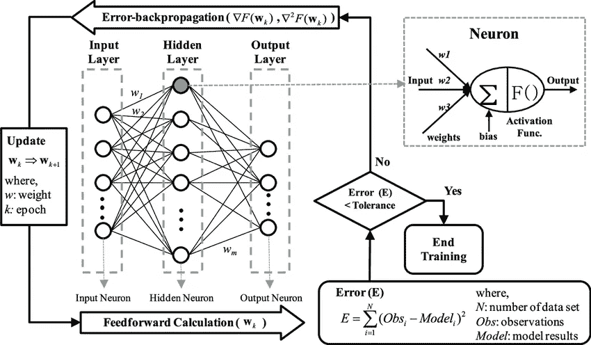
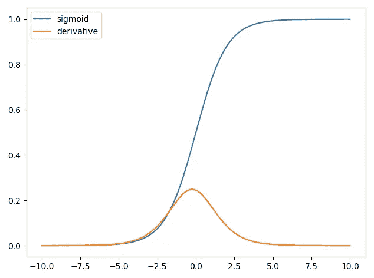
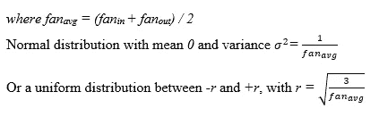
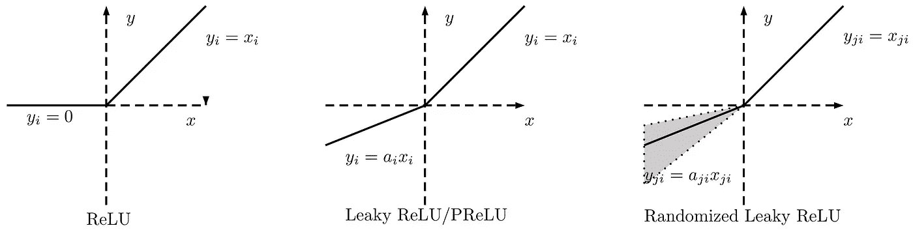

# 消失/爆炸渐变

> 原文：<https://medium.com/analytics-vidhya/vanishing-exploding-gradients-b00b4735d70d?source=collection_archive---------0----------------------->

## 窥视反向传播算法

反向传播这个术语及其在神经网络中的一般用途是在 Rumelhart，Hinton & Williams ( [1986a](https://www.semanticscholar.org/paper/Learning-representations-by-back-propagating-errors-Rumelhart-Hinton/052b1d8ce63b07fec3de9dbb583772d860b7c769) )中介绍的，然后在 Rumelhart，hint on&Williams([1986 b](https://archive.org/details/paralleldistribu00rume))中得到阐述和推广。但是这项技术在 20 世纪 60 年代被独立地重新发现了很多次。

来源:[研究之门](https://www.researchgate.net/figure/Schematic-diagram-of-backpropagation-training-algorithm-and-typical-neuron-model_fig2_275721804)

当拟合到神经网络时，反向传播基于单个输入-输出样本的网络权重来计算损失函数的梯度，并且这样做是有效的，不像直接单独计算关于每个权重的梯度。基本上，它使用梯度以梯度下降步骤更新每个参数。

## 消失问题

然而，随着算法向下进行到较低层，梯度通常变得越来越小。因此，较低层的连接权重实际上没有变化。这就是所谓的 ***消失渐变问题*** 。

## 爆炸问题

另一方面，在某些情况下，梯度可以变得越来越大。如此多的层得到疯狂的大权重更新。它导致算法发散。这叫做 ***爆炸渐变问题*** 。

好吧，你可能会问为什么它会消失或爆炸。

在某些激活函数的输入和输出之间存在巨大的差异，例如逻辑(sigmoid)激活函数。每层输出的方差远大于其输入的方差。在网络中前进，方差在每一层之后不断增加，直到激活函数在顶层饱和。

来源:[谷歌图片](https://www.google.com/search?q=sigmoid+function&tbm=isch&ved=2ahUKEwja5KyO4Pr1AhVS0OAKHe7XAAwQ2-cCegQIABAA&oq=sigmoid+&gs_lcp=CgNpbWcQARgAMgQIABBDMgUIABCABDIECAAQQzIFCAAQgAQyBQgAEIAEMgQIABBDMgQIABBDMgUIABCABDIECAAQQzIECAAQQzoECAAQHjoGCAAQCBAeUJEMWLIVYMQmaABwAHgAgAF4iAHOB5IBAzEuOJgBAKABAaoBC2d3cy13aXotaW1nwAEB&sclient=img&ei=jPYHYtruJdKggwfur4Ng&bih=937&biw=1920&rlz=1C1GCEA_enTR961TR961#imgrc=bgaPC4vKBrRtcM&imgdii=_CGSSGgwGrwd5M)

在某些情况下，参数可能变得太大，以至于溢出并导致 NaN 值。

我们如何解决这个问题？

有几种方法可以解决这个问题。这是第一个:

## Glorot 和 He 初始化

当正向预测和反向传播梯度时，我们希望信号流是适当的。我们不希望信号减弱或爆炸。

Glorot 和 Bengio 认为，我们需要每层输出的方差等于输入的方差，我们还需要梯度在反向流过一个层之前和之后具有相等的方差。

除非该层中的输入数量等于该层中的神经元数量(这些数量称为该层的扇入、扇出)，否则这两个条件都不能得到保证。然而，他们提出了一个在实践中证明非常有效的折衷方案:每层的连接权重必须随机初始化。

此外，使用 Glorot 初始化可以大大加快训练速度。

默认情况下，Keras 使用均匀分布的 Glorot 初始化。您可以通过设置 kernel_initializer="he_uniform "或 kernel_initializer="he_normal "来将其更改为 He 初始化

比如说；

> keras.layer.Dense(25，activation = "relu "，kernel_initializer="he_normal ")

## 不饱和激活函数

在检查 sigmoid 激活函数时，我提到对于较大的输入，饱和度是梯度消失背后的主要原因，由于其性质，因此它不能用于网络的隐藏层。当然，有可能在深度神经网络中找到更好的激活函数！让我们看看 ReLU。

**整流线性单元(ReLU)**

它是优选的，因为它在正值时不饱和。该功能对激活和输入提供更高的灵敏度，并防止容易饱和。此外，它的计算速度相当快。

然而，像所有的好东西一样，这一个有一个问题:*垂死的 ReLU* s

一些神经元在训练期间停止输出除 0 以外的任何信号，它们实际上已经死亡。特别是如果你使用了一个大的学习率，你可以看到你的网络中有一半的神经元是死的。

作为这个问题的解决方案，您可能想要使用 ReLU 的一个变体: *leaky ReLU* 。

**漏整流线性单元(** ***漏整流单元* )**

Leaky ReLU 是一种基于 ReLU 的激活函数，但是它对于负值具有小的斜率，而不是平坦的斜率。斜率系数是在训练前确定的，也就是说，它不是在训练过程中学习的。泄漏量由一个超参数控制。泄漏的较小斜率确保由泄漏的 ReLU 供电的神经元永远不会死亡；虽然他们可能会在漫长的训练阶段陷入昏迷，但最后总有醒来的机会。

**随机泄漏整流线性单元(RReLU)**

他们还评估了 RReLU，其中泄漏参数在训练期间在给定范围内随机选取，并在测试期间固定为平均值。它还表现得相当好，并作为一个正则化，即减少过度拟合训练集的风险。

来源:[谷歌图片](https://www.google.com/search?q=leaky+relu&tbm=isch&ved=2ahUKEwi6ooP4mYT2AhVKyBQKHaBsBYcQ2-cCegQIABAA&oq=leaky+relu&gs_lcp=CgNpbWcQAzIFCAAQgAQyBAgAEB4yBAgAEB4yBAgAEB4yBAgAEB4yBAgAEB4yBAgAEB4yBAgAEB4yBAgAEB4yBAgAEB46BwgjEO8DECc6BggAEAcQHlDzBViADmCcFmgAcAB4AIABhwGIAYEHkgEDMC43mAEAoAEBqgELZ3dzLXdpei1pbWfAAQE&sclient=img&ei=JOsMYrqAK8qQU6DZlbgI&bih=927&biw=1920&client=firefox-b-d#imgrc=p-ApAAMq3vlSMM)

另见:普雷卢，eLU。

使用泄漏的 ReLU

> leaky _ relu = keras . layers . leaky relu(alpha = 0.2)
> 
> layer = keras.layers.Dense(10，activation = leaky_relu，内核初始化器="he_normal ")

**批量归一化**

即使我前面提到的方法在训练开始时减少了消失/爆炸，但它们并不保证在训练期间不会返回。

它包括在每个隐藏层的激活功能之前或之后在模型中添加一个操作。该操作简单地对每个输入进行零中心化和归一化，然后使用每层两个新的参数向量对结果进行缩放和移位:一个用于缩放，另一个用于移位。换句话说，该操作让模型学习每个图层输入的最佳比例和平均值。

为了对输入进行零中心化和归一化，算法需要估计每个输入的平均值和标准差。这是通过评估当前小批量中每个输入的平均值和标准偏差来实现的。

然而，BN 增加了模型的复杂性。此外，神经网络的预测速度较慢。

> model = keras . models . sequential([
> 
> keras . layers . flatten(input _ shape =[28，28])，
> 
> keras . layers . batch normalization()，
> 
> keras.layers.Dense(300，activation="relu ")，
> 
> keras . layers . batch normalization()，
> 
> keras.layers.Dense(100，activation="relu ")，
> 
> keras . layers . batch normalization()，
> 
> keras.layers.Dense(10，activation="softmax ")
> 
> ])

**渐变裁剪**

为了减轻爆炸梯度问题，我们可以使用这种技术。我们在反向传播过程中剪切梯度，使它们不超过某些阈值。通常，这种技术用于递归神经网络。对于其他类型的网络，BN 通常就足够了。

> optimizer = tensor flow . keras . optimizer . SGD(clip value = 1.0)
> 
> model.compile(loss='mse '，optimizer=optimizer)

这段代码意味着，关于每个可训练参数，损失的所有偏导数将被限制在-1.0 和 1.0 之间。

要了解更多细节，你可以查阅我在参考资料中提到的奥雷连·盖伦的书。这本书真的是必读，我强烈推荐。

还有一个比较短的推荐，我建议你看一下 neptune.ai 发表的文章[《神经网络模型中的消失和爆炸梯度:调试、监控和修复》](https://neptune.ai/blog/vanishing-and-exploding-gradients-debugging-monitoring-fixing)，我可以说是一篇非常详细的研究，用代码丰富。

参考

*   [https://www . oreilly . com/library/view/hands-on-machine-learning/9781492032632/](https://www.oreilly.com/library/view/hands-on-machine-learning/9781492032632/)
*   【https://paperswithcode.com/method/leaky-relu 