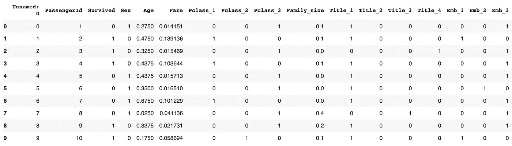
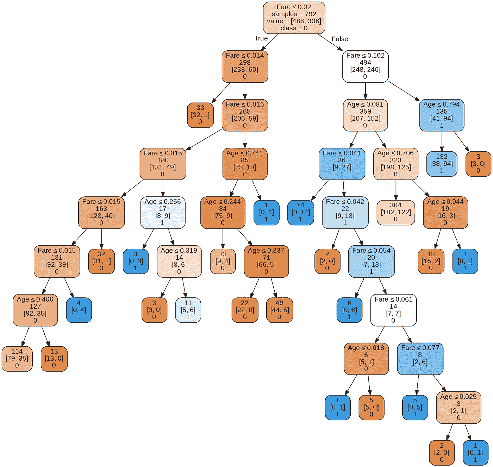
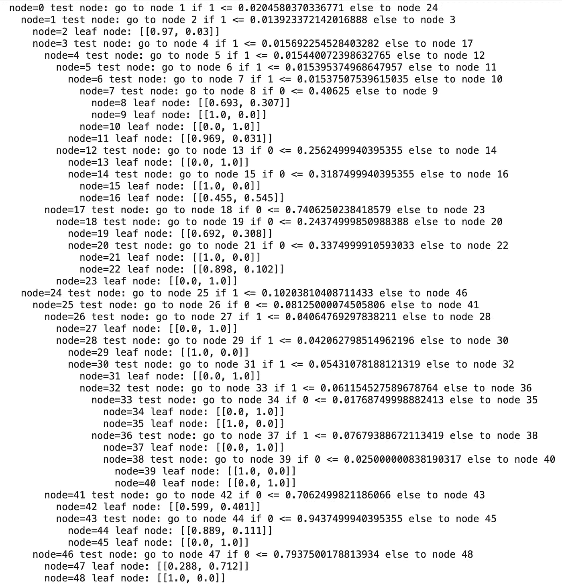
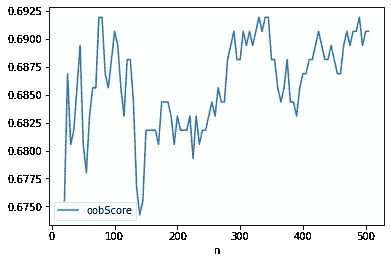
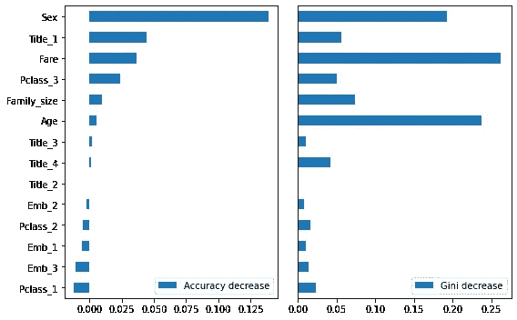

# 树模型和随机森林的可变重要性—使用 Python

> 原文：<https://medium.com/analytics-vidhya/variable-importance-with-tree-models-random-forest-with-python-cb775d019977?source=collection_archive---------2----------------------->

树模型及其强大的衍生工具集成学习是数据解释和预测任务的强大技术。

在统计机器学习中，模型是数据驱动的。我们所说的数据驱动主要是指在适应数据之前没有预先定义的数据模型或结构。这与经典的统计方法形成对比，在经典的统计方法中，假设一些模型和结构，并通过导出所需的参数来拟合数据。例如，在线性或逻辑回归中，假设基础数据分别遵循正态和伯努利分布。然而，在树模型或 K-NN 算法中，模型仅基于数据导出，而没有导出特定于模型的参数。因此，树有能力发现与数据中复杂交互相对应的隐藏模式。在本文中，我们旨在简要介绍用于数据解释和预测的树模型和集成学习。

树模型有两个吸引人的方面[1]:

*   树模型为探索数据提供了一个可视化工具，可以了解哪些变量是重要的，以及它们之间的关系。树可以捕捉预测变量之间的非线性关系。
*   树模型提供了一组规则，可以有效地传达给非专家，用于实现或“销售”数据挖掘项目。

# 树形模型

树模型是描述数据的“if-then-else”规则的集合。树模型，也称为*分类和回归树* ( *CART* )、3 *决策树*，或简称为*树*，是 Leo Breiman 等人在 1984 年首次开发的一种有效且流行的分类(和回归)方法[1]。由于其简单和易于理解的性质，树模型是与不一定熟悉分析的人交流的有效数据探索技术之一。为了练习树模型，我们将引导您使用 Python 对数据集应用树模型。我们将使用[泰坦尼克号数据集](https://www.kaggle.com/azeembootwala/titanic)将乘客分类为死亡或幸存。我们的目标是将 *Sci-kit Learn* 用作 python 库*。此外，还增加了 4 栏，从姓名栏重新设计为标题 *1 到标题* 4，表示男性&女性，取决于他们是否结婚(先生、夫人、主人、小姐)。一项额外的分析旨在看看已婚人士或换句话说有社会责任感的人是否有更多的生存本能&这一趋势对男女来说是相似的。该数据集由 15 个预测因子组成，如性别、票价、p_class、家庭规模、…。*目标响应是*幸存。*请注意，取值有限的因子变量已经通过一键编码进行了转换。这篇文章的完整代码可以在这里找到。

树模型的优势之一是它对预测值缩放不敏感，而预测值缩放是在更复杂的算法(如神经网络和逻辑回归)中要考虑的关键点。因此，在树模型中可以安全地跳过数据争论。

开始之前，请注意，我们将使用`dmba`库来可视化树模型决策。您可以通过`pip3`命令安装软件包:

```
#in jupyter notebook 
!pip3 install dmba#on terminal CLI
pip3 install dmba
```

# 仅使用两个预测器

出于可视化的目的，我们旨在仅使用两个预测器`Age`和`Fare`来预测幸存的乘客。我们从加载数据开始。数据看起来像:

```
train_df = pd.read_csv('train_data.csv')
train_df.head(10)
```



我们删除了前两列，因为它们不包含任何有助于预测结果的信息`Survived`。

```
train_df = train_df.drop(columns=['Unnamed: 0', 'PassengerId'])
```

仅使用两个预测器`Age`和`Fare`，获得的树如下:

```
predictors = ['Age', 'Fare']
outcome = 'Survived'X = train_df[predictors]
y = train_df[outcome]titanic_tree = DecisionTreeClassifier(random_state=1, criterion='entropy', min_impurity_decrease=0.003)titanic_tree.fit(X, y)plotDecisionTree(titanic_tree, feature_names=predictors, class_names=titanic_tree.classes_)
```

树模型的规则可以看作是:



*一个简单的树模型的规则适合巨大的数据*

可以看到，树是倒着画的，所以根在上面，叶子在下面。我们将`min_impurity_decrease`设置为 0.003。换句话说，如果这种分裂导致杂质减少大于或等于 0.003，则阳极将被分裂。根树从查看一个预测阈值`Fare <= 0.02`开始，并尝试基于多数原则对结果进行分类。我们也可以通过`dmba`库获得树的文本表示。代码如下:

```
print(textDecisionTree(titanic_tree))
```

输出将如下所示:



树模型的文本表示

树算法基于[递归分割](https://en.wikipedia.org/wiki/Recursive_partitioning)算法工作。它首先将数据空间划分为不重叠的区域，每个区域表示给定预测值的独特值集。然后选择区域，给我们相似结果的集合。换句话说，杂质最少的区域。

> 根据 *Gini 杂质*或*熵信息来测量杂质。*基尼系数不可与*基尼系数*相混淆。它们代表相似的概念，但基尼系数仅限于二元分类问题，并与曲线下面积(AUC)指标相关[2]。

# 集成学习

然而，就预测而言，利用多棵树的结果通常比只使用一棵树更有效。特别是，随机森林和提升树算法几乎总能提供卓越的预测准确性和性能。集合模型主要有两种变体:*装袋*和*助推*。在集合树模型的情况下，这些被称为*随机森林*模型和*增强树*模型【1】。

## 随机森林

*随机森林*基于对决策树应用 bagging，有一个重要的扩展:除了对记录进行采样，算法还对变量进行采样。Bagging 类似于集成的基本算法，除了不是将各种模型拟合到相同的数据，而是将每个新模型拟合到 bootstrap 重采样。

随机森林的复杂性在于选择所用模型的数量。我们可以通过穷尽搜索不同数量的树来确定这一点，并选择给出最低误差的一个。由于在随机森林中，只有数据子集用于训练，剩下的数据可以用于错误验证。Python 通过 *Scikit-learn* 提供了一个工具来导出模型验证的 out-of-bag (oob)错误。*出袋* ( *OOB* )误差估计值是训练模型的误差率，应用于该树的训练集之外的数据。我们可以使用 oob 在森林树中选择合适数量的树模型。

```
n_estimator = list(range(20, 510, 5))
oobScores = []for n in n_estimator:rf = RandomForestClassifier(n_estimators=n, criterion='entropy',       max_depth=10, random_state=1, oob_score=True)
rf.fit(X, y)
oobScores.append(rf.oob_score_)df = pd.DataFrame({ 'n': n_estimator, 'oobScore': oobScores })
df.plot(x='n', y='oobScore')
```

输出将是:



OOb 作为估计量数量的函数

可以看出，最大深度为 10 时，树的最佳数量大约为 140。

# 可变重要性

树模型可用于确定哪些预测因素在预测结果中起着关键作用。衡量变量重要性有两种方法[1]:

*   如果变量的值被随机置换(类型=1)，则模型的精度降低。随机改变数值会消除该变量的所有预测能力。准确性是根据袋外数据计算的(因此这种方法实际上是一种交叉验证的估计)。
*   通过在一个变量(类型=2)上分割的所有节点的基尼不纯分数的平均减少。这衡量了包含该变量对节点纯度的改善程度。这种方法是基于训练集的，因此不如根据袋外数据计算的方法可靠。

变量 importance 的 python 实现如下:

```
predictors = ['Sex', 'Age', 'Fare', 'Pclass_1','Pclass_2', 'Pclass_3', 'Family_size', 'Title_1', 'Title_2', 'Title_3', 'Title_4', 'Emb_1', 'Emb_2', 'Emb_3']outcome = 'Survived'X = train_df[predictors]
y = train_df[outcome]rf_all = RandomForestClassifier(n_estimators=140, random_state=1)
rf_all.fit(X, y)rf_all_entropy = RandomForestClassifier(n_estimators=500, random_state=1, criterion='entropy')rf = RandomForestClassifier(n_estimators=140)scores = defaultdict(list)# crossvalidate the scores on a number of different random splits of the datafor _ in range(5):
train_X, valid_X, train_y, valid_y = train_test_split(X, y, test_size=0.3)
rf.fit(train_X, train_y)
acc = metrics.accuracy_score(valid_y, rf.predict(valid_X))for column in X.columns:
X_t = valid_X.copy() 
X_t[column] = np.random.permutation(X_t[column].values)
shuff_acc = metrics.accuracy_score(valid_y, rf.predict(X_t))
scores[column].append(np.abs(acc-shuff_acc)/acc)print('Features sorted by their score:')print(sorted([(round(np.mean(score), 4), feat) for feat, score in scores.items()], reverse=True))
```

输出将是:

```
Features sorted by their score: [(0.1243, 'Sex'), (0.0462, 'Title_1'), (0.0356, 'Age'), (0.0224, 'Pclass_1'), (0.0197, 'Family_size'), (0.0149, 'Fare'), (0.0148, 'Emb_3'), (0.0138, 'Pclass_3'), (0.0137, 'Emb_1'), (0.0128, 'Pclass_2'), (0.0096, 'Title_4'), (0.0053, 'Emb_2'), (0.0011, 'Title_3'), (0.0, 'Title_2')]
```

我们可以通过`matplotlib`将变量重要性形象化为



准确性下降，基尼系数下降

可以看出，从准确性的角度来看，`sex`具有最高的重要性，因为它提高了 13%的准确性，而一些变量是中性的。此外，包括一些变量可能会降低准确性。从基尼系数的下降来看，情况有所不同。请记住，精确的测量更可靠。然而，在计算复杂性很重要的情况下，例如在需要拟合数千个模型的生产环境中，额外的计算工作可能不值得。此外，基尼系数下降揭示了随机森林使用哪些变量来制定其分裂规则(回想一下，这些信息在简单的树中很容易看到，但在随机森林中实际上是丢失的)[1]。

# 参考

[1]布鲁斯、彼得、安德鲁·布鲁斯和彼得·格德克。*数据科学家实用统计学:使用 R 和 Python 的 50 多个基本概念*。奥莱利媒体，2020。