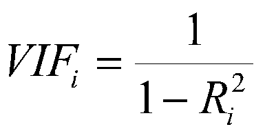

# 差异通货膨胀系数(VIF)

> 原文：<https://medium.com/analytics-vidhya/variance-inflation-factor-vif-c0a39522114e?source=collection_archive---------6----------------------->

每当我们谈论回归模型时，我们总是听到多重共线性，但我们从来没有想过如何检查这一点。

我知道使用**" M*atplotlib "****绘制相关矩阵会有所帮助，但这不是我想要的。*

*我们将讨论方差膨胀因子(VIF)，但在此之前，让我们快速讨论一下**多重共线性**。*

1.  *多重共线性意味着模型中的独立变量是相关的。*
2.  *独立变量之间的多重共线性会降低模型的性能。*
3.  *多重共线性可能是多重回归中的一个问题，因为输入变量都是相互影响的。因此，它们实际上不是独立的，很难测试自变量的组合对因变量或结果的影响程度。*

*因此，我们需要**方差膨胀因子(VIF)** ，因为它是帮助测量多重共线性程度的工具。*

**

*公式*

*VIF 的公式很简单，因此很容易理解，你只需要知道 R。*

> *如果你不知道 R，请看看我关于它的文章。[链接](/analytics-vidhya/r-squared-formula-explanation-6dc0096ce3ba)*

*假设有特征 X1，X2，X3…Xn*

*我们将分别计算每个要素的 VIF，因此我们需要计算 R，X1 的回归方程为*

**

*我们可以使用这个等式计算每个特征的 R，并将 R 代入 VIF 公式。*

*VIF 值将始终大于 1。以下是 VIF 的一些规则*

*   *1 =不相关。*
*   *介于 1 和 5 之间=中度相关。*
*   *大于 5 =高度相关。*

## *哪里不应该用 VIF？*

*   *多项式方程。*
*   *虚拟变量。*
*   *名义变量。*

## *最后的想法*

*多重共线性降低了独立变量的统计显著性。VIF 被用来检测这些变量。独立变量上的大方差膨胀因子(VIF)表示与其他变量的高度共线关系，在模型结构和独立变量选择中应考虑或调整这些关系。*