# 变分自动编码器环境中的变分推理

> 原文：<https://medium.com/analytics-vidhya/variational-inference-in-context-of-variational-autoencoders-vaes-e96bfe859980?source=collection_archive---------6----------------------->

在这篇博客中，我们将介绍变分推理，之后将介绍变分自动编码器(VAEs)。这个博客包含了 VAEs 的所有细节，即从基本定义到与自动编码器的比较，VAE 使用的损失函数的数学推导，以及使用 Pytorch 实现 VAE。稍后，我们将把 VAEs 与其他生成模型进行比较，如生成对抗网络(GANs)。

# 介绍

在许多有趣的潜变量模型中，计算后验概率是不容易的。在这种情况下，变分推理提供了一种计算近似后验分布的方法。在这篇博客中，我们将在变分自动编码器(VAE)上下文中研究变分推理，这是一种生成性深度学习模型。在我们继续之前，下面是潜在变量的定义。

> **潜在变量:**潜在变量是不能直接观察到的变量，而是从其他变量中推断出来的，或者我们可以说潜在变量允许我们描述可见变量上非常复杂的分布。
> 让我们考虑一个粗略的例子:看看下图。让我们假设我把这张图片发给你，把它作为壁纸放在屏幕上。正如我们已经知道的，图像中的像素依赖于邻居(因为纹理颜色和所有)。现在你可能会问为什么天空是蓝色的而不是黑色的？(因为我决定给你看白天而不是晚上的时间)。你也可以问为什么天空不多云？(因为我决定给你看一个晴天)等等。
> 所以这些决定(白天、晴天等)你并不清楚(它们对你是隐藏的)。因此，我们只观察图像，但我们所观察到的取决于这些潜在的(隐藏的)决定。

# 变分推理

在研究朴素贝叶斯、线性回归等简单模型时，我们假设数据来自基础分布，更可能来自正态分布。此外，在朴素贝叶斯中，假设所有样本都是独立同分布的，但事实并非如此。

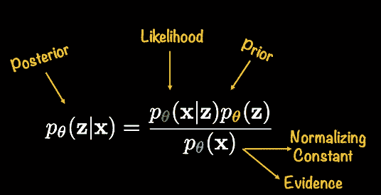

获得后验分布的隐变量模型和 Bayes 法则。

在上面的图像中，我们有一个潜在变量模型和贝叶斯规则来获得**潜在变量 z.** 的后验分布，但是，很难计算分母，即证据，因为它在高维空间中转化为难以处理的积分。因此，由于难以处理的证据，我们无法计算后验概率。

变分推断建议我们使用另一个参数为φ的**分布 q 作为后验概率的近似值。最著名的变分推理算法是****算法**和**变分自动编码器。**现在，在转向变型自动编码器之前，让我们对自动编码器做一个简单的概述。****

## **自动编码器**

**自动编码器被训练来重建输入数据。自动编码器包含一个编码器，它接受输入 **X** 并将其映射到一个隐藏的表示。然后，解码器采用这个隐藏的表示，并尝试将输入重构为 x。自动编码器的基本架构如下:**

**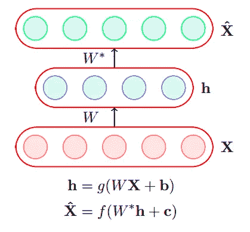**

**自动编码器的体系结构**

# **变分自动编码器**

**可变自动编码器属于生成模型，它提供了一种从模型分布中进行采样的原则方法。可变自动编码器与自动编码器具有相同的结构。但是在自动编码器中，我们只能重建输入，因为*(高维潜在空间)是一个非常高维的向量，并且这个空间中只有少数向量实际上对应于输入的有意义的潜在表示。因此，在 VAEs 中，我们只输入那些极有可能的值 ***h*** 。换句话说，我们感兴趣的是从***【P(h | X)***中取样，以便我们只挑选那些概率较高的 ***h 的*** 。因此，变分自动编码器可以同时进行重建和生成。***

1.  ***在 VAEs 中，使用神经网络**(编码器)**将训练数据映射到潜在空间。然后将潜在空间后验分布( **P(z|X))** 和先验分布 **(P(z))** 建模为高斯。网络的输出是两个参数- **均值()**和**方差(σ)**，即后验分布的参数。***
2.  ***假设来自潜在空间分布的随机样本生成输入数据。***
3.  ***然后使用另一个神经网络**(解码器)**将潜在空间向量映射到输入数据。***

***因此，变分自动编码器是一种神经网络，它以无监督的方式从输入中学习隐藏模式。它基本上包含**两个部分**:第一个是**编码器**类似于卷积神经网络或任何前馈神经网络。编码器旨在从图像中学习有效的模式，并将它们传递到瓶颈架构中。自动编码器的另一部分是一个**解码器**，它使用瓶颈层中的潜在空间来重新生成类似于输入的数据。***

## ***VAEs 架构***

***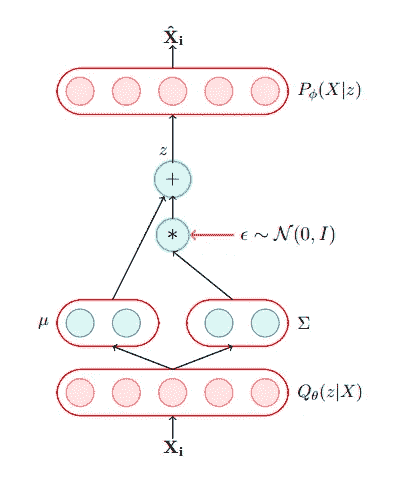***

***VAE 建筑***

*****编码器:**编码器将训练数据作为输入，并产生潜在表示**z。**潜在表示是随机的，即它们是概率分布(高斯)的参数。***

*****采样器:**给定编码器的均值和对数方差，我们使用通过**重新参数化技巧**创建的确定性函数从 Qθ(z|X)采样。***

> *****重新参数化技巧:**我们知道，在神经网络中，我们通过[反向传播](https://towardsdatascience.com/how-does-back-propagation-in-artificial-neural-networks-work-c7cad873ea7)来学习参数。因此，VAE 也使用反向传播算法来学习参数。但是在 VAEs 中，我们需要的是里面的*采样器*节点本质上应该是随机的，并且我们应该能够计算采样节点相对于`mean`和`log-variance`向量的梯度。因此，采样器`epsilon` 中的小家伙实际上**重新参数化了**我们的价值观。这允许`mean`和`log-variance`向量仍然作为网络的可学习参数，同时仍然通过`epsilon`保持整个系统的随机性。***

*****KL-Divergence:** 我们计算变分近似 Qθ(z|X)的 KL-Divergence 和潜变量 z 的真实分布，这也用在总损失函数中，起正则化作用。***

> *****KL-Divergence:** 用于衡量两个分布内包含的信息的差异。关于 KL-Divergence 的推导和更多的了解，你可以查看 youtube 上的这个视频。***

*****解码器:** z 从编码器的输出中取样，作为解码器的输入。解码器误差用于总损失函数中，代表重建损失。***

*****总损失函数:**用于训练自动编码器的总损失函数 L(x)是 KL 散度和解码器误差的和。***

***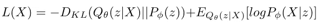***

***损失由两个表达式组成。损失函数中的第一个表达式捕获了潜在变量的概率分布，并作为正则项。并且，第二个表达式抓住了所有自动编码器中使用的重构误差的概念。***

***现在进入数学领域，这是损失函数的推导:***

***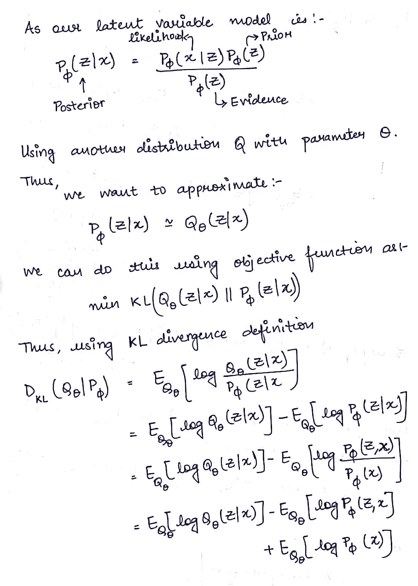******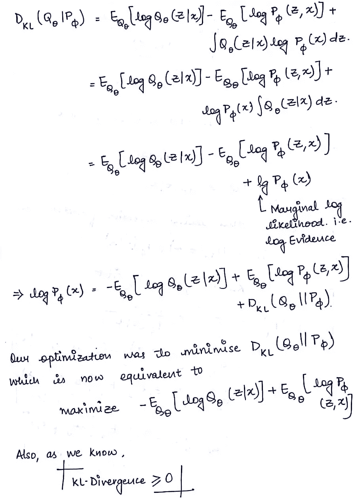******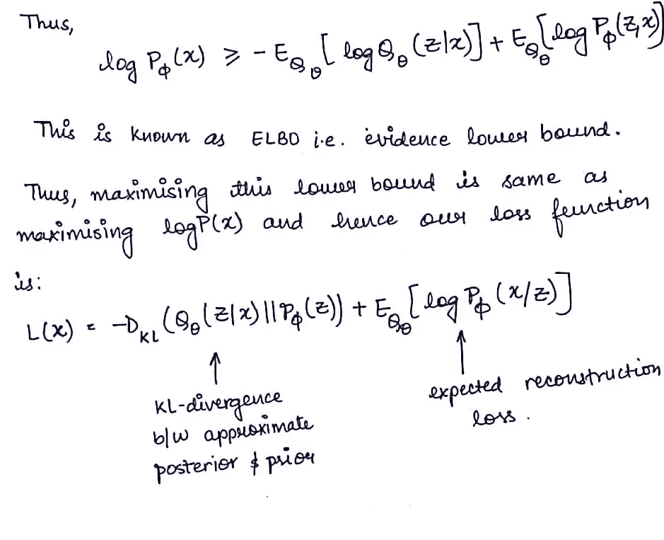***

# ***履行***

***我在 PyTorch 中实现了 MNIST 数据集的变分自动编码器，并从 VAE 执行了重建和生成。***

***这是 VAE 的代码:***

***下载数据集并从数据集中绘制一些样本图像。***

***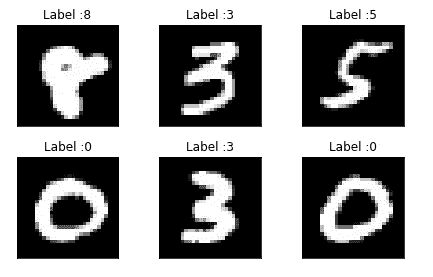***

***带有原始标签的数据集样本图像***

***为编码器和解码器创建类，并将它们合并到一个名为 VAE 的类中。***

***训练 VAE 并绘制损失函数和时期之间的图形。***

***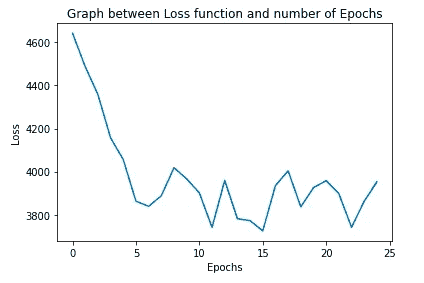***

***绘制了从编码器获得的潜在空间。***

***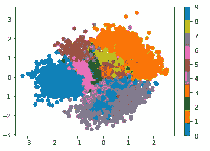***

***潜在空间***

***下面的代码显示了潜在空间中数字之间的插值。这里我在数字 7 和 2 之间插值。这可以被认为是 VAE 的重建。***

***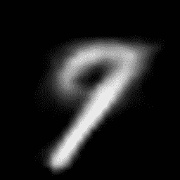***

***来自潜在空间的数字之间的插值。***

***最后，从 VAE 生成图像。***

***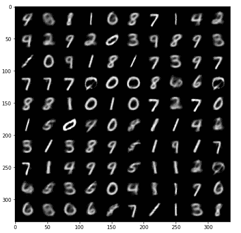***

***VAE 生成的数字***

***除此之外，我还为 CIFAR10 数据集实施了 VAE。下面是 GitHub 回购的链接:[https://GitHub . com/bamboriyaankit/ML-Course-Project/blob/main/ML _ Project _ VAE _ cifar . ipynb](https://github.com/bamboriyaankit/ML-Course-Project/blob/main/ML_Project_VAE_CIFAR.ipynb)***

***上面代码的链接:[https://github . com/bamboriyaankit/ML-Course-Project/blob/main/ML _ Project _ VAE _ MNIST % 20(1)。ipynb](https://github.com/bamboriyaankit/ML-Course-Project/blob/main/ML_Project_VAE_MNIST%20(1).ipynb)***

## ***VAEs 与 GANs 的简单比较***

***vae 是概率图形模型，它们的明确目标是潜在建模，而 GAN 是显式建立的，以优化生成任务。虽然 VAE 和甘斯都使用无监督学习来学习底层数据分布，但甘斯生成的图像似乎比 VAEs 更好。***

***以下是我用过的一些重要参考资料:***

1.  ***[https://en.wikipedia.org/wiki/Variational_Bayesian_methods](https://en.wikipedia.org/wiki/Variational_Bayesian_methods)***
2.  ***[https://ermongroup . github . io/cs 228-notes/inference/variable/](https://ermongroup.github.io/cs228-notes/inference/variational/)***
3.  ***[https://www.youtube.com/watch?v=oJu649cDGyo&list = pleayksg 4 usq1r-2 xrj _ gbzzs 6 I-F8 yfru&index = 148](https://www.youtube.com/watch?v=oJu649cDGyo&list=PLEAYkSg4uSQ1r-2XrJ_GBzzS6I-f8yfRU&index=148)***

***关于任何解释或更正，请在评论区告诉我。***