# 从头开始变分量子本征解算器:寻找哈密顿量的基态能量

> 原文：<https://medium.com/analytics-vidhya/variational-quantum-eigensolver-from-scratch-finding-ground-state-energy-of-hamiltonian-a5c13d5268f1?source=collection_archive---------14----------------------->

来源:谷歌图片

寻找哈密顿量的基态能量

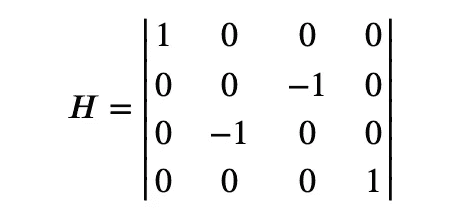

# 变分量子本征解算器；

它基于变分原理，即如果我们有一个带本征态和相关本征值的哈密顿量 H。那么下面的关系成立:

𝐻|𝜓⟩=𝜆|𝜓⟩H|ψ⟩=λ|ψ⟩

其中λ是给定状态|ψ⟩.的能量值对于每一个不同的|ψ⟩，我们可以找到它的能量，但是对于只有一个|ψ⟩，存在最小的λ，我们称这个|ψ⟩为系统的基态。VQE 帮助我们找到任何给定系统的基态。为了简化过程，它把哈密顿量分解成泡利矩阵。[资源](https://www.mustythoughts.com/variational-quantum-eigensolver-explained)

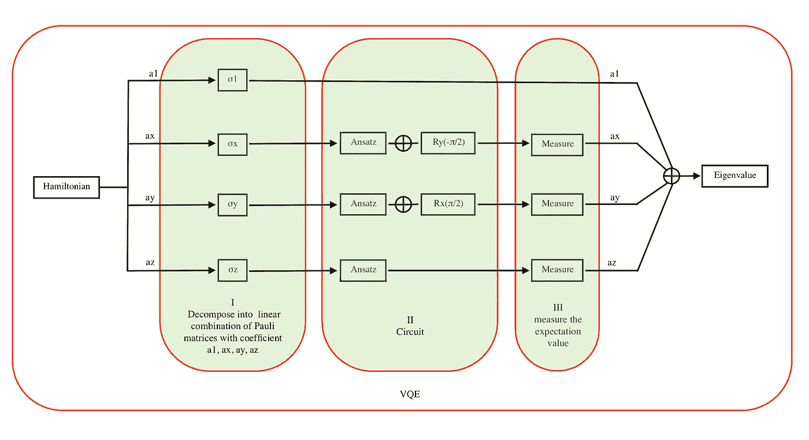

图一。VQE 流程图。

VQE 可以归纳为三个部分

1.  分解
2.  电路

*   安萨茨
*   初始化测量基础

3.尺寸

# 第 1 部分:分解

**将两量子位哈密顿量分解成泡利矩阵**
泡利矩阵构成了 2 × 2 厄米矩阵的实向量空间的基础。这意味着任何 2 × 2 厄米矩阵都可以唯一地写成泡利矩阵的线性组合，所有系数都是实数。这些泡利项(σ1，σx，σy，σz)告诉我们应该在什么基础上测量我们的量子位，它们的系数告诉我们最终应该通过多少因子来考虑它们的期望值。

对于两个量子位的哈密顿矩阵或 4 × 4 厄米矩阵

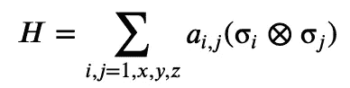

在哪里，

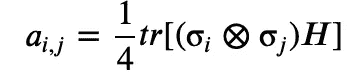

给定埃尔米特矩阵 H 可以写成

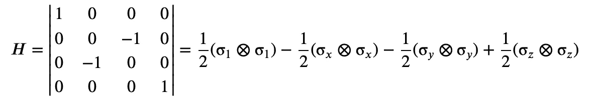

# 第 2 部分:电路

一旦我们有了哈密顿量的分解，我们就可以为分解中的每一项创建电路。
电路主要由 Ansatz 组成，它准备我们需要得到的测量状态。我们将通过反复试验找到答案。
由于 QC 总是在 z 基中测量，我们需要初始化测量基，在我们的两量子位哈密顿量 h 中，我们有来自分解(σ1⊗σ1),(σ𝑥⊗σ𝑥),(σ𝑦⊗σ𝑦),σ𝑧⊗σ𝑧)的四项，分别具有系数 1/2、1/2、1/2、1/2。

如果我们取第一项(σ1⊗σ1)，它代表第一和第二量子位上相同运算，因为它是相同的运算，所以我们不需要任何电路，我们只需要在最后求和时考虑它的系数。
第二项(σ𝑥⊗σ𝑥)在两个量子位上都有σx 操作，所以为了沿 x 基进行测量，我们需要将布洛赫球绕 y 轴旋转-π/2 度用于量子位。类似地，对于第三项(σ𝑦⊗σ𝑦),我们将绕 x 轴旋转布洛赫球π/2 度，使两个量子位沿着 y 轴进行测量。沿 Z 轴的测量不需要任何旋转，因为 QC 总是在 Z 轴上测量。所以第四届(σ𝑧⊗σ𝑧)将只包括安萨兹。现在让我们编码 Ansatz。

# 安萨茨

查看 ansatz 电路:

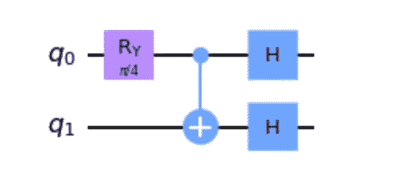

图一。安萨茨

为哈密尔顿分解的每一项创建电路

# 第二任期(σ𝑥⊗σ𝑥):第一巡回赛

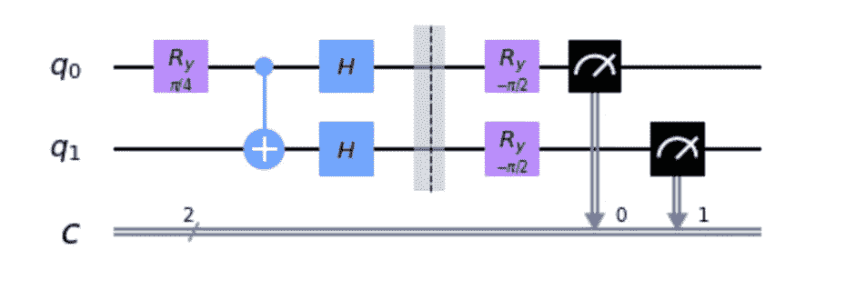

图二。XX 术语的电路

# 第三届(σ𝑦⊗σ𝑦):第二巡回赛

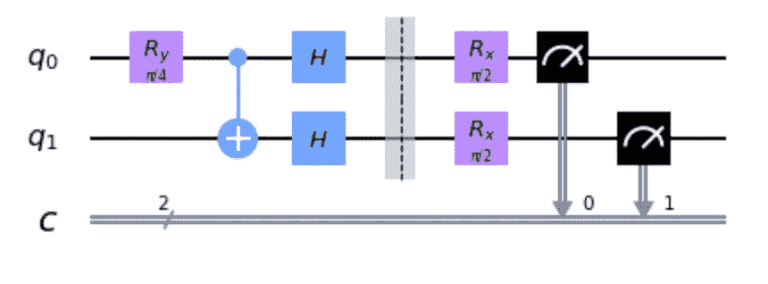

图三。YY 术语电路

# 第四任期(σ𝑧⊗σ𝑧):第三巡回法庭

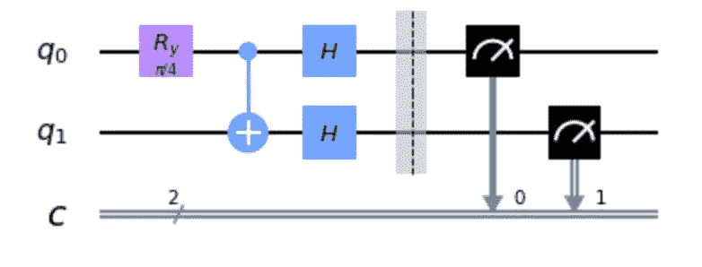

图 4。ZZ 术语电路

# 第 3 部分:测量

现在进行测量，我们将找到每个电路的期望值。每个电路的测量将由四项概率组成|00 >、|01 >、|10 >、|11 >。对于单量子位，我们考虑测量的本征值，如果我们在测量中发现我们的系统处于|0 >状态，那么我们把它作为 1，如果它处于|1 >状态，那么我们把它作为-1，这些是它们的本征值。但是对于两个量子位的测量，如果我们的测量是|01 >意味着第一个量子位在 0 态坍缩，第二个量子位在 1 态坍缩，那么我们取它们的本征值的乘积 1 x -1 = -1 我们可以把它作为一个符号，同样，我们可以对其他测量做。

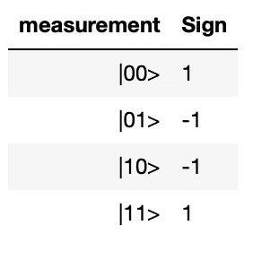

图 4。衡量

我们可以将期望值计算为∑(𝑠𝑖𝑔𝑛).(𝑃)，其中 p 是测量的概率。一旦我们有了每个电路的期望值，我们就将它们与从分解步骤中获得的各自的系数相加，以计算最终特征值。对于给定的 H 和它的分解，我们可以得到特征值，

# VQE 算法

我们得到的最低特征值是-1，属于这个状态

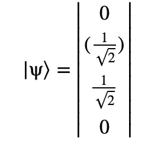

# 用参数研究特征值的演化

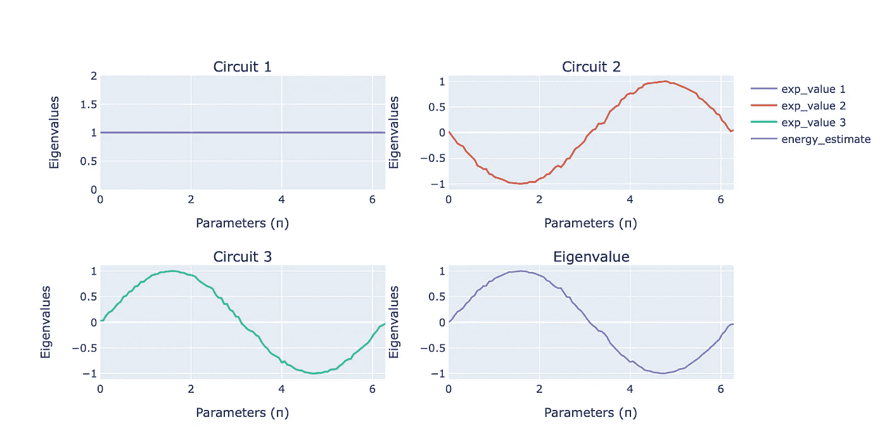

图五。结果

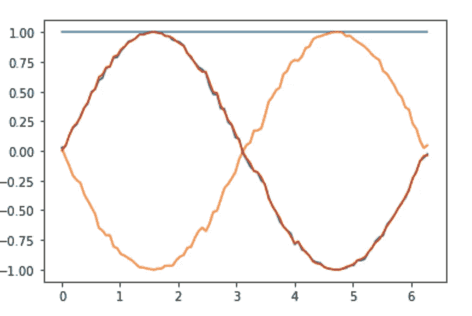

图六。参数特征值

**结束注释**

Ansatz 是通过反复试验选择的。
安萨兹的一些结果

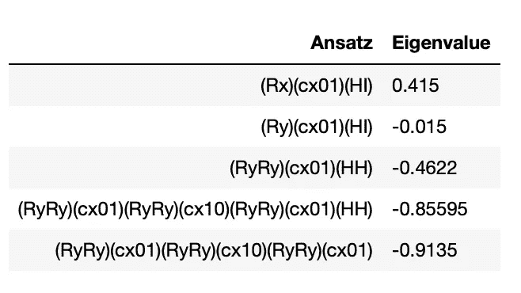

图 7。不同天线的特征值

具有多个参数的其他 Ansatzs(如(U3I)(cx01)(HI)也执行类似的操作，在这种情况下，它给出的结果是 0.0016

# 资源

*   [*GitHub*](https://github.com/pratik-ingle/VQE)
*   [*变分量子本征解算器解释*](https://www.mustythoughts.com/variational-quantum-eigensolver-explained)

享受乐趣，不断学习..

我的[*Twitter*](https://twitter.com/PratikIngle_)*和 [*GitHub*](https://github.com/pratik-ingle/VQE)*