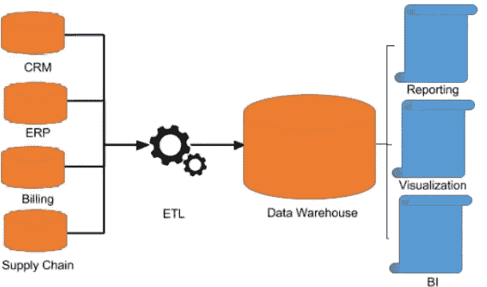

# 数据科学中的各种数据源—概述和用法

> 原文：<https://medium.com/analytics-vidhya/various-data-sources-in-data-science-overview-and-usage-cdbf7e86dbbd?source=collection_archive---------3----------------------->


数据科学的核心是数据。在当今世界，所有决策都是由数据驱动的，这使得数据及其使用成为组织中的一个重要元素。从分析智能手表中的健康数据到 TB 级的大数据分析，数据是产生商业决策的主要因素。但是随着场景的变化，数据的存储介质和方法也在变化。了解如何使用这些存储方法来提取和分析数据是非常重要的。在本文中，我们将研究各种数据源并使用它们。

**文本文件**

最基本的数据存储方法是使用文本文件。文本文件中的内容是结构化的，将遵循特定的格式。文本文件最常见的用法出现在日志记录中。日志条目以特定的格式存储，可以使用编程语言读取和提取。可以使用字符串解析或正则表达式来拆分条目中的每个参数。


文本文件(日志文件)中的结构化数据示例

```
#regex for parsing log fileregex = “<your_regex_here>”#read the text file and use re.findall() to extract each parametersFile = open(“text.log”,’r’)for i in File.readlines():print(re.findall(regex,i))
```

**数据库**

数据库是安全存储数据(通常以表格形式)和有效管理大量数据的常用方法。SQL 是一种常用的数据库。在数据库中，用户向 DBMS 发送查询，DBMS 执行查询并返回结果。与文本文件不同，数据库需要用户密码组合才能访问和执行任务。在这一节中，我们将使用 Python 来访问一个现有的 MySQL 数据库。由于数据库是一个庞大的主题，请查看参考资料中的教程链接以进一步学习。


SQL 表中的数据存储。

```
import mysql.connectormydb=mysql.connector.connect(host=”hostname_here”,user=”username”,password=”password_here”)
cursor=mydb.cursor()#execute query
mycursor.execute(“QUERY_HERE”)#commiting confirms the changes to the database
mydb.commit()
```

**CSV 文件**

一种最常见的数据存储方式是 CSV 文件。CSV 文件由逗号分隔的数据组成。当在 excel 等软件中打开时，CSV 显示为 Excel 表格，其中数据按列和行的方式存储。CSV 文件可以使用编程语言(如 Python)和库(如 Pandas)轻松访问和处理。Pandas 还允许对数据框进行广泛的数学和分析操作。查看参考资料部分的链接。


CSV 文件中的数据存储

```
import pandas as pddata = pd.read_csv(“file.csv”)print(data) #prints full dataframeprint(data[‘column_name’]) #prints a single column in dataframe
```

**云数据仓库/云数据库**

数据科学通常与云平台相关联。由于能够建立巨大的机器和弹性属性，云计算正在全球兴起，并具有巨大的未来潜力。云提供的主要存储解决方案是数据仓库和云数据库。虽然功能保持不变，但仓库用于存储大量用于分析目的的传入数据，而云数据库在云中存储通常的客户数据。这两者都可以使用各自的 API 从应用程序中访问。GCP 提供了 google cloud API，它要求你发送凭证来连接任何服务，而对于 AWS，你可以使用平台提供的连接字符串使用 *pyodbc* 库来连接任何服务。



分析系统的流水线设计

**杂项来源**

**多媒体数据**

某些数据将以多媒体形式呈现，如图像或音频。这些按原样存在于文件夹中。对于这种类型的数据，OpenCV 等库用于读取图像并转换为数组。音频通常被转换成图像(声谱图),这又回到图像处理问题。


多媒体数据通常存在于文件夹中

**社交媒体/API**

某些数据科学问题需要您连接到 API 或另一个平台(如社交媒体)来获取特定数据。这篇[中型文章](/analytics-vidhya/feedback-analysis-in-python-with-tweepy-and-textblob-ff4d7f39ff99?source=your_stories_page-------------------------------------)演示了这个场景，其中从 Twitter 标签中获取数据，并对其进行情感分析以进行自然语言处理。API 提供实时数据流(例如:COVID 数据或选举结果数据)。这有助于执行实时分析和仪表板生成。


连接到平台和实时数据源需要使用 API 来交换数据

感谢您的阅读！

## 参考资料和有用的链接

Mysql 教程:[https://www.w3schools.com/mysql/](https://www.w3schools.com/mysql/)

熊猫教程:[https://pandas . pydata . org/pandas-docs/version/0.15/tutorials . html](https://pandas.pydata.org/pandas-docs/version/0.15/tutorials.html)

学习 Google Bigquery 和 API:[https://cloud.google.com/bigquery](https://cloud.google.com/bigquery)

学习 AWS 红移和 API:[https://docs.aws.amazon.com/redshift/index.html](https://docs.aws.amazon.com/redshift/index.html)

更多地了解我:https://bit.ly/vishnu-u

在 LinkedIn 上找到我:[https://www.linkedin.com/in/vishnuu0399/](https://www.linkedin.com/in/vishnuu0399/)