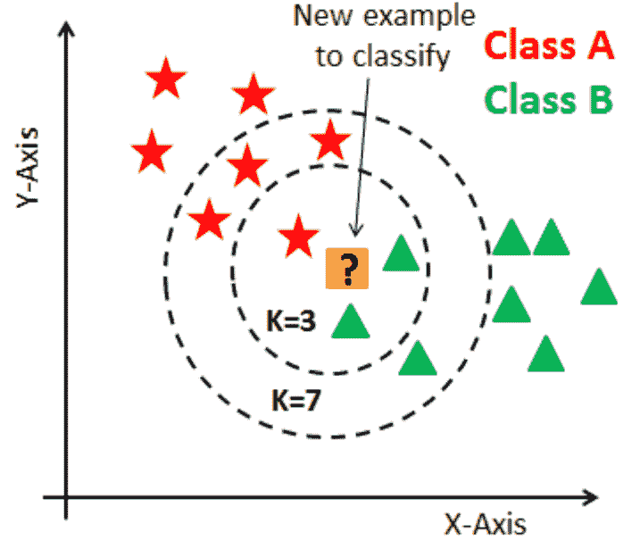
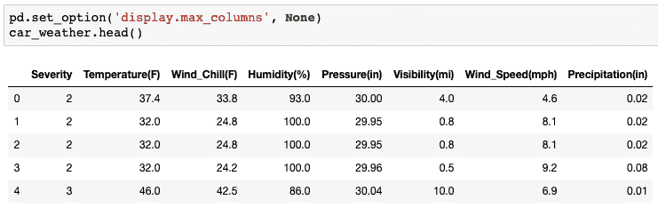
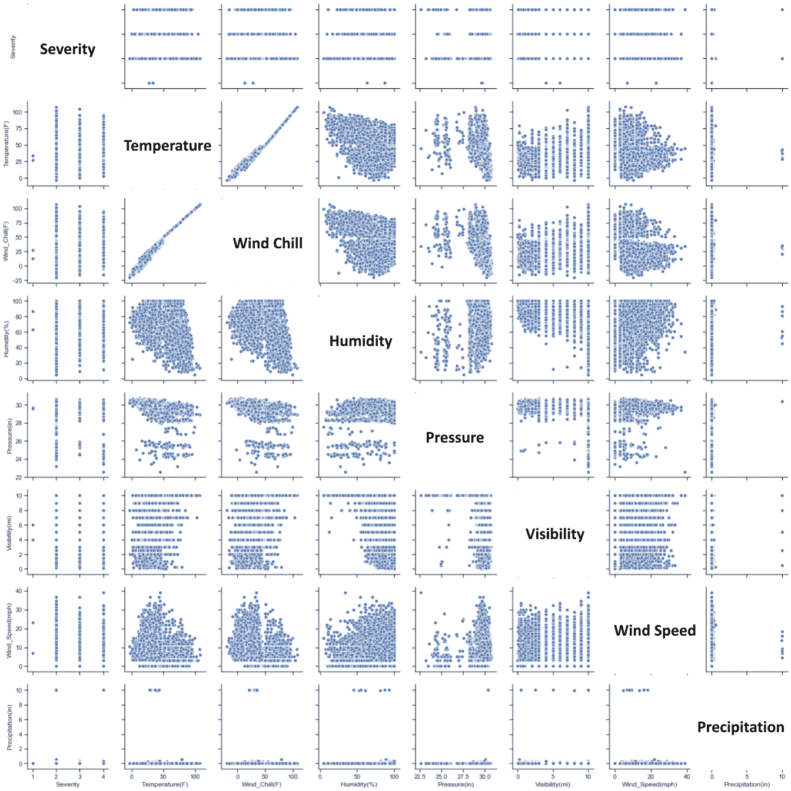
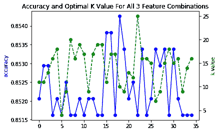
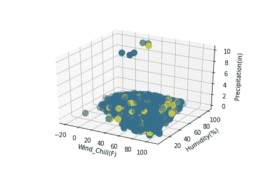
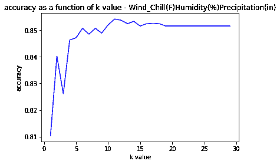
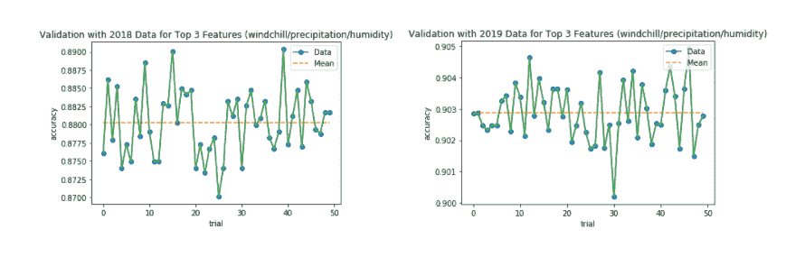
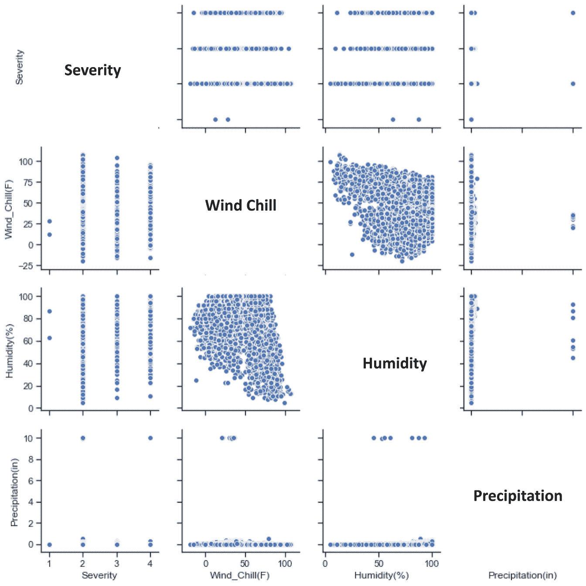

# 使用机器学习基于环境刺激的车辆事故严重性预测

> 原文：<https://medium.com/analytics-vidhya/vehicle-accident-severity-prediction-based-on-environmental-stimuli-using-machine-learning-3b35b4599667?source=collection_archive---------15----------------------->

# 导言和背景

在过去的几十年里，交通事故死亡和残疾显著增加，并被认为是一个主要的公共健康问题。[美国国家公路交通安全管理局(NHTSA)](https://www.nhtsa.gov/press-releases/roadway-fatalities-2019-fars#:~:text=NHTSA%20Releases%202019%20Crash%20Fatality%20Data&text=There%20were%2036%2C096%20fatalities%20in,VMT)%20increased%20by%200.8%25.) 报告称，2019 年机动车交通事故死亡人数为 36096 人。几个原因促成了这一点。获取有关道路环境和周边威胁的信息可以帮助驾驶员评估他们当前的道路状况，并做出统计上更安全的驾驶相关决策。这些因素包括恶劣的天气、道路的特点，甚至是一天中的时间。

环境刺激在多大程度上对汽车事故的发生/严重程度起作用？道路环境/周边威胁中的哪些具体外部因素表明事故严重程度较高。

在这篇博客中，我将介绍一种简单而有效的方法，通过隔离和分析与天气相关的数据来预测可能发生的交通事故的严重程度。为此，我使用了数据分类。

# 框架—机器学习和数据分类

*   **机器学习:**对通过经验和使用数据自动改进的计算机算法的研究
*   **数据科学中的数据分类:**对给定数据点的类别进行预测的过程。分类预测建模是从输入变量(x)到离散输出变量(y)近似映射函数(f)的任务。
*   **K-最近邻(KNN):** 常用非参数分类方法进行分类和回归。我使用了 **sklearn** python 库，该库查找查询和邻居池中现有记录之间的距离(由 k 值决定)。邻居池中最频繁的标签将确定查询的分类。

[*图:k=3 和 k=7 的 KNN 分类示例*](https://www.kdnuggets.com/2020/11/most-popular-distance-metrics-knn.html)

*   **懒惰的学习者:**简单的存储训练数据，等到测试数据出现。当它发生时，基于存储的训练数据中最相关的数据进行分类。例如:KNN。
*   **最佳 k 值**:降低噪声对数据分类的影响，使类别之间的界限不那么明显。这种肘方法用于为 KNN 聚类选择最佳的聚类数。
*   **k 值的显著性**:k 参数将定义在投票过程中要考虑的最近邻居的数量。较大的 k 值表示映射可能比较小的 k 值更平滑。

# 阶段 1:导入、规范化和可视化原始数据

我导入了一个名为“ [**的数据集，一个全国范围的交通事故数据集**](https://arxiv.org/abs/1906.05409) ”(参见参考文献*中的数据源)，由康乃尔大学的独立研究人员提供，包含 2016 年 2 月**至 2020 年 12 月**的交通事故相关数据，提供**严重性评级。**这些严重等级的范围从 2 到 4(或从最低到最高)。

该数据集包含总共 460 万条具有 49 个特征的记录。我决定特别看一下与天气相关的数据，这 7 个特征是:温度(OF)、风寒(OF)、湿度(%)、气压(in)、能见度(mi)、风速(mph)和降水量(in)。

*表:提取的 2017 年天气样本数据*

在争论完数据之后，我用一个 **seaborn pairplot** 绘制了与天气相关的数据，以可视化特征之间的统计关系(尤其是严重性)。

*图:提取的 2017 年数据的 seaborn pair plot*

# 阶段 2:开发算法以确定预测的最佳天气特征

给定七种不同的天气特征，我想确定三种特征的最佳组合，以获得最高的预测精度。换句话说，我开发了一种算法，以最高的准确度来识别特征元组。为此，我为 7Cn 个天气组合开发了 n 个特征集。例如，如果组合了三个特征，将有 7C3 = 35 种可能的组合。我进一步遍历这些组合，并为每个组合开发了一个 KNN 分类器模型。这包括确定每个组合的最佳 K 值(产生最高精度的参数)。

我的算法确定了三个最能表明坠机严重程度的最佳天气特征:**风寒、降水、**和**湿度**。该元组模型的最佳 k 值为 11，75%训练数据的最大精度为 **0.8554** 。

*图表:在遍历所有 35 个特征组合后，最佳 k 值和精确度被聚集并绘制成图表。红圈表示最能表明严重程度的组合。*

*图表:颜色表示前三个特征图表上绘制的车祸严重程度。*

*图:k = 11 时准确率最高。*

# 第三阶段:测试和验证 KNN 算法的发现

最后，我需要使用 2018 年和 2019 年的天气相关数据来验证开发的模型，并根据需要调整分类器。为此，我验证了分类器在预测严重性方面的准确性。在用 2017 年的数据训练了我的模型(第二阶段)之后，我用 2018 年和 2019 年的数据验证了模型(第三阶段)。我用每年随机产生的 25%的数据进行了 50 次试验，总共 100 次试验。2018 年的天气相关数据产生了 88.976% 的准确率**。2019 年的天气相关数据产生了 **90.446%** 的准确率。**

*图表:使用 2018 年和 2019 年数据集进行验证*

# 总体统计分析

进一步的调查表明，上述三大特征**、风寒、降水、湿度**之间**没有显著相关性**。这种显著相关性的缺乏表明特征对模型的影响不会是相似的。

由于**温度**和**风冷**是**线性相关**，它们都对模型产生类似的影响。此外，当在组合中配对时，包含温度和风寒的模型确实产生了最低的精确度。

*图表:seaborn pair 绘图直观地比较了前三个特征和严重性*

# 结论和未来应用

**路况**和**外界刺激**对交通事故结果有破坏性影响。根据我的研究，使用 **KNN 模型**，事故记录/数据的**天气相关特征**可以预测给定查询的严重程度，准确率高达**90%**。在所有因素中，**我的算法**和 **KNN 模型分类**识别出与事故严重程度相关性较高的 3 个最佳**天气**因素，准确率约为 90%**风寒**、**降水**和**湿度**。

虽然开发的 KNN 模型已被证明是确定车祸发生概率的一种相对成功的方法，但它可以作为神经网络和面向回归的机器学习方法的概念证明。由于它是非参数化的，它可能无法用更高级的建模技术的细微差别进行预测。

加强预防努力的必要性是明确的。正如**谷歌地图**为**交通繁忙区域**提供视觉预测以让司机了解情况一样，类似的方法也可以用于向**发出与驾驶安全和潜在危险相关的警告**。

在我的 [**GitHub**](https://github.com/anjalisamavedam/vehicle-accident-severity-prediction) **上查看我的代码！**

# 参考

1.  凯瑞、雷切尔·N 和基兰·M·萨尔马。"夏令时对道路交通碰撞风险的影响:一项系统综述."*美国国家卫生研究院，NCBI* ，2017 年 7 月 2 日，[www.ncbi.nlm.nih.gov/pmc/articles/PMC5734262/.](http://www.ncbi.nlm.nih.gov/pmc/articles/PMC5734262/.)
2.  莱斯科瓦，卡罗。"走向机器学习——K 近邻(KNN). "中，朝向数据科学，2020 年 10 月 2 日，朝向 sdata Science . com/朝向-机器学习-k-最近邻-knn-7d5eaf53d36c。
3.  *Moosavi、Sobhan、Mohammad Hossein Samavatian、Srinivasan Parthasarathy、Radu Teodorescu 和 Rajiv Ramnath。"基于异质稀疏数据的事故风险预测:新数据集和见解."《第 27 届 ACM 地理信息系统进展 SIGSPATIAL 国际会议论文集》，ACM，2019。
4.  *Moosavi、Sobhan、Mohammad Hossein Samavatian、Srinivasan Parthasarathy 和 Rajiv Ramnath。"一个全国性的交通事故数据集.", 2019.
5.  *Moosavi，Sobhan。“美国事故(420 万起记录)。”*卡格尔*2021 年 1 月 28 日[www.kaggle.com/sobhanmoosavi/us-accidents.](http://www.kaggle.com/sobhanmoosavi/us-accidents.)
6.  查宁·南塔塞纳马特。"如何用 Python 建立回归模型."*中型*，走向数据科学，2020 年 8 月 16 日，Towards Data Science . com/how-to-build-a-regression-model-in-python-9a 10685 c7f 09。