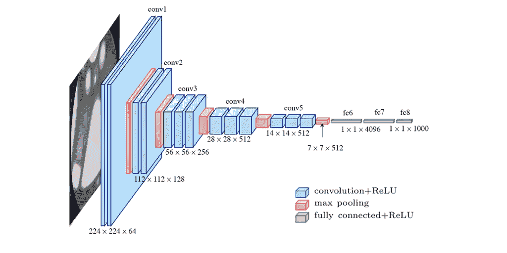
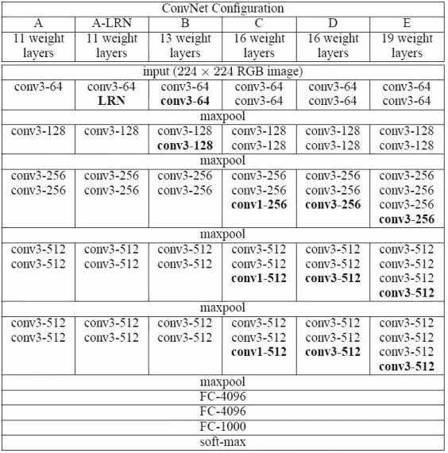
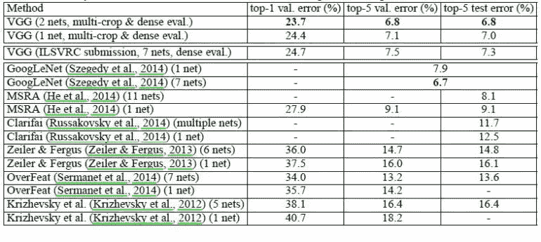

# VGGNet —用于分类和检测的卷积网络

> 原文：<https://medium.com/analytics-vidhya/vggnet-convolutional-network-for-classification-and-detection-3543aaf61699?source=collection_archive---------7----------------------->

VGG16 的架构——由 [Max Ferguson](https://www.researchgate.net/profile/Max-Ferguson) 在 ResearchGate 上传

# 介绍

**VGG16** 是英国牛津大学的 K. Simonyan 和 A. Zisserman 在论文“[用于大规模图像识别的甚深卷积网络](https://arxiv.org/abs/1409.1556)”中提出的卷积神经网络模型。该模型在 ImageNet 中达到了 92.7%的 top-5 测试准确率，ImageNet 是一个包含 1000 个类的超过 1400 万个图像的数据集。它是提交给 [ILSVRC-2014](https://image-net.org/challenges/LSVRC/2014/) 的著名模型之一。它通过用多个 3×3 内核大小的滤波器相继替换大内核大小的滤波器(第一和第二卷积层中分别为 11 和 5 个)来改进 AlexNet。VGG16 接受了数周的训练，使用的是 NVIDIA Titan Black GPU。

# ImageNet

[ImageNet](http://www.image-net.org/) 是一个数据集，包含超过 1500 万张带有标签的高分辨率图像，属于大约 22，000 个类别。这些图片是从网上收集来的，由人类标签员用亚马逊的机械土耳其人众包工具贴上标签。从 2010 年开始，作为 Pascal 视觉对象挑战赛的一部分，每年都会举办一次名为 ImageNet 大规模视觉识别挑战赛(ILSVRC)的比赛。ILSVRC 使用 ImageNet 的一个子集，在 1000 个类别中的每一个类别中大约有 1000 个图像。大约有 120 万幅训练图像、50，000 幅验证图像和 150，000 幅测试图像。ImageNet 由不同分辨率的图像组成。因此，图像被下采样到 256×256 的固定分辨率。给定一个矩形图像，该图像被重新缩放并从结果图像的中心 256×256 小块中裁剪出来。

# VGG16 的架构

下图所示的架构是 VGG16。

VGG16 架构

cov1 层的输入是固定大小的 224 x 224 RGB 图像。图像通过一叠卷积层，在卷积层中，过滤器与一个微小的感受域一起使用:3×3(这是捕捉左/右、上/下、中心概念的最小尺寸)。在其中一种配置中，它还利用 1×1 卷积滤波器，可视为输入通道的线性变换(后跟非线性)。卷积步距固定为 1 个像素；卷积层输入的空间填充使得在卷积后保持空间分辨率，即对于 3×3 卷积层，填充是 1 像素。空间池由五个最大池层执行，这五个最大池层跟随一些卷积层(并非所有卷积层都跟随最大池)。最大池化在 2×2 像素窗口上执行，步长为 2。

三个全连接(FC)层跟随一个卷积层堆栈(在不同的架构中具有不同的深度):前两个各有 4096 个通道，第三个执行 1000 路 ILSVRC 分类，因此包含 1000 个通道(每个类别一个)。最后一层是最大柔化层。全连接层的配置在所有网络中都是相同的。

所有隐藏层都配备了校正(ReLU)非线性。还注意到，没有一个网络(除了一个)包含本地响应标准化(LRN)。这种规范化不会提高 ILSVRC 数据集的性能，但会增加内存消耗和计算时间。

# 配置

ConvNet 配置如图 2 所示。这些网被称为它们的名字(A-E)。所有配置都遵循架构中的通用设计，只是深度不同:从网络 A 中的 11 个权重层(8 个卷积层和 3 个 FC 层)到网络 E 中的 19 个权重层(16 个卷积层和 3 个 FC 层)。卷积层的宽度(通道数)相当小，从第一层的 64 开始，然后在每个最大池层之后增加 2 倍，直到达到 512。

VGGNet 的 ConvNet 配置

# 用例及实现

VGGNet 有两个主要缺点:

1.  训练慢得令人痛苦。
2.  网络架构权重本身相当大(关于磁盘/带宽)。

由于其深度和全连接节点的数量，VGG16 超过 533MB。这使得部署 VGG 成为一项令人厌倦的任务。VGG16 用于很多深度学习图像分类问题；然而，更小的网络架构往往更可取(如 SqueezeNet、GoogLeNet 等。).但是对于学习来说，它是一个很好的构建模块，因为它很容易实现。

# 结果

VGG16 在 ILSVRC-2012 和 ILSVRC-2013 比赛中明显优于上一代车型。VGG16 的结果也在争夺分类任务的冠军(误差为 6.7%的 GoogLeNet)，并大大超过了 ILSVRC-2013 获奖提交的 Clarifai，后者在有外部训练数据的情况下达到了 11.2%，没有外部训练数据的情况下达到了 11.7%。在单网性能方面，VGG16 架构取得了最好的结果(7.0%的测试误差)，比单个 GoogLeNet 高出 0.9%。

模型性能比较

# 参考

*   [https://neurohive.io/en/popular-networks/vgg16/](https://neurohive.io/en/popular-networks/vgg16/)

# 关于作者:

本文由马来西亚 [Arkmind](https://arkmind.com.my) 技术负责人韩胜撰写。他对软件设计/架构相关的东西、计算机视觉以及边缘设备充满热情。他开发了几个基于人工智能的网络/移动应用程序来帮助客户解决现实世界的问题。你可以通过他的 [Github 简介](https://github.com/hansheng0512)来了解他。