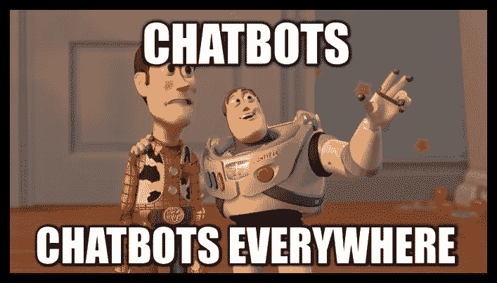
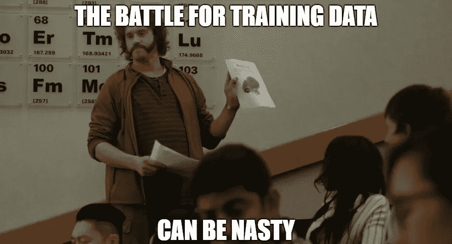
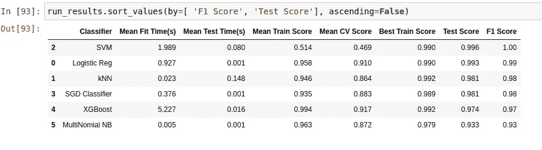
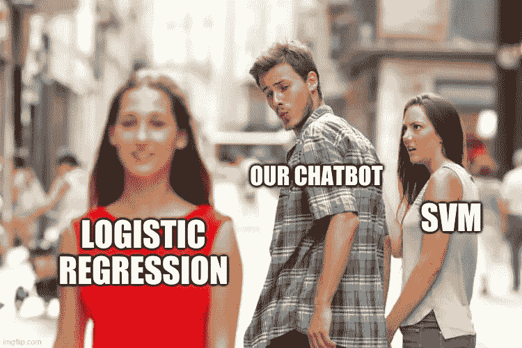

# 认识 Vicci —非常智能的 Covid 聊天界面— 1

> 原文：<https://medium.com/analytics-vidhya/vicci-very-intelligent-covid-chat-interface-70b9eaeea1ae?source=collection_archive---------25----------------------->

## *使用 Python 和经典 ML 设计 COVID 聊天机器人*

承认吧。不管你是不是 ML/AI 领域的，聊天机器人这个话题一直很耐人寻味。随着最近机器学习的进步和数据的丰富，聊天机器人越来越受欢迎，以服务于基本的支持活动。最大的优势是他们能够确保 24x7 的可用性和成本效益。因此，让我们开始探索开发一个当今最热门话题的机器人——新冠肺炎。

# **意图&实体意图**

意图和实体是聊天机器人术语的组成部分。简单来说，**意图**就是用户用他/她特定的 ***话语*** (查询)想要完成的主要意图或任务。而**实体**只是向意图添加更多信息。比如说-

对于下面两个句子，意图可以归类为— *播放歌曲，*而实体将为*虔诚*和*浪漫*

*   为我演奏一首*虔诚的* *歌曲*
*   为我演奏一首浪漫的歌曲

而对于下面两个句子，意图可以是— *开/关*，实体可以是*灯*和*咖啡机*

*   关闭*灯*
*   打开*咖啡机*

# ***创建训练数据***

不用说，像任何其他机器学习问题一样，第一个要求是获得高质量的训练数据。由于 covid 是一个非常新的场景，因此很难获得大量最新、可靠且公开可用的训练数据。所以让我们从头开始创建我们自己的训练数据。我们查看了印度政府[世卫组织](https://www.who.int/emergencies/diseases/novel-coronavirus-2019/question-and-answers-hub/q-a-detail/coronavirus-disease-covid-19)和[卫生和家庭福利部](https://www.mohfw.gov.in/pdf/FAQ.pdf)官方网站的 FAQ 部分。从那里，我们收集了大约 12 个问题，涉及 covid 的各个主要方面，如定义、症状、传播、治疗、如何保护等。这些成为我们最初的 12 个独特的意图。你可以在这里找到数据[。](https://github.com/kr-prince/VICCI-Python-Chatbot/blob/main/data/FAQ_data.csv)

我们还想添加一些功能来执行一些实时操作。在这种情况下，帮助用户找到一个接种疫苗的位置，并从印度政府的[官方仪表板](https://www.mygov.in/covid-19#statewise-data)获得最新的邦级 covid 数据。这又增加了两个意图。

最后，我们肯定希望我们的机器人尽可能像**对话**，而不是菜单驱动，所以我们为问候、介绍、确认和再见增加了 4 个意图。这完成了我们有 18 个意向的基本数据集。

显然，没有一种分类算法能够在这样一个每类只有一句话的小数据集上工作，所以我们必须找到一种方法来扩展这个数据集。我们查找短语生成模型，深度学习拯救了我们。我们在曼努埃尔·罗梅罗的博客上看到了[关于谷歌 T5 模型在 quora 问题上的微调。更多关于 T5](https://huggingface.co/mrm8488/t5-small-finetuned-quora-for-paraphrasing) [这里](https://paperswithcode.com/method/t5)。

使用 T5 模型解释

然而，在我们的 covid 相关问题上直接使用解释模型并不太好。大多数生成的短语几乎以相同的方式开始，只是在句子的最后几个词上有所不同。有些只是在 a/an/the 上有所不同，有些只是在大小写上有所不同。在其中一个实验中，问题的释义—*“Covid 是如何通过空气传播的？”*是*“Covid 如何通过地面传播”。*这可能是因为该模型是在 Quora 问题上进行训练的，Quora 问题涵盖了一个更一般的概念，即通过空气和地面的传播可能是相似的，但是在我们的情况下，该领域非常封闭。这一观察强调了在特定领域数据上微调深度学习模型对于可靠输出的重要性，但我们首先试图在这里生成一些训练数据。因此，我们手工创建了每个问题的大约 8-10 个变体。你可以在这里找到他们。

最后，我们在 T5 模型上使用这些问题(保持箱数参数较低，因此要求它保持特定)，并创建每个问题的大约 50 个变化，然后进一步处理它们以消除重复，使用随机的州名和日期创建更多的假变化，以使数据更少偏差。我们还观察到，闲聊的问题小而干脆，但模型会生成超长的短语，因此我们简单地对这些意图的数据进行过采样。

你可以在这个[链接](https://github.com/kr-prince/VICCI-Python-Chatbot/blob/main/experiments/generate_train_data.ipynb)上找到这个实验的完整的 Colab 笔记本。

# ***设计 Vicci 的大脑——意图分类器***

既然我们的机器人应该处理的每种意图都有大约 50 种不同的问题，我们开始寻找一个好的分类模型。对于小于 1k 大小的训练数据，使用神经网络或序列模型似乎是多余的，因此我们从一种基本的特征化技术开始—[**TfidfVectorizer**](https://en.wikipedia.org/wiki/Tf%E2%80%93idf)**。**我们还决定将 Tf-Idf 与问题中每个单词的 [**手套**](https://nlp.stanford.edu/projects/glove/) (单词表示的全局向量)的平均值进行对比。我们使用 LabelEncoder 将意图转换成数字或标签。

我们注意到 Tf-Idf 特性在识别较长问题的意图方面表现得更好。相比之下，手套向量在识别较短的问题时表现更好，特别是聊天意图，可能是因为与取较长句子中所有单词向量的平均值相比，像*“Hi”*和*“Thanks”*这样的短语将具有明确定义的向量。所以我们决定取二者之长。我们只考虑了 100 维的手套向量，我们将 Tf-Idf 特征的上限保持在 600，以防止由于高维而导致的过度拟合问题(记住我们只有少量的训练数据)。我们的最终特征是手套向量的 Tf-Idf 加权平均值与 Tf-Idf 向量本身的连接。我们还使用了 nltk 单词标记器，而不是简单地拆分每个单词，因为这样可以将一些常用短语放在一起，比如— *“长期”*，这被证明是有用的。然后，我们研究了所有模型在这些特性上的性能，得到了良好的结果。

你可以在这个[链接](https://github.com/kr-prince/VICCI-Python-Chatbot/blob/main/experiments/model_training.ipynb)找到完整的实验。

为了监控分类器的性能，我们使用 GridSearchCV，但是不使用默认的交叉验证参数，而是使用 StratifiedShuffleSplit。根据 Scikit-Learn [文档](https://scikit-learn.org/stable/modules/generated/sklearn.model_selection.GridSearchCV.html) —

*对于整数/无输入，如果估计值是分类器，并且 y 是二进制或多类，则使用 StratifiedKFold。在所有其他情况下，使用 KFold。这些拆分器是用 shuffle=False 实例化的，因此这些拆分在调用之间是相同的。*

但我们希望有一个更健壮的图片，因此我们决定使用 StratifiedShuffleSplit 进行交叉验证，每次都返回分层但随机的折叠。

拥有更少训练数据的一线希望是，我们可以自由探索所有类型的分类器，如逻辑回归、k 近邻、朴素贝叶斯、SVM、SGD 分类器和 XGBoost。我们还进行了大量的实验来微调超参数并实现它们的最佳配置。

## 分类器结果

分类器分数

*   大多数分类器表现良好，因为训练数据很小，并且非常适合我们的任务。
*   很明显，SVM 和逻辑回归是这个训练数据中最好的两个分类器。
*   尽管 SVM 的 F1 和测试得分最高，但其平均交叉验证得分很低。这说明它在这个数据上有极端的行为。因此我们选择逻辑回归。
*   另一个要注意的观察结果是，在缩放数据上训练的朴素贝叶斯分类器相对滞后。

所有人都欢呼逻辑回归的至高无上..！

好的。到目前为止一切顺利。

在本文的下一部分，我们将使用 Flask 设计 bot 引擎、实体提取技术和部署。

接下来:[第二部](https://nphard12.medium.com/meet-vicci-very-intelligent-covid-chat-interface-2-6ef26754b702)

**你可以在 GitHub 的** **这里找到这个项目的完整代码** [**。**](https://github.com/kr-prince/VICCI-Python-Chatbot)