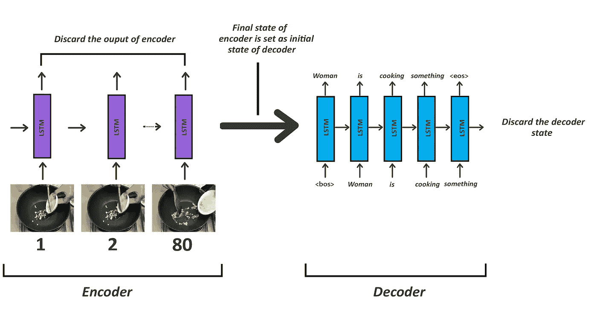
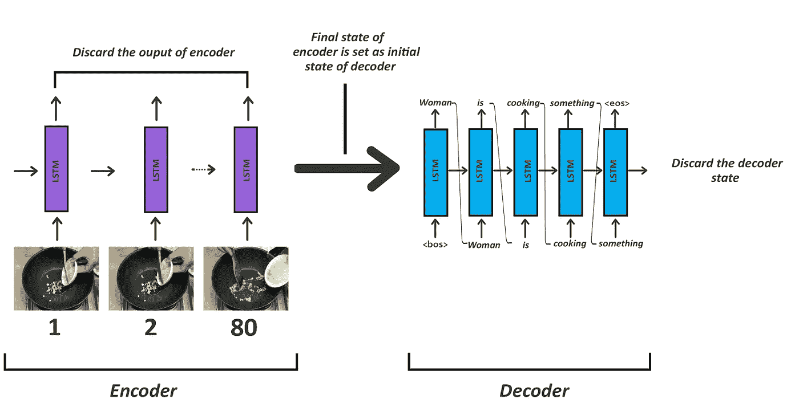

# 使用 Keras 的视频字幕

> 原文：<https://medium.com/analytics-vidhya/video-captioning-with-keras-511984a2cfff?source=collection_archive---------1----------------------->

自动生成描述视频事件的字幕


# **简介**

近年来，视频字幕任务变得非常流行。有了所有这些像 YouTube、Twitch 这样的平台，以及像 Instagram Reels 这样的短视频，视频已经成为我们日常生活中非常重要的交流方式。据福布斯统计，每天有超过 5 亿人在脸书上观看视频。每分钟有 72 小时的视频上传到 YouTube。随着视频获得如此高的人气，视频的人工智能产品已经成为一种空前的必需品。


显示视频字幕实时预测的剪辑

# 先验知识

理解这篇文章需要 LSTM/RNN 的概念和编码器-解码器架构的基础知识以及对 Keras 的理解。

# 动机

我正在寻找一些独特的项目工作时，我遇到了字幕。当我意识到缺乏视频字幕方面的好资源，但却有大量的图像字幕时，我开始深入这个话题。所以，我决定在这方面努力，让人们更容易实现视频字幕。

# 现实世界的应用

我们必须首先理解这个问题在现实场景中有多重要。

*   **更好的搜索算法**:如果每个视频都能被自动描述，搜索算法会有更好更准确的结果。
*   **推荐系统**:如果视频的内容可以被自动描述，我们可以很容易地根据视频的相似性对其进行分类。

# 数据收集

出于这项研究的目的，我使用了微软的 MSVD 数据集。你可以从[这里](https://www.dropbox.com/sh/whatkfg5mr4dr63/AACKCO3LwSsHK4_GOmHn4oyYa?dl=0)得到数据集。这个数据集包含 1450 个经过手动标记用于训练的 YouTube 短片和 100 个用于测试的视频。

每个视频都被分配了一个唯一的 ID，每个 ID 有大约 15-20 个字幕。

# 了解数据集

在下载数据集时，您会发现 **training_data** 和 **testing_data** 文件夹。每个文件夹都包含一个**视频**子文件夹，其中包含将用于培训和测试的视频。这些文件夹还包含 **feat** 子文件夹，features 的简称。feat 文件夹包含视频的特征。还有 **training_label** 和 **testing_label** json 文件。这些 json 文件包含每个 ID 的标题。我们可以如下读取 json 文件:

```
train_path='training_data'
TRAIN_LABEL_PATH = os.path.join(train_path, 'training_label.json')
*# mentioning the train test split*
train_split = 0.85
*# loading the json file for training*
**with** open(TRAIN_LABEL_PATH) **as** data_file:    
    y_data = json.load(data_file)
```

json 文件如下所示:


每个视频都有多个字幕，意思相同

因此，对于每个视频 id，有许多可选的字幕。

# 提取视频特征

视频字幕是一个两部分的项目。第一部分，提取视频的特征。

什么是视频？人们可以说视频是一系列图像的列表，对吗？因此，对于数据集中的视频，从视频中提取每个被称为帧的图像。

代码可以在这里看到。

由于视频的长度不同，提取的帧数也会不同。所以为了简单起见，每个视频只取 80 帧。80 帧中的每一帧都经过预先训练的 **VGG16** ，从每一帧中提取 4096 个特征。这些特征被堆叠以形成(80，4096)形状的阵列。80 是帧数，4096 是从每一帧提取的特征数。

在这里，您可以看到 VGG16 型号已加载。来自每个视频的 80 帧中的每一帧都被传递到模型中以提取特征并保存为 numpy 数组。现在这些特征已经从数据集中提取出来了，所以我们可以继续下一步了。

# 清理和预处理字幕

现在，我们将加载所有的字幕，并将它们与它们的视频 id 配对。以下是我所做的。train_list 包含一对标题和视频 ID。我所做的唯一的文本预处理是在每个标题之前和之后分别添加<bos>和<eos>标记。</eos></bos>

*   **< bos >** 表示句子的开始，因此模型知道从这里开始预测
*   **< eos >** 表示语句结束，这是模型知道停止预测的地方。

这是 train_list 的外观。


一些培训列表项目

train_list 分为训练和验证两部分。training_list 包含 85%的数据，其余的数据存在于 validation_list 中。

**vocab _ list 仅包含来自 training_list 的标题，因为我们将仅使用训练数据中的单词来标记**。标记后，我们将填充标题，使所有的句子长度相同。在我的项目中，我把它们都填充为 10 个单词。你可能已经看到**我也只使用字数在 6 到 10 之间的标题。你可能会问我为什么这么做？**

如果你查看所有数据集中最大字数的标题，它有 39 个字，但是对于大多数标题，字数在 6 到 10 之间。如果我们不过滤掉一些标题，我们将不得不把它们填充到标题的最大长度，在我们的例子中是 39。现在，如果大多数句子有 10 个单词，我们将不得不填充它们，使它们的长度加倍，这将导致大量的填充。这些高度填充的句子将用于训练，这将导致模型预测大部分填充的标记。由于填充基本上意味着添加空格，因此该模型预测的大多数句子将只包含更多空格和更少单词，从而导致不完整的句子。

**现在我只使用前 1500 个单词作为标题的词汇。**你看到的任何标题都必须是 1500 个单词的一部分。尽管独特单词的数量远远超过 1500 个，为什么我们只使用 1500 个单词进行训练呢？

如果你认为大多数单词出现的次数很少，只有 1、2 或 3 次，那么这个词汇很容易出现异常值。因此为了安全起见，我们将只使用前 1500 个最常出现的单词。

# 培训模型

大多数情况下，对于与文本生成相关的问题，首选模型是编码器-解码器架构。在我们的问题陈述中，由于必须生成文本，我们也将使用这种**序列到序列**架构。为了更好地理解这个架构，我建议查看这篇文章[](https://towardsdatascience.com/understanding-encoder-decoder-sequence-to-sequence-model-679e04af4346)**。**

**在这种架构中需要知道的一点是，编码器单元的**最终状态总是作为解码器单元的**初始状态。在我们的问题中，我们将使用编码器来输入视频特征，解码器将接收字幕。**

**现在，我们已经建立了我们将使用一个编码器-解码器模型，让我们看看我们应该如何使用它。**

**什么是视频来着？我们可以称之为图像序列**对吗？对于任何与序列相关的东西，我们总是喜欢使用 RNNs 或 LSTMs。在我们的例子中，我们将使用 LSTM。要了解 LSTMs，请参考此[链接](http://colah.github.io/posts/2015-08-Understanding-LSTMs/)。****

**现在我们将 LSTM 用于编码器，让我们看看解码器。解码器将生成字幕。字幕基本上是一个单词序列，所以我们也将在解码器中使用 LSTMs。**

****

**培训模式**

**在图中，第一帧的特征被输入编码器的第一个 LSTM 单元。接下来是第二帧的特征，这一直持续到第 80 帧。对于这个问题，我们只对编码器的最终状态感兴趣，因此编码器的所有其他输出都被丢弃。现在编码器 LSTM 的最终状态作为解码器 LSTM 的初始状态。这里，在第一个解码器中，LSTM <bos>作为输入开始句子。来自训练数据的字幕的每一个单词都被一个接一个地输入，直到<eos>。</eos></bos>**

**所以对于上面的例子，如果实际的字幕是**女人正在煮东西**，解码器从第一个解码器 LSTM 中的< bos >开始。在下一个单元格中，实际字幕中的下一个单词**女人**被喂食，接着是**正在煮东西**。这以< eos >令牌结束。**

**编码器的**时间步长是我们将用于编码器的 LSTM 单元的数量，等于 **80** 。**编码器令牌**是视频中特征的数量，在我们的例子中是 **4096** 。**解码器的时间步长**是解码器的 LSTM 单元数 **10** ，而**令牌数**是词汇长度 **1500** 。****

**让我们看看这个模型的代码。**

**培训模型的代码**

**让我们看看建筑。**

****

# **加载数据集**

**现在我们已经知道了模型，将数据加载到模型中也是培训中非常重要的一部分。**

**训练数据点的数量约为 14k，这肯定会**导致 RAM 内存问题**。为了避免这样的问题，我使用了一个**数据生成器**。我用的是一个 **320** 的批量。因为训练有两个输入。我将其转换为一个列表，然后将两者一起作为编码器输入，其中包含视频输入和解码器输入的特征，这些输入是经过标记化和填充的字幕，转换为具有 1500 个标签的分类特征，这是我们将使用的词汇长度，或者是我提到的解码器标记的数量。我使用 **yield 语句**返回输出。Yield 语句用于创建生成器。这里我使用了一个定制的生成器，因为我们有两个输入。我已经以字典的形式加载了所有的特性，这样一次又一次地加载相同的数组会花费更少的时间。**

# **培养**

**我训练了 150 个纪元的模型。完成一个历元的训练大约需要 40 秒。**我用 colab 免费版在特斯拉 T4 上进行培训**。**

# **推理模型**

**与大多数神经网络不同，编码器-解码器的训练和测试模型是不同的。我们不会在训练后原样保存整个模型。**我们不同的保存编码器模型和解码器部分。**现在让我们看看推理模型。**

**首先，我们将使用编码器模型。来自所有 80 帧的特征被传递到模型中。模型的这一部分与训练时的一样。编码器模型给了我们预测。同样，我们对最终输出状态感兴趣，因此编码器的所有其他输出都将被丢弃。编码器的最终状态作为其初始状态与<bos>令牌一起被送入解码器，以便解码器预测下一个字。</bos>**

**有两种方法可以生成标题。**我已经实现了这两种方法，但为了在实时预测中获得更快的结果，我将使用贪婪搜索**。要了解更多关于**贪**和**梁**的搜索点击 [**这里**](https://machinelearningmastery.com/beam-search-decoder-natural-language-processing/) 。**

****

**推理模型**

**现在，如果模型被适当地训练，正如你在上面看到的，它应该预测**女人**作为令牌。记住，在训练中，下一个输入总是标题中的下一个单词。因为我们这里没有标题，所以下一个单词是前一个 LSTM 单元的输出。然后，输出 **woman** 与前一个单元的状态一起被送入下一个单元。这继续预测下一个字**是**。这种情况一直持续到模型预测到状态方程。我们将不再需要任何更多的预测，因为这个句子是完整的。**

# **结果**

**现在我知道每个人都在等待这个，所以让我给你看更多来自**测试数据**的结果。现在，请注意，这些结果使用了贪婪搜索算法。**

****

**一个男人正在舞台上表演**

****

**一名男子正在碗里搅拌配料**

****

**一只猫正在弹钢琴**

****

**一名男子正在摊玉米饼**

**现在，只显示适当的结果是错误的。以下是一些不太正确的结果。**

****

**一个男人正在骑自行车**

**这个模型把自行车和自行车搞混了。**

****

**一只狗正在跳舞**

**不知何故，这个模型把猫和狗搞混了，它没有摆动爪子，而是认为它在跳舞。这个标题在语法上没有什么意义。**

# **结论**

**谢谢你读到这里。更多详情请参考我的 [**Github**](https://github.com/Shreyz-max/Video-Captioning) 。**

**让训练更好的一些方法是更多的数据洗牌。添加来自许多不同领域的视频。**

****重要观点****

**我们必须理解**训练数据应该在语义上类似于测试数据**。例如，如果我在动物的视频上训练模型，并在不同的活动上测试它，它肯定会给出不好的结果。**

# **未来的工作**

*   **而不是使用给定的功能提取更多的功能，我自己使用像 I3D 专门为视频设计的模型**
*   **添加一个用户界面，使其更具吸引力，并将其部署到某个平台。**
*   **添加嵌入层和关注块来训练更长的视频。**

# **参考**

**【https://github.com/CryoliteZ/Video2Text 号**

**[https://github . com/packt publishing/Intelligent-project-Using-Python/tree/master/chapter 05](https://github.com/PacktPublishing/Intelligent-Projects-Using-Python/tree/master/Chapter05)**

**[](https://towardsdatascience.com/image-captioning-with-keras-teaching-computers-to-describe-pictures-c88a46a311b8) [## 使用 Keras 的图像字幕——“教计算机描述图片”

### 目录:

towardsdatascience.com](https://towardsdatascience.com/image-captioning-with-keras-teaching-computers-to-describe-pictures-c88a46a311b8)  [## 序列到序列-视频到文本

### 真实世界的视频通常具有复杂的动态；和生成开放域视频描述的方法应该…

arxiv.org](https://arxiv.org/abs/1505.00487) 

想要更多 AI 内容？在 LinkedIn 上关注我的每日更新。

# 感谢您的阅读。如果你喜欢这篇文章，请给它一些掌声👏。希望你有美好的一天！**