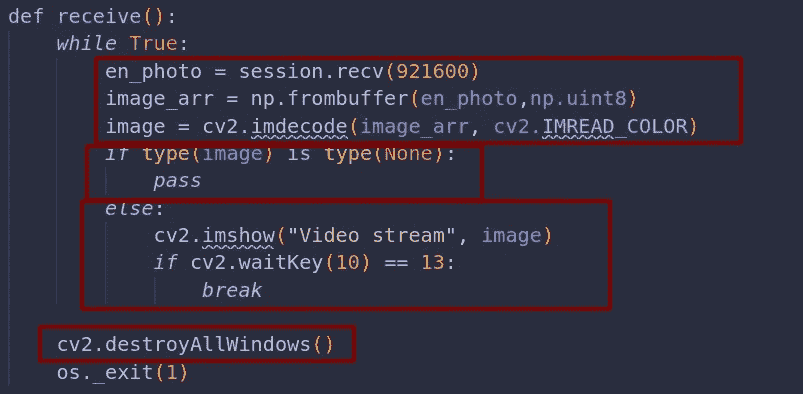
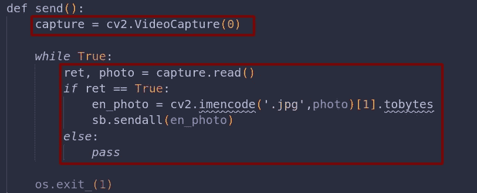
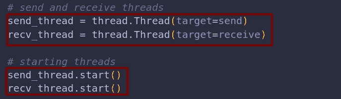
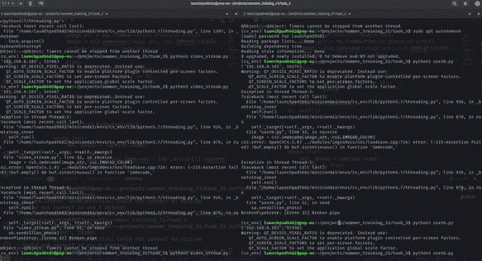

# 使用 OpenCV 和 Socket 进行视频聊天

> 原文：<https://medium.com/analytics-vidhya/video-chat-using-opencv-and-socket-5ca864a54696?source=collection_archive---------4----------------------->


[Unsplash](https://unsplash.com?utm_source=medium&utm_medium=referral) 上[视觉](https://unsplash.com/@visuals?utm_source=medium&utm_medium=referral)的照片

在这个博客中，我们将使用 ***OpenCV*** 和 ***Sockets*** 在 ***Python*** 中构建 ***无语音视频聊天频道*** 。

## 让我们从一个计划开始:

*   为一对一通信创建 TCP 套接字。
*   从摄像机中获取实时流。
*   对双工通道使用多线程。

***OpenCV*** 是使用 Python 进行图像和视频处理的库。我们可以使用它做任何与图像和视频相关的事情。我们裁剪、编辑、创建图像和制作视频。

***Socket*** 是底层的网络接口，用来连接网络上的两个节点进行相互通信。

***线程*** 是 python 中用来创建多线程程序的库。

## 让我们开始实施计划:

首先我们将使用下面的代码使用 ***套接字库*** 创建 ***TCP 套接字*** :

*   将协议设置为 TCP，将地址族设置为 IPv4 地址族。

```
# *tcp and ipv4 address family*tcp = socket.SOCK_STREAMafm = socket.AF_INET
```

*   使用 TCP 和 AFM 变量创建套接字。

```
# *creating socket*sa = socket.socket(afm,tcp)sb = socket.socket(afm,tcp)
```

***sa*** 和 ***sb*** 是为两个节点之间的通信而创建的套接字。我们也可以使用单个插座实现同样的功能。

*   将 ***IP 地址与端口号绑定。***

```
sa.bind((usera_ip,usera_port))
```

*   开始监听插座。

```
sa.listen()
```

*   开始接受来自节点的连接。

```
session, addr = sa.accept()
```

***sa.accept()*** 用于接受来自其他节点的连接请求。 ***session*** 存储会话数据并使用它来发送和接收请求，而 ***addr*** 用于存储接收者节点的地址。

*   将这个节点连接到另一个节点。

```
sb.connect((usera_ip,2001))
```

然后，我们需要设计精巧的 ***接收*** 和 ***发送*** 来接收和发送视频。



***receive()*** 函数包括使用下面的代码块接收视频帧的无限循环。

***【session . recv(buff _ size)***用于从节点接收字节数组。然后， ***np.frombuffer()*** 用于将字节存储回数据类型为 ***np.uint8*** 的 numpy 数组中，该数组存储的值在 0 到 255 的范围内。然后，***cv2 . im decode(image _ arr，cv2。IMREAD_COLOR)*** 用于将图像解码回带有 ***cv2 的彩色图像。IMREAD_COLOR*** 参数。

如果 ***图像*** 为空，数据类型为 ***Nonetype*** ，程序将通过，否则使用 ***cv2.imshow(image_name，image)*** 和*【cv2 . waitKey(10)* 连续显示帧，如果关键字输入为 ***则使用 wait key(10)***使帧等待 10 毫秒并退出

***cv2 . destroyallwindows()***用于完全破坏图像窗口，并使用 ***os 退出线程。*_ 退出(0)**。

***【send()***函数包括使用下面的代码块发送视频帧的无限循环。



**cv2*。VideoCapture(0)*** 用于访问摄像机，并且可以使用作为参数传递的数字来更改摄像机。 ***捕捉*** 存储摄像机的访问方法就像 ***读取()*** 从摄像机输入或者 ***释放()*** 就是摄像机。

***capture . read()***返回两个变量，第一个作为 bool 值，表示照片是否拍摄，第二个作为照片。

然后，如果 ***ret*** 为 ***True*** 使用 ***imencode 对图像进行编码('。jpg '，photo)*** 并返回两个变量，第二个变量作为 ***编码数组*** 并使用 ***转换成字节。tobytes*** 可以通过套接字发送。

***sendall(byte _ encoded _ array)***通过 socket 发送所有数据，数据发送到目的节点，直到所有数据成功发送到目的节点。



我们需要使用 ***线程创建线程来同时接收和发送视频。Thread(target=func)*** 以目标为 ***send()*** 和 ***receive()*** 将函数赋予单独的线程。



然后，我们应该在两个节点上运行程序。这里，我使用了相同的 IP 地址和不同的端口。

哇哦。！我们一起做的。成功创建并执行了视频聊天程序。您可以使用下面的 Github 链接查看代码。

[](https://github.com/Launchpad5682/summer_training_21/tree/main/task_3) [## 启动平台 5682/summer_training_21

### 在 GitHub 上创建一个帐户，为 launch pad 5682/summer _ training _ 21 开发做贡献。

github.com](https://github.com/Launchpad5682/summer_training_21/tree/main/task_3) 

如果你觉得这很有趣，给一个👏。感谢阅读。