# 视频游戏销售分析

> 原文：<https://medium.com/analytics-vidhya/video-games-sales-analysis-9d1c30446ce4?source=collection_archive---------9----------------------->

电子游戏销售的探索性数据分析


[JESHOOTS.COM](https://unsplash.com/@jeshoots?utm_source=medium&utm_medium=referral)在 [Unsplash](https://unsplash.com?utm_source=medium&utm_medium=referral) 上拍照

有用的链接:

*   [GitHub](https://github.com/sanketchavan5595/Video-Games-sales-analysis)
*   [数据集](https://www.kaggle.com/gregorut/videogamesales?select=vgsales.csv)
*   [Colab](https://colab.research.google.com/drive/1W3XtcUZkP0n60Adc6xmz4VcQGipHaiFa?usp=sharing)
*   [卡格尔](https://www.kaggle.com/sanketchavan5595/video-games-sales-analysis)
*   这里提供了抓取数据的脚本[。
    使用 Python 基于 **BeautifulSoup** 。](https://github.com/GregorUT/vgchartzScrape)

# **数据集描述:**

*   数据集有 16598 行和 11 列

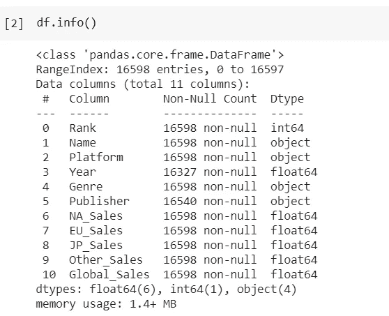

*   数据集有一些空值，我们通过使用`df.isnull().sum()`得到
*   空值仅占总值的 1.84%

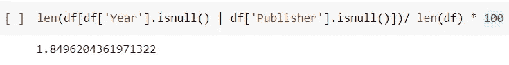

*   我们决定使用`df.dropna(inplace=True)`来删除它们
*   year 列的数据类型为 float，所以我们将其转换为 int。`df[‘Year’] = df[‘Year’].astype(int)`

下面是每列的含义。

*   **排名** —整体销售排名
*   **名称** —运动会名称
*   **平台** —游戏发布的平台(即 PC、PS4 等。)
*   **年** —游戏发布的年份
*   **流派** —游戏的流派
*   **发行商** —游戏的发行商
*   **北美 _ 销售额** —北美销售额(百万)
*   **EU_Sales** —欧洲销售额(百万)
*   **JP_Sales** —日本销售额(百万)
*   **其他 _ 销售额** —世界其他地区的销售额(百万)
*   **全球 _ 销售额** —全球总销售额。

**分类列有:**

*   ***平台***
*   ***年份***
*   ***流派***
*   ***发布者***

**数字栏有:**

*   ***NA_Sales***
*   ***欧盟 _ 销售***
*   ***JP_Sales***
*   ***其他 _ 销售***
*   ***全球 _ 销售***

## **让我们看看分类列**

## ***平台:***

总共有 31 个不同的平台，如 DS，PS2，PS3，X360 等。我们来看看销量最多的五大平台。

为了绘制图表，我们定义了一个函数，它将平台上的总销售额和图表的标题作为参数。它返回一个饼图。

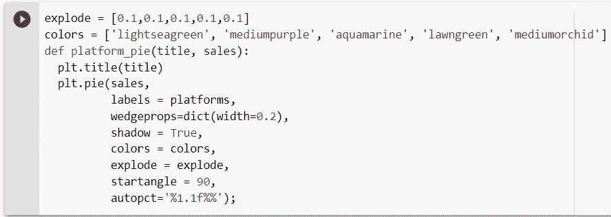

我们使用`pyplot.subplot()`来绘制图表。

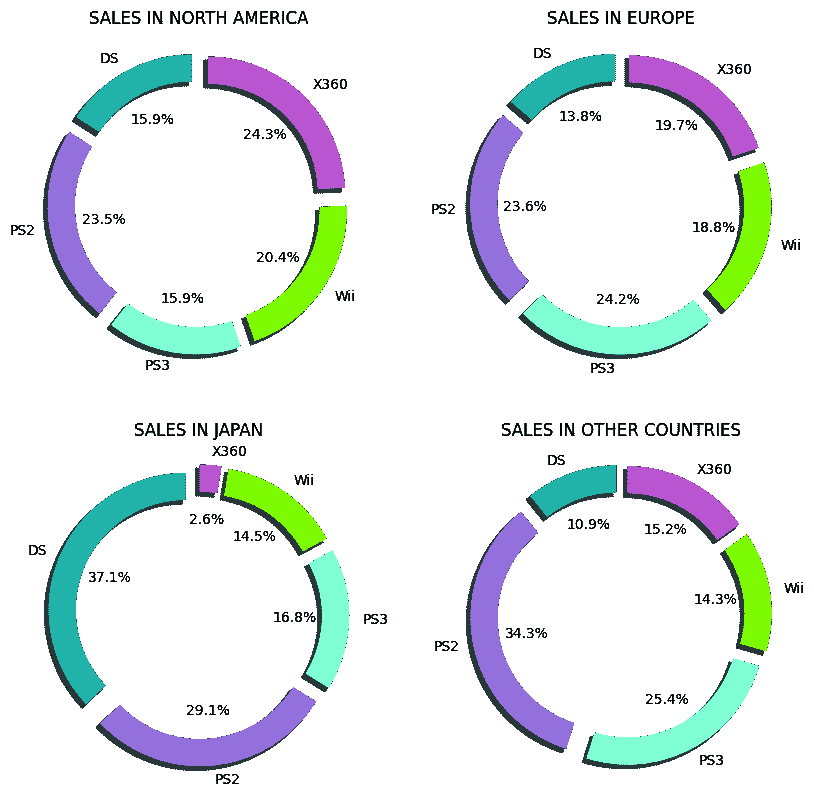

**五大平台饼图**

以下是我们从“平台”专栏中学到的内容:

*   **总体而言，NES 和英国是两大主导平台**
*   在这两个市场中，NES 在北美和日本的销量超过了英国，而英国在欧洲的销量超过了英国。

## 年份:

该数据集包含 1980 年至 2020 年的数据。然而，数据集中包含的视频游戏数量每年都有所不同。数据集中包含的最多的视频游戏是 2005 年至 2013 年发布的。

让我们为每年和每个地区的销售额绘制图表:

使用的函数是:

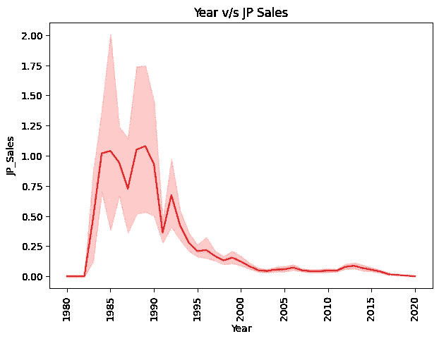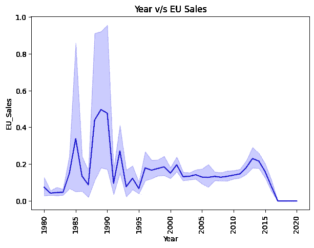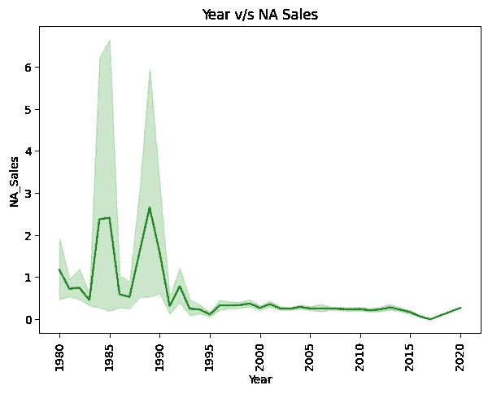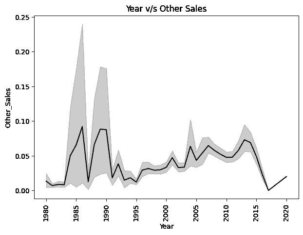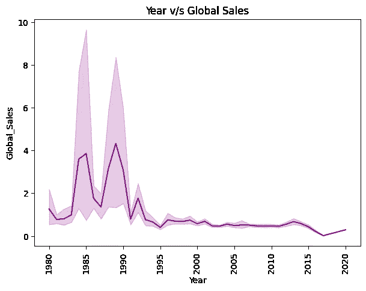

**各地区年销售额**

上述图表表明:

*   在 1984 年、1985 年、1988 年、1989 年、1990 年和 1992 年，所有类别的销售量都有所增加。

## **流派:**

数据集中的所有视频游戏分为 12 种类型。大多数游戏属于“动作”和“运动”类型。但这并不意味着这些类型的电影销量最高。让我们画一些图表来弄清楚。

使用的函数是:

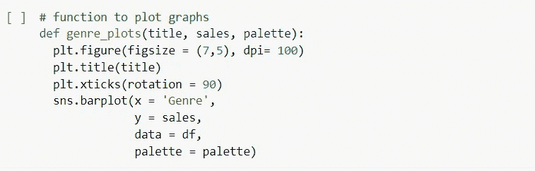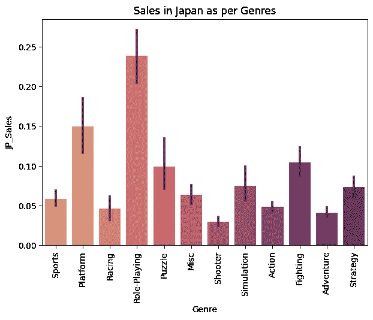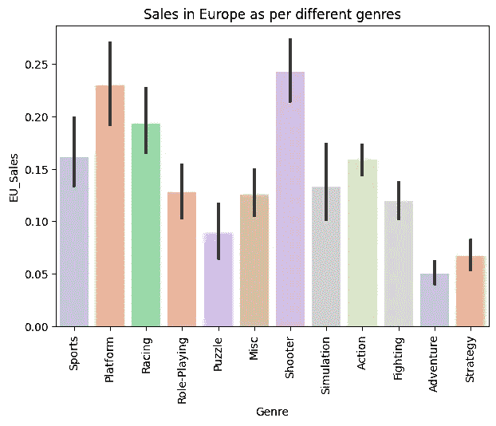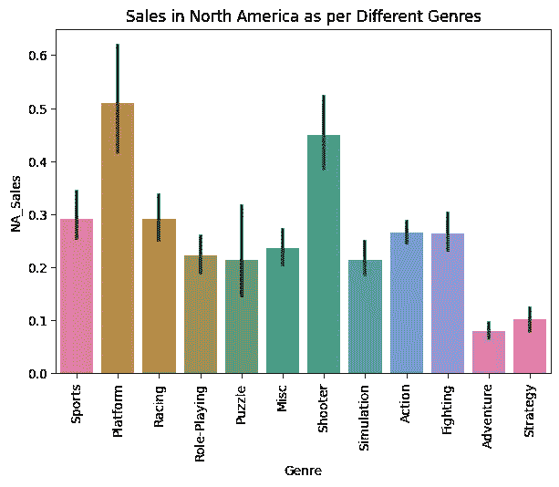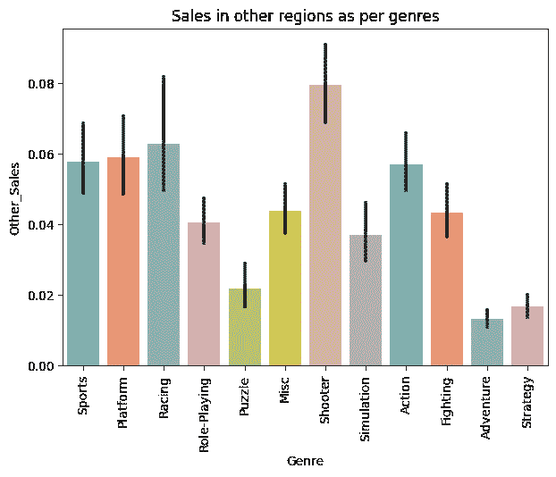

这是我们从上面的图表中学到的

*   “角色扮演”这一类型在日本的销量更高。
*   在北美和欧洲，大部分销售是由“射手”和“平台”这两种类型完成的。
*   **在其他地区和国家,“射手”和“赛车”这两种类型在销量上占主导地位。**

## 发布者:

该数据集总共包含 576 个发布者。让我们看看他们的前十名以及他们的总销售额和平均销售额。

下面是用于获得总销售额和平均销售额的代码:

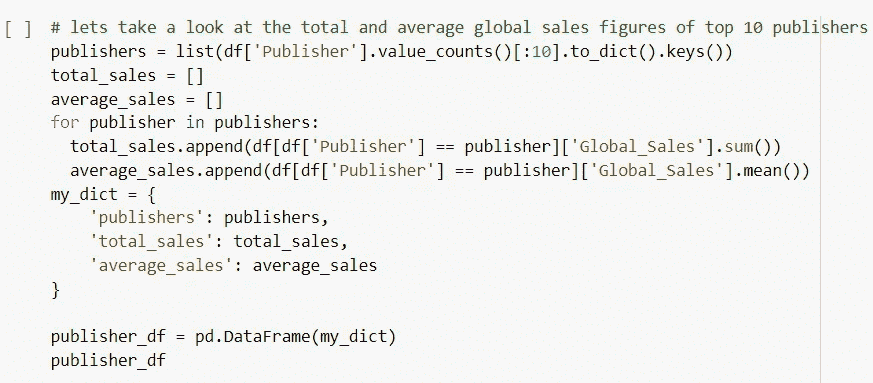

我们将绘制两个图表，一个是总销售额，一个是平均销售额。

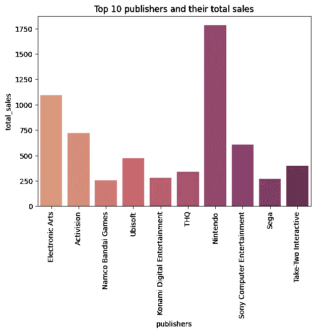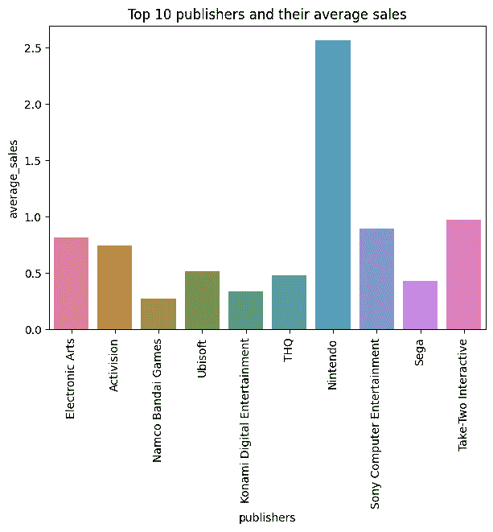

上面的图表告诉我们:

*   任天堂是总销售额和平均销售额最高的公司。
*   **总销售额和平均销售额较高的其他公司有艺电、动视、育碧和索尼。**

## 让我们来看看数字变量

我们将绘制一张饼图，看看哪个地区的销售额最高。

用于绘制图表的代码是:

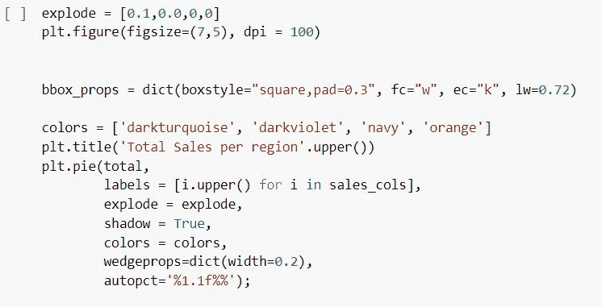

下面是饼图:

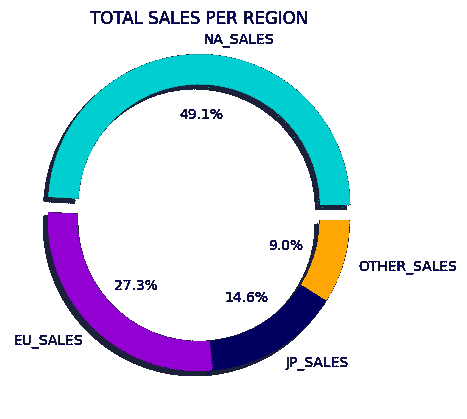

**北美地区的总销售量最高。**

# 提问和回答问题

**Q1。在每个地区和全球范围内，每个流派中最畅销的游戏有哪些？**

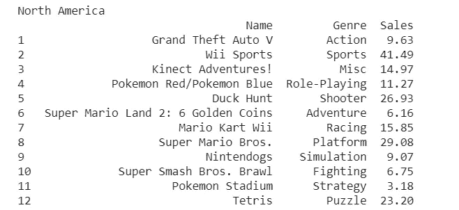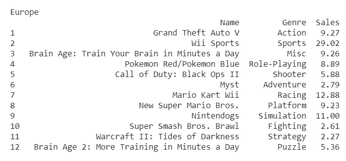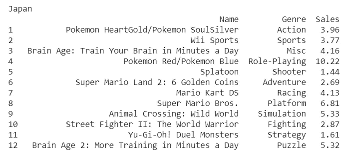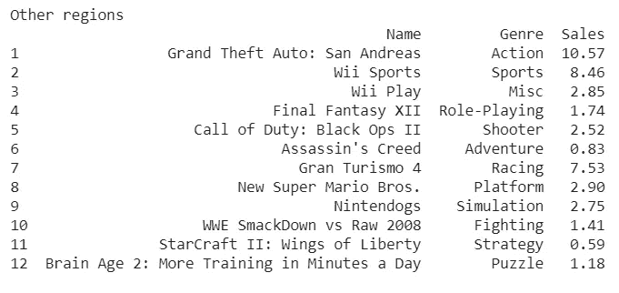

**Q2。哪些平台出售所有类型的视频游戏？**

*   3DS
*   鐽
*   奥尔德尼
*   车底距地高(Ground Clearance)
*   N64
*   个人电脑
*   附言（同 postscript）；警官（police sergeant）
*   PS2
*   PS3
*   PS4
*   掌上游戏机(SONY 推出的掌上娱乐平台)
*   公共汽车
*   (美国)学业能力倾向测验（Scholastic Aptitude Test）
*   SNES
*   任天堂在 2006 年推出的新一代电视游戏机
*   WiiU
*   X360
*   XB

**Q3。在每个地区，哪个平台的每种类型的销售额最高，有多少？**

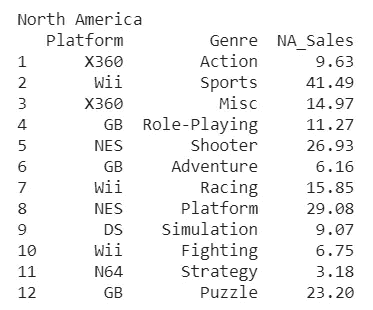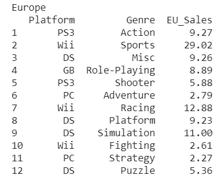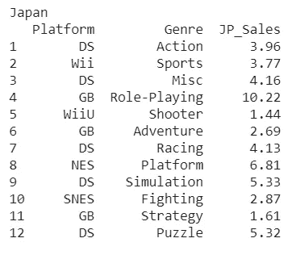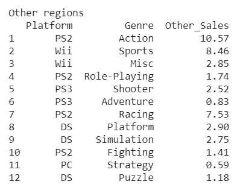

**Q4。哪一年售出的游戏数量最多，哪种类型的游戏在那一年的全球销量最高？**

函数`df[‘Year’].value_counts()`给出了每年数据集中的条目数。据发现，大多数游戏是在 2009 年售出的(1431)，其次是在 2008 年(1428)。

让我们绘制一张图表，找出哪种类型在 2009 年取得了最高的全球销售额

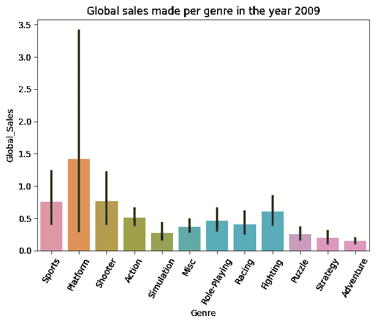

“平台”类型在 2009 年取得了最高的全球销量。

**Q5。哪家出版商的销售额最高，该出版商在每种类型和每个地区的总销售额是多少？**

我们使用函数`df[‘Publisher’].value_counts()`来获得每个发布者在数据集中的条目数。我们知道发行商“电子艺界”已经卖出了最多的游戏。

让我们绘制一个饼图，看看它在每个地区的表现。

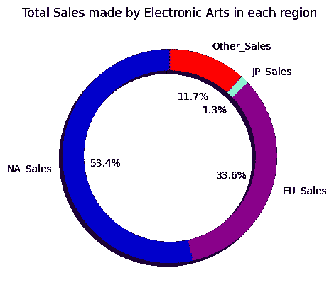

《电子艺界》在北美销量最高，在日本销量最低。

让我们先走一步，找出“电子艺界”销售的游戏在每个地区以及全球的最低和最高销售额。

我们将使用下面的函数按照销售类型对销售进行分组

```
ea_df.groupby(‘Genre’)[sales_cols + [‘Global_Sales’]].mean()
ea_df.groupby(‘Genre’)[sales_cols + [‘Global_Sales’]].sum()
```

在执行上述两个函数之后，下面是结果

*   **射击类电影在每个地区和全球都取得了最高的平均销量**
*   **“运动”这一类别在所有地区和全球都取得了最高的总销售额。**
*   **在日本**，电子艺界没有出售过“益智类”游戏
*   在北美,“冒险”类型的总销售额最低，而“平台”类型的平均销售额最低。
*   在欧洲,“策略”这一类型的电影销量最低。

## 参考

*   [https://pandas.pydata.org/docs/](https://pandas.pydata.org/docs/)
*   [https://numpy.org/doc/](https://numpy.org/doc/)
*   [https://matplotlib.org/stable/contents.html](https://matplotlib.org/stable/contents.html)
*   [https://seaborn.pydata.org/](https://seaborn.pydata.org/)

**如果有什么建议，随时联系**

*   领英:【www.linkedin.com/in/sanket-chavan5595 