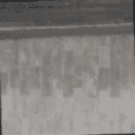
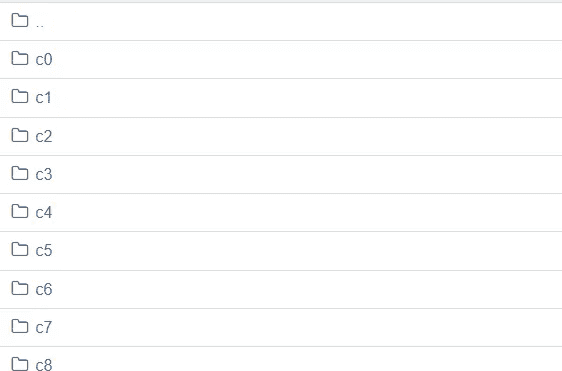
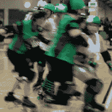
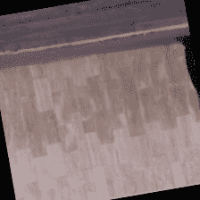

# 用于深度学习任务的视频预处理器和增强

> 原文：<https://medium.com/analytics-vidhya/video-preprocessor-and-augmentation-for-deep-learning-tasks-12dd3fcce868?source=collection_archive---------4----------------------->



来自魏茨曼视频数据集的增强视频

随着多种视频处理任务对视频分类和识别模型的需求不断增长，了解如何使用 python 库处理视频非常重要。因此，在本文中，我们将了解如何处理原始视频数据，并根据我们的具体需求进行相应的调整。

# 1.预处理视频数据

为了预处理视频数据，我们将使用 python 库，例如

*   OpenCV:[https://opencv.org/](https://opencv.org/)
*   环球:【https://docs.python.org/3/library/glob.html 
*   https://pypi.org/project/imageio/
*   OS:[https://docs.python.org/3/library/os.html](https://docs.python.org/3/library/os.html)

请访问以上链接，以便更好地理解和使用每个库。

你可能很熟悉，视频只是以帧的形式堆叠起来的图像，所以一个视频是由多个帧组合而成的。

我将使用 [*魏茨曼视频数据集*](http://www.wisdom.weizmann.ac.il/~vision/SpaceTimeActions.html) 进行处理。

数据集的主文件夹应该具有以下结构。在从这些子目录输入数据时，您还可以编辑子文件夹的名称，以便更好地重定向。



正如你在上面的结构中看到的，我已经根据类标签重命名了 Weizmann 数据集的所有子目录，以便将来更容易获取。

从上面的代码片段中，你可以看到我分别使用 os 和 glob 来列出和获取所有文件，我还将 X & labels 作为空列表，并在其中附加各自的数据。最后，我将这两个列表作为 NumPy 数组返回。之后，X 将所有的视频文件作为一个帧数组，下面我分享了 load_video 代码片段，以便更好地理解这个流程。

正如我们所看到的，我使用 OpenCV 读取特定视频中的所有帧，将它们添加到 frames 数组中，调整它们的大小，并将其作为一个 NumPy 数组返回，像素值在 0 到 1 之间归一化。

为了理解这个流程，我还在下面附上了 crop_center_square(框架)代码:

现在，如果您调用 loaddata(“视频目录的路径”，类的数量)函数，您将获得视频处理为一个 NumPy 数组和所有视频的标签。

```
Xin, Yin = loaddata(“path to the video directory”, number of classes)
```

如果您检查 Xin[index]的形状，其中 index 是将视频作为帧数组的任何有效索引，您将得到(x，224，224，3)的输出，其中 x 是该视频中的帧数，224 是帧的宽度和高度，3 是红色、绿色和蓝色的通道大小。

现在，为了可视化来自已处理的 NumPy 数组的任何视频，我们可以使用下面提到的 to_gif 函数。

我们可以看到，我们正在将归一化像素值转换回 255 范围格式，以便正确显示。

如果我们调用 _gif(sample_video ),我们将得到如下输出:



示例视频的 gif

# 2.视频数据增强

为了克服**数据**数量有限、多样性有限的问题，我们用现有的**数据生成(制造)自己的**数据**。**哪个我们用任何特定类别的更多样化的数据来训练任何深度学习模型。

我主要使用[*vidau*](https://github.com/okankop/vidaug)*g*进行视频增强相关的任务。

*   https://github.com/okankop/vidaug

在 [vidaug](https://github.com/okankop/vidaug) 库中探索了对特定视频进行增强或不进行增强的可能性，我附上了用于增强的代码片段，以及如何使我们的训练数据比以前更大以获得更好的结果，并减少深度学习任务中那些不健康的过度拟合。

数据扩充包括以下方式:

*   随机作物
*   随机旋转
*   水平翻转
*   垂直滑动
*   高斯-布朗勒
*   等等。

以下是关于如何使用 vidaug 进行视频增强的代码:

下面给出了创建增强视频数据的 NumPy 数组的函数:

在所需数据的扩增后，我们应该能够使用扩增的数据，所以我附加了如何与现有的训练数据连接的代码，以创建一个新的更大的训练数据集。

以下是扩充数据的示例:



扩充数据

正如我们所看到的，上面的视频是使用随机旋转和垂直翻转来增强的。

谢谢大家，我会带来更多关于视频分类和识别的文章。

请通过以下方式联系我:

[](https://www.linkedin.com/in/biplab-barman/) [## Biplab 酒保

### 在全球最大的职业社区 LinkedIn 上查看 Biplab Barman 的个人资料。Biplab 有 3 个工作列在他们的…

www.linkedin.com](https://www.linkedin.com/in/biplab-barman/) 

请检查:

 [## Biplab097/i3d_finetuning

### 在这个库中，我们使用迁移学习和微调新的双流膨胀 3D ConvNet (I3D)这是…

github.com](https://github.com/Biplab097/i3d_finetuning) 

更多问题。

