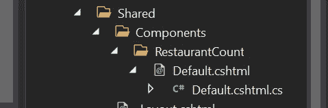
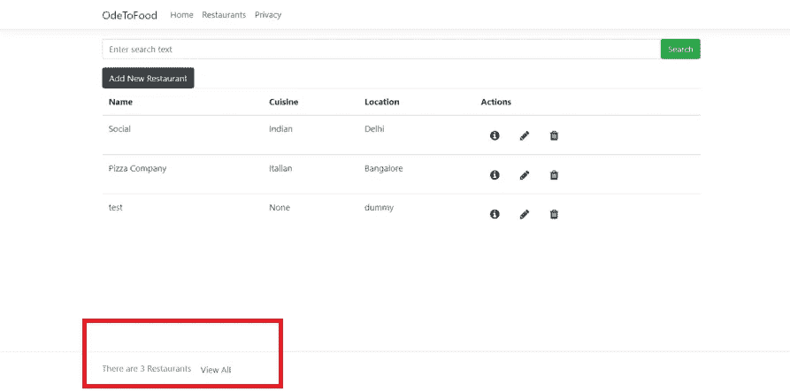

# 查看 ASP.NET 核心中的组件

> 原文：<https://medium.com/analytics-vidhya/view-components-in-asp-net-core-a92180c233a4?source=collection_archive---------2----------------------->

## 在 ASP.NET 核心应用程序中实施视图组件


由[马克斯·杜济](https://unsplash.com/@max_duz?utm_source=medium&utm_medium=referral)在 [Unsplash](https://unsplash.com?utm_source=medium&utm_medium=referral) 拍摄的照片

我们都很熟悉局部视图:可以在 web 应用程序中重用的视图，并作为子视图呈现。使用 ViewResult 可以从控制器返回部分视图，就像常规视图一样。局部视图通常使用`@Html.Partial()`方法在主视图中渲染。

ASP.NET 核心中引入了视图组件，它比局部视图更强大。视图组件有自己的类来编写逻辑，并且不依赖于控制器来实现。他们还可以利用依赖注入的力量。例如，你想在你的应用程序中实现社交图标，但是它们动态地带有不同的颜色和与之相关的 URL。这里可以使用视图组件。

**实施:**

让我们实现一个视图组件:restaurantcountviewcomponent . cs，它将帮助我们从数据库中获得餐馆的总数。

您的项目->添加 restaurantcountviewcomponent . cs

**注意:**不要忘记在你的类名中使用 ViewComponent，这样框架就可以知道它是一个视图组件，并且可以对它进行相应的处理。

```
public class RestaurantCountViewComponent : ViewComponent{private IRestaurantData restaurantData { get; }public RestaurantCountViewComponent(IRestaurantData _restaurantData){this.restaurantData = _restaurantData;}public Task<IViewComponentResult> InvokeAsync(){var count = restaurantData.GetData("").Count();return Task.FromResult<IViewComponentResult>(View(count));}}
```

如果我们仔细看看上面的代码，我们可以看到 ViewComponent 是一个从 View Component 基类派生的 C#类。它还支持构造函数注入，我们为 IRestaurantData 实现了我们的数据库操作，因为我们需要 GetData()方法从数据库中获取餐馆列表。

如果我们看到 InvokeAsync 方法，我们可以加载我们的数据，它返回包装在视图中的数据，这基本上是以“Default”的名称呈现部分视图。

创建 Default.cshtml 局部视图文件夹结构应该如下所示:

在我们的共享文件夹中，我们维护一个结构-> Components-> restaurant count-> default . cs html



视图组件呈现的默认视图的文件夹结构

内部默认。我写了一些代码来显示餐馆的数量:

```
@model intThere are @Model Restaurants<a asp-page="./List" class="btn btn-default" style="color: blue;">View All</a>
```

我在 _Layout.cshtml 的页脚中添加了一个我们可以从视图中的任何地方调用 ViewComponents 的帖子，这样就可以在整个应用程序中看到计数:

```
<vc:restaurant-count></vc:restaurant-count>
```

它看起来像什么:



在页脚呈现视图组件的应用程序主页

如果你喜欢读这篇文章，请为它鼓掌。如果你有任何问题或建议，可以在评论区联系我。