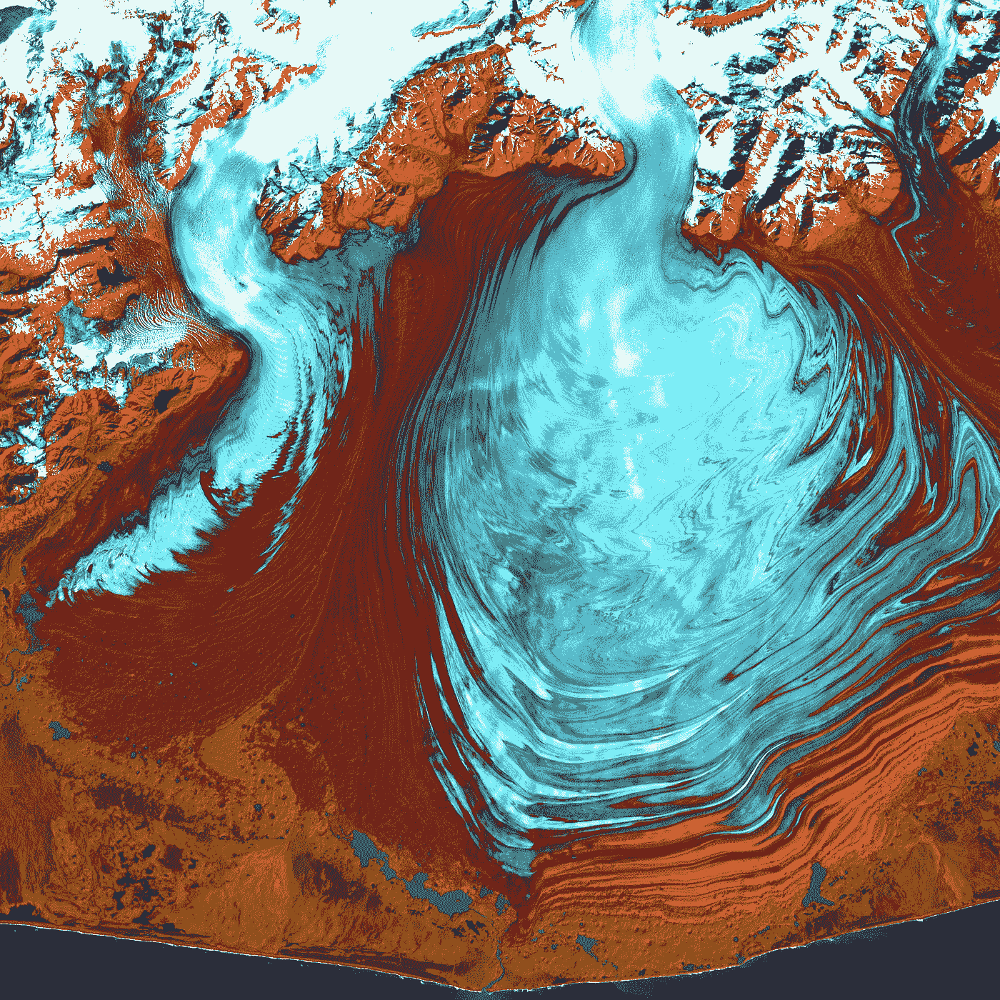
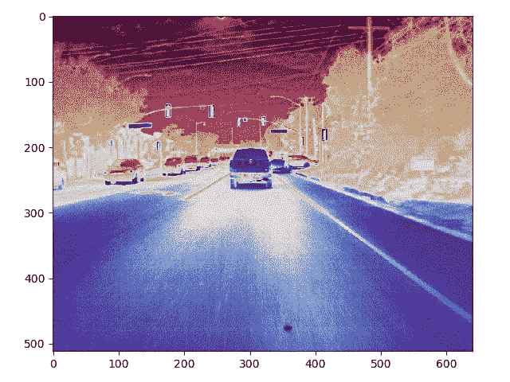
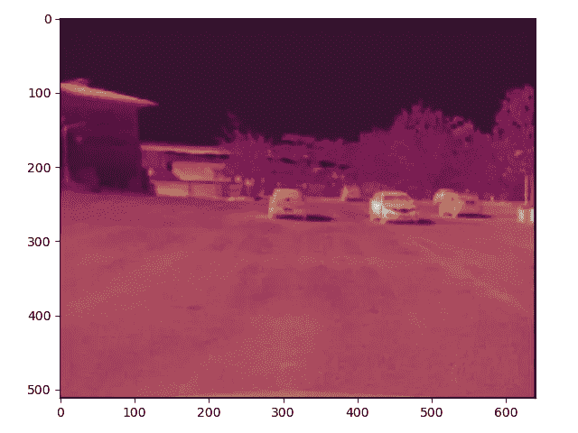

# 查看机器学习中用于分析的热图像

> 原文：<https://medium.com/analytics-vidhya/view-thermal-images-for-analysis-in-machine-learning-982d9b81dab4?source=collection_archive---------3----------------------->

## 显示灰度热图像的简单代码



美国地质勘探局在 [Unsplash](https://unsplash.com?utm_source=medium&utm_medium=referral) 上拍摄的照片

热成像在不同的融合技术中被用于自动驾驶汽车中的[物体检测](/suryagutta/why-is-sensor-data-fusion-required-to-train-machine-learning-algorithms-in-autonomous-vehicles-45251aff3615) (AVs)。这些图像是灰度的。我们可以使用 Python 中的简单代码来查看这些图像进行分析。有一些[公开可用的数据集](/suryagutta/datasets-for-machine-learning-in-autonomous-vehicles-dd13bae5925b)有 AVs 中机器学习的热图像。

```
# open cv
**import** cv2# plotting library **import** matplotlib.pyplot **as** pltimage = cv2.imread(**'flir_thermal.jpeg'**, 0)
colormap_image = cv2.**applyColorMap**(image, cv2.**COLORMAP_TWILIGHT_SHIFTED**)

plt.figure()
plt.imshow(colormap_image)
plt.show()
```

CV2 有以下[颜色图](https://docs.opencv.org/4.5.3/d3/d50/group__imgproc__colormap.html):

```
COLORMAP_AUTUMN
COLORMAP_BONE
COLORMAP_JET
COLORMAP_WINTER
COLORMAP_RAINBOW
COLORMAP_OCEAN
COLORMAP_SUMMER
COLORMAP_SPRING
COLORMAP_COOL
COLORMAP_HSV
COLORMAP_PINK
COLORMAP_HOT
COLORMAP_PARULA
COLORMAP_MAGMA
COLORMAP_INFERNO
COLORMAP_PLASMA
COLORMAP_VIRIDIS
COLORMAP_CIVIDIS
COLORMAP_TWILIGHT
COLORMAP_TWILIGHT_SHIFTED
COLORMAP_TURBO
COLORMAP_DEEPGREEN
```

以下样本图像可以从[这里](https://github.com/suryagutta/sample_data/tree/master/Thermal_Images)下载。


来源:[前视**可视**图像](https://www.flir.com/oem/adas/adas-dataset-form/)


来源:[前视红外**热成像**图像](https://www.flir.com/oem/adas/adas-dataset-form/)



使用上面的 python 代码显示热图像


来源: [Kaist **可视**图片](https://soonminhwang.github.io/rgbt-ped-detection/)


来源: [Kaist **热**图像](https://soonminhwang.github.io/rgbt-ped-detection/)



使用上面的 python 代码显示热图像

**感谢**阅读！请👏如果你喜欢这篇文章，请跟我来，因为它**鼓励我**写更多！