# 重复测量数据违反独立性假设:为什么忽略相关性是不好的

> 原文：<https://medium.com/analytics-vidhya/violating-the-independence-assumption-with-repeated-measures-data-why-its-bad-to-ignore-e52500595f2b?source=collection_archive---------7----------------------->


由[陈乐德](https://unsplash.com/@mero_dnt?utm_source=medium&utm_medium=referral)在 [Unsplash](https://unsplash.com?utm_source=medium&utm_medium=referral) 上拍摄的照片

人们在统计学课上教你的第一件事是线性模型，在这个模型中，一个连续的反应变量，比如认知健康，是根据一个或几个协变量预测的，比如性别和血压。好吧，如果用某种问卷来衡量认知健康，我们通常会发现总和或平均分数是正态分布的。这个线性模型是一个非常有用的框架，它可以非常容易地扩展到更一般的情况，例如具有二元结果(例如，患有阿尔茨海默氏病是或否，以保持认知健康主题)。这是(深入)探索奇妙的统计世界的绝佳起点！然而…

…线性模型的统计类固有一些严格的假设。我不会重复所有的线性模型假设，因为 [Joos Korstanje](https://medium.com/u/8fa2918bdae8?source=post_page-----e52500595f2b--------------------------------) 已经非常清楚地解释了它们，但是我想特别强调一个假设:观察的独立性。这个假设的意义实际上是非常明显的，把它转化为我们的例子:我们假设不同受试者的认知健康得分之间没有关系。在我攻读教育科学学士学位期间，我们被教导不要太在意独立性假设，因为它仅仅是研究设计的一个属性。我认为这对于一个更普遍的实践来说是说明性的，在这种实践中，我们经常假设——为了方便和出于实际考虑——假设是正确的。我总是喜欢和高中的物理做比较，老师经常提到我们在解决重力问题时可以忽略空气阻力。现在，正如这篇文章的标题所暗示的，忽视假设是非常有害的！要了解原因，我们应该首先深入探讨一下*可变性的话题。*

## 可变性及其来源

可变性实际上是统计学的基石之一。我们可以很好地估计平均效应大小，但是没有可变性的度量，这些平均值不会告诉我们太多。例如，当我们比较治疗组和对照组的认知健康得分时，两组在组均值附近变化很大，这将很难检测出两组之间的显著差异。然而，当组平均值周围的变化相当小时，检测任何显著差异会容易得多。观察值之间的差异来自三个不同的来源:受试者之间的差异、受试者内部的差异和测量误差。

**受试者之间的差异**是因为个体天生不同。一些人往往有较高的认知健康得分，而其他人则更有可能报告较低的得分。

**受试者内变异性**当受试者被多次测量时，会发生一些固有的生物波动。例如，血压可能因季节、昼夜节律、一天中的时间或饮食而变化。因此，一些未观察到的潜在过程可能会导致受试者的随机变异性。

**测量误差**源于变量是使用某些测量仪器测量的，而这些仪器并不十分精确。例如，血压可能由不同的护士在不同的时间测量，这导致随机波动。虽然这可以被认为是变异性的一个独立来源，但它经常被放在受试者内部的变异性中。

有了这些不同可变性来源之间的区别，我们在解释为什么忽视依赖性是如此糟糕的想法上迈出了一大步。然而，为了获得一个真正令人满意的答案，我们必须首先借助我们的认知健康例子来探讨- 之间的*和*被试内的*效应的概念。*

## 受试者之间和受试者内部的效应

考虑一项研究，其中我们有两个测量，基线和随访(5 年后)，认知健康得分(反应)和协变量性别和血压。我们可以将这种设计总结如下:

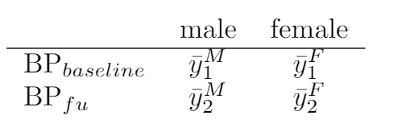

y *表示反应变量，认知健康得分*

在这种情况下，性别的影响代表了受试者之间的*效应，因为它的值可能是稳定的。血压是我们所说的受试者内部效应，因为在每个个体内部，其值可能在不同的测量场合之间波动。在没有交互效应的情况下，我们可以更正式地将主体间效应定义为:*

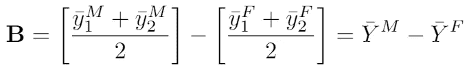

受试者内部效应为:

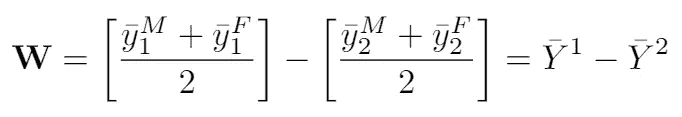

在下一节中，我将说明当我们忽略观察值之间的相关性时，受试者间效应的方差将被低估，导致*p*-值过于乐观。另一方面，受试者内效应的*p*-值会过于保守，因为方差会被高估。

## *B* 和 W 的方差

在我们继续之前:

```
WARNING: compared to the previous sections, this one is quite mathy… It practically just contains derivations to arrive at two insightful equations that illustrate how the between- and within-subjects variability depend on the correlation between responses. Fasten your seatbelt!
```

话虽如此，我们还是分手吧！由于 B 在字母表中排在 W 之前，我们首先仔细看看 **B** 的方差，或者用公式:

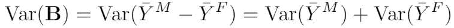

这可以进一步扩展:

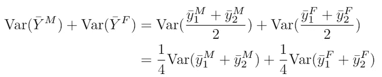

我们使用它的地方

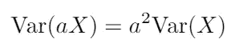

现在，由于基线和随访之间的测量很可能是相关的(由于受试者之间的可变性，一些受试者比其他受试者具有更高的认知分数)，这种表达可以进一步细分:

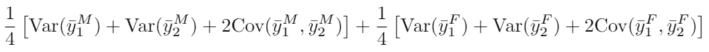

看起来我们的推导变得越来越混乱，但是不用担心！我们离简化整个表达式只有一步之遥，为此，我们更仔细地看看两个随机变量的平均值之间的协方差:

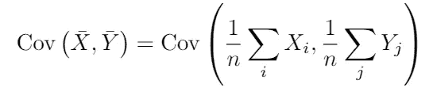

利用协方差的一般规则，

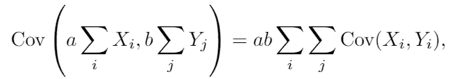

给了我们:

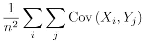

当我们假设独立性和恒定协方差时，这简单地归结为:

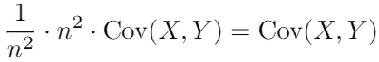

但是当 *i* = *j* 时，观察值 *Xᵢ* 和 *Yⱼ* 是相关的，因为它们是关于同一个主题！那么上面的等式不再成立，我们得到:

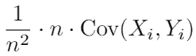

将协方差写成相关性和标准差，我们得到:

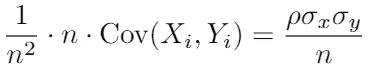

为了方便起见，我们假设标准差相等，这样我们最终得到:

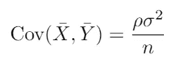

嗯，就这样吧！我们现在可以返回到我们明显复杂的表达式，插入结果，并看到它原来是完全可以理解的。我们有:


其中为了说明的目的，我们可以假设表达式中的所有方差都是相等的。注意，我们在这里考虑平均值的方差，这需要除以样本大小*n。*我们最终得到:

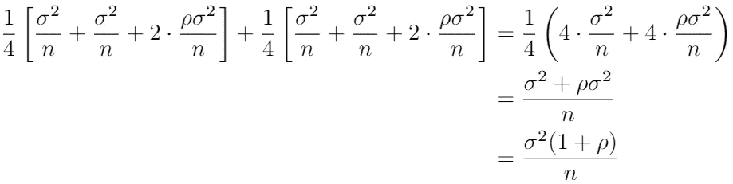

因此，总而言之，我们对受试者间效应方差的最终表达式是:

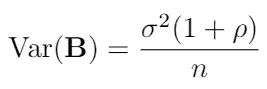

万岁！我们已经成功地导出了一个相对简单的表达式，它取决于重复测量之间的相关性。现在，我们可以通过或多或少的等价推导，为受试者内部效应构建这样一个表达式。还记得我们是如何定义受试者内效应的吗？


我们只是像以前一样继续，有一个重要的区别:第一次和第二次测量是相关的！因此，我们有下面的方差表达式:

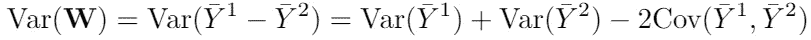

考察等式右侧的前两项，我们可以得出:

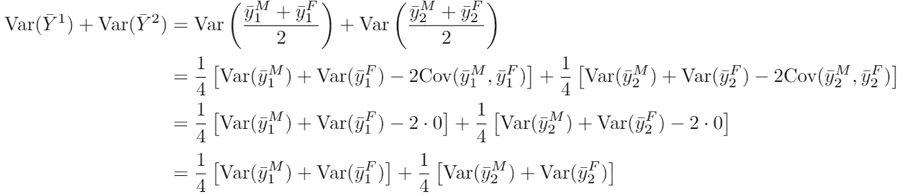

正如我们之前已经看到的，为了说明的目的，我们可以假设表达式中的所有方差都相等，由此上述表达式简化为:

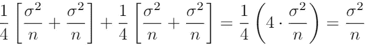

这看起来不再太复杂了，不是吗？唯一需要转换成更简单表达式的是ȳ*和ȳ之间的协方差。我们开始吧:*

*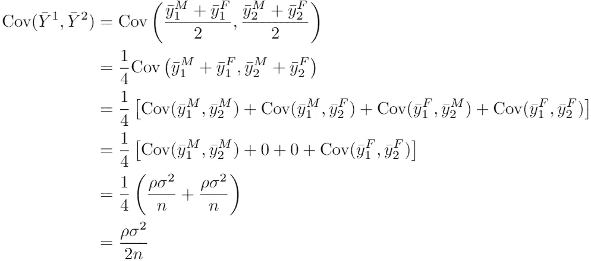*

*利用这些导出的简化表达式，我们可以将受试者内效应的方差写为:*

*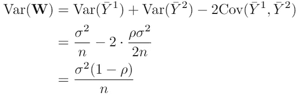*

*再次万岁！我们再一次把一个相对复杂的表达式缩小到一个更简单的表达式，这个表达式依赖于重复测量之间的相关性。现在我们已经看到相关性会影响受试者之间和受试者内部效应的方差估计，很明显假设独立性——或者换句话说，没有相关性——是非常糟糕的！为了在实践中看到这一点，让我们抛开所有的理论推导，用一个说明性的例子来解放我们的思想，结束这个相关性的故事。*

## *说明性示例*

*记住受试者之间和受试者内部方差的表达式:*

*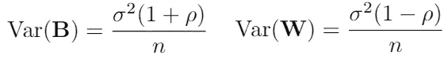*

*如果我们假设观察值是独立的( *ρ* = 0)，而事实上并非如此，那么被试间效应的方差将会在下被*估计，导致太小的标准误差和*p*-值过于乐观(假设 *ρ* > 0)。另一方面，受试者内效应的方差将超过估计值*，导致 *p* 值过于保守。不用说，这两种情况都是极不可取的！让我们求助于一个模拟例子，我们在基线和随访时将认知健康得分建模为性别和血压的函数。我使用以下 R 代码生成数据并分析数据集，假设独立性(`lm`)或考虑依赖性(`lmer`):***

这两种分析功能之间的区别是另一篇博文的内容，但却是最重要的——也是最引人注目的！—目前的问题是这两个函数之间的输出差异。假设独立，我们获得的估计值和相应的标准误差为:

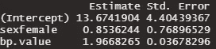

假设独立性的估计和 SEs

当我们考虑重复测量之间的相关性时，我们确实看到受试者之间性别效应的标准误差被严重低估，而受试者内部血压效应现在几乎小了两倍:

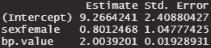

考虑到依赖性的估计数和 SEs

这些结果当然支持这篇博文开头的大胆说法:忽略相关性绝对是个坏主意。虽然我不确定这是否会延伸到高中的物理课，但我总的建议是:不要想当然地假设！

*参考文献*

[1] Fitzmaurice，G.M .，Laird，N.M. & Ware，J.H. (2012) *应用纵向分析。新泽西州霍博肯的约翰·威利&父子公司。*