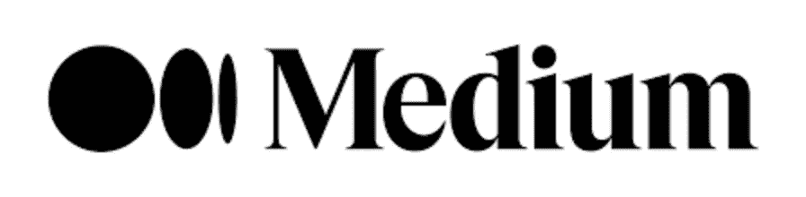
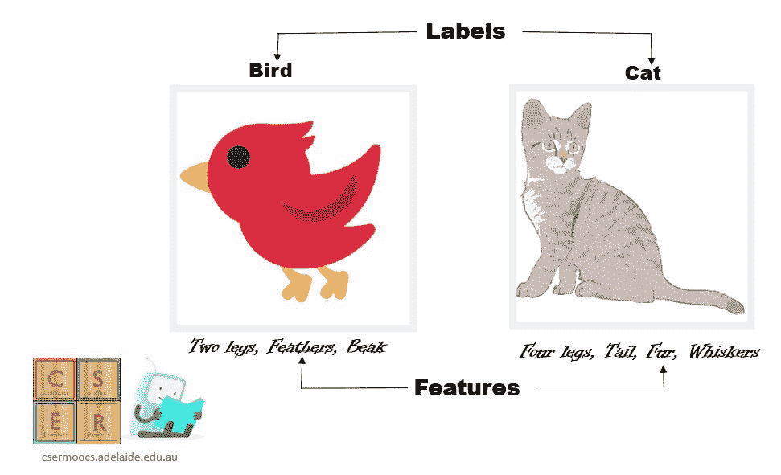
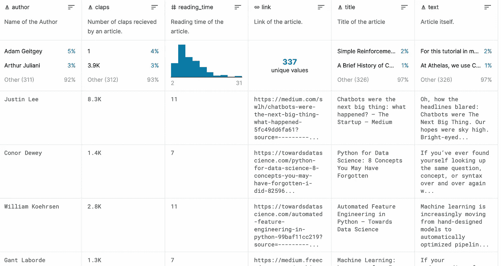
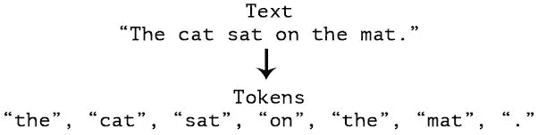
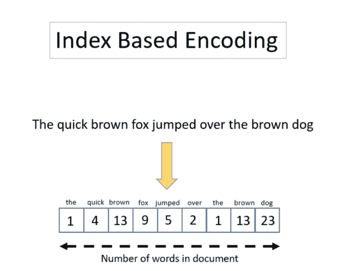
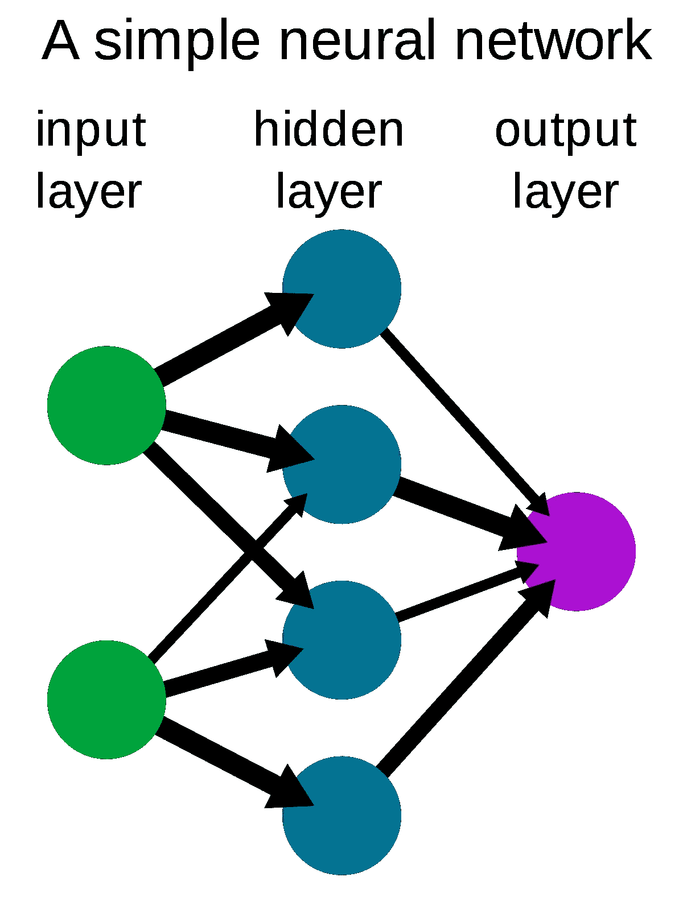
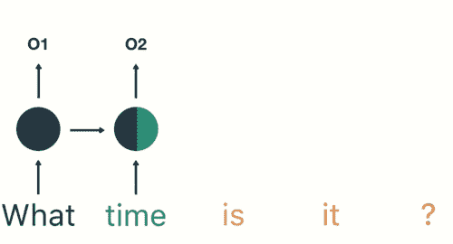
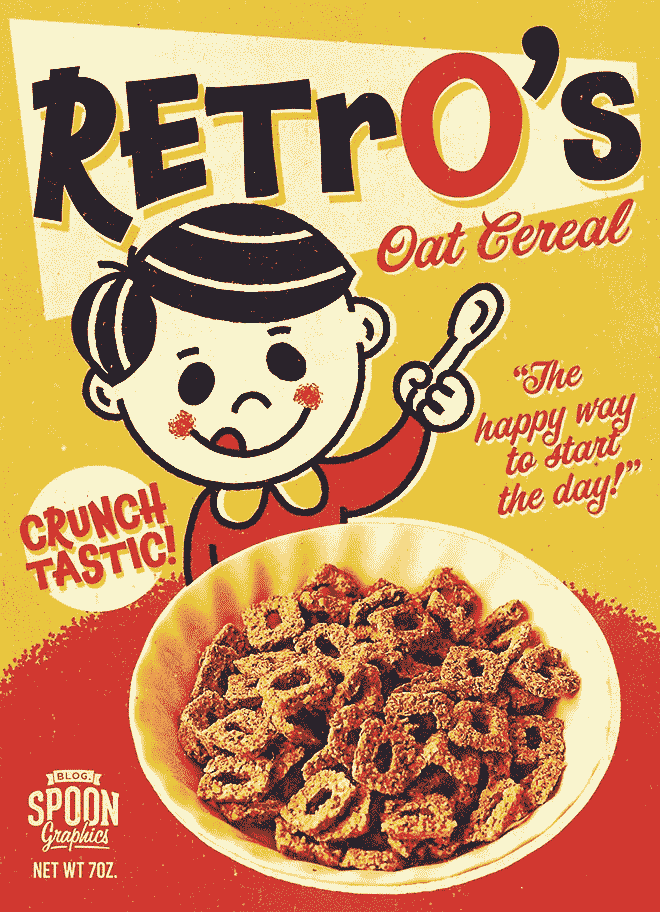

# 病毒还是非病毒:媒体文章成功的预测因素

> 原文：<https://medium.com/analytics-vidhya/viral-or-nah-the-medium-article-success-predictor-7681f9aaf1f4?source=collection_archive---------30----------------------->

如果你现在正在阅读这篇文章，那么你很可能是地球上 46 亿接入互联网的人之一。

作为一个普通的互联网爱好者，我敢打赌你也读过一篇文章，甚至可能写过一篇。

我们屏幕上的这些短文本块向我们传达了无穷无尽的知识，塑造了我们的观点，并给我们提供了关于我们周围世界正在发生的事情的内幕消息。

# “算法”

但是，如果你曾经浏览过谷歌的第二页，我敢肯定你已经意识到，并不是每篇文章都会出现在我们的手机或新闻订阅上。

而且，如果你曾经自己写过一篇文章，你几乎肯定会感到沮丧和困惑，为什么只有 3 个人读过你关于夏威夷披萨是世界上最好的东西的帖子，但超过 1800 万人以某种方式集体同意喜欢完全相同的鸡蛋图片。

现在，这经常，也理所当然地归功于*算法、*互联网神秘的机器人霸主，它控制着我们看到和想到的一切——至少在我们的屏幕上。

从我们在手机上收到的新闻通知，到我们在寻找最深层最黑暗问题的答案时出现的研究论文，算法是现代日常生活中不可避免的一部分。

尤其是现在，在疫情期间，许多人主要通过互联网在家工作，许多人除了通过社交媒体之外，完全与朋友隔绝。

现在想象一下，如果我们每个人都能让算法对我们有利。**如果我们能够以某种方式预测算法会提升什么，会降低什么，会怎么样？**

# 病毒性或非病毒性:中等成功预测

这就是冯:中等成功预测者的用武之地。VoN(Viral 或 Nah 的缩写)是我做的一个算法，它已经研究了超过 350 篇中型文章的内容，了解了什么可行，什么不可行。冯将这些知识与你的预期文章进行比较，告诉你你有多大可能被病毒式传播。

# 它是如何工作的

**机器学习**

冯致力于一个叫做监督机器学习的过程。这基本上意味着我们给冯数据一个正确的答案，称为**标签**，我们希望它用来找到正确的答案，称为**特征。**

然后，该算法的任务是查看每个条目的特征，并试图猜测其标签是什么，然后再进行纠正和尝试。

把它想象成类似于人们学习走路的方式。

我们只是向他们展示我们是如何走路的，而不是给蹒跚学步的孩子一步一步地指导行走的所有动态。

观察大人走一点后，宝宝一般会自己起来尝试。如果他们摔倒了，那么他们知道我们不应该这样走路，但是如果他们没有摔倒，那么他们就会知道他们刚刚做的事情就是走路。

所以现在在一个超高的层面上是有道理的，但是它到底是怎么运作的呢？

要回答这个问题，我们需要数据。

## **分割数据**

**数据是机器学习的支柱，**任何算法的 80%左右都是在清理数据，所以我们使用什么数据以及如何使用数据是任何算法最重要的部分。

对于 VoN，我使用了 Kaggle(数据科学家的一种“Airbnb”)的数据集，其中包括大约 350 篇中型文章，分为 6 列:

*   作者姓名
*   拍手
*   阅读时间
*   环
*   标题
*   文本

(你可以在这里找到)

出于我的目的，我决定只分离出“掌声”作为标签*和“文本”作为特征*。这意味着只对文章的内容进行评判。**

接下来，为了阻止算法仅仅记忆答案，我们必须将数据分成**训练数据**，用于教授算法，以及**测试数据**，用于测试算法。

## 预处理

计算机，在最基本的层面上，只是超级强大的计算器。你在屏幕上看到的一切都是数学和自然语言处理的产物，就像冯一样。

这就是**预处理**发挥作用的地方。

预处理的目标是将我们的语言数据转换成计算机可以进行计算的东西。

**标记化**

我们首先用一个叫做**标记化**的过程来做这件事，这个过程就是**把文本分解成单词序列的花哨说法。**

不同的机器人以不同的方式分解它们的文本，但是，冯特别地，把每个句子分解成单词大小的记号。

这意味着像“你好，我的名字是克里斯”这样的句子将被分解成单词序列，[“你好”、“我的”、“名字”、“是”、“克里斯”]。

**下壳体**

接下来，我们**将每个单词转换成小写字母**。这是为了防止有大写字母的单词被注册为与没有大写字母的单词不同的单词，因为大写字母通常不影响单词的意思。

这将使我们的示例行变成，["hello "，" my "，" name "，" is "，" chris"]。

**编码**

一旦我们把每个句子组成一个单词列表，我们就必须对它们进行编码。**编码指的是将单词转换成数字以使其能够被计算机读取的过程。**

为此，该算法为它看到的每个新单词分配一个数字，并将该单词的每次出现都更改为其对应的数字。

例如，如果将这一行["你好"、"我的"、"名字"、"是"、"克里斯]]编码为[1，2，3，4，5]

然后，我们必须将这一行[ "my "，" name "，" is "，" chris "，" hello"]编码为[2，3，4，5，1]

**填充**

最后，为了将我们的序列放入神经网络(我们接下来会谈到这一点)，我们需要使它们的大小一致。

为了实现这一点，我们在一个叫做**填充的过程中将占位符值添加到每个列表中，直到达到一定的大小。**

如果我们在示例句子的末尾填充值 0，字数为 6，那么它将变成[1，2，3，4，5，0]。

## 基本神经网络

现在我们的数据格式正确，我们将它输入到一个**人工神经网络**，它是算法的一部分，实际上负责**从数据中学习和预测标签，**以便实际做出我们的预测。

如上图所示，神经网络被分成多层计算。

**第一层**，也称为输入层，**获取每个输入值并保存在自己的节点**中，用圆圈表示。

这然后得到前馈。其中，**第二层**中的每个节点，也称为隐藏层，**保存它之前层中所有节点的乘积和某个权重，**或调整。

然后，隐藏层中的所有节点乘以**输出层的节点，输出层保存神经网络的所有输出。**

然后将此输出与我们之前获得的标记数据进行比较，并相应地调整隐藏层和输出层的权重。

## 冯使用的是

虽然这很好，但像这样的前馈人工神经网络的一个主要缺陷是它们没有考虑每个单词的上下文。

为此，我们需要 RNNs，也就是递归神经网络。

虽然我不会深入研究 rnn 如何工作的细节，但在很高的层面上，rnn 有能力根据之前的单词来理解每个单词的上下文。对于冯，我使用了一种叫做 LSTM 的特殊类型的 RNN，是长短期记忆神经网络的缩写。

我选择了 LSTM，因为传统的 rnn 有记住句子中每个单词的问题。

现在，虽然这听起来不是问题，但当你的算法开始耗尽内存，为了存储不重要的单词而“忘记”重要的单词时，它就开始真正受到伤害了。

这样想吧，你正在读你最喜欢的麦片，复古的盒子。

你读完所有的单词，然后把目光移开。

现在，如果我让你背诵你在盒子上看到的一些单词，你可能会记住主要意思，“燕麦麦片”，“松脆”，“每天开始的好方法”，即使你不一定把所有的单词都背对了。

这是因为你能够挑出最重要的单词并记住它们，而不是那些不太重要的单词，如“the”和“to”。传统的 rnn 没有这种能力，而是记住每个单词相同的数量。

LSTM 氏症患者没有这个问题，他们和我们一样，可以故意忘记句子中不重要的部分，这样他们就能对重要的内容有更多的记忆。

## 有用吗？

目前，VoN 大约有 70-80%的准确率。

这意味着在测试数据中，它有 75%的正确率，还不应该被誉为成功预测的圣杯。

尽管如此，我还是邀请你去[和 VoN](https://colab.research.google.com/drive/14NEWfjpsbB6xoIgbkPRuBJbGKOjZsXSZ?usp=sharing) 玩玩，看看它是否认可你的写作风格！

用户测试是非常重要的，所以在下面的结果中留下你的预测，包括它是否正确！

是的…冯确实认为这会像病毒一样传播开来。