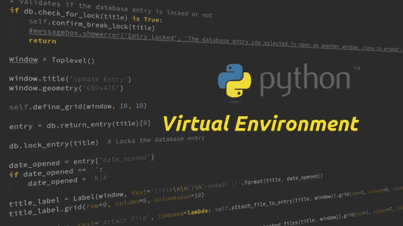

# Python 中的虚拟环境

> 原文：<https://medium.com/analytics-vidhya/virtual-environment-in-python-95c212cac7fc?source=collection_archive---------2----------------------->

## 开发人员最强大的工具

照片由[凯尔·科瓦尔奇克](https://kyletk.com/)从[凯莱特克](https://kyletk.com/index.php/2017/10/28/python-benefits-using-virtual-environment/)拍摄

虚拟环境是一种工具，它通过为每个项目单独创建一个环境来帮助保持不同项目所需的依赖关系/库。三分之一的 Python 开发人员在他/她的项目中使用虚拟环境，这的确是一个完美的实践。

# 需要虚拟环境吗？