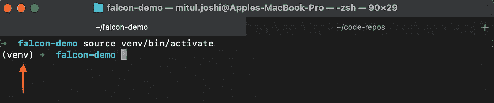
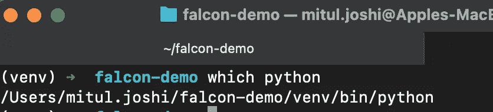
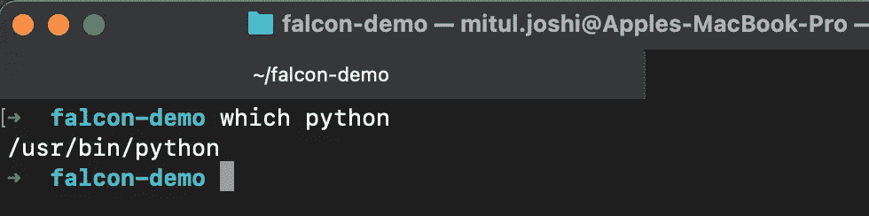
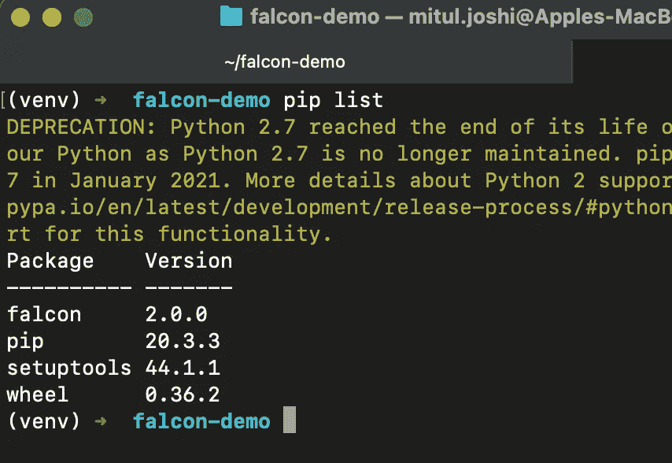
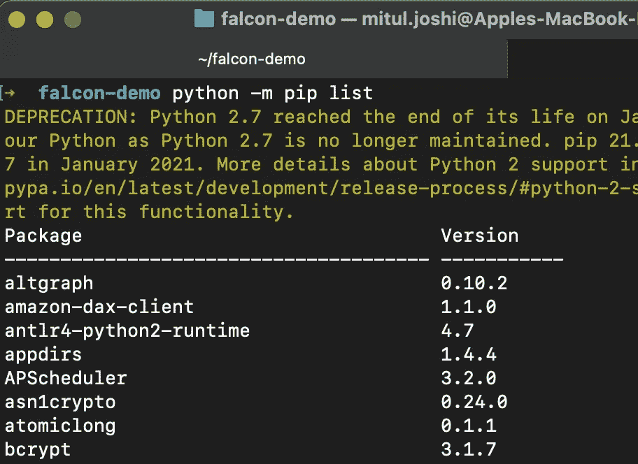
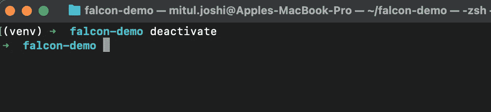

# python 中的虚拟环境

> 原文：<https://medium.com/analytics-vidhya/virtual-environments-in-python-186cbd4a1b94?source=collection_archive---------12----------------------->


在开始了解虚拟环境到底是什么以及它如何让我们的生活变得更容易之前，让我们来看看在开发一个简单的 python 项目时可能会遇到的一些事情。

一个 python 项目可能依赖于几个第三方库来实现您的业务目标。您可以使用名为 pip 的 python 包管理器来管理所有这些额外的包/依赖项。

要检查您的 pip 版本，您可以-

```
python -m pip --version
```

您可以使用 pip -中的 install 命令来安装软件包

```
python -m pip install package-name
```

默认情况下，pip 总是安装任何软件包的最新版本(直到提到该软件包的特定版本)，并且还会安装所需软件包的任何依赖项

到目前为止，一切似乎都很顺利，那么你为什么还要进一步阅读这篇文章呢？

# 问题是

如果在开发这个运行在 python 2 上的项目(项目 A)的同时，您也开始开发另一个运行在 python 3 上的 python 项目(项目 B ),那会怎么样呢？

项目 A 和项目 B 可能都需要一个库(lib A)来实现它们的目标，但是在 python 2 上运行的项目 A 可能与 lib A 的不同版本兼容，而项目 B (python 3)可能与其他版本兼容。

即使您的多个项目使用相同的 python 版本，也可能会出现这样的情况:为任何新项目更新依赖项版本可能会破坏现有项目的功能。

由于默认情况下，系统上的每个项目都将从相同的目录编写和使用第三方包，这带来了一个挑战，因为它可能会破坏您的任何一个项目的功能。

# 进入虚拟环境

来自 https://docs.python.org/的官方文件称-

> 虚拟环境是一种 Python 环境，其中安装的 Python 解释器、库和脚本与其他虚拟环境中安装的解释器、库和脚本以及(默认情况下)安装在“系统”Python(即作为操作系统的一部分安装的系统)中的任何库相隔离。

上面的定义很简单，可以理解为虚拟环境只是为您提供一个隔离的地方来管理项目的依赖关系，这样它们就不会干扰安装在任何其他虚拟环境中或安装在您的系统上的库。

您可以简单地为您从事的每个项目创建一个虚拟环境。

# 使用虚拟环境

虽然有不同的模块可以用来创建一个虚拟环境，但在本文中我们将讨论 **virtualenv(python 2)**

## 1)安装 virtualenv

```
python -m pip install virtualenv
```

上面的命令将安装软件包 virtualenv，你可以通过`python -m virtualenv --version`来验证版本

## 2)创建虚拟环境

您可以使用命令创建一个虚拟环境

```
python -m virutalenv venv
```

上面的命令将创建一个名为 venv 的目录，其中包含运行 python 项目所需的所有文件。您安装的所有第三方软件包将仅存储在此目录中。

您还可以为任何想要的 python 版本创建虚拟环境。如果您在创建虚拟环境时没有指定任何 python 版本，那么它将使用您的系统正在使用的默认 python 版本。

```
python -m virtualenv -p python3 venv
```

上面的命令创建了一个使用 python 3 执行的虚拟环境。

## 3)激活虚拟环境

一旦创建了虚拟环境，就需要激活它。这可以使用命令-

```
source venv/bin/activate
```



激活虚拟环境后，您将开始在左侧看到当前虚拟环境的名称。这表明您的虚拟环境当前处于活动状态。您现在可以使用 pip 安装您的软件包，它们将仅安装在此虚拟环境中，而不是系统范围内。

激活脚本将您的 shell 设置为使用 python 可执行文件和安装在此虚拟环境中的其他第三方包

## 4)现在有什么不同？

如果您在激活的虚拟环境中运行命令`which python`



**虚拟环境激活**

这表明该环境使用的 python 解释器只存在于该虚拟环境中，而不是默认的系统 python 解释器

如果我在全局环境中运行相同的`which python`命令-



**未激活虚拟环境**

如果你在你激活的虚拟环境中运行命令`pip list`



**虚拟环境激活**

这显示了您在这个虚拟环境中通过 pip 安装的包。

在我的全局环境中运行相同的命令将会给出我在系统范围内安装的所有包



**未激活虚拟环境**

这些包及其版本独立于您在虚拟环境中安装的内容，这是这些虚拟环境向您承诺的隔离。

您对虚拟环境中的包所做的任何更改(无论有多少)都不会更新/操作安装在系统范围内或其他虚拟环境中的包，因此您可以开发多个项目，而不会遇到任何依赖冲突问题。

## 5)停用虚拟环境

当你完成你的工作时，你可以简单地在你当前激活的虚拟环境中输入`deactivate`，然后你就可以离开了



# 结论-


所以当有人问你“虚拟环境 kab 使用 karna 启动 karoge？”时，不要像 Guddu Bhaiya 一样。立即开始使用它们。