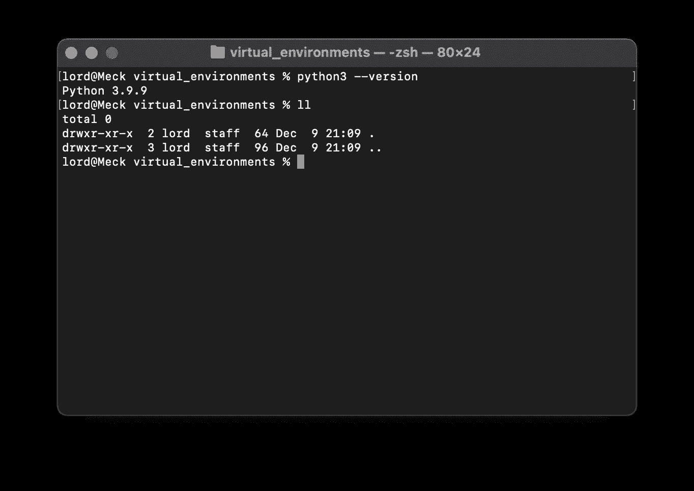
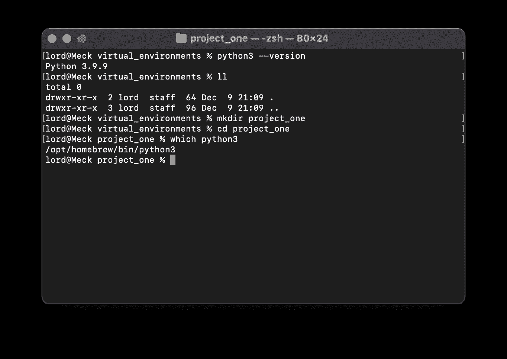
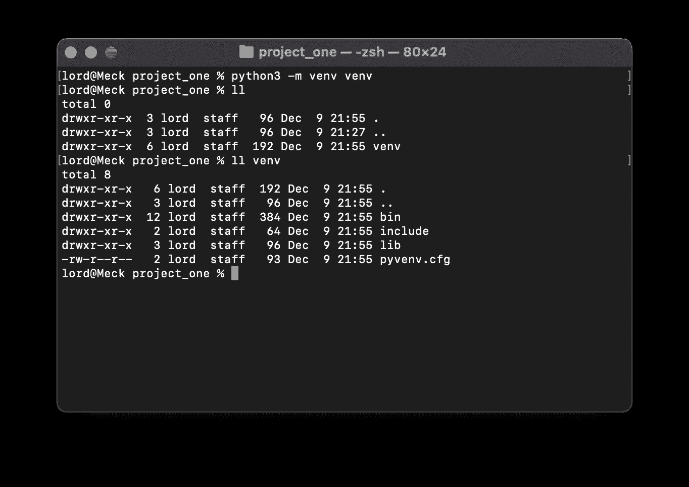
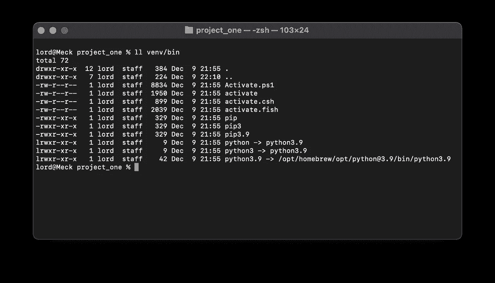
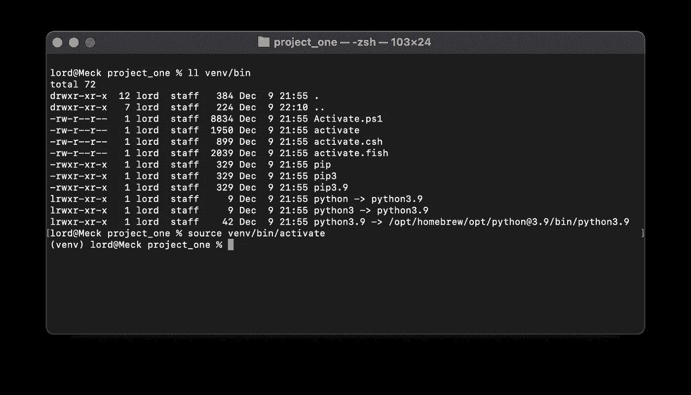
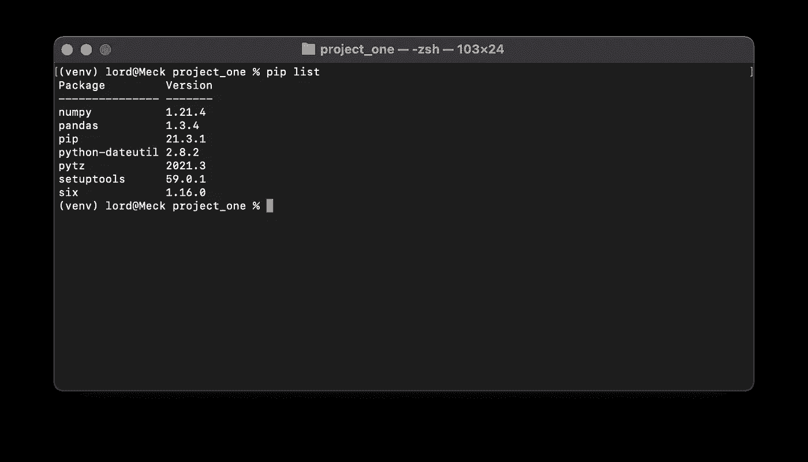
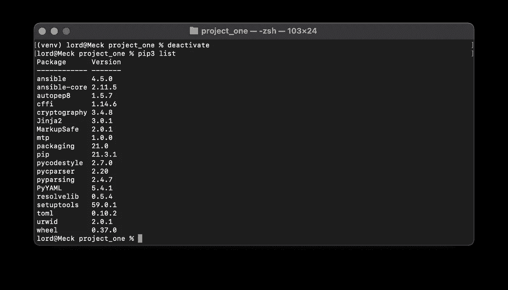
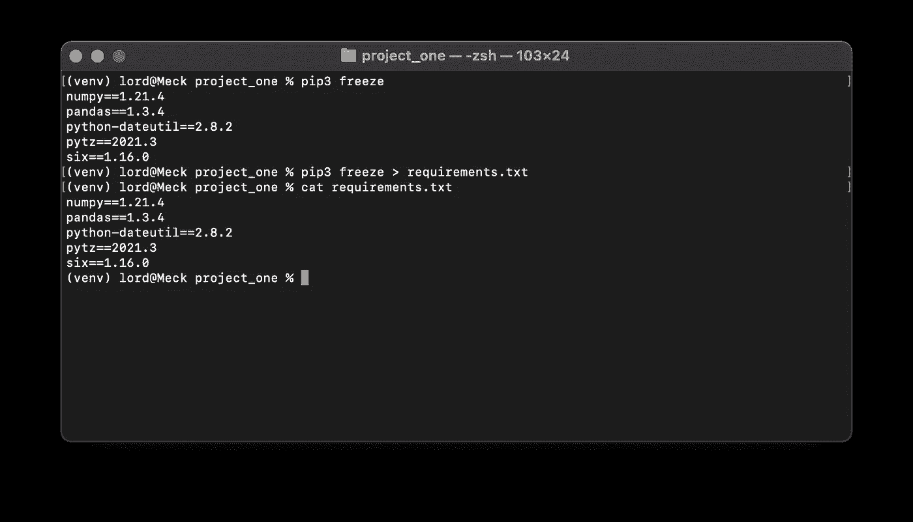

# Python 中的虚拟环境

> 原文：<https://medium.com/analytics-vidhya/virtual-environments-in-python-ce52628d3052?source=collection_archive---------0----------------------->

Python 项目需要不同的包才能工作，或者需要相同的包，但版本不同。如果你的机器上有两个需要 NumPy 包的项目，但是有两个不同的版本就有问题了，因为你当然不能安装一个以上的版本。为了解决这个问题，让事情更干净，有虚拟环境。

如果你认为它对你有用，看看这个故事:

[](/analytics-vidhya/writing-in-python-on-vs-code-f37d2a48deb) [## 用 python 编写 VS 代码

### 嗨！让我们看看如何用 Visual Studio 代码开始用 python 编码。

medium.com](/analytics-vidhya/writing-in-python-on-vs-code-f37d2a48deb) 

想象一下，每个项目都有自己的 python 解释器和自己的包。它们基本上运行在不同的环境中，所以两个不同虚拟环境中的两个项目不会共享任何东西。那么如何做到这一点呢？

我目前的设置是使用 python 3.9.9 的 macOS Monterey。



现在我有了这个名为`virtual_environments`的空文件夹。这里我想为不同的东西创建几个项目。因此，首先我将为第一个项目创建一个新文件夹，姑且称之为`project_one`。在`project_one`中，如果我调用 python3 显然是指安装在我机器上的 python 3 解释器。



要创建新的虚拟环境，请运行命令:

```
python3 -m venv venv
```



您要求 python3 的模块 venv 创建一个新的虚拟 env，存储在文件夹`venv`中。正如你所看到的，一个文件夹`venv`已经被创建了，在里面`bin`也有这个环境的 python 解释器。



在`bin`文件夹中也有一堆叫做 activate 的脚本，这取决于你使用的 shell。在我的例子中，激活虚拟 env(我们创建了它，但是我们还没有告诉进程使用它！)我只需用命令源运行脚本`activate`。

```
source venv/bin/activate
```



正如你现在看到的，在用户面前有一个小的`(venv)`，通知我们正在虚拟环境中工作的事实。让我们试着测试一下。如果我跑了

```
pip3 install pandas numpy
```

这些包将被安装在虚拟环境中，事实上它们是:



现在，我可以检查包不会在虚拟环境之外。要退出虚拟环境，我必须运行命令`deactivate`:



有用！现在，对于第二个项目，我只是做同样的事情，我将在那里添加我需要的包。

最后要提的是。假设我想与 Bob 分享我的项目。我也可以和他分享文件夹`venv`,但是因为它太大了(我的没有安装任何包的文件夹是 13 MB ),所以效率不高。他可以自己做。问题是他必须知道他要安装什么包。为了解决这个问题，我可以创建一个名为`requirements.txt`(标准名称)的文件，并在其中写入所需包的列表:

```
pip3 freeze > requirements.txt
```



正如你现在在 requirements.txt 中看到的，有一个包的列表。现在 Bob 可以创建他的虚拟 env，然后运行命令

```
pip3 install -r requirements.txt
```

该命令将自动查找文件并安装所需的软件包。非常有用，很好拥有。